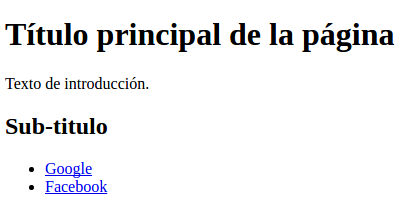
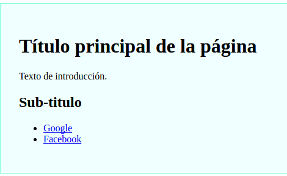

HTML & CSS
===

*Fuentes*

- [Frontend Web Development](https://courses.thinkful.com/gh-studentv2/course/0)

Introducción
---

Durante este documento explicaremos conceptos de funcionamiento de HTML y CSS. A
grandes razgos podemos definir HTML como un lenguaje para estructurar el
contenido web, mientras que CSS se encarga de manejar el estilo de esos
componentes.

Componentes importantes
---

Practicamente todas las páginas en la web cuentan con algunos de estos
componentes:

- `<h1>` - _Encabezado de primer nivel_. Indica el encabezado más importante
dentro de la página. Es conveniente contar solamente con uno de estos componentes 
por página. Principalmente por temas de accesibilidad.
- `<h2~6>` - _Encabezado de segundo/tercer/cuarto/quinto/sexto nivel_. Utilizado
para encabezados de menor importancia. Son especialmente utilies para los bots
de los buscadores para entende de que se trata la página. Todos los componentes
de encabezado definen el estilo del texto que contienen. Por defecto, cuanto más
importancia tenga el encabezado, mayor será su tamaño de fuente.
- `<p>` - _Parrafo_. Utilizado para agrupar texto.
- `<ul>` - _Lista desordenada_. Se utiliza en conjunto con el componente `<li>`
para definir listas no númeradas.
- `<ol>` - _Listas ordenadas_. Similar al componente `<ul>` pero los componentes
`<li>` encapsulados están numerados.
- `<a>` - _Link_. Utilizado para referenciar otra página, u otras partes de la
misma. Criticos para la navegación.
- `<div>` - _Contenedor_. Es un componente genérico que se utiliza para agrupar
los distintos elementos que conforman la página.

Un ejemplo de como utilizar estos componentes puede ser:

```html
<div>
  <h1>Título principal de la página</h1>
  <p>Texto de introducción.</p>

  <!- Este es un comentario ->
  
  <h2>Sub-titulo</h2>
  <ul>
    <li>
      <a href="http://google.com">Google</a>
    </li>    
    <li>
      <a href="http://facebook.com">
        Facebook
      </a>
    </li>    
  </ul>
</div>
```

Algunos puntos importantes a tomar en cuenta a partir de este ejemplo:

1. Los espacios en blanco y la indentación no son contemplados a la hora de
	 procesar el documento.
2. Todos los componentes cuentan con propiedades que modifican su
	 comportamiento. Por ejemplo, los componentes `<a>`, cuentan con una propiedad
	 llamada `href`, que indica el sitio referenciado por el link.
3. Como se colocan los componentes uno dentro de otros es irrelevante al momento
	 de procesar el documento. Sin embargo, contar con indentación y una
	 separación clara entre componentes es importante para poder entenderlos correctamente en el futuro.
4. Utilizamos componentes `<div>` para agrupar distintos componentes dentro de la página.
5. Podemos agregar comentarios al markup de la página utilizando `<!- ->`. El texto dentro de este componente no será visible para nuestros usuarios.

Si abrimos este código en el explorador, el resultado no seá particularmente atractivo:



Para cambiar el estilo de la página debemos utilizar CSS. CSS (Cascading Style Sheet) es un lenguaje utilizado para describir la presentación de documentos HTML o XML. El código CSS le dice al explorador como debe presentar el contenido del HTML. Por ejemplo: para decorar un `div` podemos agregar el siguiente codigo a la pagina:

```css
div {
  background-color: azure;
  border: 1px solid aquamarine;
  padding: 30px;
}
```

Todo código CSS sigue una sintaxis similar. Primero se coloca el objetivo que queremos estilizar y luego una lista con los atributos que se le deben aplicar. Todos los componentes cuentan con un estilo por defecto, el cual vamos sobrescribiendo cuando creamos nuevas reglas. Todos los bloques de CSS son aditivos, osea que el set de atributos que se le terminan aplicando a un componente en particular, es la combinación de todos los bloques, que apuntan al mismo. En caso de que dos bloques cuenten con dos reglas que modifiquen el mismo atributo, solo se tomará en cuenta la última.

Existen dos máneras de agregar este código a la página:

1. Colocando el texto entre un tag de `<style></style>`.
2. Refernciando un archivo en otra ubicación.

Las referencias a los archivos CSS o los tags de `style` pueden agregarse en cualquier parte del documento. Más adelante vermos "mejores prácticas" sobre donde colocar el código CSS.

Si combinamos los útlimos dos ejemplos el resultado es el siguiente:

```html
<style>
div {
  background-color: azure;
  border: 1px solid aquamarine;
  padding: 30px;
}
</style>
<div>
  <h1>Título principal de la página</h1>
  <p>Texto de introducción.</p>

  <!- Este es un comentario ->
  
  <h2>Sub-titulo</h2>
  <ul>
    <li>
      <a href="http://google.com">Google</a>
    </li>    
    <li>
      <a href="http://facebook.com">
        Facebook
      </a>
    </li>    
  </ul>
</div>
```



Editor de Texto
---


