Amazon Elastic Cloud Computing (Amazon EC2)
===

*Fuentes:*
- [Documentación oficial](https://aws.amazon.com/es/documentation/ec2/)

## Indice.
---
- [Introducción](#introduccion)
- [AMIs](#amis)
- [Tipos de Instancias](#tipos-de-instancias)
- [Formas de Adquisición](#formas-de-adquisición)
- [Opciones de Tenencia](#opciones-de-tenencia)
- [Ciclo de Vida de las Instancias](#ciclo-de-vida-de-las-instancias)

&nbsp;
---
## Introducción ##
---
¿Qué es Amazon EC2?      
---
EC2 es el servicio de computación más común que AWS ofrece, ya que permite implementar servidores virtuales dentro de su entorno AWS.
Y la mayoría de la gente requerirá un servidor en una forma u otra como parte de su solución. 

Reduce el tiempo necesario para obtener y arrancar nuevas instancias de servidor en cuestión de minutos, lo que permite escalar rápidamente la capacidad, ya sea aumentándola o reduciéndola, según cambien sus necesidades. 

Amazon EC2 cambia el modelo económico de la informática, ya que solo tendrá que pagar por la capacidad que realmente utilice. Amazon EC2 les brinda a los desarrolladores las herramientas necesarias para crear aplicaciones resistentes a errores y para aislarlas de los casos de error comunes.

***************

### Beneficios
* Informática a escala web elástica
* Totalmente controlado
* Servicios de hospedaje en la nube flexibles
* Integrado
* Fiabilidad
* Seguridad
* Fácil de comenzar

### Caso práctico de AWS: Netflix
AWS permite a Netflix desplegar rápidamente miles de servidores y terabytes de almacenamiento en cuestión de minutos. Los usuarios pueden ver programas y películas de Netflix desde cualquier parte del mundo, incluso en la web, en tabletas o en dispositivos móviles como el iPhone.

https://aws.amazon.com/es/solutions/case-studies/netflix/

### El servicio EC2 puede dividirse en las siguientes secciones:
*	Amazon Machine Imágenes (AMIs)
*	Tipos de instancia
*	Opciones de compra de la instancia
*	Tenencia
*	datos del usuario
*	Opciones de almacenamiento
*	seguridad
---
&nbsp;
## AMIs

Son esencialmente plantillas de instancias EC2 preconfiguradas que permiten iniciar rápidamente una nueva instancia EC2 basada en la configuración dentro del AMI. 

Esto evita tener que instalar un sistema operativo o cualquier otra aplicación común que pueda necesitar instalar en varias otras instancias de EC2. 

Desde una perspectiva de alto nivel, un AMI incluirá un sistema operativo y aplicaciones, junto con cualquier configuración personalizada.
AWS proporciona un gran número de AMIs que cubren diferentes sistemas operativos, desde Linux a Red Hat a Microsoft Windows, entre otros. 
Al configurar una nueva instancia de EC2, seleccionar su AMI es la primera opción de configuración que se debe realizar. También es posible crear propias imágenes AMI como forma acelerar los procesos de implementación.

Por ejemplo, empezaría con la selección de un AMI de AWS, digamos un servidor Linux. Una vez que esté funcionando, puede que sea necesario instalar varias de sus propias aplicaciones personalizadas y realizar cambios de configuración específicos. Ahora, si se necesita otro servidor para realizar la misma funcionalidad, es posible pasar por el mismo proceso de selección de un AMI de Linux AWS y, de nuevo, instalar manualmente sus aplicaciones y realizar sus configuraciones. 

Una vez que haya realizado esos cambios en el primer servidor, simplemente basta con crear un nuevo AMI de esa instancia con todas las aplicaciones instaladas y configuraciones ya realizadas. 
Entonces, si se necesita otro servidor de la misma configuración, todo lo que necesitará hacer es seleccionar su AMI personalizado como la imagen base de su instancia y lanzará el servidor Linux, sus aplicaciones personalizadas ya instaladas y cualquier configuración ya realizada.

Además de AWS-manejado y de su propio AMIs personalizado, también será posible seleccionar un AMI del mercado de AWS. El mercado de AWS es básicamente una tienda en línea que permite comprar AMIs de proveedores de confianza como Cisco, Citrix, Alert Logic, etc. 
Estos AMI de proveedores pueden tener aplicaciones y configuraciones específicas ya hechas, como las instancias optimizadas con seguridad incorporada Y herramientas de monitoreo o contengan sistemas de migración de bases de datos. Por último, también existen AMI de la comunidad, que son un repositorio de AMIs que han sido creados y compartidos por otros miembros de AWS.

<u>**Como crear AMIs personalizadas**</u>

A continuación se presentará un ejemplo práctico, de como crear AMIs personalizadas. Es decir: De una instancia base, puede generarse la necesidad de disponer de imagenes de la misma, para ser replicadas en nuevas instancias. Pej: Tomo una AMI base con Windows Server 2016, y le instalo determinados features que sé que voy a necesitar cada vez que levante una nueva instancia con dicho sistema operativo.

Pasos:
* Desde una instancia, voy a ***Create Image***.
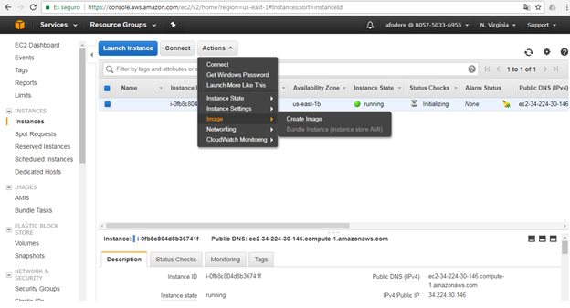

* Luego debo seleccionar los parámetros a nivel de configuración. Recordemos que los tipos de volumen de propósito general son los que se encuentran incluídos dentro del free tier.

  En el caso de la opción Delete On Termination, significa que dicha imagen será destruida una vez que la instancia asociada a dicha imagen finalice. Si se desea esto, se deberá activar esta opción.

  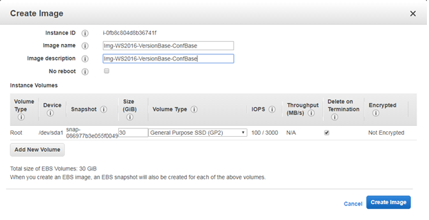

  **La capa gratuita nos permite almacenar hasta 30 GB de Amazon Elastic Block Store en cualquier combinación de almacenamiento general (SSD) o magnético, más 2 millones de E/S (con almacenamiento magnético de EBS) y 1 GB de almacenamiento de snapshots**

  ***Por mas información consulte:   https://aws.amazon.com/es/free/***

* Una vez finalizado con el proceso de parametrización se mostrará lo siguiente:
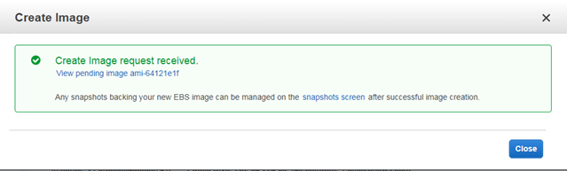 

  **Nota:**

  ***El proceso de creación de una AMI, genera un snapshot. Para evitar costos adicionales, borrar todo para evitar costos adicionales.***

   ***Por mas información consulte:   https://aws.amazon.com/es/free/***

* Para ver la AMI creada, nos dirigimos a Images->AMIs

  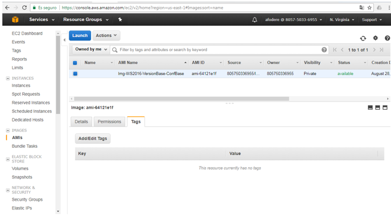 

<u>**Permisos sobre AMIs personalizadas**</u>
* Para visualizar y modificar los permisos sobre la AMI creada, se deberá hacer clic sobre la AMI.

  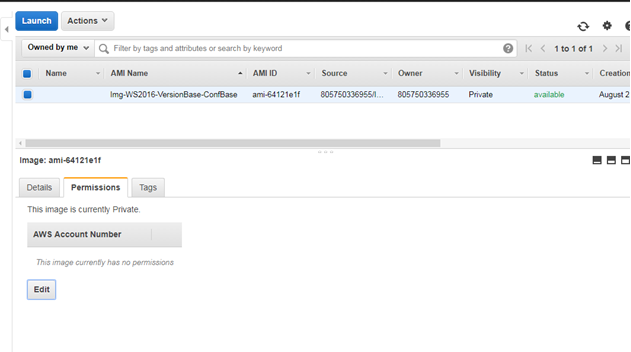 

  Luego hacemos clic sobre el botón Edit, y se mostrará la siguiente pantalla:
  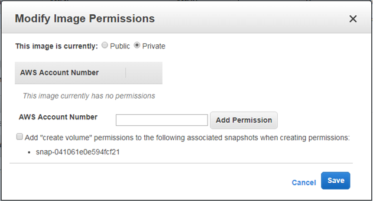 
  

  Allí se podrán agregar/modificar/eliminar permisos sobre dicha AMI.

  También podemos otorgarle permisos al usuario, de forma de que pueda crear volúmenes asociados al snapshot.

<u>**Agregar TAG a AMI**</u>

* Los TAGs permiten clasificar los recursos AWS de diferentes maneras, por ejemplo, por propósito, propietario o entorno. Esto es útil cuando se tienen muchos recursos del mismo tipo. Con lo cual el manejo de tags facilita al momento de identificar rápidamente un recurso específico basado en los tags que se le han asignado. 

  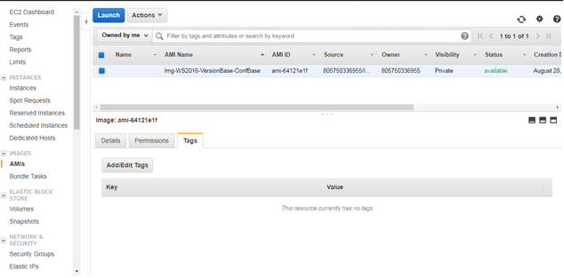 
  

  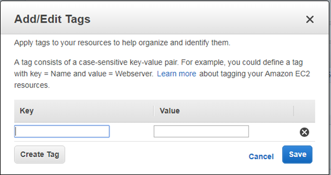

  Cada tag consta de una clave y un valor opcional, ambos definidos.

  <u>Un ejemplo:</u>

  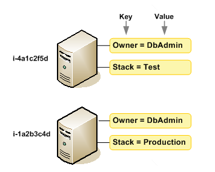

  Por mas información consulte:   http://docs.aws.amazon.com/AWSEC2/latest/UserGuide/Using_Tags.html

<u>**Uso de una AMI Personalizada**</u>

  
* Para poder utilizar las AMIs creadas, primeramente se deberá crear una nueva instancia. Luego, en el momento de elegir la AMI, debajo de **my AMIs** se encuentran las AMI creadas. Simplemente la seleccionamos, y luego el proceso continúa de forma análoga al proceso básico de levantar una nueva instancia.

  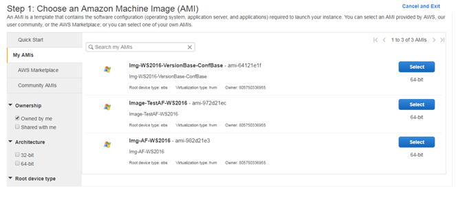

  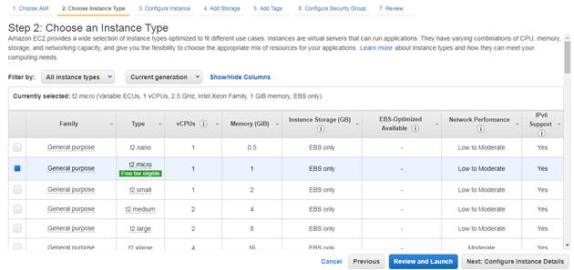

<u>**Desregistrar una AMI**</u>

Se puede llegar a dar la situación, en la que se desee desregistrar la AMI creada.
Para ello se deberán realizar los siguientes pasos:

* Dirigirse a Images, y luego presionar botón derecho sobre la AMI.
  
  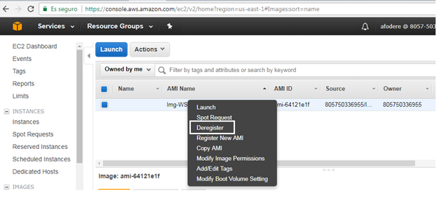

  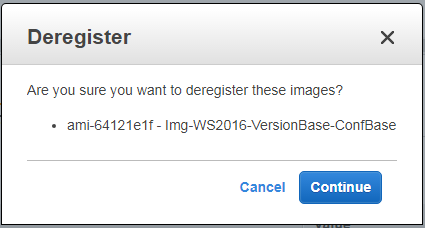

* El proceso de desregistro demora unos minutos en completarse.

  Si por error se le da nuevamente **desregistrar** a una AMI a la que ya se le inició el proceso, se mostrará el siguiente mensaje de error:
  
  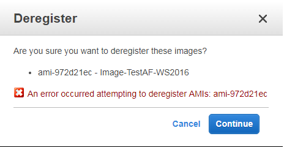

* Finalmente, para verificar, se deberá volver a la sección **Images**. Allí se constatará de que no existen AMIs creadas.
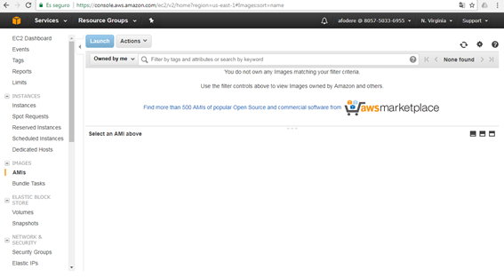

---
&nbsp;

## Tipos de Instancias

Un tipo de instancia simplemente define el tamaño de la instancia desde una CPU, memoria, almacenamiento y perspectiva de red. Tener esta flexibilidad de instancias variadas le permite seleccionar el tamaño o la potencia más apropiada de un servidor virtual que necesita para un rendimiento óptimo con sus aplicaciones.

Amazon EC2 permite elegir entre ***instancias de desempeño fijo*** (por ejemplo, M3, C3 y R3) e ***instancias de desempeño con ráfagas*** (por ejemplo, T2).

## Familias de Instancias

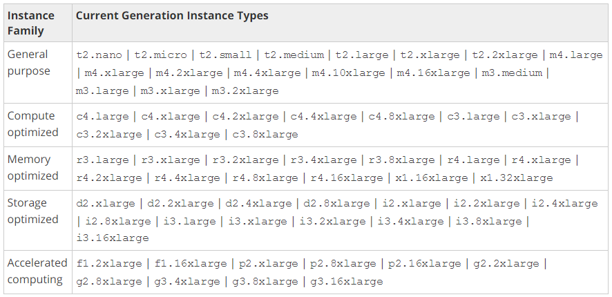

### Instancias de Desempeño con Ráfagas

Aquí es donde se encuentran las de propósito General.

Las instancias de desempeño con ráfagas, proporcionan un nivel base de desempeño de la CPU con la posibilidad de alcanzar ráfagas por encima del nivel básico. 

Uno de los tipos de instancias de desempeño con ráfagas son las T2 en las cuales el desempeño de referencia y la capacidad de alcanzar ráfagas se rigen por los créditos de la CPU.

 Cada instancia T2 recibe créditos de CPU continuamente a un nivel establecido dependiendo del tamaño de la instancia.  Las instancias T2 acumulan créditos de la CPU cuando están inactivas y los utilizan cuando están activas.  Las instancias T2 son una buena opción para cargas de trabajo que no usan la CPU por completo, a menudo o de manera constante, pero que de vez en cuando tienen que alcanzar ráfagas (por ejemplo, servidores web, entornos para desarrolladores y bases de datos). 

 Ilustraremos con un ejemplo mediante la siguiente tabla:

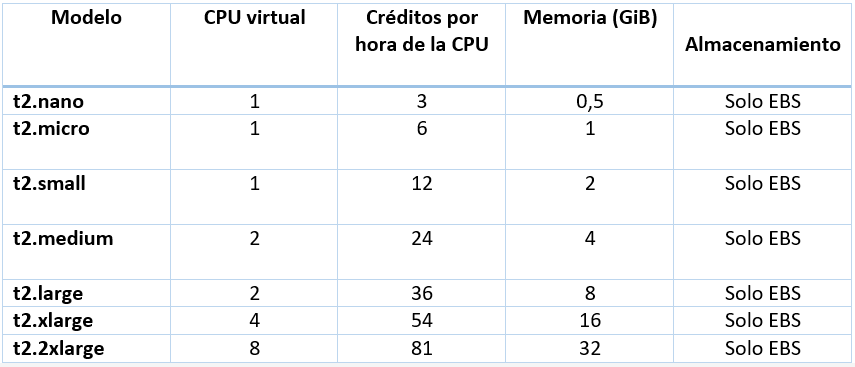

---
***Que son los créditos por hora de CPU?***

Son los encargados de aumentar el rendimiento de CPU de una instancia t2 en caso de necesidad puntual, las instancias t2 también llamadas de performance burstable o de ráfaga disponen de un rendimiento definido fijo como el que podemos ver en la tabla y de una capacidad  temporal extra limitada por los créditos por hora de CPU definidos.

La instancia arranca con un balance de créditos de CPU suficiente para que el performance sea bueno, mientras la instancia este en modo idle (o sin llegar a usar su baseline performance) los CPU Credits se acumulan según la tabla anterior CPU Credits / Hour, hasta llegar a 24 horas, donde si no se han gastado no se seguirán acumulando.

En el caso que una instancia requiera de un nivel de CPU superior a su Baseline Performance en momentos puntuales (ráfagas) usará los créditos disponibles acumulados hasta terminarlos y seguirá con el rendimiento marcado en su baseline performance.

*Ejemplos:*

*Supongamos que tenemos una instancia t2.micro encendida usando un 10% de CPU continuo (Su máximo permitido), en este caso se van acumulando a razón de 6 Créditos de CPU cada hora. 
Transcurridas 2 horas dispondremos de 12 minutos completos (2 horas x 6 créditos) en los que podremos usar el 100% de performance de un core de CPU a máximo rendimiento, transcurridos estos 12 minutos el sistema bajará su performance hasta un 10% de la potencia del core de CPU que es el asignado en su baseline.*

*Notas:* 

* *El sistema operativo seguirá indicando que está al 100% de CPU si el proceso no ha finalizado, pero irá un 90% más lento que en los 12 minutos anteriores donde pudimos disfrutar de la máxima potencia del core físico asignado a la máquina virtual.*

* *En el caso de una instancia t2.large dispondremos siempre de un 60% del core de CPU para nuestro uso y disfrute, en el caso puntual que necesitemos superar este rendimiento, el sistema cogerá de su reserva de CPU Crédits lo acumulado a razón de 36 créditos por hora el establecido en la primera imagen del artículo.*
*Si el uso de CPU de la instancia t2.large fuera inferior a un 60% de CPU durante 24 horas, dispondríamos de 14 horas o 864 minutos de uso del sistema al 100% de su capacidad de procesamiento (24 horas *36 créditos), transcurrido este tiempo volveríamos a disponer de un 60% de rendimiento del core.*

* *En el caso de las instancias t2 medium y large que disponen de 2 vCPU significa que tienen el doble de capacidad de proceso? Pues no. En el caso de t2 medium tiene como base un 40% de un núcleo disponible para un único proceso (1 vCPU) pero si utiliza multiproceso (2 vCPU) dispondrá de un 20% por cada proceso. en el caso de t2.large lo mismo pero con un 60% de una vCPU y de un 30% si es multiproceso.*

---

**Formato de Desempeño de las Instancias**

Amazon EC2 proporciona a cada instancia una cantidad consistente y previsible de capacidad de CPU, independientemente de su hardware subyacente.

Amazon EC2 dedica algunos recursos del equipo host, como CPU, memoria y almacenamiento de instancias, a una instancia particular. Amazon EC2 comparte otros recursos de la computadora host, como la red y el subsistema de disco, entre instancias. 

Si cada instancia de un equipo host intenta utilizar tanto de uno de estos recursos compartidos como sea posible, cada uno recibe un porcentaje igual de ese recurso. Sin embargo, cuando un recurso está infrautilizado, una instancia puede consumir una mayor proporción de ese recurso mientras esté disponible.

Cada tipo de instancia proporciona un rendimiento mínimo superior o inferior de un recurso compartido. Por ejemplo, los tipos de instancia con alto rendimiento de E / S tienen una mayor asignación de recursos compartidos. La asignación de una mayor proporción de recursos compartidos también reduce la varianza del rendimiento de E / S. Para la mayoría de las aplicaciones, un rendimiento de E / S moderado es más que suficiente. Sin embargo, para aplicaciones que requieren un rendimiento de E / S mayor o más consistente, se deberá considerar un tipo de instancia con mayor rendimiento de E / S.

### Instancias de Desempeño fijo

Garantizan entregar los recursos en forma constante.
Pensada para satisfacer aquellos requerimientos, donde es importante un desempeño de la CPU alto de manera consistente para aplicaciones como, por ejemplo,codificación de video, sitios web de alto volumen o aplicaciones HPC (High Performance Computing)

<u>**Algunos tipos de instancias de Desempeño Fijo:**</u>

  Optimizadas para Cómputo

  Memoria optimizada

  Almacenamiento optimizado

  Computación Acelerada

* **Almacenamiento Optimizado**

  Las instancias optimizadas de almacenamiento están diseñadas para cargas de trabajo que requieren un alto acceso secuencial de lectura y escritura a conjuntos de datos muy grandes en el almacenamiento local. Están optimizadas para entregar decenas de miles de operaciones de E / S aleatorias de baja latencia por segundo (IOPS) a aplicaciones.

* **Memoria optimizada (Instancias X1):**

  **Descripción:**

    Los tipos de instancia aquí se utilizan principalmente para aplicaciones de gran escala, de clase empresarial, en memoria, tales como realizar el procesamiento en tiempo real de datos no estructurados o para bases de datos en memoria como SAP HANA. 
    
    Las instancias de esta familia utilizan almacenamiento de instancia con respaldo SSD para baja latencia y un rendimiento de entrada / salida muy alto, incluyendo IOPS muy alto, que significa operaciones de salida de entrada por segundo. 
  
    Estos son ideales para cargas de trabajo analíticas y no bases de datos SQL, sistemas de archivos de datos y aplicaciones de procesamiento en bloque. Puede comprar instancias de EC2 a través de una variedad de diferentes planes de pago. Estos han sido diseñados para ayudarle a ahorrar costes seleccionando la opción más apropiada para su despliegue. 
  
    Las instancias X1 están optimizadas para aplicaciones en la memoria a larga escala de clase empresarial y ofrecen el costo más bajo por GiB de RAM entre los tipos de instancias de Amazon EC2.

  
  **Características:**

  * Procesadores Intel Xeon E7-8880 v3 (Haswell) de alta frecuencia
  * Precio más bajo por GiB de RAM
  * Hasta 1 952 GiB de memoria de instancia basada en DDR4
  * Almacenamiento SSD y optimizadas para EBS por defecto sin costo adicional
  * Posibilidad de controlar la configuración del estado C y P del procesador

  **Casos de uso**

  Se recomiendan las instancias X1 para ejecutar bases de datos en memoria como SAP HANA, motores de procesamiento de big data como Apache Spark o Presto, y aplicaciones informáticas de alto desempeño (HPC). 
  
  Las instancias X1 están certificadas por SAP para la ejecución de Business Warehouse en HANA (BW), soluciones de centros de datos en HANA, Business Suite en HANA (SoH), y Business Suite S/4HANA de siguiente generación en un entorno de producción en la nube de AWS.

* **Computación Acelerada (P2)**

    **Descripción:**

    
  Si necesita una alta capacidad de procesamiento, se beneficiará del uso de instancias de computación acelerada, que proporcionan acceso a aceleradores de cálculo basados ​​en hardware como GPUs o Field Programmable Gate Arrays (FPGA). Las instancias de computación acelerada permiten mayor paralelismo para un mayor rendimiento en cargas de trabajo intensivas en computación.

  Las instancias basadas en GPU proporcionan acceso a las GPU NVIDIA con miles de núcleos de cálculo. Puede utilizar instancias de computación acelerada basadas en GPU para acelerar las aplicaciones científicas, de ingeniería y de procesamiento aprovechando los frameworks de computación paralelo CUDA o Open Computing Language (OpenCL). También puede utilizarlos para aplicaciones gráficas, como streaming de juegos, transmisión de aplicaciones 3D y otras cargas de trabajo de gráficos.

  **Características:**
  
  * Procesadores Intel Xeon E5-2686v4 (Broadwell) de alta frecuencia.
  * GPU NVIDIA K80 de alto desempeño, cada unidad con 2 496 núcleos de procesamiento paralelo y     12 GiB de memoria GPU
  *	Compatible con GPUDirect™ (comunicación GPU punto a punto)
  *	Proporciona redes mejoradas con el adaptador de red elástico de Amazon EC2, que ofrece hasta    20 Gbps de ancho de banda total en un grupo de ubicación.

  *	Optimizados para EBS de manera predeterminada sin costos adicionales

* **Optimizadas para Cómputo**
 
  **Descripción:**

  Esta familia incluye instancias de gran capacidad de almacenamiento que ofrecen almacenamiento de instancias respaldado por SSD en memoria no volátil exprés (NVMe) optimizado para baja latencia, desempeño de E/S aleatoria muy alta, desempeño de lectura secuencial alto y ofrecen IOPS altas a bajo costo.

---
&nbsp;
## Formas de Adquisición:

* Reservadas
  
  Las instancias reservadas (IR) de Amazon EC2 proporcionan un descuento importante (de hasta el 75%) en comparación con el precio de las instancias bajo demanda y brindan una reserva de capacidad cuando se utilizan en una zona de disponibilidad específica.

  Por otra parte el mercado de instancias reservadas permite a otros clientes de AWS publicar sus IR estándares para la venta. Las IR estándares de terceros no presentan diferencias con las instancias reservadas estándares que se adquieren directamente a AWS, con la excepción de que ofrecen precios menores y plazos más cortos.

  Tipos:

  * IR estándares: 
      
      Ofrecen el mayor descuento (hasta un 75% en comparación con las instancias bajo demanda) y están mejor preparadas para el uso de estado constante.
      
      Plazos: AWS ofrece IR estándares en plazos de 1 o 3 años.
  
  * IR convertibles: 
  
      Ofrecen un descuento (hasta un 54% en comparación con las instancias bajo demanda) y la capacidad para cambiar los atributos de la IR siempre y cuando el intercambio resulte en la creación de instancias reservadas de un valor equivalente o superior. Al igual que las IR estándares, las IR convertibles están mejor preparadas para el uso de estado constante.
      
      AWS ofrece IR convertibles en plazos de 3 años.
     

  * IR programadas: 
      
      Se pueden lanzar en los intervalos de tiempo para los que se hayan reservado. Esta opción permite adecuar la reserva de capacidad a un cronograma recurrente y previsible que solo ocupe una fracción de un día, una semana o un mes.

* On Demand
  
  Con las instancias bajo demanda, solo paga por las instancias de EC2 que utiliza. El uso de las instancias bajo demanda elimina los costos y las complejidades de la planificación, la compra y el mantenimiento del hardware y se transforma lo que normalmente son grandes costos fijos en costos variables mucho más reducidos. 

  Características:
  
  * Las instancias bajo demanda permiten pagar por la capacidad de cómputo por horas sin compromisos a largo plazo. Así se eliminan los costos y las complejidades de la planificación,la compra y el mantenimiento del hardware y se transforma lo que normalmente son grandes costos fijos en costos variables mucho más reducidos.

  * Los precios se calculan por hora de instancia consumida para cada instancia, desde el momento   en el que se lanza hasta que se finaliza o detiene. Cada porción de hora de instancia           consumida se facturará como hora completa.

* Spot.
  
  Permiten pujar por la capacidad informática de Amazon EC2 que quede libre. 
  A menudo se ofrecen descuentos para las instancias de subasta. 
  Esto supone que, por el mismo presupuesto que el invertido en los precios bajo demanda, puede reducir considerablemente el costo de ejecutar las aplicaciones, aumentar la capacidad de cómputo y de desempeño de las aplicaciones, y habilitar nuevos tipos de aplicaciones de informática en la nube.

  Beneficios

  * Las instancias de subasta se ejecutan cuando su precio de puja supera el precio de subasta y    ponen a su alcance la fiabilidad, la seguridad, el desempeño, el control y la elasticidad de Amazon EC2 a precios reducidos acordes al mercado.

  * Reducción de los costos operacionales.

    Es posible reducir los costos operacionales hasta en un 50-90% con las instancias de subasta, en comparación con las instancias bajo demanda.
    El precio de subasta fluctúa en función de la oferta y la demanda de capacidad de EC2 disponible sin uso.
  
    Cuando solicita instancias de subasta, debe especificar el precio máximo de subasta que está dispuesto a pagar.  Su instancia de subasta se lanza cuando el precio de subasta es menor que el precio que especificó y continuará ejecutándose hasta que decida finalizarla o hasta que el precio de subasta exceda el precio máximo que especificó.

    Con las instancias de subasta, nunca se le cobra más que el precio máximo que especificó.  Mientras su instancia se encuentre en ejecución, se le cobrará el precio de subasta vigente durante dicho período. 

    Si el precio de subasta excede el precio que especificó, la instancia recibirá una notificación dos minutos antes de que se finalice, y no se le cobrará la hora parcial durante la cual la instancia se haya ejecutado.

    Si incluye un requisito de duración en la solicitud de instancia de subasta, la instancia continúa ejecutándose hasta que decida cerrarla o hasta que se cumpla la duración especificada; no se cerrará por cambios en el precio de subasta.

  * Mejora en el desempeño de la aplicación
  
    En las instancias de subasta se pueden ejecutar y escalar aplicaciones, como por ejemplo, servicios web sin estado, representaciones de imágenes, análisis de big data y cómputos masivamente paralelos. Dado que las instancias de subasta suelen costar un 50-90% menos, esto le permite la capacidad de cómputo en 2-10x contando con el mismo presupuesto.

* Instancias Reservadas programadas 

  Las Instancias Reservadas Programadas (Instancias Programadas) permiten comprar reservas de capacidad que se repiten diariamente, semanalmente o mensualmente, con una hora y duración de inicio especificadas, por un período de un año. 

  Se debe realizar la reserva de la capacidad por adelantado, de modo de saber que está disponible cuando se necesita. 

  Se paga por el tiempo que las instancias están programadas, incluso si no son usadas.

  Las instancias programadas son una buena opción para las cargas de trabajo que no se ejecutan continuamente, pero se ejecutan en un horario regular. 

  Por ejemplo, se puede utilizar instancias programadas para una aplicación que se ejecuta durante las horas de oficina o para el procesamiento por lotes que se ejecuta al final de la semana.

  Si es necesario disponer de una reserva de capacidad de forma contínua, para procesos como ser: procesamiento por lotes, ejecución de tareas de backups, etc, etc; las instancias reservadas son una excelente opción, pensando a la vez en la reducción de costos.

  Amazon EC2 separa las agrupaciones de instancias de EC2 en cada Zona de Disponibilidad para su uso como instancias planificadas. Cada grupo admite una combinación específica de tipo de instancia, sistema operativo y red (EC2-Classic o EC2-VPC).

  Para empezar, debe buscar un horario disponible. Puede buscar en varias agrupaciones o en una única agrupación. Después de encontrar un horario adecuado, cómpralo.

  Debe iniciar sus instancias programadas durante sus períodos de tiempo programados, utilizando una configuración de inicio que coincida con los siguientes atributos de la programación que ha adquirido: tipo de instancia, zona de disponibilidad, red y plataforma. Cuando lo hace, Amazon EC2 lanza instancias de EC2 en su nombre, en función de la especificación de lanzamiento especificada. Amazon EC2 debe asegurarse de que las instancias de EC2 hayan finalizado al final del período de tiempo programado actual para que la capacidad esté disponible para cualquier otra instancia programada para la que esté reservada. 

  Por lo tanto, Amazon EC2 finaliza las instancias de EC2 tres minutos antes del final del período de tiempo programado actual.

  No es posible detener o reiniciar instancias programadas, pero si se permite terminarlas manualmente según sea necesario. Si se finaliza una instancia programada antes de que finalice su período de tiempo programado actual, es posible reiniciarlo después de unos minutos. De lo contrario, se debe esperar hasta el siguiente período de tiempo programado.

  Limitantes de este tipo de instancias:

  * Los siguientes son los únicos tipos de instancia compatibles: C3, C4, M4 y R3.

  * El plazo requerido es de 365 días (un año).

  * La utilización mínima necesaria es de 1.200 horas por año.

  * Se puede comprar una instancia programada con hasta tres meses de antelación.

  Por mas información consulte:   http://docs.aws.amazon.com/es_es/AWSEC2/latest/UserGuide/ec2-scheduled-instances.html
---
&nbsp;
## Opciones de Tenencia

* Compartida

  Tenencia Compartida es cuando una instancia está alojada en un hardware compartido. Esto significa que podría haber otros clientes de AWS ejecutando sus instancias en el mismo servidor físico. Nunca se sabrá quienes son esos otros clientes ni cuantas instancias se están ejecutando en el mismo servidor físico. 

  La seguridad y la separación se gestionan en la capa de hipervisor, donde AWS mantiene el control operacional y de soporte.

  AWS garantiza que no habrá cruzamiento de datos entre las diferentes instancias.

  La mayor ventaja de Tenencia Compartida es su menor costo. 
  
  Este es el producto adecuado para aquellos casos en los cuales no hay necesidad de de aislamiento, y por lo tanto de disponer de determinados recursos de hardware para su uso explícito.

* Host Dedicado

  Para usar un Host Dedicado, primero se debe asignar hosts para su uso en su cuenta. A continuación, debemos inciar las instancias en los hosts especificando host tenancy para la instancia. 

  La configuración de ubicación automática de instancia le permite controlar si una instancia puede iniciarse en un host concreto. Cuando una instancia se detiene y se reinicia, la configuración de afinidad de Host determina si se ha reiniciado en el mismo host o en otro. Si ya no necesita un host bajo demanda, puede detener las instancias que se ejecutan en el host, dirigirlas para que se inicien en un host diferente y, a continuación, liberar el host dedicado.

  Por mas información consulte: http://docs.aws.amazon.com/es_es/AWSEC2/latest/UserGuide/dedicated-hosts-overview.html

* Instancias Dedicadas

  Las instancias dedicadas son las instancias de Amazon EC2 que se ejecutan en una nube virtual privada (VPC) en hardware dedicado a un solo cliente. Las instancias Dedicadas están físicamente aisladas en el nivel de hardware de host de instancias que pertenecen a otras cuentas de AWS. Las instancias dedicadas pueden compartir hardware con otras instancias de la misma cuenta de AWS que no son instancias dedicadas.

  Por mas información consulte: http://docs.aws.amazon.com/es_es/AWSEC2/latest/UserGuide/dedicated-instance.html  

* Placement Groups

  Un grupo de ubicaciones, es un agrupamiento lógico de instancias dentro de una sola Zona de Disponibilidad. Los grupos de ubicaciones se recomiendan para aplicaciones que se benefician de una baja latencia de la red, un alto rendimiento de la red o ambas. 

  Para proporcionar la latencia más baja y el rendimiento de red de paquete por segundo más alto para su grupo de ubicaciones, se debe eligir un tipo de instancia que admita la creación de redes mejoradas. 

  Primero, se crea un grupo de ubicaciones y, a continuación, se deberá iniciar varias instancias en el grupo de ubicaciones. Es recomendable iniciar el número de instancias que necesita en el grupo de ubicaciones en una sola solicitud de lanzamiento y usar el mismo tipo de instancia para todas las instancias del grupo de ubicaciones. 

  En caso de agregar más instancias al grupo de ubicaciones más adelante, o si se llegar a intentar iniciar más de un tipo de instancia en el grupo de ubicaciones, se aumentan las probabilidades de obtener un error de capacidad insuficiente.

  * **Consideraciones:**
    
      * No se cobra por crear un grupo de ubicaciones.

      * Si detiene una instancia en un grupo de ubicaciones y, a continuación, vuelve a iniciarla,  se ejecuta en el grupo de ubicaciones. Sin embargo, el inicio falla si no hay suficiente    capacidad para la instancia.

      * En caso de recibir un error de capacidad al iniciar una instancia en un grupo de            ubicaciones que ya tiene instancias en ejecución, se deberá detener e inicie todas las instancias del grupo de ubicaciones y luego intentar reiniciarlo. 

  * **Limitantes**
  
      * Un Placement Group no puede abarcar múltiples availability Zones.
      * El nombre que especifique para un grupo de ubicaciones debe ser único dentro de su cuenta de AWS.

      * Los siguientes son los únicos tipos de instancia que puede utilizar al iniciar una instancia en un grupo de ubicaciones:
      

      * La velocidad máxima de tráfico de la red entre dos instancias de un grupo de ubicaciones está limitada por la más lenta de las dos instancias.  

      * Aunque es posible iniciar varios tipos de instancia en un grupo de ubicaciones, esto reduce la probabilidad de que la capacidad necesaria esté disponible para que su lanzamiento tenga éxito. Recomendamos utilizar el mismo tipo de instancia para todas las instancias de un grupo de ubicaciones.

      * No puede mover una instancia existente a un grupo de ubicaciones. Puede crear un AMI desde su instancia existente y, a continuación, iniciar una nueva instancia del AMI en un grupo de ubicaciones.

    Por mas información consulte:   http://docs.aws.amazon.com/es_es/AWSEC2/latest/UserGuide/placement-groups.html

**************************************************
&nbsp;
## Ciclo de Vida de las Instancias
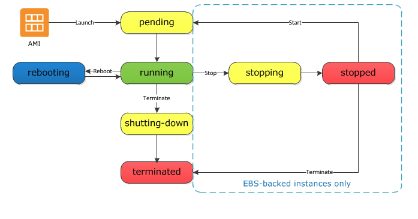

* ***Lanzamiento de Instancia***

    Cuando se inicia una instancia, ingresa el estado ***pendiente***. 
  
    Para ver el estado de una instancia desde línea de comandos, se deberá utilizar el siguiente comando:

          PS C:\>aws ec2 describe-instances

    El tipo de instancia que especificó al iniciar determina el hardware del equipo host de su instancia. 

    También se utilizará la Amazon Machine Image (AMI) que especificó al iniciar para iniciar la instancia. 
  
    Después de que la instancia esté lista, entrará en el estado de ***ejecución***. Puede conectarse a su instancia de ejecución y utilizarla de la misma manera que utilizará una computadora que se encuentre frente a usted.

    ***Tan pronto como su instancia pasa al estado de ejecución, se le facturará por cada hora o hora parcial que mantenga la instancia en ejecución; Incluso si la instancia permanece inactiva y no se conecta a ella.***

  

* ***Start & Stop de Instancias (Solo para aquellas con respaldo en EBS)***

  * Stop de una Instancia.

    Cuando se detiene una instancia, entra en el estado de detención y, a continuación, en el estado detenido. 

    * Amazon no cobra tarifas por hora ni por transferencia de datos por esa instancia después de detenerla, pero sí se cobra por el almacenamiento de los volúmenes de Amazon EBS. 
  
    * Mientras la instancia esté en estado detenido, es posible modificar ciertos atributos de la   instancia, incluido el tipo de instancia.

      Desde línea de comandos se deberá ejecutar el siguiente comando:

      
          PS> aws ec2 stop-instances --instance-ids IDInstancia

  * Start de una una Instancia

      Cuando inicia la instancia, ingresa el estado pendiente y, en la mayoría de los casos, la instancia es trasladada a una nueva computadora host.
      
      Desde línea de comandos se deberá ejecutar el siguiente comando:
          
          PS> aws ec2 start-instances --instance-ids IDInstancia

      Cuando detiene e inicia su instancia, perderá cualquier dato sobre los volúmenes de almacén de instancia en el equipo host anterior.

  ***Cada vez que transita una instancia de detenida a ejecutándose, se carga una hora de instancia completa, incluso si estas transiciones se producen varias veces en una sola hora.***   

* ***Reinicio de una Instancia***

    Reiniciar una instancia equivale a reiniciar un sistema operativo.
  
    La instancia permanece en el mismo equipo host y mantiene su nombre DNS público, su dirección IP privada y cualquier dato de sus volúmenes de almacén de instancias. 
  
    Tarda normalmente unos minutos para que se complete el reinicio, pero el tiempo que tarda en reiniciarse depende de la configuración de la instancia.

    Al reiniciar una instancia no se inicia una hora de facturación de una nueva instancia.

    Desde línea de comandos se deberá ejecutar el siguiente comando:
      
      PS C:\> aws ec2 reboot-instances --instance-ids IDInstancia

* ***Retiro de una Instancia***
    Una instancia está programada para ser retirada cuando AWS detecta un fallo irreparable del hardware subyacente que aloja la instancia. 
    
    Cuando una instancia alcanza su fecha de retiro programada, AWS la interrumpe o termina. 
    
    <u>Si el dispositivo raíz de instancia es un volumen de Amazon EBS, la instancia se detiene y se puede iniciar de nuevo en cualquier momento.</u> 
    
    <u>Si el dispositivo raíz de instancia es un volumen de almacén de instancia, la instancia se termina y no se puede volver a usar.</u>

    Para obtener información desde la línea de comando, se mostrará el siguiente ejemplo con las sentencias a ejecutar:
    
      PS C:\> PS C:\>aws ec2 describe-instances i-12345678
    
      AvailabilityZone : us-west-2a
      Events           : {}
      InstanceId       : i-12345678
      InstanceState    : Amazon.EC2.Model.InstanceState
      Status           : Amazon.EC2.Model.InstanceStatusSummary
      SystemStatus     : Amazon.EC2.Model.InstanceStatusSummary

      PS C:\> $status = aws ec2 describe-instances -InstanceId i-12345678
      PS C:\> $status.InstanceState

      Code    Name
      ----    ----
      16      running

      PS C:\> $status.Status

      Details           Status
      -------           ------
      {reachability}    ok

      PS C:\> $status.SystemStatus

      Details           Status
      -------           ------
      {reachability}    ok

* ***Terminación de instancia***

  Tan pronto como el estado de una instancia cambie a apagar o finalizar, deje de incurrir cargos por esa instancia.

  En caso de que se encuentre habilitada la protección de terminación, no es posible finalizar la instancia utilizando la consola, la CLI o la API.

  Después de finalizar una instancia, permanece visible en la consola durante un breve período y, a continuación, la entrada se elimina automáticamente.

  No puede conectar o recuperar una instancia terminada.

  Cada instancia respaldada por EBS respalda el atributo ***InstanceInitiatedShutdownBehavior***, que controla si la instancia se detiene o termina cuando inicia un apagado desde la propia instancia (por ejemplo, utilizando el comando shutdown en Linux). 

  Cada volumen de Amazon EBS admite el atributo ***DeleteOnTermination***, que controla si el volumen se elimina o se conserva al finalizar la instancia a la que está conectado. El valor predeterminado es eliminar el volumen del dispositivo raíz y conservar cualquier otro volumen EBS.

  
  Desde línea de comandos se deberá ejecutar el siguiente comando:

      
      PS> aws ec2 terminate-instances --instance-ids IDInstancia -Terminate

Refs:
[AWS CLI Command References EC2](http://docs.aws.amazon.com/cli/latest/reference/ec2/)

---
[Siguiente >](https://github.com/conapps/conapps-iot/blob/master/AWS%20Cloud/EC2/AWS_EC2_Parte_2.md)
