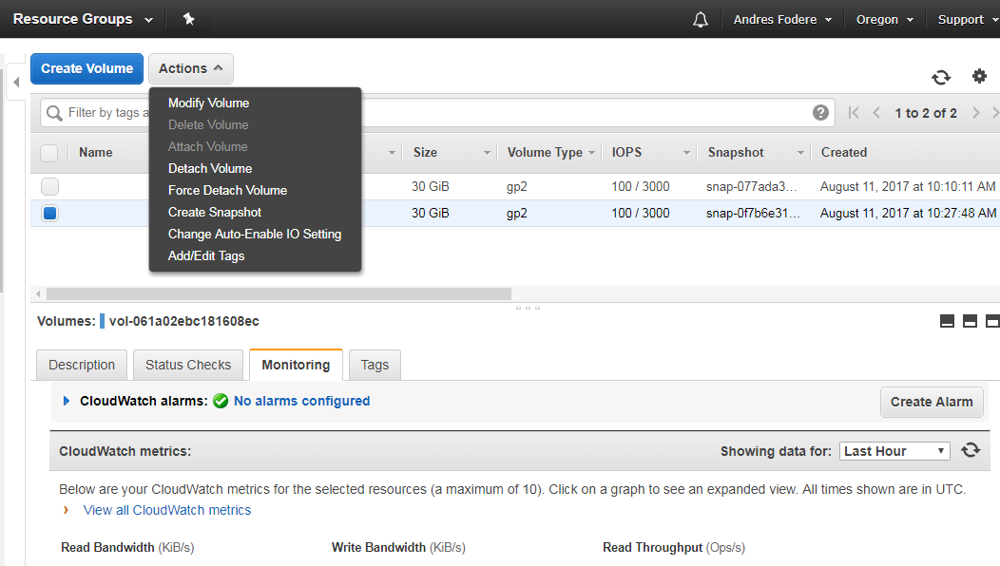
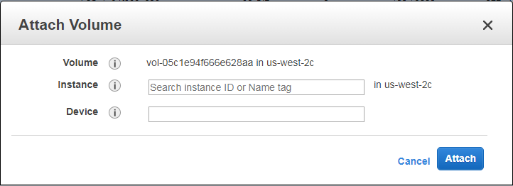
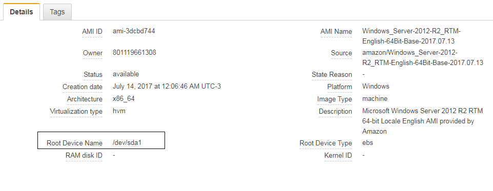

| [< Anterior](https://github.com/conapps/conapps-iot/blob/master/AWS%20Cloud/EC2/AWS_EC2.md) | [Siguiente >](https://github.com/conapps/conapps-iot/blob/master/AWS%20Cloud/EC2/AWS_EC2_Parte_3.md) |

---
### Opciones de Pago
* Instancias Bajo Demanda
    Son las instancias de EC2 que puede iniciar en cualquier momento y tenerlo aprovisionado y disponible en cuestión de minutos. 
    
    Se puede usar esta instancia por un tiempo más corto o por el tiempo que se necesite antes de finalizar la instancia. 
    
    Estas instancias tienen una tasa fija y se determina en el tipo de instancia seleccionado y se paga por hora. 
    
    Las instancias bajo demanda se usan típicamente para usos a corto plazo donde las cargas de trabajo pueden ser irregulares y donde la carga de trabajo no puede interrumpirse. 
    
    Muchos usuarios de AWS utilizan instancias bajo demanda dentro de sus entornos de pruebas y desarrollo.

* Instancias Reservadas

    Las instancias reservadas permiten comprar un tipo de instancia durante un período de tiempo determinado a cambio de un costo reducido en comparación con la demanda. 
    
    Esta reducción puede ser hasta el 75%. Estas reservas contra las instancias deben ser compradas en plazos de uno o tres años. 
    
    Se pueden conseguir reducciones adicionales con instancias reservadas, dependiendo de los métodos de pago que seleccione. 

    Dentro de las Instancias Reservadas, existen las siguientes opciones de pago:
    
    * Todo por adelantado.
        
        El pago completo de la reserva de uno o tres años se paga. Esto ofrece el descuento más grande y no se requiere ningún pago adicional, independientemente del número de horas que la instancia se use. 

    * Pago parcial por adelantado.
    
        Se hace un pago inicial más pequeño y, a continuación, se aplica un descuento a cualquier hora utilizada por la instancia durante el plazo. No se realizan pagos iniciales o parciales y el menor descuento de los tres modelos se aplica a cualquier hora utilizada por la instancia. 

        Las instancias reservadas se utilizan para cargas de trabajo previsibles a largo plazo, lo que le permite aprovechar al máximo los ahorros.

* Spot

    Las instancias Spot permiten pujar por los recursos de computación EC2 no utilizados.
    
    Sin embargo, su recurso no está garantizado por un período de tiempo fijo. 
    
    Para utilizar una instancia de punto EC2, debe realizar una puja mayor que el precio spot actual fijado por AWS. 
    
    Este precio spot varía dependiendo de la oferta y la demanda del recurso no utilizado. 
    
    Si el precio de la oferta para un tipo de instancia es mayor que el precio al contado, entonces comprará la instancia.
    
    Pero tan pronto como su precio de la oferta se haga más bajo que el precio al contado fluctuante, se le emitirá una advertencia de dos minutos antes de que la instancia sea automáticamente terminada y eliminada de su entorno por AWS. 
    
    La ventaja de las instancias puntuales es que puedes pujar por grandes instancias de EC2 a un precio muy bajo, ahorrando una cantidad enorme. 
    Sin embargo, debido a la naturaleza de cómo las instancias pueden ser eliminadas de repente de su entorno, las instancias puntuales sólo son útiles para el procesamiento de datos y aplicaciones que pueden interrumpirse repentinamente, como los trabajos por lotes y el procesamiento en segundo plano de los datos.

---
## Opciones de Almacenamiento

### Amazon EBS

Amazon EBS ofrece los siguientes tipos de volumen, que difieren en las características de rendimiento y el precio, de modo que puede adaptar el rendimiento de almacenamiento y el costo a las necesidades de sus aplicaciones. 
Los tipos de volúmenes se dividen en dos categorías:

* Volúmenes respaldados por SSD.

    Optimizados para cargas de trabajo transaccionales que implican operaciones de lectura / escritura frecuentes con tamaño de E / S pequeño, donde el atributo de rendimiento dominante es IOPS
    Apunta a rendimiento-performance, por sobre procesamiento de grandes cargas de trabajo.

    Aquí se encuentran los siguientes tipos de volúmenes:
    * <u>SSD de Propósito General (gp2)</u>
        
        Volumen SSD de uso general que equilibra el precio y el rendimiento para una amplia variedad de cargas de trabajo transaccionales

        Caso de uso:
        * Recomendado para la mayoría de las cargas de trabajo.
        * Volúmenes de arranque del sistema
        * Escritorios virtuales
        * Aplicaciones interactivas de baja latencia
        * Entornos de desarrollo y prueba

        

    * <u>SSD con IOPS Provisionados (io1)</u>
    
        Volumen SSD de mayor rendimiento diseñado para aplicaciones de misión crítica

        Caso de uso:
        
        * Aplicaciones empresariales críticas que requieren un rendimiento IOPS sostenido, o más    de 10.000 IOPS o 160 MiB / s de rendimiento por volumen. Pensado para grandes cargas de   trabajo de bases de datos, tales como: 
        * MongoDB
        * Cassandra 
        * Microsoft SQL Server 
        * MySQL 
        * PostgreSQL 
        * Oracle

        

* Volúmenes respaldados por HDD.

    Optimizados para grandes cargas de trabajo de flujo continuo donde el rendimiento (medido en MiB / s) es una mejor medida de rendimiento que IOPS

    Apunta a procesamiento de grandes cargas de datos.

    * <u>HDD con Rendimiento Optimizado (st1)</u>
        
        Volumen de disco duro de bajo costo diseñado para cargas de trabajo de uso frecuente

        Casos de uso:
        * Transmisión de cargas de trabajo que requieren un rendimiento constante y rápido a un     precio bajo. 
        * Pensado para Gran cantidad de datos. 
        * Almacenes de datos. 
        * Procesamiento de registros. 
        * No puede ser un volumen de arranque.

        

    * <u>HDD frío (sc1)</u>
    
        Volumen de HDD de menor costo diseñado para cargas de trabajo de acceso menos frecuente

        Casos de uso:
        * Almacenamiento orientado al rendimiento para grandes volúmenes de datos a los que se accede con poca frecuencia. 
        * Escenarios donde el menor costo de almacenamiento es importante No puede ser un volumen de arranque.

        

---
### ¿ Que son las IOPS ?

Las IOPS son una unidad de medida que representa las operaciones de entrada / salida por segundo. 

Las operaciones se miden en KiB y la tecnología de accionamiento subyacente determina la cantidad máxima de datos que un tipo de volumen cuenta como una sola E / S. 

El tamaño de E / S tiene un ***límite de 256 KiB para volúmenes SSD*** y ***1.024 KiB para volúmenes HDD***, ya que los volúmenes SSD manejan E / S pequeñas o aleatorias mucho más eficientemente que los volúmenes HDD.

Cuando las operaciones de E / S pequeñas son físicamente contiguas, Amazon EBS intenta combinarlas en una sola E / S hasta el tamaño máximo. 

<u>Ejemplos:</u>
* Para volúmenes SSD, una sola operación de E / S de 1.024 KiB cuenta como 4 operaciones.
  (1.024 ÷ 256 = 4)

* Mientras que 8 operaciones de E / S contiguas a 32 KiB cuentan como 1operación (8 × 32 = 256). 

* Sin embargo, 8 operaciones de E / S al azar a 32 KiB cada cuenta como 8 operaciones. 
 Cada operación de E / S inferior a 32 KiB cuenta como 1 operación.

---
### Manejo de Snapshots
Un snapshot de un volumen EBS, puede utilizarse como línea de base para nuevos volúmenes o para copia de seguridad de datos. 

<u>Si realizan snapshots periódicos de un volumen, los mismos son incrementales</u>:
Sólo los bloques del dispositivo que han cambiado después del último realizado se guardan en el nuevo realizado. 

A pesar de que los snapshots se guardan de forma incremental, el proceso de eliminación está diseñado para que sólo sea necesario conservar el mas reciente para restaurar todo el volumen.

<u>Los snapshots se producen asincrónicamente</u>: El snapshot de punto a punto se crea de inmediato, pero el estado del mismo está pendiente hasta que se haya completado (cuando todos los bloques modificados se han transferido a Amazon S3), lo que puede tardar varias horas en snapshots iniciales grandes o los subsiguientes realizados en los que han cambiado muchos bloques. 
Mientras se está completando, un snapshot en curso no se ve afectado por las lecturas y escrituras en curso en el volumen.

<u>Importante</u>:

* Aunque se puede realizar un snapshot de un volúmen mientras uno anterior de ese volumen está en   el estado pendiente, tener varios snapshots pendientes de un volumen puede resultar en un r endimiento de volumen reducido hasta que los mismos se completen.

* Hay un límite de 5 snapshots pendientes para un único gp2, io1 o volumen magnético y 1 sólo pendiente para un único volumen st1 o sc1. 

* Si se recibe un error ConcurrentSnapshotLimitExceeded mientras se intenta crear varios snapshots simultáneos del mismo volumen, se debe esperar a que una o más de los que se encuentran pendientes se completen antes de crear otro snapshot de ese volumen.

* Los snapshots realizados a volúmenes cifrados se cifran automáticamente. Los volúmenes que se   crean a partir de snapshots cifrados también se cifran automáticamente. Los datos de los        volúmenes cifrados y los snapshots asociados están protegidos tanto en reposo como en movimiento. 

* De forma predeterminada, se pueden crear snapshots a partir de volúmenes de su propiedad. Sin embargo, se pueden compartir los snapshots ya creados con cuentas específicas de AWS, o bien compartirla a la comunidad de AWS, haciéndolos públicos. 

* En cuanto a los snapshots cifrados, se pueden compartir sólo con cuentas específicas de AWS.
Para que otros puedan usar su el snapshot cifrado que fue compartido, también se debe compartir la clave CMK que se utilizó para cifrarla. 

* Los usuarios con acceso al snasphot cifrado que se desea compartir, deberán crear su copia personal, y luego usar dicha copia para restaurar el volumen.
La nueva copia generada, también se puede volver a cifrar con una clave diferente.

Se puede tomar un snapshot de un volumen adjunto que está en uso. 
Sin embargo, los snapshots sólo captan datos que se han escrito en el volumen de Amazon EBS en el momento en que se emite el comando de snapshot. Esto podría excluir cualquier dato que haya sido almacenado en caché por cualquier aplicación o sistema operativo.

Si es posible pausar cualquier escritura de archivo en el volumen lo suficiente para tomar un snapshot, el snapshot debería quedar completo. 

Sin embargo, si no se puede pausar todas las escrituras de archivos en el volumen, se deberá desmontar el volumen de dentro de la instancia, ejecutar el comando para realizar el snapshot y, a continuación, volver a montar el volumen para garantizar un snapshot coherente y completo. 
Se puede volver a montar y utilizar su volumen mientras el estado del snapshot está pendiente.

***Nota:*** 
            
Para desmontar un volúmen en Linux, ejecutar el siguiente comando:
    
    umount -d device_name

### Crear un snapshot desde la consola

* Abrir la consola de Amazon EC2 https://console.aws.amazon.com/ec2/

* Dentro del panel de navegación - elegir la opción Snapshots.

* Luego se deberá hacer clic en el botón Create Snapshot

* Se desplegará la siguiente ventana, donde le indicaremos el ID o tag asociado al volumen,         Nombre, Descripción, y si el volúmen se encuentra o no encriptado.

    

### Recuperar el sistema partiendo desde un snapshot

* Una vez que tenemos el Snapshot realizado, debemos crear un nuevo volumen a partir de ese snapshot.

* Para ello Dentro del panel de navegación - elegir la opción Volumes.

* Luego presionamos sobre la opción Create Volume.

    

### lgunas consideraciones a tener en cuenta:
•	

* Tipo: 
Seleccione de Propósito General (SSD), Provisto IOPS (SSD), o Volúmenes Magnéticos.

* Tamaño: 
Establece el tamaño del volumen que se va a crear. No puede hacer un tamaño de volumen menor que el volumen original que se tomó la instantánea, pero es posible aumentarlo.

* Zona de disponibilidad:
Seleccione la zona de disponibilidad en la que desea crear el volumen. Debe coincidir la zona de disponibilidad con la instancia de EC2 en ejecución que desea restaurar.

* Snapshot ID:

    Ahí se deberá colocar el ID, nombre, del snapshot que fue creado anteriormente.
    Finalmente presionamos sobre el botón Create.

    A continuación, debemos asegurarnos de que el volumen se haya creado seleccionando la Consola EC2 "Volúmenes". 
    
    El volumen de "en uso" en "Estado" se adjunta a una instancia, el volumen de "Disponible" se crea pero no se adjunta a ninguna instancia.Una vez que haya verificado que el volumen se ha creado, es necesario detener la instancia en "Instancias" de la consola EC2.

    Una vez detenida la instancia, debemos hacer un detach del volumen que deseamos sobreecribir con este nuevo volumen creado.

    

    Una vez finalizado esto, procederemos a hacer un attach del volumen que deseamos recuperar.

        
        
        

    Donde indicaremos lo siguiente:

    * Instance:
        En este caso, ingresaremos el nombre de nuestra instancia.
        Sólo se muestran las instancias en la misma zona de disponibilidad que el volumen seleccionado.

    * Device:
        Ahí seleccionamos el Device ID del volumen que vamos a atachear.
        
         Para ver el Device ID:
            
        * buscamos la AMI que utilizamos (pej: ami-3dcbd744), y en los Detalles, se nos mostrará cual es el Device ID
        
        Siendo en este caso el Device ID buscado: /dev/sda1

        * Una vez que completamos ambos campos, presionamos sobre el botón Attach, luego vamos la la parte de Instancias, y la iniciamos nuevamente.

Refs:

http://docs.aws.amazon.com/AWSEC2/latest/WindowsGuide/concepts.html
https://www.youtube.com/watch?v=AKqRoy3TxVw
http://docs.aws.amazon.com/AWSEC2/latest/UserGuide/ebs-creating-snapshot.html
https://docs.aws.amazon.com/AWSEC2/latest/UserGuide/block-device-mapping-concepts.html?icmpid=docs_ec2_console
https://amimoto-ami.com/2014/10/03/create-snapshot-restore/

---
| [< Anterior](https://github.com/conapps/conapps-iot/blob/master/AWS%20Cloud/S3/AWS_EC2.md) | [Siguiente >](https://github.com/conapps/conapps-iot/blob/master/AWS%20Cloud/S3/AWS_EC2_Parte_3.md)|
