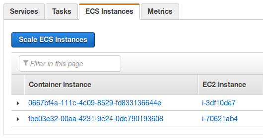
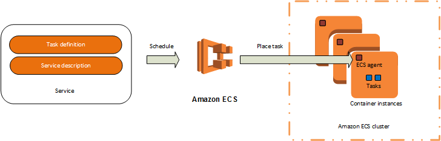

Clústeres de Amazon ECS
===

*Fuentes:*
- [Documentación oficial](http://docs.aws.amazon.com/es_es/AmazonECS/latest/developerguide/ECS_clusters.html)

## Indice.
---
- [Conceptos de clústeres](#conceptos-de-clusteres)
- [Creación de un clúster](#creación-de-un-clúster)
- [Contenedores e Imagenes](#contenedores-e-imagenes)
- [Escalado de un clúster](#escalado-de-un-clúster)
- [Eliminación de un clúster](#eliminación-de-un-clúster)

&nbsp;
---
## Conceptos de clústeres ##

*Los clústeres pueden contener varios tipos distintos de instancia de contenedor.
*Los clústeres son específicos de la región.
*Las instancias de contenedor solo pueden ser parte de un clúster a la vez.
*Puede crear políticas de IAM personalizadas para sus clústeres para permitir o limitar el acceso de los usuarios a clústeres específicos.

&nbsp;
## Creación de un clúster

Puede crear un clúster de ECS utilizando la Consola de administración de AWS, tal como se describe en este tema. 
Después de haber creado el clúster, puede registrar instancias de contenedor en el mismo y ejecutar tareas y servicios.

Pasos para crear un clúster

1-Abra la consola de Amazon ECS en https://console.aws.amazon.com/ecs/.

2-En la barra de navegación, seleccione la región a utilizar.

3-En el panel de navegación, elija Clusters.

4-En la página Clusters, elija Create Cluster.

5-En Cluster name, escriba un nombre para su cluster. Se admiten hasta 255 letras (mayúsculas y minúsculas), números, guiones y caracteres de subrayado.

6-(Opcional) Para crear un clúster vacío sin instancias de contenedor asociadas, elija Create an empty cluster, Create.

   Nota
   
Si crea un clúster vacío, debe lanzar las instancias de contenedor manualmente en dicho clúster antes de poder ejecutar tareas en él.

7-En Instance type, seleccione la opción:

*EC2 bajo demanda

8-En el campo EC2 instance type, elija el tipo de instancia EC2 que desea utilizar para sus instancias de contenedor. El tipo de instancia que seleccione determina los recursos disponibles para ejecutar sus tareas.

9-En Number of instances, escriba el número de instancias EC2 a lanzar en su clúster. 

10-En EBS storage (GiB), elija el tamaño del volumen de Amazon EBS a utilizar para el almacenamiento de datos en sus instancias de contenedor. De forma predeterminada, la AMI optimizada para Amazon ECS se lanza con un volumen raíz 8 GiB y un volumen de datos de 22 GiB. Puede aumentar el tamaño del volumen de datos para permitir un mayor almacenamiento de imágenes y contenedores.

11-En Key pair, elija un par de claves de Amazon EC2 para utilizar con sus instancias de contenedor para obtener acceso SSH. Si no especifica un par de claves, no podrá acceder a las instancias de contenedor con SSH. 

12-En la sección Networking, configure la VPC en la que va a lanzar sus instancias de contenedor. De forma predeterminada, el asistente de creación de clústeres crea una nueva VPC con dos subredes en diferentes zonas de disponibilidad y un grupo de seguridad abierto a Internet en el puerto 80. Se trata de una configuración básica que funciona bien para un servicio HTTP. Sin embargo, puede modificar estos ajustes.

13-En la sección Container instance IAM role, seleccione la función de IAM que desea utilizar con las instancias de contenedor. Si su cuenta tiene la función ecsInstanceRole que se crea en el asistente de la primera ejecución de la consola, entonces se seleccionará de forma predeterminada. Si no dispone de esta función en su cuenta, puede optar por crear la función o puede elegir otra función de IAM para utilizarla con las instancias de contenedor. 

14-Seleccione Create.

## Escalado de un clúster

1-Abra la consola de Amazon ECS en https://console.aws.amazon.com/ecs/.

2-En la barra de navegación, seleccione la región en la que existe el clúster.

3-En el panel de navegación, elija Clusters.

4-Seleccione el clúster que va a escalar.

5-En la página Cluster : name, seleccione ECS Instances.

Si aparece el botón Scale ECS Instances, podrá escalar el clúster en el siguiente paso. De lo contrario, deberá ajustar manualmente su grupo de Auto Scaling para escalar hacia arriba o hacia abajo las instancias o puede iniciar o terminar manualmente sus instancias de contenedor en la consola de Amazon EC2.

6-Elija Scale ECS Instances.

7-En Desired number of instances, introduzca el número de instancias a las que desea escalar el clúster y seleccione Scale.

## Eliminación de un clúster

Pasos para eliminar un clúster

1-Abra la consola de Amazon ECS en https://console.aws.amazon.com/ecs/.

2-En la barra de navegación, seleccione la región a utilizar.

3-En el panel de navegación, elija Clusters.

4-En la página Clusters, seleccione el clúster que desea eliminar.

 *Nota
  Si el clúster ha registrado instancias de contenedor, debe anularlas o terminarlas.
  
5-Elija Delete cluster. Puede ver una de las dos instrucciones de confirmación:
  
 *Al eliminar el clúster, también se elimina el stack de CloudFormation EC2ContainerService-cluster_name: Al eliminar este clúster, se limpian los recursos asociados que se crearon con el clúster, incluidos los grupos de Auto Scaling, las VPC o los balanceadores de carga.

 *Eliminar el clúster no afecta a los recursos de CloudFormation...: Al eliminar este clúster, no se limpian los recursos que están asociados con el clúster, incluidos los grupos de Auto Scaling, las VPC o los balanceadores de carga. Además, las instancias de contenedor registradas con este clúster deben anularse o terminarse antes de poder eliminar el clúster.

 

   

Amazon ECS es un servicio regional que simplifica la ejecución de contenedores de aplicación con alta disponibilidad en diversas zona de disponibilidad dentro de una región. Puede crear clústeres de Amazon ECS dentro de una VPC nueva o existente.
Después de que el clúster esté activo y en ejecución, puede definir servicios y definiciones de tareas que especifican las imágenes de contenedores Docker que ejecutar en los clústeres. Las imágenes de contenedor se almacenan y se extraen desde registros de contenedor, que podrían existir dentro o fuera de la infraestructura de AWS.

## Contenedores e imagenes

Para implementar aplicaciones en Amazon ECS, los componentes de la aplicación se deben diseñar para ejecutarse en contenedores. Un contenedor Docker es una unidad estandarizada de desarrollo de software que contiene todo lo que la aplicación de software necesita para ejecutarse: código, tiempo de ejecución, herramientas del sistema, bibliotecas del sistema, etc. Los contenedores se crean a partir de una plantilla de solo lectura denominada imagen.

Las imágenes se crean normalmente a partir de un Dockerfile, un archivo de texto sin formato que especifica todos los componentes incluidos en el contenedor. Estas imágenes se almacenan a continuación en un registro desde el que se pueden descargar y ejecutar en sus instancias de contenedor. 

## Definiciones de tareas

Para preparar su aplicación para que se ejecute en Amazon ECS, cree una definición de tarea. La definición de tarea es un archivo de texto en formato JSON que describe uno o más contenedores que forman la aplicación. Podemos decir que es un plan de la aplicación. Las definiciones de tarea especifican diversos parámetros para la aplicación como, por ejemplo, los contenedores que utilizar y los repositorios en los que se encuentran, los puertos que se deben abrir en la instancia de contenedor para la aplicación y los volúmenes de datos que se deben utilizar con los contenedores en la tarea.

A continuación, mostramos un ejemplo de una definición de tarea sencilla que contiene un único contenedor que ejecuta un servidor web Nginx. 

{
      "family": "webserver",
      "containerDefinitions": [
      {
              "name": "web",
              "image": "nginx",
              "cpu": 99,
              "memory": 100,
              "portMappings": [{
                      "containerPort": 80,
                      "hostPort": 80
              }]
      }]
}

### Tareas y programación

Una tarea es la instancia creada de una definición de tareas en una instancia de contenedor dentro del clúster. Después de haber creado una definición de tareas para su aplicación dentro de Amazon ECS, puede especificar el número de tareas que se ejecutarán en su clúster.

El programador de tareas de Amazon ECS es responsable de colocar tareas en instancias de contenedor. Dispone de varias opciones de programación diferentes. Por ejemplo, puede definir un servicio que ejecuta y mantiene un número especificado de tareas de forma simultánea.

### Clústeres

Cuando se ejecutan tareas utilizando Amazon ECS, las coloca en un clúster, que es una agrupación lógica de instancias EC2. Amazon ECS descarga las imágenes del contenedor desde un registro que especifique y ejecuta dichas imágenes en las instancias de contenedor dentro del clúster.

### Agente de contenedor

El agente de contenedor se ejecuta en cada instancia dentro de un clúster de Amazon ECS. Envía información a Amazon ECS sobre el uso de recursos y tareas en ejecución actualmente en la instancia e inicia y detiene tareas cuando recibe una solicitud desde Amazon ECS.

### Servicios relacionados

Amazon ECS se puede utilizar junto con los servicios de AWS siguientes:

  AWS Identity and Access Management
  
IAM es un servicio web que ayuda a controlar de forma segura el acceso de los usuarios a los recursos de AWS. Utilice IAM para controlar quién puede usar los recursos de AWS (autenticación), así como cuáles de ellos pueden usar y cómo pueden hacerlo (autorización). En Amazon ECS, IAM se puede utilizar para controlar el acceso en el nivel de instancia de contenedor utilizando roles de IAM y en el nivel de tarea utilizando roles de tarea de IAM.
  
  Auto Scaling
  
Auto Scaling es un servicio web que le permite lanzar o terminar de manera automática instancias EC2 de acuerdo con políticas definidas por el usuario, controles del estado de salud y programas. Puede utilizar Auto Scaling para reducir y aumentar la escala en las instancias de contendor dentro de un clúster en respuesta a una serie de métricas.

  Elastic Load Balancing
  
Elastic Load Balancing distribuye automáticamente tráfico de aplicaciones entrante entre varias instancias EC2 en la nube. Esto le permite conseguir niveles superiores de tolerancia a errores en sus aplicaciones, proporcionando sin problemas la capacidad de equilibrio de carga necesaria para distribuir el tráfico de las aplicaciones. Puede utilizar Elastic Load Balancing para crear un punto de enlace que balancee el tráfico entre servicios en un clúster.

  Amazon EC2 Container Registry

Amazon ECR es un servicio de registro de Docker de AWS administrado que es seguro, escalable y de confianza. Amazon ECR admite repositorios privados de Docker con permisos de nivel de recurso que utilizan IAM, de forma que instancias EC2; o usuarios concretos puedan obtener acceso a los repositorios y a las imágenes. Los desarrolladores pueden utilizar la CLI de Docker para diseñar, insertar, extraer y administrar imágenes. 

  AWS CloudFormation
  
AWS CloudFormation ofrece a desarrolladores y administradores de sistemas un método sencillo de crear y administrar una colección de recursos de AWS relacionados entre sí, aprovisionándolos y actualizándolos de una manera ordenada y predecible. Puede definir clústeres, definiciones de tarea y servicios como entidades en un script de AWS CloudFormation. 

[Siguiente >](https://github.com/conapps/conapps-iot/blob/master/AWS%20Cloud/EC2/AWS_EC2_Parte_2.md)
