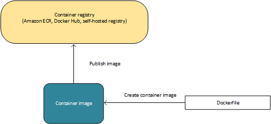
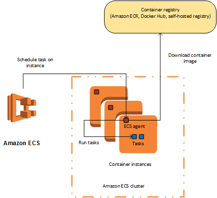

Amazon EC2 Container Service(Amazon ECS)
===

*Fuentes:*
- [Documentación oficial](http://docs.aws.amazon.com/es_es/AmazonECS/latest/developerguide/Welcome.html)

## Indice.
---
- [Introducción](#introducción)
- [Características de Amazon ECS](#características-de-amazon-ecs)
- [Contenedores e Imagenes](#contenedores-e-imagenes)
- [Definiciones de tareas](#definiciones-de-tareas)
- [Tareas y programación](#tareas-y-programación)
- [Clústeres](#clústeres)
- [Agente de contenedor](#agente-de-contenedor)
- [Servicios relacionados](#servicios-relacionados)

&nbsp;
---
## Introducción ##
---
¿Qué es Amazon EC2 Container Service?   
---
Amazon EC2 Container Service (Amazon ECS) es un servicio de administración de contenedores muy escalable y rápido que facilita la tarea de ejecutar, detener y gestionar contenedores de Docker en un clúster de instancias de Amazon Elastic Compute Cloud (Amazon EC2).
Amazon ECS le permite lanzar y detener aplicaciones basadas en contenedores con llamadas al API sencillas, le permite obtener el estado del clúster desde un servicio centralizado y le ofrece acceso a muchas características familiares de Amazon EC2.
***************

### Beneficios
* Puede programar la colocación de los contenedores en su clúster en función de las necesidades de los recursos, las políticas de aislamiento y los requisitos de disponibilidad
* Elimina la necesidad de operar sus propios sistemas de administración de clústeres y administración de configuración o de preocuparse del escalado de su infraestructura de administración.
* Se puede utilizar para crear una experiencia de implementación y creación coherente, administrar y escalar lotes y cargas de trabajo de Extracción, transformación y carga (ETL) y crear arquitecturas de aplicación sofisticadas en un modelo de microservicios.

&nbsp;
## Características de Amazon ECS

Amazon ECS es un servicio regional que simplifica la ejecución de contenedores de aplicación con alta disponibilidad en diversas zona de disponibilidad dentro de una región. Puede crear clústeres de Amazon ECS dentro de una VPC nueva o existente.
Después de que el clúster esté activo y en ejecución, puede definir servicios y definiciones de tareas que especifican las imágenes de contenedores Docker que ejecutar en los clústeres. Las imágenes de contenedor se almacenan y se extraen desde registros de contenedor, que podrían existir dentro o fuera de la infraestructura de AWS.

## Contenedores e imagenes

Para implementar aplicaciones en Amazon ECS, los componentes de la aplicación se deben diseñar para ejecutarse en contenedores. Un contenedor Docker es una unidad estandarizada de desarrollo de software que contiene todo lo que la aplicación de software necesita para ejecutarse: código, tiempo de ejecución, herramientas del sistema, bibliotecas del sistema, etc. Los contenedores se crean a partir de una plantilla de solo lectura denominada imagen.

Las imágenes se crean normalmente a partir de un Dockerfile, un archivo de texto sin formato que especifica todos los componentes incluidos en el contenedor. Estas imágenes se almacenan a continuación en un registro desde el que se pueden descargar y ejecutar en sus instancias de contenedor. 

## Definiciones de tareas

Para preparar su aplicación para que se ejecute en Amazon ECS, cree una definición de tarea. La definición de tarea es un archivo de texto en formato JSON que describe uno o más contenedores que forman la aplicación. Podemos decir que es un plan de la aplicación. Las definiciones de tarea especifican diversos parámetros para la aplicación como, por ejemplo, los contenedores que utilizar y los repositorios en los que se encuentran, los puertos que se deben abrir en la instancia de contenedor para la aplicación y los volúmenes de datos que se deben utilizar con los contenedores en la tarea.

A continuación, mostramos un ejemplo de una definición de tarea sencilla que contiene un único contenedor que ejecuta un servidor web Nginx. 

{
      "family": "webserver",
      "containerDefinitions": [
      {
              "name": "web",
              "image": "nginx",
              "cpu": 99,
              "memory": 100,
              "portMappings": [{
                      "containerPort": 80,
                      "hostPort": 80
              }]
      }]
}

### Tareas y programación

Una tarea es la instancia creada de una definición de tareas en una instancia de contenedor dentro del clúster. Después de haber creado una definición de tareas para su aplicación dentro de Amazon ECS, puede especificar el número de tareas que se ejecutarán en su clúster.

El programador de tareas de Amazon ECS es responsable de colocar tareas en instancias de contenedor. Dispone de varias opciones de programación diferentes. Por ejemplo, puede definir un servicio que ejecuta y mantiene un número especificado de tareas de forma simultánea.

### Clústeres

Cuando se ejecutan tareas utilizando Amazon ECS, las coloca en un clúster, que es una agrupación lógica de instancias EC2. Amazon ECS descarga las imágenes del contenedor desde un registro que especifique y ejecuta dichas imágenes en las instancias de contenedor dentro del clúster.

### Agente de contenedor

El agente de contenedor se ejecuta en cada instancia dentro de un clúster de Amazon ECS. Envía información a Amazon ECS sobre el uso de recursos y tareas en ejecución actualmente en la instancia e inicia y detiene tareas cuando recibe una solicitud desde Amazon ECS.

### Servicios relacionados

Amazon ECS se puede utilizar junto con los servicios de AWS siguientes:

  AWS Identity and Access Management
  
IAM es un servicio web que ayuda a controlar de forma segura el acceso de los usuarios a los recursos de AWS. Utilice IAM para controlar quién puede usar los recursos de AWS (autenticación), así como cuáles de ellos pueden usar y cómo pueden hacerlo (autorización). En Amazon ECS, IAM se puede utilizar para controlar el acceso en el nivel de instancia de contenedor utilizando roles de IAM y en el nivel de tarea utilizando roles de tarea de IAM.
  
  Auto Scaling
  
Auto Scaling es un servicio web que le permite lanzar o terminar de manera automática instancias EC2 de acuerdo con políticas definidas por el usuario, controles del estado de salud y programas. Puede utilizar Auto Scaling para reducir y aumentar la escala en las instancias de contendor dentro de un clúster en respuesta a una serie de métricas.

  Elastic Load Balancing
  
Elastic Load Balancing distribuye automáticamente tráfico de aplicaciones entrante entre varias instancias EC2 en la nube. Esto le permite conseguir niveles superiores de tolerancia a errores en sus aplicaciones, proporcionando sin problemas la capacidad de equilibrio de carga necesaria para distribuir el tráfico de las aplicaciones. Puede utilizar Elastic Load Balancing para crear un punto de enlace que balancee el tráfico entre servicios en un clúster.

  Amazon EC2 Container Registry

Amazon ECR es un servicio de registro de Docker de AWS administrado que es seguro, escalable y de confianza. Amazon ECR admite repositorios privados de Docker con permisos de nivel de recurso que utilizan IAM, de forma que instancias EC2; o usuarios concretos puedan obtener acceso a los repositorios y a las imágenes. Los desarrolladores pueden utilizar la CLI de Docker para diseñar, insertar, extraer y administrar imágenes. 

  AWS CloudFormation
  
AWS CloudFormation ofrece a desarrolladores y administradores de sistemas un método sencillo de crear y administrar una colección de recursos de AWS relacionados entre sí, aprovisionándolos y actualizándolos de una manera ordenada y predecible. Puede definir clústeres, definiciones de tarea y servicios como entidades en un script de AWS CloudFormation. 

[Siguiente >](https://github.com/conapps/conapps-iot/blob/master/AWS%20Cloud/ECS _(Amazon _EC2 _Container _Service)/ECS_Parte_2 Clusteres.md)
