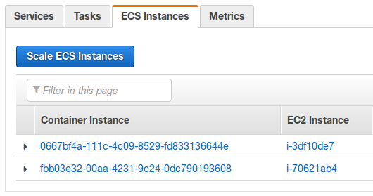

Clústeres de Amazon ECS
===

*Fuente:*
- [Documentación oficial](http://docs.aws.amazon.com/es_es/AmazonECS/latest/developerguide/ECS_clusters.html)

## Indice.
---
- [Conceptos de clústeres](#conceptos-de-clusteres)
- [Creación de un clúster](#creación-de-un-clúster)
- [Escalado de un clúster](#escalado-de-un-clúster)
- [Eliminación de un clúster](#eliminación-de-un-clúster)

&nbsp;
---
## Conceptos de clústeres ##

*Los clústeres pueden contener varios tipos distintos de instancia de contenedor.

*Los clústeres son específicos de la región.

*Las instancias de contenedor solo pueden ser parte de un clúster a la vez.

*Puede crear políticas de IAM personalizadas para sus clústeres para permitir o limitar el acceso de los usuarios a clústeres específicos.

&nbsp;
## Creación de un clúster

Puede crear un clúster de ECS utilizando la Consola de administración de AWS, tal como se describe en este tema. 
Después de haber creado el clúster, puede registrar instancias de contenedor en el mismo y ejecutar tareas y servicios.

Pasos para crear un clúster

1-Abra la consola de Amazon ECS en https://console.aws.amazon.com/ecs/.

2-En la barra de navegación, seleccione la región a utilizar.

3-En el panel de navegación, elija Clusters.

4-En la página Clusters, elija Create Cluster.

5-En Cluster name, escriba un nombre para su cluster. Se admiten hasta 255 letras (mayúsculas y minúsculas), números, guiones y caracteres de subrayado.

6-(Opcional) Para crear un clúster vacío sin instancias de contenedor asociadas, elija Create an empty cluster, Create.

   Nota
   
Si crea un clúster vacío, debe lanzar las instancias de contenedor manualmente en dicho clúster antes de poder ejecutar tareas en él.

7-En Instance type, seleccione la opción:

*EC2 bajo demanda

8-En el campo EC2 instance type, elija el tipo de instancia EC2 que desea utilizar para sus instancias de contenedor. El tipo de instancia que seleccione determina los recursos disponibles para ejecutar sus tareas.

9-En Number of instances, escriba el número de instancias EC2 a lanzar en su clúster. 

10-En EBS storage (GiB), elija el tamaño del volumen de Amazon EBS a utilizar para el almacenamiento de datos en sus instancias de contenedor. De forma predeterminada, la AMI optimizada para Amazon ECS se lanza con un volumen raíz 8 GiB y un volumen de datos de 22 GiB. Puede aumentar el tamaño del volumen de datos para permitir un mayor almacenamiento de imágenes y contenedores.

11-En Key pair, elija un par de claves de Amazon EC2 para utilizar con sus instancias de contenedor para obtener acceso SSH. Si no especifica un par de claves, no podrá acceder a las instancias de contenedor con SSH. 

12-En la sección Networking, configure la VPC en la que va a lanzar sus instancias de contenedor. De forma predeterminada, el asistente de creación de clústeres crea una nueva VPC con dos subredes en diferentes zonas de disponibilidad y un grupo de seguridad abierto a Internet en el puerto 80. Se trata de una configuración básica que funciona bien para un servicio HTTP. Sin embargo, puede modificar estos ajustes.

13-En la sección Container instance IAM role, seleccione la función de IAM que desea utilizar con las instancias de contenedor. Si su cuenta tiene la función ecsInstanceRole que se crea en el asistente de la primera ejecución de la consola, entonces se seleccionará de forma predeterminada. Si no dispone de esta función en su cuenta, puede optar por crear la función o puede elegir otra función de IAM para utilizarla con las instancias de contenedor. 

14-Seleccione Create.

## Escalado de un clúster

1-Abra la consola de Amazon ECS en https://console.aws.amazon.com/ecs/.

2-En la barra de navegación, seleccione la región en la que existe el clúster.

3-En el panel de navegación, elija Clusters.

4-Seleccione el clúster que va a escalar.

5-En la página Cluster : name, seleccione ECS Instances.

Si aparece el botón Scale ECS Instances, podrá escalar el clúster en el siguiente paso. De lo contrario, deberá ajustar manualmente su grupo de Auto Scaling para escalar hacia arriba o hacia abajo las instancias o puede iniciar o terminar manualmente sus instancias de contenedor en la consola de Amazon EC2.

6-Elija Scale ECS Instances.

7-En Desired number of instances, introduzca el número de instancias a las que desea escalar el clúster y seleccione Scale.

## Eliminación de un clúster

Pasos para eliminar un clúster

1-Abra la consola de Amazon ECS en https://console.aws.amazon.com/ecs/.

2-En la barra de navegación, seleccione la región a utilizar.

3-En el panel de navegación, elija Clusters.

4-En la página Clusters, seleccione el clúster que desea eliminar.

 *Nota
  Si el clúster ha registrado instancias de contenedor, debe anularlas o terminarlas.
  
5-Elija Delete cluster. Puede ver una de las dos instrucciones de confirmación:
  
 *Al eliminar el clúster, también se elimina el stack de CloudFormation EC2ContainerService-cluster_name: Al eliminar este clúster, se limpian los recursos asociados que se crearon con el clúster, incluidos los grupos de Auto Scaling, las VPC o los balanceadores de carga.

 *Eliminar el clúster no afecta a los recursos de CloudFormation...: Al eliminar este clúster, no se limpian los recursos que están asociados con el clúster, incluidos los grupos de Auto Scaling, las VPC o los balanceadores de carga. Además, las instancias de contenedor registradas con este clúster deben anularse o terminarse antes de poder eliminar el clúster.

    

[Siguiente >](https://github.com/conapps/conapps-iot/blob/master/AWS%20Cloud/ECS _(Amazon _EC2 _Container _Service)/ECS_Parte_3 Intancias _de _Contenedor.md)
