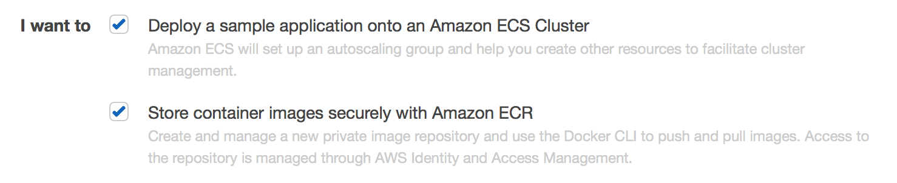
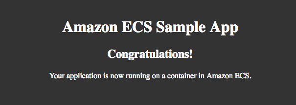

Introducción a Amazon ECS
===

*Fuente:*
- [Documentación oficial](http://docs.aws.amazon.com/es_es/AmazonECS/latest/developerguide/ECS_GetStarted.html)

Empecemos por Amazon EC2 Container Service (Amazon ECS) creando una definición de tareas, programando tareas y configurando un clúster en la consola de Amazon ECS.

Opcionalmente puede crear un repositorio de imagen de Amazon EC2 Container Registry (Amazon ECR) e insertar una imagen en él. 

El asistente de primera ejecución de Amazon ECS le guiará para empezar a trabajar con Amazon ECS. El asistente le ofrece la opción de crear un clúster y lanzar nuestra aplicación web de ejemplo o si ya dispone de una imagen de Docker que desea lanzar en Amazon ECS, puede crear una definición de tareas con dicha imagen y utilizarla para su clúster en su lugar.

Elija sus opciones de configuración del asistente de primera ejecución de Amazon ECS

 1-Abra el asistente de primera ejecución de la consola de Amazon ECS en https://console.aws.amazon.com/ecs/home#/firstRun.
 
 2-Seleccione las opciones para la primera ejecución de Amazon ECS.
 
 

Para crear un clúster de Amazon ECS e implementar una aplicación para contenerlo, marque la primera opción. Para crear un repositorio de Amazon ECR y enviar una imagen a este, que puede utilizar en sus definiciones de tareas de Amazon ECS, marque la segunda opción. Elija Continue para continuar.

 3-Si ha decidido crear un repositorio de Amazon ECR, complete las siguientes dos secciones del asistente de primera ejecución: Configure repository y Build, tag, and push Docker image . Si no va a crear un repositorio de Amazon ECR, pase directamente a Cree una definición de tarea.
 
Configure el repositorio

Un repositorio es el lugar en el que almacena imágenes de Docker en Amazon ECR. Cada vez que inserta o extrae una imagen de Amazon ECR, debe especificar la ubicación del registro y el repositorio para informarle a Docker adónde se va a enviar la imagen o de dónde se la va a extraer.

 *Para Repository name, introduzca un nombre exclusivo para el repositorio y elija Next step.

Creación, etiquetado y envío de imágenes Docker

-En esta sección del asistente, puede utilizar la CLI de Docker para etiquetar una imagen local existente (que ha creado a partir de un Dockerfile o extraído de otro registro, como Docker Hub) y, a continuación, enviar la imagen etiquetada a su su registro de Amazon ECR.

   1-Recupere el comando docker login que puede utilizar para autenticar su cliente Docker en el registro pegando el comando aws ecr get-login desde la consola en una ventana de terminal.
 
   2-Ejecute el comando docker login que se devolvió en el paso anterior. Este comando proporciona un token de autorización que es válido durante 12 horas.
   
   3-(Opcional) Si tiene un Dockerfile para la imagen que va a insertar, compile la imagen y etiquétela para su nuevo repositorio pegando el comando docker build desde la consola en una ventana de terminal. Asegúrese de que se encuentra en el mismo directorio que su Dockerfile.

   4-Etiquete la imagen para su nuevo repositorio y registro de ECR pegando el comando docker tag desde la consola en una ventana de terminal. El comando de la consola presupone que la imagen se creó desde un Dockerfile en el paso anterior; si no creó la imagen desde un Dockerfile, sustituya la primera instancia de repository:latest por el ID o el nombre de imagen de la imagen local que desea insertar.

   5-Inserte la imagen recién etiquetada en su repositorio de ECR pegando el comando docker push en una ventana de terminal.

   6-Seleccione Done.

Cree una definición de tarea

Una definición de tarea es como un plan para su aplicación. Cada vez que inicie una tarea en Amazon ECS, especificará una definición de tarea de modo que el servicio sepa qué imagen de Docker debería usar para los contenedores y cuántos contenedores debería utilizar en la tarea, y la asignación de recursos para cada contenedor.

   1-Configure sus parámetros de definición de tarea.

     El asistente de primera ejecución viene precargado con una definición de tarea, y usted puede ver el contenedor simple-app definido en la consola. Si lo desea, puede cambiar el nombre de la definición de tarea o revisar y editar los recursos utilizados por el contenedor (como unidades de CPU y límites de memoria) eligiendo el nombre de contenedor y editando los valores que se muestran (las unidades de CPU se encuentran en el menú Advanced container configuration). Para simplificar, las definiciones de tareas creadas en el asistente de primera ejecución se limitan a un único contenedor. Puede crear definiciones de tareas de varios contenedores más adelante en la consola de Amazon ECS.

     nota  
	 
	 Si utiliza una imagen de Amazon ECR para definir sus tareas, asegúrese de usar la nomenclatura registry/repository:tag completa para sus imágenes de Amazon ECR. Por ejemplo, aws_account_id.dkr.ecr.region.amazonaws.com/my-web-app:latest.
	
   2-Elija Next step para continuar.

Configure el servicio

   1-En el campo Service Name, seleccione un nombre para su servicio.
   
   2-En el campo Desired number of tasks, introduzca el número de tareas que desea lanzar con la definición de tareas especificada.

Configure el clúster.

-En esta sección del asistente, indicará un nombre para su clúster y, luego, configurará las instancias de contenedor en las que se pueden colocar sus tareas, el rango de direcciones desde el que puede llegar a las instancias y al balanceador de carga y las funciones de IAM que desea utilizar con las instancias de contenedor que le permiten a Amazon ECS encargarse de esta configuración por usted.

   1-En el campo Cluster Name, seleccione un nombre para su clúster.
   
   2-En el campo EC2 instance type, elija el tipo de instancia que desea utilizar para sus instancias de contenedor. Los tipos de instancias con más recursos de CPU y memoria pueden controlar más tareas. 
   
   3-En el campo Number of instances, ingrese el número de instancias de Amazon EC2 que desea lanzar en su clúster para colocar tareas en ellas. Cuantas más instancias tenga en su clúster, más tareas podrá colocar en ellas. Las instancias de Amazon EC2 incurren en costos mientras existen en sus recursos de AWS.
   
    nota
    
    Si creó un servicio con más de una tarea deseada en él que expone los puertos de contenedores a puertos de instancia de contenedor, como la aplicación Amazon ECS sample, debe especificar al menos esa cantidad de instancias aquí.
  
   4-Seleccione un nombre del par de claves para utilizar con las instancias de contenedor. Esto es necesario para que pueda iniciar sesión en sus instancias con SSH; si no se especifica un par de claves aquí, no podrá acceder a las instancias de contenedor con SSH. Si no tiene un par de claves, puede crear uno en la consola de Amazon EC2 en https://console.aws.amazon.com/ec2/.

   5-(Opcional) En la sección Security Group, puede elegir un bloque de CIDR que restrinja el acceso a sus instancias. El valor predeterminado (Anywhere) permite obtener acceso desde todo Internet.

   6-En la sección Container instance IAM role, elija un rol de instancia de contenedor de Amazon ECS existente (ecsInstanceRole) que ya haya creado, o seleccione Create new role para crear el rol de IAM necesario para sus instancias de contenedor.

   7-Haga clic en Review and Launch para continuar.
   

Revisión

    1-Revise la definición de tareas, la configuración de tareas y las configuraciones de clúster y haga clic en Launch Instance & Run Service para finalizar. Se abrirá la página Launch Status que muestra el estado del lanzamiento y describe todos los pasos del proceso (esto puede tardar unos minutos en completarse mientras su grupo de Auto Scaling se crea y se rellena).
	
	2-Una vez completado el lanzamiento, seleccione View service para ver su servicio en la consola de Amazon ECS.

(Opcional) Vista de los contenedores de su servicio

    Si el servicio es una aplicación web como la aplicación Amazon ECS sample, puede ver sus contenedores con un navegador web.

    1-En la página Service: service-name, elija la pestaña Tasks.
 
    2-Elija una tarea de la lista de tareas en su servicio.

    3-En la sección Containers, elija la flecha a la izquierda del contenedor web para ampliarlo. Si utiliza la aplicación Amazon ECS sample, amplíe el contenedor simple-app.

    4-En Network bindings, elija el URL External Link. Debería ver una página web que muestra la aplicación Amazon ECS sample.
	
 	

