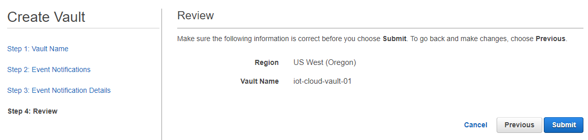
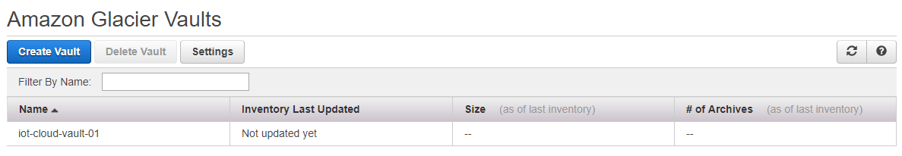
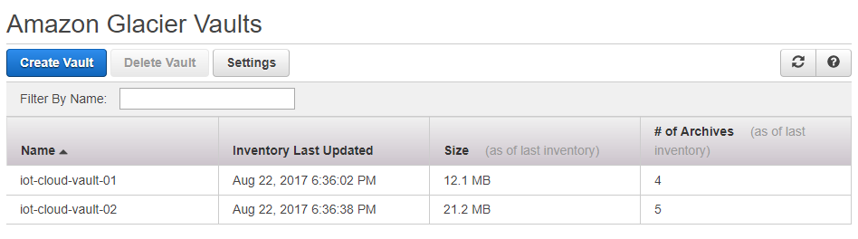
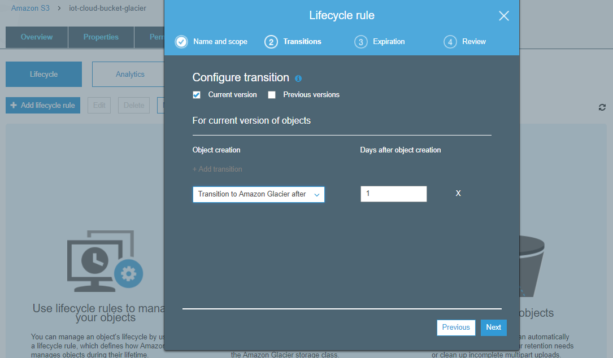
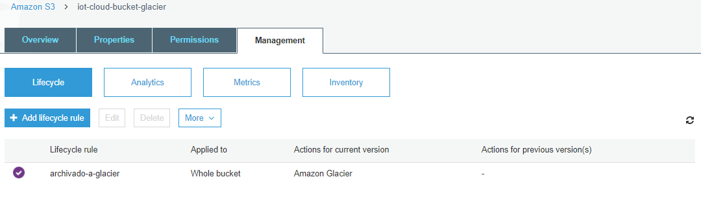

Amazon Glacier
===

*Fuentes:*
- [Documentación oficial](https://aws.amazon.com/es/documentation/glacier/)
- [Página de AWS Glacier](https://aws.amazon.com/es/glacier/)
- [Precios de AWS Glacier](http://aws.amazon.com/es/glacier/pricing/)
- [AWS re:Invent 2016: Deep Dive on Amazon Glacier (STG302)](https://youtu.be/dfr9mBcDJ-U)
- [AWS S3 Master Class](https://youtu.be/VC0k-noNwOU)
- Otras fuentes referenciadas a lo largo de los documentos (Ref:)


## Indice.
---
- [Introducción](#introduccion)
- [Conceptos Básicos](#conceptos-básicos)
- [Primeros Pasos](#primeros-pasos)
- [Linea de Comandos de Amazon S3](#línea-de-comandos-de-amazon-s3)
- [Folders](#folders)

---
## Introducción ##
---
¿Qué es Amazon Glacier?      
---
Amazon Glacier es un servicio de almacenamiento en la nube seguro, duradero y de muy bajo costo para archivar datos y realizar backups a largo plazo.
Permite almacenar con seguridad cantidades pequeñas o grandes de datos a un costo muy bajo, lo que representa un ahorro significativo en comparación con una solución local.
Amazon Glacier proporciona tres opciones para el acceso (recuperación) de los datos, que van desde unos pocos minutos a varias horas.

### Características
* Fácil de usar
* Muy bajo costo: desde 0,004 USD por GB por mes
* Seguro: todos los datos son encriptados *at rest*
* Durable: 99.999999999% (5-6 veces mayor que 2 copias de cintas)
* Escalable
* Integrado con otros servicios AWS

### Casos de uso
* Sustitución de cinta magnética (tape) para archivado de datos en ubicaciones remotas
* Archivado de recursos multimedia (imágenes, videos, audio, etc.)
* Archivado de información a largo plazo (historia clínica, etc.)
* Archivado conforme a requisitos reglamentarios o legales (disponibles por 10 o 20 años)
* Almacenamiento de datos científicos
* Preservación de contenido digital (bibliotecas, agencias gubernamentales, etc.)

Amazon Glacier es un almancenamiento de tipo *object storage* y puede extender las capacidades de Amazon S3 para archivar datos a largo plazo reduciendo los costos.

Ref:
[Amazon Glacier](https://aws.amazon.com/es/glacier/)
[Detalles del producto Amazon Glacier](https://aws.amazon.com/es/glacier/details/)

---
### Formas de acceso a Glacier
Al igual que el resto de los servicios de Amazon, puede accederse y utilizarse de diversas formas:

* API REST
* AWS Management Console
* AWS CLI
* AWS SDK


Ref.:
[API Reference for Amazon Glacier](http://docs.aws.amazon.com/es_es/amazonglacier/latest/dev/amazon-glacier-api.html)
[Consola Web de AWS](https://console.aws.amazon.com/console/home)
[AWS Command Line Interfce (CLI)](https://aws.amazon.com/es/cli/)
[AWS SDK para Python (Boto3)](https://aws.amazon.com/es/sdk-for-python/)
[AWS SDK para Java](https://aws.amazon.com/es/sdk-for-java/)

---
## Conceptos Básicos ##
---
Ref:
[Getting Started with Amazon Glacier](https://docs.aws.amazon.com/es_es/amazonglacier/latest/dev/amazon-glacier-getting-started.html)

### Vaults
Son los contenedores donde se almacenan los datos en Glacier. Representan el nivel mas alto de "jerarquía" dentro del almacenamiento.
Se pueden crear hasta 1000 *vaults* por cuenta, y cada *vault* puede crear un número ilimitado de *archives*.

El nombre del *vault* debe ser único para una cuenta y dentro de cada región en la cual es creado. Una cuenta puede tener dos *vaults* con el mismo nombre pero en diferentes regions. El nombre debe tener entre 1 y 255 caracteres, puede tener mayúsculas, guión bajo (\_), guión (-) y puntos (.), no puede tener espacios ni otros caracteres especiales.  

Ref.:
[Working with Vaults in Amazon Glacier](http://docs.aws.amazon.com/es_es/amazonglacier/latest/dev/working-with-vaults.html)


### Archives
Son los datos que almacenamos en Amazon Glacier, es la información que nosotros subimos y accedemos.

Un *archive* puede contener cualquier tipo de datos en cualquier formato.
Solo pueden escribirse una vez (*write-once*), el tamaño máximo para un *archive* es de 40TB, y un *vault* puede contener una cantidad ilimitada de *archives*.

Los datos almacenados en Amazon Glacier son inmutables, lo que significa que, una vez creado un archivo, no se puede actualizar (*write once*). Eso garantiza que datos como los registros de conformidad y normativos no se puedan modificar una vez archivados.

Ref.:
[Working with Archives in Amazon Glacier](http://docs.aws.amazon.com/es_es/amazonglacier/latest/dev/working-with-archives.html)


### Inventory
Es un índice que contiene la lista de *archives* que tenemos almacenados. Este índice se refresca cada 24hrs.

---
## Primeros pasos ##
---

### Como acceder a los datos
La consola web de AWS se puede utilizar para crear y eliminar *vaults* en Amazon Glacier. Sin embargo, toda otra interacción con Glacier, por ejemplo para subir datos, requiere el uso de otros métodos por fuera de la consola.

* Acceso directo a Amazon Glacier mediante la API de Glacier, ya sea desde línea de comando mediante la **AWS CLI** (Command Line Interface) o desde nuestro propio código utilizando el **AWS SDK** (Software Development Kit).

* Integrándolo con **AWS S3 Lifecycle Policies**, que permite mover en forma automatizada datos desde S3 hacia Glacier, en base a ciertas políticas y criterios configurables.

* Mediante **herramientas y/o gateways de terceros**, por ej. Veeam, Synology, Veritas, NetApp, FastGlacier, Commvault, Cloudberry, etc.


Para trabajar con Glacier vamos a usar principalmente la línea de comandos AWS CLI.
Si no tiene instalada y configurada la CLI puede revisar [aquí](https://github.com/conapps/conapps-iot/blob/master/AWS%20Cloud/S3/20170810_AWS_S3_Parte_2.md#línea-de-comandos-de-amazon-s3)  la primer clase de S3 donde se explica como hacerlo.

---
### Crear un *Vault*

Ingrese a la Consola de Administración de Amazon Web Services, y acceda a Glacier.

.

Si es la primera vez que entramos debemos seleccionar *Get started* para comenzar:


* Podemos seleccionar la región donde almacenar nuestros datos, en la parte superior derecha de la consola. Recuerde que el servicio de Glacier no está disponible en todas las regiones, y los precios suelen variar de acuerdo a la región seleccionada.
  

.
* Ingrese el nombre del *vault* (recuerde que el nombre debe cumplir ciertos requisitos):
  

.
* Por el momento no es necesario configurar notificaciones de eventos.
  Si quisiéramos, podríamos configurar notificaciones para que Glacier nos notifique cuando una operación sea completada. Las notificaciones se realizan mediante Amazon SNS (un tema que abordaremos en otra clase).
  
.

* Repase la configuración y complete la creación del *vault*
  
.

Listo! El *vault* ahora aparece listado dentro de la consola de Glacier.



### Utilizando la CLI con Glacier

La CLI de Glacier nos pide siempre que indiquemos el usuario en los comandos que ejecutamos, mediante la opción *account-id*. Podemos poner nuestro nombre de usuario, o simplemente ponemos un *"-"* con lo cual va a usar los datos del usuario que configuramos por defecto para la herramienta (*aws configure*).

Probemos primero de listar el *vault* que creamos anteriormente:
```bash
$ aws glacier list-vaults --account-id -
{
    "VaultList": []
}
```
Como podemos ver recibimos una lista vacía, y no nos muestra el *iot-cloud-vault-01* que creamos antes.
Pero tengamos en cuenta que los *vaults* son específicos de las regiones de AWS. Lo que está pasando en este caso, es que creamos este *vault* en Oregon (us-west-2) pero nuestra CLI estaba configurada en N. Virginia (us-east-1).

Para solucionar esto, podemos pasarle la región en cada comando que ejecutemos:
```bash
$ aws glacier list-vaults --account-id - --region us-west-2
{
    "VaultList": [
        {
            "VaultARN": "arn:aws:glacier:us-west-2:805750336955:vaults/iot-cloud-vault-01",
            "VaultName": "iot-cloud-vault-01",
            "CreationDate": "2017-08-17T17:53:40.893Z",
            "NumberOfArchives": 0,
            "SizeInBytes": 0
        }
    ]
}
```

O, para que sea mas fácil trabajar, podemos cambiar la configuración de la CLI para apuntar a la región correcta, mediante *aws configure* e ingresando *us-west-2* en la región (los otros campos no los cambiamos):

```bash
$ aws configure
AWS Access Key ID [****************B4TN]:
AWS Secret Access Key [****************BfX3]:
Default region name [us-east-1]: us-west-2
Default output format [json]:
```

Probemos nuevamente de listar, ahora si, obtenemos el *vault* que habíamos creado:
```bash
$ aws glacier list-vaults --account-id -
{
    "VaultList": [
        {
            "VaultARN": "arn:aws:glacier:us-west-2:805750336955:vaults/iot-cloud-vault-01",
            "VaultName": "iot-cloud-vault-01",
            "CreationDate": "2017-08-17T17:53:40.893Z",
            "NumberOfArchives": 0,
            "SizeInBytes": 0
        }
    ]
}
```

Ahora ya podemos crear un segundo *vault* desde la CLI (y luego listarlos):
```bash
$ aws glacier create-vault --account-id - --vault-name iot-cloud-vault-02
{
    "location": "/805750336955/vaults/iot-cloud-vault-02"
}


$ aws glacier list-vaults --account-id -
{
    "VaultList": [
        {
            "VaultARN": "arn:aws:glacier:us-west-2:805750336955:vaults/iot-cloud-vault-01",
            "VaultName": "iot-cloud-vault-01",
            "CreationDate": "2017-08-17T17:53:40.893Z",
            "NumberOfArchives": 0,
            "SizeInBytes": 0
        },
        {
            "VaultARN": "arn:aws:glacier:us-west-2:805750336955:vaults/iot-cloud-vault-02",
            "VaultName": "iot-cloud-vault-02",
            "CreationDate": "2017-08-17T18:47:42.244Z",
            "NumberOfArchives": 0,
            "SizeInBytes": 0
        }
    ]
}
```

Y obviamente, ambos *vaults* aparecen listados en la consola web:



---
### Subir Datos
Los archivos en Glacier no pueden ser subidos desde la consola Web, lo haremos mediante la CLI.

Primero vamos a crear un archivo llamado *mi_archivo_01.zip* para subir a Glacier.

**En Linux:**
```bash
$ dd if=/dev/urandom of=mi_archivo_01.zip bs=3145728 count=1
1+0 records in
1+0 records out
3145728 bytes (3,1 MB, 3,0 MiB) copied, 0,0697288 s, 45,1 MB/s
```

**En Windows:**
```bash
C:\temp>fsutil file createnew mi_archivo_01.zip 3145728
File C:\temp\mi_archivo_01.zip is created
```

Veamos como subir un archivo con la CLI.
Podemos utilizar el comando *upload_archive* para subirlo.
```bash
$ aws glacier upload-archive --account-id - --vault-name iot-cloud-vault-01 --body mi_archivo.zip
{
    "location": "/805750336955/vaults/iot-cloud-vault-01/archives/2VijuHqLP8HZR-BG9FH4nm-13nZa7iPXYvBaXEVWPMcMIWEkc1nd69xBvM5iAroNaR8FPGTeqQXuz5h6FjorUEPNQwH5LfLsaHDodRv5TKUYgmM59IdzLGbAOqKl8llRi5X5t6nv5w",
    "checksum": "f58e64a2381d9a68934b7ce8db45450654c6af977f6c40ca23b263ba994d9b27",
    "archiveId": "2VijuHqLP8HZR-BG9FH4nm-13nZa7iPXYvBaXEVWPMcMIWEkc1nd69xBvM5iAroNaR8FPGTeqQXuz5h6FjorUEPNQwH5LfLsaHDodRv5TKUYgmM59IdzLGbAOqKl8llRi5X5t6nv5w"
}
```
Si fuera un archivo muy grande podríamos dividirlo en partes y utilizar el comando *initiate-multipart-upload* (puede revisar este comando en la documentación de referencia).

Si vamos a la consola web, no vamos a notar ningún cambio. Esto es porque las columnas *Size* y *# of Archives* muestran la información en base al *Inventary* que todavía no se actualizó, y se actualiza una vez por día. Tendremos que esperar 24 horas  para ver alguna diferencia aquí.


También podemos listar los detalles del *vault* mediante:
```bash
$ aws glacier describe-vault --account-id - --vault-name iot-cloud-vault-01
{
    "VaultARN": "arn:aws:glacier:us-west-2:805750336955:vaults/iot-cloud-vault-01",
    "VaultName": "iot-cloud-vault-01",
    "CreationDate": "2017-08-17T17:53:40.893Z",
    "NumberOfArchives": 0,
    "SizeInBytes": 0
}
```

Ahora una vez transcurridas las primeras 24hrs, la información de inventario se actualiza, y podemos ver que el *vault* tiene 1 archivo y algo así como 3MB de datos:
```bash
$ aws glacier describe-vault --account-id - --vault-name iot-cloud-vault-01
{
    "VaultARN": "arn:aws:glacier:us-west-2:805750336955:vaults/iot-cloud-vault-01",
    "VaultName": "iot-cloud-vault-01",
    "CreationDate": "2017-08-17T17:53:40.893Z",
    "LastInventoryDate": "2017-08-18T13:25:55.144Z",
    "NumberOfArchives": 1,
    "SizeInBytes": 3178496
}
```

### Listar el contenido de un *Vault*
Pero como obtenemos el contenido de un *vault*?
Esto no podemos verlo en la consola web, y debemos recurrir una vez mas a la CLI.

Veamos primero de subir un par de archivos adicionales al *vault* para tener algunos datos mas.
Recuerden que la información sobre estos nuevos archivos que vamos a subir no se actualizará en el inventario hasta mañana.
```bash
$ aws glacier upload-archive --account-id - --vault-name iot-cloud-vault-01 --body lab-glacier.zip
{
    "location": "/805750336955/vaults/iot-cloud-vault-01/archives/Z0v2TFdYeLINlOBkKa6vjXAwrdjyzPDJmH2kaTRbx7rS79sWwwGSIDkoTOeiizKmIY1_rmfO9DPCDlF7iXY4I6Dzaj8VSbN32OfihLLb7YBl3kENlbRv9i8s4C4sIyRFDs3UVUtTFg",
    "checksum": "657a715f87baa9d89b651d185d8bc73147e686ee91252edcd57bae3c310b7490",
    "archiveId": "Z0v2TFdYeLINlOBkKa6vjXAwrdjyzPDJmH2kaTRbx7rS79sWwwGSIDkoTOeiizKmIY1_rmfO9DPCDlF7iXY4I6Dzaj8VSbN32OfihLLb7YBl3kENlbRv9i8s4C4sIyRFDs3UVUtTFg"
}

$ aws glacier upload-archive --account-id - --vault-name iot-cloud-vault-01 --body lab-s3.zip
{
    "location": "/805750336955/vaults/iot-cloud-vault-01/archives/zNBKFYgdEvi34i5l2zth0gECNUX1bMe0otS1f56paBTAdTiG8kt8CuUycQgnQ2o-J52v_KcDGd3w5aSMVXT3DIHgpQ0ix00ohqwc3H2bG08FieHs83tAIqtby_Y0x0qLhqP_ZSwagQ",
    "checksum": "cbc2c6b93acf2bc11971c22a0ffa6fdb9592d36513a31245c391685e4cf70103",
    "archiveId": "zNBKFYgdEvi34i5l2zth0gECNUX1bMe0otS1f56paBTAdTiG8kt8CuUycQgnQ2o-J52v_KcDGd3w5aSMVXT3DIHgpQ0ix00ohqwc3H2bG08FieHs83tAIqtby_Y0x0qLhqP_ZSwagQ"
}
```

Para ver el contenido de un *vault*, incluyendo los archivos que acabo de subir, debemos iniciar un *job* de la siguiente forma:
```bash
$ aws glacier initiate-job --account-id - --vault-name iot-cloud-vault-01 --job-parameters "{\"Type\": \"inventory-retrieval\"}"
{
    "location": "/805750336955/vaults/iot-cloud-vault-01/jobs/49KitZMjk3WO-PoOUOgKBA2lH_fBR7NBUyyKM56_e5fDW7R3y8MM0pCowoCHaioqhBTZWwvkI6BroHv-7Lt3MhSiX8xo",
    "jobId": "49KitZMjk3WO-PoOUOgKBA2lH_fBR7NBUyyKM56_e5fDW7R3y8MM0pCowoCHaioqhBTZWwvkI6BroHv-7Lt3MhSiX8xo"
}
```

Ahora, el job que iniciamos antes queda corriendo y puede demorar unas horas. Tenga en cuenta el valor del *jobId* dado que lo necesitaremos más adelante.
Podemos ver el estado del *job* mediante el siguiente comando, el estado *"StatusCode"* indicará *"InProgress"* o *"Succeeded"*
```bash
$ aws glacier list-jobs --account-id - --vault-name iot-cloud-vault-01
{
    "JobList": [
        {
            "JobId": "49KitZMjk3WO-PoOUOgKBA2lH_fBR7NBUyyKM56_e5fDW7R3y8MM0pCowoCHaioqhBTZWwvkI6BroHv-7Lt3MhSiX8xo",
            "Action": "InventoryRetrieval",
            "VaultARN": "arn:aws:glacier:us-west-2:805750336955:vaults/iot-cloud-vault-01",
            "CreationDate": "2017-08-21T18:50:16.130Z",
            "Completed": false,
            "StatusCode": "InProgress",
            "InventoryRetrievalParameters": {
                "Format": "JSON"
            }
        }
    ]
}
```

*-- algunas horas mas tarde --*

```bash
$ aws glacier list-jobs --account-id - --vault-name iot-cloud-vault-01
{
    "JobList": [
        {
            "JobId": "49KitZMjk3WO-PoOUOgKBA2lH_fBR7NBUyyKM56_e5fDW7R3y8MM0pCowoCHaioqhBTZWwvkI6BroHv-7Lt3MhSiX8xo",
            "Action": "InventoryRetrieval",
            "VaultARN": "arn:aws:glacier:us-west-2:805750336955:vaults/iot-cloud-vault-01",
            "CreationDate": "2017-08-21T18:50:16.130Z",
            "Completed": true,
            "StatusCode": "Succeeded",
            "StatusMessage": "Succeeded",
            "InventorySizeInBytes": 450,
            "CompletionDate": "2017-08-21T22:35:36.412Z",
            "InventoryRetrievalParameters": {
                "Format": "JSON"
            }
        }
    ]
}
```

Ahora que el job finalizó, debemos grabar la salida del job a un archivo (por ejemplo *lista.txt*), necesitamos el *JobID* para esto:
```bash
$ aws glacier get-job-output --account-id - --job-id 49KitZMjk3WO-PoOUOgKBA2lH_fBR7NBUyyKM56_e5fDW7R3y8MM0pCowoCHaioqhBTZWwvkI6BroHv-7Lt3MhSiX8xo --vault-name iot-cloud-vault-01 lista.txt
{
    "status": 200,
    "acceptRanges": "bytes",
    "contentType": "application/json"
}

```

Y por último, podemos abrir este archivo para ver el inventario del contenido de nuestro *vault*.
La salida es en formato JSON, y podemos ver que los objetos almacenados en nuestro *iot-cloud-vault-01* son xxxx
```bash
$ cat lista.txt


```

También podemos ver que el inventario se actualizó, y ahora el *vault* muestra también los dos archivos adicionales que habíamos subido un rato antes:
```bash
$ aws glacier describe-vault --account-id - --vault-name iot-cloud-vault-01
{


}
```

---

$ aws glacier initiate-job --account-id - --region us-west-2 --vault-name iot-cloud-vault-01 --job-parameters "{\"Type\": \"inventory-retrieval\"}"
{
    "location": "/805750336955/vaults/iot-cloud-vault-01/jobs/E6SAfaZGuebIrrdu13h58FBoDPS8dJCB6pJWbqny92gIkhqtPHq0l2ikcgg_bQiDkS9eDCn1UHJ7ThcpWK7PEI6B6rLi",
    "jobId": "E6SAfaZGuebIrrdu13h58FBoDPS8dJCB6pJWbqny92gIkhqtPHq0l2ikcgg_bQiDkS9eDCn1UHJ7ThcpWK7PEI6B6rLi"
}

$ aws glacier list-jobs --account-id - --vault-name iot-cloud-vault-01                                                             {
    "JobList": [
        {
            "JobId": "E6SAfaZGuebIrrdu13h58FBoDPS8dJCB6pJWbqny92gIkhqtPHq0l2ikcgg_bQiDkS9eDCn1UHJ7ThcpWK7PEI6B6rLi",
            "Action": "InventoryRetrieval",
            "VaultARN": "arn:aws:glacier:us-west-2:805750336955:vaults/iot-cloud-vault-01",
            "CreationDate": "2017-08-22T01:42:57.026Z",
            "Completed": false,
            "StatusCode": "InProgress",
            "InventoryRetrievalParameters": {
                "Format": "JSON"
            }
        },
        {
            "JobId": "49KitZMjk3WO-PoOUOgKBA2lH_fBR7NBUyyKM56_e5fDW7R3y8MM0pCowoCHaioqhBTZWwvkI6BroHv-7Lt3MhSiX8xo",
            "Action": "InventoryRetrieval",
            "VaultARN": "arn:aws:glacier:us-west-2:805750336955:vaults/iot-cloud-vault-01",
            "CreationDate": "2017-08-21T18:50:16.130Z",
            "Completed": true,
            "StatusCode": "Succeeded",
            "StatusMessage": "Succeeded",
            "InventorySizeInBytes": 450,
            "CompletionDate": "2017-08-21T22:35:36.412Z",
            "InventoryRetrievalParameters": {
                "Format": "JSON"
            }
        }
    ]
}


--- prueba en iot-cloud-vault-02
$ aws glacier upload-archive --vault-name iot-cloud-vault-02 --account-id - --archive-description "20170821-respaldo-mi_archivo" --body ./bkp-glacier/mi_archivo.zip
{
    "location": "/805750336955/vaults/iot-cloud-vault-02/archives/6KN-lDSBEUb-MUXR_XgQ6knZtsEdJ6jPruDO6HQFnti0hyPccOaKmiByCltHgcH931KsF9FOSyutpwqKYP6BKJV_IuiMvdozbXijiB1Cg3GwOhk_pDlYqRb0DXNiYGsVgsnmKY6Kdg",
    "checksum": "f58e64a2381d9a68934b7ce8db45450654c6af977f6c40ca23b263ba994d9b27",
    "archiveId": "6KN-lDSBEUb-MUXR_XgQ6knZtsEdJ6jPruDO6HQFnti0hyPccOaKmiByCltHgcH931KsF9FOSyutpwqKYP6BKJV_IuiMvdozbXijiB1Cg3GwOhk_pDlYqRb0DXNiYGsVgsnmKY6Kdg"
}

$ aws glacier upload-archive --vault-name iot-cloud-vault-02 --account-id - --archive-description "20170821-respaldo-mi_backup" --body ./bkp-glacier/mi_backup.zip
{
    "location": "/805750336955/vaults/iot-cloud-vault-02/archives/zufjzdsJEHK32ZcYc_ZHUfox5ftWFdrc71CAPdXdmi0qlpADQ4rovzngU2Pr9Ys-KQd76LH-6MgcfSyVRWRyDmkj_QVctTiSrfhrvi7yxa4Z3hUIUSeNMqdpgQQKMYrrM3RIoUJpbQ",
    "checksum": "f58e64a2381d9a68934b7ce8db45450654c6af977f6c40ca23b263ba994d9b27",
    "archiveId": "zufjzdsJEHK32ZcYc_ZHUfox5ftWFdrc71CAPdXdmi0qlpADQ4rovzngU2Pr9Ys-KQd76LH-6MgcfSyVRWRyDmkj_QVctTiSrfhrvi7yxa4Z3hUIUSeNMqdpgQQKMYrrM3RIoUJpbQ"
}

$ aws glacier upload-archive --vault-name iot-cloud-vault-02 --account-id - --archive-description "20170821-respaldo-otro_backup" --body ./bkp-glacier/otro_backup.zip
{
    "location": "/805750336955/vaults/iot-cloud-vault-02/archives/Gd0NTap3nbJDJ9RMNsVN_TbofytFmDMVxLJ4vZ7D5n-q0p1dXELg5Yi3BAPARd_MZulhW_FeVL4leYOU8Pcg8wqKhgyZw9arsFWVKgCUkmL6VNTXcqcD27V7coqBu4dAVwfsQFUaUQ",
    "checksum": "f58e64a2381d9a68934b7ce8db45450654c6af977f6c40ca23b263ba994d9b27",
    "archiveId": "Gd0NTap3nbJDJ9RMNsVN_TbofytFmDMVxLJ4vZ7D5n-q0p1dXELg5Yi3BAPARd_MZulhW_FeVL4leYOU8Pcg8wqKhgyZw9arsFWVKgCUkmL6VNTXcqcD27V7coqBu4dAVwfsQFUaUQ"
}


$ aws glacier upload-archive --vault-name iot-cloud-vault-01 --account-id - --archive-description "20170821-respaldo-otro_backup" --body ./bkp-glacier/otro_backup.zip
{
    "location": "/805750336955/vaults/iot-cloud-vault-01/archives/wes8Hmsw1boV0bkCVJWu5bY3RAbvUhOEeuY8iiq3Z33ZqIga-Gb00UnS0NtMiJ2Z5-ApQ5pEKN1MXmWIhl8aMPMmjd00iY4N40IoBfPZzU-p90mDczMtg7m-2uC3AUQ7lrJo45bbNw",
    "checksum": "f58e64a2381d9a68934b7ce8db45450654c6af977f6c40ca23b263ba994d9b27",
    "archiveId": "wes8Hmsw1boV0bkCVJWu5bY3RAbvUhOEeuY8iiq3Z33ZqIga-Gb00UnS0NtMiJ2Z5-ApQ5pEKN1MXmWIhl8aMPMmjd00iY4N40IoBfPZzU-p90mDczMtg7m-2uC3AUQ7lrJo45bbNw"
}


$ aws glacier initiate-job --account-id - --vault iot-cloud-vault-01 --job-parameters '{ "Type": "inventory-retrieval" }'
{
    "location": "/805750336955/vaults/iot-cloud-vault-01/jobs/CNUvbYZZkS0jTav4rrb_n3kQmqwSOj4YN8Ya_DRxwNF-8T0Rgmar44jsSOAnalTVhTeCPnpoSDnSRUPN7tCtgfeJeWLx",
    "jobId": "CNUvbYZZkS0jTav4rrb_n3kQmqwSOj4YN8Ya_DRxwNF-8T0Rgmar44jsSOAnalTVhTeCPnpoSDnSRUPN7tCtgfeJeWLx"
}

$ aws glacier list-jobs --account-id - --vault-name iot-cloud-vault-01                                                             {
    "JobList": [
        {
            "JobId": "CNUvbYZZkS0jTav4rrb_n3kQmqwSOj4YN8Ya_DRxwNF-8T0Rgmar44jsSOAnalTVhTeCPnpoSDnSRUPN7tCtgfeJeWLx",
            "Action": "InventoryRetrieval",
            "VaultARN": "arn:aws:glacier:us-west-2:805750336955:vaults/iot-cloud-vault-01",
            "CreationDate": "2017-08-22T02:27:43.977Z",
            "Completed": false,
            "StatusCode": "InProgress",
            "InventoryRetrievalParameters": {
                "Format": "JSON"
            }
        },
        {
            "JobId": "SyalPqzhm_95QKr91PjsI5lPIx01Lr-MHUf1d17JUaZyYi41pzFmVyh9vml8ws7cEMFKf2m2fXHcaDMNjUelvLbWvyY5",
            "JobDescription": "Prueba de recuperacion 2017-08-21",
            "Action": "ArchiveRetrieval",
            "ArchiveId": "2VijuHqLP8HZR-BG9FH4nm-13nZa7iPXYvBaXEVWPMcMIWEkc1nd69xBvM5iAroNaR8FPGTeqQXuz5h6FjorUEPNQwH5LfLsaHDodRv5TKUYgmM59IdzLGbAOqKl8llRi5X5t6nv5w",
            "VaultARN": "arn:aws:glacier:us-west-2:805750336955:vaults/iot-cloud-vault-01",
            "CreationDate": "2017-08-22T02:02:46.515Z",
            "Completed": false,
            "StatusCode": "InProgress",
            "ArchiveSizeInBytes": 3145728,
            "SHA256TreeHash": "f58e64a2381d9a68934b7ce8db45450654c6af977f6c40ca23b263ba994d9b27",
            "ArchiveSHA256TreeHash": "f58e64a2381d9a68934b7ce8db45450654c6af977f6c40ca23b263ba994d9b27",
            "RetrievalByteRange": "0-3145727",
            "Tier": "Standard"
        },
        {
            "JobId": "E6SAfaZGuebIrrdu13h58FBoDPS8dJCB6pJWbqny92gIkhqtPHq0l2ikcgg_bQiDkS9eDCn1UHJ7ThcpWK7PEI6B6rLi",
            "Action": "InventoryRetrieval",
            "VaultARN": "arn:aws:glacier:us-west-2:805750336955:vaults/iot-cloud-vault-01",
            "CreationDate": "2017-08-22T01:42:57.026Z",
            "Completed": false,
            "StatusCode": "InProgress",
            "InventoryRetrievalParameters": {
                "Format": "JSON"
            }
        },
        {
            "JobId": "49KitZMjk3WO-PoOUOgKBA2lH_fBR7NBUyyKM56_e5fDW7R3y8MM0pCowoCHaioqhBTZWwvkI6BroHv-7Lt3MhSiX8xo",
            "Action": "InventoryRetrieval",
            "VaultARN": "arn:aws:glacier:us-west-2:805750336955:vaults/iot-cloud-vault-01",
            "CreationDate": "2017-08-21T18:50:16.130Z",
            "Completed": true,
            "StatusCode": "Succeeded",
            "StatusMessage": "Succeeded",
            "InventorySizeInBytes": 450,
            "CompletionDate": "2017-08-21T22:35:36.412Z",
            "InventoryRetrievalParameters": {
                "Format": "JSON"
            }
        }
    ]
}


$ aws glacier get-job-output --account-id - --job-id CNUvbYZZkS0jTav4rrb_n3kQmqwSOj4YN8Ya_DRxwNF-8T0Rgmar44jsSOAnalTVhTeCPnpoSDnSRUPN7tCtgfeJeWLx --vault-name iot-cloud-vault-01 lista2.out
{
    "status": 200,
    "acceptRanges": "bytes",
    "contentType": "application/json"
}


$ cat lista2.out
{"VaultARN":"arn:aws:glacier:us-west-2:805750336955:vaults/iot-cloud-vault-01","InventoryDate":"2017-08-18T08:16:34Z",
"ArchiveList":[{"ArchiveId":"2VijuHqLP8HZR-BG9FH4nm-13nZa7iPXYvBaXEVWPMcMIWEkc1nd69xBvM5iAroNaR8FPGTeqQXuz5h6FjorUEPNQwH5LfLsaHDodRv5TKUYgmM59IdzLGbAOqKl8llRi5X5t6nv5w","ArchiveDescription":"","CreationDate":"2017-08-17T19:10:10Z","Size":3145728,"SHA256TreeHash":"f58e64a2381d9a68934b7ce8db45450654c6af977f6c40ca23b263ba994d9b27"}]}


---
### Recuperar Datos
Los datos en Glacier no pueden ser recuperados en forma directa.

Lo que debemos hacer es:
1) Iniciar un Job indicando que datos queremos recuperar
2) Esperar a que el Job sea procesado por Glacier y finalice. Esto puede demorar de 3 a 5 horas normalmente, aunque hay opciones de recuperar datos en minutos con un costo mayor.
3) Recibir la notificación de que el Job terminó (si configuramos notificaciones).
4) Descargar la "salida del job".


$ aws glacier initiate-job --account-id - --vault-name iot-cloud-vault-01 --region us-west-2 --job-parameters file://job-archive-retrieval.json
{
    "location": "/805750336955/vaults/iot-cloud-vault-01/jobs/SyalPqzhm_95QKr91PjsI5lPIx01Lr-MHUf1d17JUaZyYi41pzFmVyh9vml8ws7cEMFKf2m2fXHcaDMNjUelvLbWvyY5",
    "jobId": "SyalPqzhm_95QKr91PjsI5lPIx01Lr-MHUf1d17JUaZyYi41pzFmVyh9vml8ws7cEMFKf2m2fXHcaDMNjUelvLbWvyY5"
}


$ aws glacier list-jobs --account-id - --vault-name iot-cloud-vault-01                                                             {
    "JobList": [
        {
            "JobId": "SyalPqzhm_95QKr91PjsI5lPIx01Lr-MHUf1d17JUaZyYi41pzFmVyh9vml8ws7cEMFKf2m2fXHcaDMNjUelvLbWvyY5",
            "JobDescription": "Prueba de recuperacion 2017-08-21",
            "Action": "ArchiveRetrieval",
            "ArchiveId": "2VijuHqLP8HZR-BG9FH4nm-13nZa7iPXYvBaXEVWPMcMIWEkc1nd69xBvM5iAroNaR8FPGTeqQXuz5h6FjorUEPNQwH5LfLsaHDodRv5TKUYgmM59IdzLGbAOqKl8llRi5X5t6nv5w",
            "VaultARN": "arn:aws:glacier:us-west-2:805750336955:vaults/iot-cloud-vault-01",
            "CreationDate": "2017-08-22T02:02:46.515Z",
            "Completed": false,
            "StatusCode": "InProgress",
            "ArchiveSizeInBytes": 3145728,
            "SHA256TreeHash": "f58e64a2381d9a68934b7ce8db45450654c6af977f6c40ca23b263ba994d9b27",
            "ArchiveSHA256TreeHash": "f58e64a2381d9a68934b7ce8db45450654c6af977f6c40ca23b263ba994d9b27",
            "RetrievalByteRange": "0-3145727",
            "Tier": "Standard"
        },
    ]
}

$ aws glacier get-job-output --account-id - --vault-name iot-cloud-vault-01 --job-id SyalPqzhm_95QKr91PjsI5lPIx01Lr-MHUf1d17JUaZyYi41pzFmVyh9vml8ws7cEMFKf2m2fXHcaDMNjUelvLbWvyY5 archivo_recuperado.zip
{
    "checksum": "f58e64a2381d9a68934b7ce8db45450654c6af977f6c40ca23b263ba994d9b27",
    "status": 200,
    "acceptRanges": "bytes",
    "contentType": "application/octet-stream"
}

$ ls -la
total 3076
drwxr-xr-x 1 VM 197121       0 ago 22 13:48 ./
drwxr-xr-x 1 VM 197121       0 ago 22 13:46 ../
-rw-r--r-- 1 VM 197121 3145728 ago 22 13:49 archivo_recuperado.zip


Ref:
* [Using Amazon Glacier with the AWS Command Line Interface](http://docs.aws.amazon.com/cli/latest/userguide/cli-using-glacier.html)
* [AWS CLI Command Reference - Glacier](http://docs.aws.amazon.com/cli/latest/reference/glacier/index.html)
* [How do I use the AWS CLI to view the contents of my Amazon Glacier vault?](https://aws.amazon.com/es/premiumsupport/knowledge-center/cli-glacier-vault/)
* [Download an Archive from a Vault in Amazon Glacier](https://docs.aws.amazon.com/es_es/amazonglacier/latest/dev/getting-started-download-archive.html)


---
### Trabajando con Amazon S3 Lifecycle Policies y Glacier
Una de las formas mas fáciles de trabajar con Glacier es haciéndolo desde S3, mediante *Lifecycle Policies*.

En la clase de S3 ya vimos como crear una policy para mover datos a diferentes capas de almacenamiento, o incluso a Glacier. Puede ver esto [aquí](https://github.com/conapps/conapps-iot/blob/master/AWS%20Cloud/S3/20170812_AWS_S3_Parte_3.md#lifecycle-policies). Revisemos nuevamente como hacerlo.

Comencemos por crear un *bucket* donde almacenar los archivos que enviaremos a Glacier, y subamos un archivo a este bucket (utilizo el mismo archivo de 3MB que habíamos creado anteriormente, pero ahora lo llamo *mi_backup.zip*).

Recuerde que esto lo estamos haciendo en S3, por lo cual podemos o bien usar la consola web de AWS o la CLI mediante comandos de s3.
```bash
$ aws s3 mb s3://iot-cloud-bucket-glacier
make_bucket: iot-cloud-bucket-glacier

$ aws s3 cp mi_backup.zip s3://iot-cloud-bucket-glacier/
upload: .\mi_backup.zip to s3://iot-cloud-bucket-glacier/mi_backup.zip
```

Ahora definamos una regla de *lifecycle* sobre este bucket, para mover todos los archivos del bucket que tengan más de 1 día de antiguedad a Glacier (este es el mínimo período de tiempo que podemos especificar). Recuerde que si lo desea puede filtrar a que objetos aplica esta regla, utilizando *prefixes* y/o *tags* (ya vimos esto antes).

Ya debería saber como hacer esto, pero repasemos como crear la regla:








Podemos ver los detalles de la regla que acabamos de crear, desde la CLI:
```bash
$ aws s3api get-bucket-lifecycle-configuration --bucket iot-cloud-bucket-glacier
{
    "Rules": [
        {
            "ID": "archivado-a-glacier",
            "Filter": {
                "Prefix": ""
            },
            "Status": "Enabled",
            "Transitions": [
                {
                    "Days": 1,
                    "StorageClass": "GLACIER"
                }
            ]
        }
    ]
}
```

Nuestro objeto *"mi_backup.zip"* se encuentra en la *Storage Class: Standard* de Amazon S3. Esto es porque cuando hicimos el upload no especificamos una clase de storage específica y por lo tanto S3 lo almacena por defecto en esta clase.

Esto podemos verlo con la CLI:
```bash
$ aws s3api list-objects --bucket iot-cloud-bucket-glacier
{
    "Contents": [
        {
            "Key": "mi_backup.zip",
            "LastModified": "2017-08-17T19:48:57.000Z",
            "ETag": "\"b944a8c500fe92d9e3af3ab9f0c53f0b\"",
            "Size": 3145728,
            "StorageClass": "STANDARD",
            "Owner": {
                "DisplayName": "aws.develop",
                "ID": "e6dd2e564aeb8d6e8c0e9fad1cb10c86902822b4e2b12bb0508a032825603031"
            }
        }
    ]
}
```
O bien con la consola web:


Bien ahora solo debemos esperar hasta mañana, y si todo funciona como debe, nuestro objeto *mi_backup.zip* debería ser archivado, pasando a la *storage class: glacier*.

 **--- 24hrs mas tarde ---**

Luego que pasó el intervalo de tiempo que especificamos en la regla anterior (en nuestro caso era 1 día), podemos ver que la regla funcionó como esperábamos, y ahora el objeto *mi_backup.zip* se encuentra en la clase de storage *Glacier*

```bash
$ aws s3api list-objects --bucket iot-cloud-bucket-glacier
{
    "Contents": [
        {
            "Key": "mi_backup.zip",
            "LastModified": "2017-08-17T19:48:57.000Z",
            "ETag": "\"b944a8c500fe92d9e3af3ab9f0c53f0b\"",
            "Size": 3145728,
            "StorageClass": "GLACIER",
            "Owner": {
                "DisplayName": "aws.develop",
                "ID": "e6dd2e564aeb8d6e8c0e9fad1cb10c86902822b4e2b12bb0508a032825603031"
            }
        }
    ]
}
```


Ahora ya no podemos acceder en forma directa al objeto, no podemos cambiarle sus propiedades, y tampoco tenemos la opción de descargarlo. Incluso la consola web nos muestra un mensaje advirtiendo esto mismo:


Para acceder al objeto, debemos primero iniciar un **restore**.


Indicamos por cuantos días queremos tener disponible el objeto una vez restaurado, y que tipo de restore queremos hacer.


Debemos tener en cuenta dos cosas:
- El objeto será recuperado a la capa de storage Standard de S3, y permanecerá disponible por la cantidad de días que especifiquemos. Por lo cual vamos a pagar el costo correspondiente por el almacenamiento de dicho objeto por ese plazo de tiempo.
- El restore no es una operación inmediata. El tiempo que demora Glacier en dejarnos el objeto disponible dependerá del tipo de restore que realicemos. Y cada operación de restore tiene costo, el cual depende también del tipo de restore que realicemos. A menor tiempo de restore mayor es el costo, y viceversa.

A modo de ejemplo podes ver el precio del restore para la región de Oregon:


Una vez solicitado el restore, podemos ver el estado del mismo en las propiedades del objeto: *ongoing-request="true"*

``` bash
$ aws s3api head-object --bucket iot-cloud-bucket-glacier --key mi_backup.zip
{
    "AcceptRanges": "bytes",
    "Restore": "ongoing-request=\"true\"",
    "LastModified": "Thu, 17 Aug 2017 19:48:57 GMT",
    "ContentLength": 3145728,
    "ETag": "\"b944a8c500fe92d9e3af3ab9f0c53f0b\"",
    "ContentType": "application/zip",
    "Metadata": {},
    "StorageClass": "GLACIER"
}
```

O también en la consola web:


Una vez finalizado el restore, podremos contar con el objeto disponible por el tiempo que lo hayamos indicado. Luego de transcurrido ese tiempo, el objeto se borrará de la capa Standard, pero siempre permanecerá en Glacier hasta que nosotros lo eliminemos.

La recuperación hace una copia del objeto a la capa Standard para que podamos accederlo, pero el objeto original sigue quedando archivado en Glacier hasta que nosotros decidamos eliminarlo.

Podemos ver que el restore ya finalizó: *ongoing-request="false"*, y la fecha de expiración del objeto: *expiry-date=xxxx*:

``` bash
$ aws s3api head-object --bucket iot-cloud-bucket-glacier --key mi_backup.zip
{
    "AcceptRanges": "bytes",
    "Restore": "ongoing-request=\"false\", expiry-date=\"Wed, 23 Aug 2017 00:00:00 GMT\"",
    "LastModified": "Thu, 17 Aug 2017 19:48:57 GMT",
    "ContentLength": 3145728,
    "ETag": "\"b944a8c500fe92d9e3af3ab9f0c53f0b\"",
    "ContentType": "application/zip",
    "Metadata": {},
    "StorageClass": "GLACIER"
}
```


Hasta que el objeto expire, vamos a poder descargarlo desde la consola o por medio de la CLI, como cualquier otro objeto.

Con la CLI podríamos en lugar de hacer un download, hacer una copia del objeto restaurado para que nos quede disponible directamente en S3 mas allá de la fecha de expiración. En este caso lo copio al mismo *bucket* con otro nombre *mi_backup_copia.zip*, pero podría copiarlo a otro bucket, o a un folder, etc. como con cualquier objeto.

``` bash
$ aws s3 cp s3://iot-cloud-bucket-glacier/mi_backup.zip s3://iot-cloud-bucket-glacier/mi_backup_copia.zip
copy: s3://iot-cloud-bucket-glacier/mi_backup.zip to s3://iot-cloud-bucket-glacier/mi_backup_copia.zip

$ aws s3 ls s3://iot-cloud-bucket-glacier/
2017-08-17 16:48:57    3145728 mi_backup.zip
2017-08-21 15:00:11    3145728 mi_backup_copia.zip
```


Ref:
* [How Do I Restore an S3 Object That Has Been Archived to Amazon Glacier?](http://docs.aws.amazon.com/es_es/AmazonS3/latest/user-guide/restore-archived-objects.html)

---
