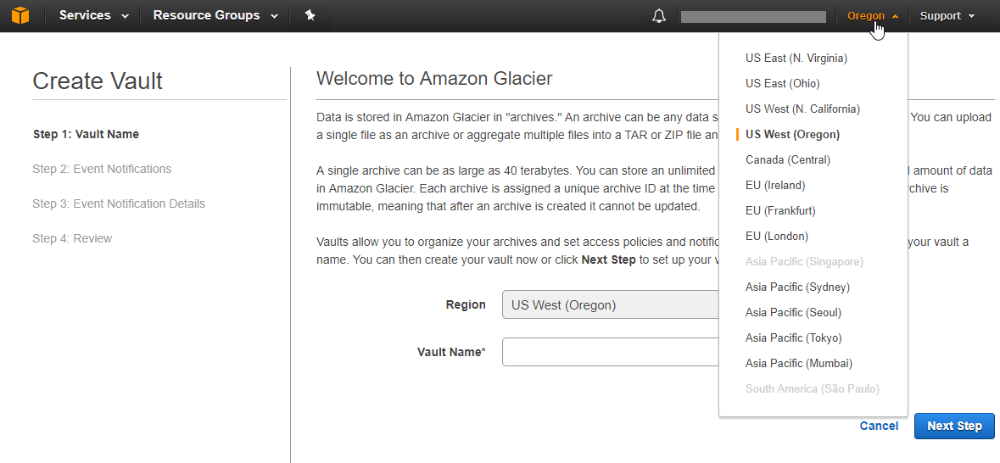
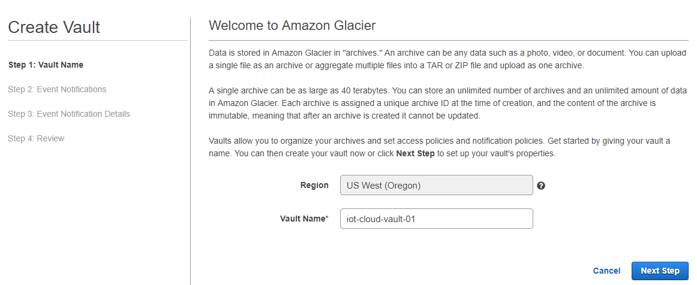
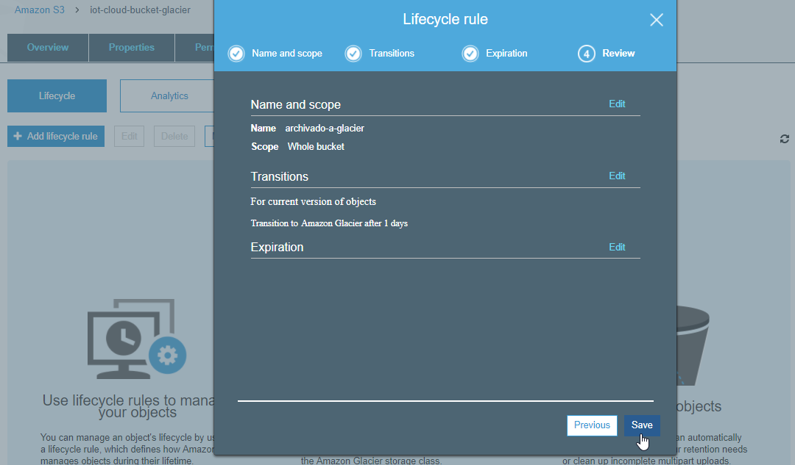

Amazon Glacier
===

*Fuentes:*
- [Documentación oficial](https://aws.amazon.com/es/documentation/glacier/)
- [Página de AWS Glacier](https://aws.amazon.com/es/glacier/)
- [Precios de AWS Glacier](http://aws.amazon.com/es/glacier/pricing/)
- [AWS re:Invent 2016: Deep Dive on Amazon Glacier (STG302)](https://youtu.be/dfr9mBcDJ-U)
- [AWS S3 Master Class](https://youtu.be/VC0k-noNwOU)
- Otras fuentes referenciadas a lo largo de los documentos (Ref:)


## Indice.
---
- [Introducción](#introducción)
- [Conceptos Básicos](#conceptos-básicos)
- [Trabajando con Glacier en la Consola Web de AWS](#trabajando-en-glacier-con-la-consola-web-de-aws)
- [Trabajando con Glacier desde Amazon S3](#trabajando-con-glacier-desde-amazon-s3)
- [Trabajando con Glacier desde AWS CLI](./AWS_Glacier_Parte2.md#trabajando-con-glacier-desde-aws-cli)
  - [Crear un Vault](./AWS_Glacier_Parte2.md#crear-un-vault)
  - [Subir un Archive a un Vault](./AWS_Glacier_Parte2.md#subir-un-archive-a-un-vault)
  - [Listar el contenido de un Vault](./AWS_Glacier_Parte2.md#listar-el-contenido-de-un-vault)
  - [Recuperar un Archive de un Vault](./AWS_Glacier_Parte2.md#recuperar-un-archive-de-un-vault)
  - [Eliminar un Archive de un Vault](./AWS_Glacier_Parte2.md#eliminar-un-archive-de-un-vault)
  - [Eliminar un Vault](./AWS_Glacier_Parte2.md#eliminar-un-vault)


---
## Introducción ##
---
¿Qué es Amazon Glacier?      
---
Amazon Glacier es un servicio de almacenamiento en la nube seguro, duradero y de muy bajo costo para archivar datos y realizar backups a largo plazo.
Permite almacenar con seguridad cantidades pequeñas o grandes de datos a un costo muy bajo, lo que representa un ahorro significativo en comparación con una solución local.
Amazon Glacier proporciona tres opciones para el acceso (recuperación) de los datos, que van desde unos pocos minutos a varias horas.

### Características
* Fácil de usar
* Muy bajo costo: desde 0,004 USD por GB por mes
* Seguro: todos los datos son encriptados *at rest*
* Durable: 99.999999999% (5-6 veces mayor que 2 copias de cintas)
* Escalable
* Integrado con otros servicios AWS

### Casos de uso
* Sustitución de cinta magnética (tape) para archivado de datos en ubicaciones remotas
* Archivado de recursos multimedia (imágenes, videos, audio, etc.)
* Archivado de información a largo plazo (historia clínica, etc.)
* Archivado conforme a requisitos reglamentarios o legales (disponibles por 10 o 20 años)
* Almacenamiento de datos científicos
* Preservación de contenido digital (bibliotecas, agencias gubernamentales, etc.)

Amazon Glacier es un almancenamiento de tipo *object storage* y puede extender las capacidades de Amazon S3 para archivar datos a largo plazo reduciendo los costos.

Ref:
* [Amazon Glacier](https://aws.amazon.com/es/glacier/)
* [Detalles del producto Amazon Glacier](https://aws.amazon.com/es/glacier/details/)


### Formas de acceso a Glacier
Al igual que el resto de los servicios de Amazon, puede accederse y utilizarse de diversas formas:

* API REST
* AWS Management Console
* AWS CLI
* AWS SDK


Ref:
* [API Reference for Amazon Glacier](http://docs.aws.amazon.com/es_es/amazonglacier/latest/dev/amazon-glacier-api.html)
* [Consola Web de AWS](https://console.aws.amazon.com/console/home)
* [AWS Command Line Interfce (CLI)](https://aws.amazon.com/es/cli/)
* [AWS SDK para Python (Boto3)](https://aws.amazon.com/es/sdk-for-python/)
* [AWS SDK para Java](https://aws.amazon.com/es/sdk-for-java/)

---
## Conceptos Básicos ##
---

### Vaults
Son los contenedores donde se almacenan los datos en Glacier. Representan el nivel mas alto de "jerarquía" dentro del almacenamiento.
Se pueden crear hasta 1000 *vaults* por cuenta, y cada *vault* puede crear un número ilimitado de *archives*.

El nombre del *vault* debe ser único para una cuenta y dentro de cada región en la cual es creado. Una cuenta puede tener dos *vaults* con el mismo nombre pero en diferentes regions. El nombre debe tener entre 1 y 255 caracteres, puede tener mayúsculas, guión bajo (\_), guión (-) y puntos (.), no puede tener espacios ni otros caracteres especiales.  


### Archives
Son los datos que almacenamos en Amazon Glacier, es la información que nosotros subimos y accedemos.

Un *archive* puede contener cualquier tipo de datos en cualquier formato.
Solo pueden escribirse una vez (*write-once*), el tamaño máximo para un *archive* es de 40TB, y un *vault* puede contener una cantidad ilimitada de *archives*.

Los datos almacenados en Amazon Glacier son inmutables, lo que significa que, una vez creado un archivo, no se puede actualizar (*write once*). Eso garantiza que datos como los registros de conformidad y normativos no se puedan modificar una vez archivados.


### Inventory
Es un índice que contiene la lista de *archives* que tenemos almacenados en el *vault*. Este índice se refresca cada 24hrs.


### Como acceder a Glacier
La consola web de AWS se puede utilizar para crear y eliminar *vaults* en Amazon Glacier. Sin embargo, toda otra interacción con Glacier, por ejemplo para subir datos, requiere el uso de otros métodos por fuera de la consola.

* Acceso directo a Amazon Glacier mediante la API de Glacier, ya sea desde línea de comando mediante la **AWS CLI** (Command Line Interface) o desde nuestro propio código utilizando el **AWS SDK** (Software Development Kit).

* Integrándolo con **AWS S3 Lifecycle Policies**, que permite mover en forma automatizada datos desde S3 hacia Glacier, en base a ciertas políticas y criterios configurables.

* Mediante **herramientas y/o gateways de terceros**, por ej. Veeam, Synology, Veritas, NetApp, FastGlacier, Commvault, Cloudberry, etc.


Ref:
* [Getting Started with Amazon Glacier](https://docs.aws.amazon.com/es_es/amazonglacier/latest/dev/amazon-glacier-getting-started.html)
* [Working with Vaults in Amazon Glacier](http://docs.aws.amazon.com/es_es/amazonglacier/latest/dev/working-with-vaults.html)
* [Working with Archives in Amazon Glacier](http://docs.aws.amazon.com/es_es/amazonglacier/latest/dev/working-with-archives.html)


---
## Trabajando en Glacier con la Consola Web de AWS
---
Son pocas las operaciones que podemos realizar con la consola web.

Ingrese a la Consola de Administración de Amazon Web Services, y acceda a Glacier.


Probemos de **crear un *vault***. Si es la primera vez que entramos debemos seleccionar *Get started* para comenzar:


Podemos seleccionar la región donde almacenar nuestros datos, en la parte superior derecha de la consola. Recuerde que el servicio de Glacier no está disponible en todas las regiones, y los precios suelen variar de acuerdo a la región seleccionada.
  

Ingrese el nombre del *vault* (recuerde que el nombre debe cumplir ciertos requisitos):
  


Si quisiéramos, podríamos configurar notificaciones para que Glacier nos avise cuando una operación sea completada. Las notificaciones se realizan mediante Amazon SNS (un tema que abordaremos en otra clase). Por lo tanto, dejemos las notificaciones sin configurar por el momento.


Repase la configuración y complete la creación del *vault*


Bien, con esto el *vault* ya está creado, y ahora podemos verlo listado dentro de la consola web:


Al lado del nombre del *vault* que acabamos de crear, podemos ver cuando fue la última vez que se actualizó el inventario, cuanto espacio total y cuantos *archives* tenemos almacenados en nuestro *vault*.
Recordemos que el inventariado se realiza una vez por día, y obviamente hasta que no subamos algun *archive* no va a mostrar ninguna información.

A modo de ejemplo, y aunque todavía no vimos como subir nuestros datos, en la siguiente imagen podemos ver un par de *vaults* ya creados, con varios *archives* almacenados, y con el inventario actualizado:


La información de espacio ocupado y cantidad de archivos se mostrará en base al último inventariado. Es decir, si subiera mas datos a estos *vaults*, la información no se actualizará hasta que el inventariado vuelva a correr.

Por el momento esto es todo lo que veremos respecto a la consola web.

---
## Trabajando con Glacier desde Amazon S3
---
Una de las formas mas fáciles de trabajar con Glacier es haciéndolo desde S3, mediante *Lifecycle Policies*.

En la [clase de S3](https://github.com/conapps/conapps-iot/blob/master/AWS%20Cloud/S3/AWS_S3_Parte_3.md#lifecycle-policies) vimos como crear una *lifecycle policy* para mover datos a diferentes capas de almacenamiento, y particularmente, **archivar objetos desde S3 hacia Glacier**.


Ahora veremos como **recuperar objetos desde Glacier a S3**, para poder accederlos nuevamente.


---
### Transfiriendo datos desde S3 a Glaciar
Vayamos ahora a la consola web de Amazon S3.
Comencemos por repasar como crear la regla de *lifecycle policiy* para archivar objetos a Glacier.

Para esto, primero vamos a crear un *bucket* y subirle un objeto (*mi_backup.zip*), que enviaremos luego a Glacier.

Recuerde que esto lo estamos haciendo en S3, por lo cual podemos o bien usar la consola web de AWS o la CLI mediante comandos de s3.
```bash
$ aws s3 mb s3://iot-cloud-bucket-glacier
make_bucket: iot-cloud-bucket-glacier

$ aws s3 cp mi_backup.zip s3://iot-cloud-bucket-glacier/
upload: .\mi_backup.zip to s3://iot-cloud-bucket-glacier/mi_backup.zip
```

Ahora definamos una regla de *lifecycle* sobre este bucket, para mover todos los objetos que tengan más de 1 día de antiguedad a Glacier (este es el mínimo período de tiempo que podemos especificar). Recordemos que podríamos filtrar sobre que objetos aplica esta regla utilizando *prefixes* y/o *tags* (ya vimos esto antes).

Repasemos como crear la regla:





Podemos ver los detalles de la regla que acabamos de crear, desde la CLI:
```bash
$ aws s3api get-bucket-lifecycle-configuration --bucket iot-cloud-bucket-glacier
{
    "Rules": [
        {
            "ID": "archivado-a-glacier",
            "Filter": {
                "Prefix": ""
            },
            "Status": "Enabled",
            "Transitions": [
                {
                    "Days": 1,
                    "StorageClass": "GLACIER"
                }
            ]
        }
    ]
}
```

Nuestro objeto *"mi_backup.zip"* se encuentra en la *Storage Class Standard* de Amazon S3. Esto es porque cuando hicimos el upload no especificamos una clase de storage específica y por lo tanto S3 lo almacena por defecto en esta clase.

Esto podemos verlo con la CLI:
```bash
$ aws s3api list-objects --bucket iot-cloud-bucket-glacier
{
    "Contents": [
        {
            "Key": "mi_backup.zip",
            "LastModified": "2017-08-17T19:48:57.000Z",
            "ETag": "\"b944a8c500fe92d9e3af3ab9f0c53f0b\"",
            "Size": 3145728,
            "StorageClass": "STANDARD",
            "Owner": {
                "DisplayName": "aws.develop",
                "ID": "e6dd2e564aeb8d6e8c0e9fad1cb10c86902822b4e2b12bb0508a032825603031"
            }
        }
    ]
}
```
O bien en la consola web:


Bien ahora solo debemos esperar hasta mañana, y si todo funciona como debe, nuestro objeto *mi_backup.zip* debería ser archivado, pasando a la *storage class: Glacier*.

 **--- 24hrs mas tarde ---**

Luego que pasó el intervalo de tiempo que especificamos en la regla anterior (en nuestro caso era 1 día), podemos ver que la regla funcionó como esperábamos, y ahora el objeto *mi_backup.zip* se encuentra en *Glacier*

```bash
$ aws s3api list-objects --bucket iot-cloud-bucket-glacier
{
    "Contents": [
        {
            "Key": "mi_backup.zip",
            "LastModified": "2017-08-17T19:48:57.000Z",
            "ETag": "\"b944a8c500fe92d9e3af3ab9f0c53f0b\"",
            "Size": 3145728,
            "StorageClass": "GLACIER",
            "Owner": {
                "DisplayName": "aws.develop",
                "ID": "e6dd2e564aeb8d6e8c0e9fad1cb10c86902822b4e2b12bb0508a032825603031"
            }
        }
    ]
}
```


Ahora ya no podemos acceder en forma directa al objeto, no podemos cambiarle sus propiedades, y tampoco tenemos la opción de descargarlo. Incluso la consola web nos muestra un mensaje advirtiendo esto mismo:


---
### Recuperando datos desde Glacier a S3

Para acceder al objeto, debemos primero iniciar un **restore**.


Indicamos por cuantos días queremos tener disponible el objeto una vez restaurado, y que tipo de restore queremos hacer.


Debemos tener en cuenta dos cosas:
- El objeto será recuperado a la capa de storage Standard de S3, y permanecerá disponible por la cantidad de días que especifiquemos. Por lo cual vamos a pagar el costo correspondiente por el almacenamiento de dicho objeto por ese plazo de tiempo.
- El restore no es una operación inmediata. El tiempo que demora Glacier en dejarnos el objeto disponible dependerá del tipo de restore que realicemos. Y cada operación de restore tiene costo, el cual depende también del tipo de restore que realicemos. A menor tiempo de restore mayor es el costo, y viceversa.

A modo de ejemplo podemos ver el precio del restore para la región de Oregon:


Una vez solicitado el restore, podemos ver el estado del mismo en las propiedades del objeto: *ongoing-request="true"*

``` bash
$ aws s3api head-object --bucket iot-cloud-bucket-glacier --key mi_backup.zip
{
    "AcceptRanges": "bytes",
    "Restore": "ongoing-request=\"true\"",
    "LastModified": "Thu, 17 Aug 2017 19:48:57 GMT",
    "ContentLength": 3145728,
    "ETag": "\"b944a8c500fe92d9e3af3ab9f0c53f0b\"",
    "ContentType": "application/zip",
    "Metadata": {},
    "StorageClass": "GLACIER"
}
```

O también en la consola web:


Una vez finalizado el restore, podremos contar con el objeto disponible por el tiempo que lo hayamos indicado. Luego de transcurrido ese tiempo, el objeto se borrará de la capa Standard, pero siempre permanecerá en Glacier hasta que nosotros lo eliminemos.

La recuperación hace una copia del objeto a la capa Standard para que podamos accederlo, pero el objeto original sigue quedando archivado en Glacier hasta que nosotros decidamos eliminarlo.

Podemos ver que el restore ya finalizó: *ongoing-request="false"*, y la fecha de expiración del objeto: *expiry-date=xxxx*:

``` bash
$ aws s3api head-object --bucket iot-cloud-bucket-glacier --key mi_backup.zip
{
    "AcceptRanges": "bytes",
    "Restore": "ongoing-request=\"false\", expiry-date=\"Wed, 23 Aug 2017 00:00:00 GMT\"",
    "LastModified": "Thu, 17 Aug 2017 19:48:57 GMT",
    "ContentLength": 3145728,
    "ETag": "\"b944a8c500fe92d9e3af3ab9f0c53f0b\"",
    "ContentType": "application/zip",
    "Metadata": {},
    "StorageClass": "GLACIER"
}
```


Hasta que el objeto expire, vamos a poder descargarlo desde la consola o por medio de la CLI, como cualquier otro objeto.

Con la CLI podríamos también, en lugar de hacer un download, hacer una copia del objeto restaurado para que nos quede disponible directamente en S3 mas allá de la fecha de expiración. En este caso lo copio al mismo *bucket* con otro nombre *mi_backup_copia.zip*, pero podría copiarlo a otro bucket, o a un folder, etc. como con cualquier objeto.

``` bash
$ aws s3 cp s3://iot-cloud-bucket-glacier/mi_backup.zip s3://iot-cloud-bucket-glacier/mi_backup_copia.zip
copy: s3://iot-cloud-bucket-glacier/mi_backup.zip to s3://iot-cloud-bucket-glacier/mi_backup_copia.zip

$ aws s3 ls s3://iot-cloud-bucket-glacier/
2017-08-17 16:48:57    3145728 mi_backup.zip
2017-08-21 15:00:11    3145728 mi_backup_copia.zip
```


También podemos hacer el restore desde Glacier, utilizando la CLI, mediante el comando `aws s3api restore-object`

```bash
$ aws s3api restore-object --bucket iot-cloud-bucket-glacier --key mi_backup.zip --restore-request Days=3


$ aws s3api head-object --bucket iot-cloud-bucket-glacier --key mi_backup.zip
{
    "AcceptRanges": "bytes",
    "Restore": "ongoing-request=\"true\"",
    "LastModified": "Thu, 17 Aug 2017 19:48:57 GMT",
    "ContentLength": 3145728,
    "ETag": "\"b944a8c500fe92d9e3af3ab9f0c53f0b\"",
    "ContentType": "application/zip",
    "Metadata": {},
    "StorageClass": "GLACIER"
}

```

Ref:
* [How Do I Restore an S3 Object That Has Been Archived to Amazon Glacier?](http://docs.aws.amazon.com/es_es/AmazonS3/latest/user-guide/restore-archived-objects.html)

---
| [Siguiente >](./AWS_Glacier_Parte2.md) |
