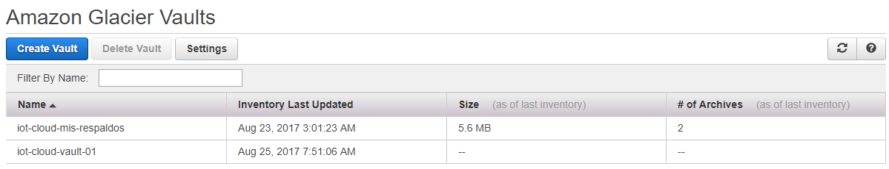
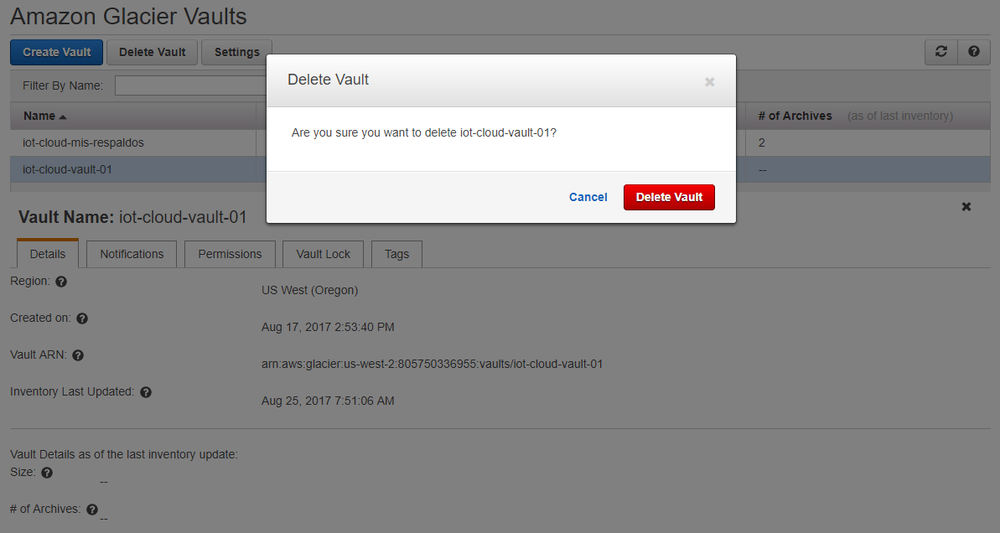

| [< Anterior](./AWS_Glacier.md) |

---
## Trabajando con Glacier mediante AWS CLI
---
Como vimos anteriormente, son pocas las operaciones que podemos realizar mediante la consola web de Glacier.
Por lo tanto, tenemos que trabajar o bien con la CLI o mediante SDK o REST (en nuestro caso vamos ausar la CLI).

Si no tiene instalada y configurada la CLI puedes revisar [aquí](https://github.com/conapps/conapps-iot/blob/master/AWS%20Cloud/S3/20170810_AWS_S3_Parte_2.md#línea-de-comandos-de-amazon-s3)  la primera clase de S3 donde se explica como hacerlo.

La CLI de Glacier nos pide siempre que indiquemos el usuario en los comandos que ejecutamos, mediante la opción *account-id*. Podemos poner nuestro usuario, o simplemente ponemos un *"-"* con lo cual va a usar los datos del usuario que configuramos por defecto para la herramienta (cosa que ya hicimos antes en el curso de S3 mediante *aws configure*).

Probemos primero de listar el *vault* que creamos anteriormente:
```bash
$ aws glacier list-vaults --account-id -
{
    "VaultList": []
}
```
Como podemos ver recibimos una lista vacía, y no nos muestra el *iot-cloud-vault-01* que creamos antes mediante la consola web.

Tengamos en cuenta que los *vaults* son específicos de las regiones de AWS donde los creamos. Lo que está pasando en este caso, es que nosotros habíamos creado ese *vault* en Oregon (us-west-2) pero nuestra CLI estaba configurada en N. Virginia (us-east-1).

Para solucionar esto, podemos pasarle la región a la CLI en el comando:
```bash
$ aws glacier list-vaults --account-id - --region us-west-2
{
    "VaultList": [
        {
            "VaultARN": "arn:aws:glacier:us-west-2:805750336955:vaults/iot-cloud-vault-01",
            "VaultName": "iot-cloud-vault-01",
            "CreationDate": "2017-08-17T17:53:40.893Z",
            "NumberOfArchives": 0,
            "SizeInBytes": 0
        }
    ]
}
```

Para que sea mas fácil y no tengamos que poner la región en cada comando que usamos, podemos simplemente cambiar la configuración de la CLI para apuntar a la región correcta, mediante *aws configure* e ingresando *us-west-2* (o la que corresponda) en la configuración de la región.

Probemos nuevamente de listar sin especificar la región, y ahora si, obtenemos el *vault* que habíamos creado antes:
```bash
$ aws glacier list-vaults --account-id -
{
    "VaultList": [
        {
            "VaultARN": "arn:aws:glacier:us-west-2:805750336955:vaults/iot-cloud-vault-01",
            "VaultName": "iot-cloud-vault-01",
            "CreationDate": "2017-08-17T17:53:40.893Z",
            "NumberOfArchives": 0,
            "SizeInBytes": 0
        }
    ]
}
```

---
### Crear un Vault

Para **crear** un nuevo *vault* desde la CLI utilizamos el comando `aws glacier create-vault`.
```bash
$ aws glacier create-vault --account-id - --vault-name iot-cloud-mis-respaldos
{
    "location": "/805750336955/vaults/iot-cloud-mis-respaldos"
}
```

Podemos **listar** los *vaults* con `aws glacier list-vaults` para verificar que haya sido creado:
```bash
$ aws glacier list-vaults --account-id -
{
    "VaultList": [
        {
            "VaultARN": "arn:aws:glacier:us-west-2:805750336955:vaults/iot-cloud-mis-respaldos",
            "VaultName": "iot-cloud-mis-respaldos",
            "CreationDate": "2017-08-22T17:15:01.608Z",
            "NumberOfArchives": 0,
            "SizeInBytes": 0
        },
        {
            "VaultARN": "arn:aws:glacier:us-west-2:805750336955:vaults/iot-cloud-vault-01",
            "VaultName": "iot-cloud-vault-01",
            "CreationDate": "2017-08-17T17:53:40.893Z",
            "NumberOfArchives": 0,
            "SizeInBytes": 0
        }
    ]
}
```


Podemos también **listar información** de un *vault* específico, mediante `aws glacier describe-vault`:
```bash
$ aws glacier describe-vault --account-id - --vault-name iot-cloud-mis-respaldos
{
    "VaultARN": "arn:aws:glacier:us-west-2:805750336955:vaults/iot-cloud-mis-respaldos",
    "VaultName": "iot-cloud-mis-respaldos",
    "CreationDate": "2017-08-22T17:15:01.608Z",
    "NumberOfArchives": 0,
    "SizeInBytes": 0
}
```

Ref.:
> [Creating a Vault in Amazon Glacier](http://docs.aws.amazon.com/amazonglacier/latest/dev/creating-vaults.html)


---

### Subir un Archive a un Vault
Para subir un archivo a Glacier desde nuestro equipo local, no podemos usar consola Web, por lo cuál lo haremos mediante la CLI (también podemos hacerlo usando REST o un SDK desde nuestro código).

Supongamos que tenemos estos dos archivos que tienen ciertos respaldos de datos que queremos archivar en Glacier:
```bash
$ ls -la ./work/respaldos/
total 5668
drwxr-xr-x 1 VM 197121       0 ago 22 14:21 ./
drwxr-xr-x 1 VM 197121       0 ago 22 14:21 ../
-rw-r--r-- 1 VM 197121 5798098 ago 22 14:03 respaldo01.tar.gz
-rw-r--r-- 1 VM 197121    2803 ago 22 14:04 respaldo02.tar.gz
```

Para subirlos, debemos hacerlos de a uno, utilizando el comando `aws galcier upload-archive`
```bash
$ aws glacier upload-archive --vault-name iot-cloud-mis-respaldos --account-id - --archive-description "20170822-respaldo01.tar.gz" --body ./work/respaldos/respaldo01.tar.gz
{
    "location": "/805750336955/vaults/iot-cloud-mis-respaldos/archives/grHW86f7glvFFhFgMCDNDYehZcfTg_h9yMRkrSeroT1iaUzIki8S0hIu1TG2W3Tr0yl1EIGWqoz1gnk5LFLEF-y-RmwQlwN19Zd-dPSivzB3ohRgozkPfBGL6s9Ji1r0tRI4dzfafA",
    "checksum": "ca6d26f5487ba41e5e10a06502e1ea96efcea8f35624cc9c6ec3920653cc3c0e",
    "archiveId": "grHW86f7glvFFhFgMCDNDYehZcfTg_h9yMRkrSeroT1iaUzIki8S0hIu1TG2W3Tr0yl1EIGWqoz1gnk5LFLEF-y-RmwQlwN19Zd-dPSivzB3ohRgozkPfBGL6s9Ji1r0tRI4dzfafA"
}
```
Una vez en Glacier, todos nuestros *archives* se identificarán únicamente por el *archiveID* el cual es generado automáticamente. Este dato es fundamental para poder luego identificar nuestro archivo, por ej., si lo queremos recuperar, por lo cual resulta conveniente poder guardar dicho id asociándolo con nuestro nombre de archivo y/o fecha en la cual lo subimos.
La opción `--archive-description "descripción"` es opcional. Pero resulta muy conveniente poder usar este campo para poner información específica sobre el archivo que estamos subiendo, de forma de poder identificarlo.

Imaginemos que tenemos varias decenas (cientos/miles) de *archives* en nuestro *vault*. Poder identificar cuál es el archive que quiero bajar en determinado, únicamente con el Id, puede ser una tarea bastante difícil. Por lo cual en lo personal recomiendo utilizar este campo para poner una descripción sobre el *archive* definiendo algún estándar de nomenclatura para todos nuestros *archives*.

Subamos ahora el segundo archivo:
```bash
$ aws glacier upload-archive --vault-name iot-cloud-mis-respaldos --account-id - --archive-description "20170822-respaldo02.tar.gz" --body ./work/respaldos/respaldo02.tar.gz
{
    "location": "/805750336955/vaults/iot-cloud-mis-respaldos/archives/gP0DzSjjWYTOEWffBN16bbRW8aVnIjjZQURb2g5cisi57KjOgkBHyVKdVW-jYJRhK0ADPiJIznaL-vFJRnu319J_ZTvqfv4FyeGWTR1zUnXc0b6QtWhK3fDSoJZwFn2DjmV5B7cUXw",
    "checksum": "b90737ab33703c878fa3ff5b15ca7f5ca93a62fe4a10e4ca4d07408777696b9e",
    "archiveId": "gP0DzSjjWYTOEWffBN16bbRW8aVnIjjZQURb2g5cisi57KjOgkBHyVKdVW-jYJRhK0ADPiJIznaL-vFJRnu319J_ZTvqfv4FyeGWTR1zUnXc0b6QtWhK3fDSoJZwFn2DjmV5B7cUXw"
}
```

Si quisiéramos subir un archivo muy grande podríamos dividirlo en partes y utilizar el comando `aws glacier initiate-multipart-upload`. Puede revisar este comando en la documentación de referencia o [aquí](http://docs.aws.amazon.com/cli/latest/userguide/cli-using-glacier.html#cli-using-glacier-prep).


Podemos listar los detalles del *vault* mediante `aws glacier describe-vault`:
```bash
$ aws glacier describe-vault --account-id - --vault-name iot-cloud-mis-respaldos
{
    "VaultARN": "arn:aws:glacier:us-west-2:805750336955:vaults/iot-cloud-mis-respaldos",
    "VaultName": "iot-cloud-mis-respaldos",
    "CreationDate": "2017-08-22T17:15:01.608Z",
    "NumberOfArchives": 0,
    "SizeInBytes": 0
}
```

Si revisamos el detalle, vamos a ver que en la cantidad de archivos y el espacio ocupado del *vault* siguen en "0" (también podemos verlo en la consola web). Esto se debe a que dicha información no se actualiza en tiempo real, sino que está basada en el último inventariado que se realizó sobre el *vault*. Como el inventariado se realiza cada 24hrs, hasta transcurrido este tiempo no vamos a ver esta información actualizada.

*-- al otro día --*
Una vez actualizado el inventario (*LastInventoryDate*), podemos ver la información del *vault* actualizada:

```bash
$ aws glacier describe-vault --account-id - --vault-name iot-cloud-mis-respaldos
{
    "VaultARN": "arn:aws:glacier:us-west-2:805750336955:vaults/iot-cloud-mis-respaldos",
    "VaultName": "iot-cloud-mis-respaldos",
    "CreationDate": "2017-08-22T17:15:01.608Z",
    "LastInventoryDate": "2017-08-23T06:01:23.241Z",
    "NumberOfArchives": 2,
    "SizeInBytes": 5866437
}
```


Refs:

> [Uploading an Archive in Amazon Glacier](http://docs.aws.amazon.com/amazonglacier/latest/dev/uploading-an-archive.html)
> [AWS CLI Command Reference Glacier:  upload-archive](http://docs.aws.amazon.com/cli/latest/reference/glacier/upload-archive.html)
> [Glacier Multipart Upload](http://docs.aws.amazon.com/cli/latest/userguide/cli-using-glacier.html#cli-using-glacier-prep)


---
### Listar el contenido de un Vault
El contenido de un *vault*, es decir, la lista de *archives* que tiene dentro, no podemos verlo desde la consola web.
Nuevamente debemos recurrir a la CLI (o SDK).

El contenido del *vault* está determinado por el último inventariado. Por lo cual, si subimos *archives* no los veremos hasta que el inventario se actualice al otro día.

Veamos cuando corrió el último inventario y cuantos archivos tenemos en el *vault*.
```bash
$ aws glacier describe-vault --account-id - --vault-name iot-cloud-mis-respaldos
{
    "VaultARN": "arn:aws:glacier:us-west-2:805750336955:vaults/iot-cloud-mis-respaldos",
    "VaultName": "iot-cloud-mis-respaldos",
    "CreationDate": "2017-08-22T17:15:01.608Z",
    "LastInventoryDate": "2017-08-23T06:01:23.241Z",
    "NumberOfArchives": 2,
    "SizeInBytes": 5866437
}
```

Si el inventario todavía no se ejecutó al menos una vez (*LastInventoryDate*), no podremos seguir adelante dado que recibiremos un error en el siguiente comando.

Para poder listar el contenido del *vault*, debemos iniciar un Job, mediante el comando `aws glacier initiate-job`. Tenga en cuenta el *jobID* generado dado que lo necesitaremos mas adelante.

```bash
$ aws glacier initiate-job --account-id - --vault iot-cloud-mis-respaldos --job-parameters '{ "Type": "inventory-retrieval" }'
{
    "location": "/805750336955/vaults/iot-cloud-mis-respaldos/jobs/GlIniFul_WwdJn7Q_ip4LFydsT0_ufeXuXfC1q7TAMcycHMLZg9wV-7nxB0XR9BV3yqKlwRGuaKdGeFPsY3ouoGiPEmU",
    "jobId": "GlIniFul_WwdJn7Q_ip4LFydsT0_ufeXuXfC1q7TAMcycHMLZg9wV-7nxB0XR9BV3yqKlwRGuaKdGeFPsY3ouoGiPEmU"
}
```

En general los Jobs pueden demorar de 3 a 5 horas para finalizar su ejecución, para luego poder obtener el resultado.
Podemos ver el estado del Job mediante `aws glacier list-jobs`, sobre el *vault* que lo iniciamos, y ver que todavía se sigue ejecutando *Completed: false* y *StatusCode: InProgress*.

```bash
$ aws glacier list-jobs --account-id - --vault-name iot-cloud-mis-respaldos
{
    "JobList": [
        {
            "JobId": "GlIniFul_WwdJn7Q_ip4LFydsT0_ufeXuXfC1q7TAMcycHMLZg9wV-7nxB0XR9BV3yqKlwRGuaKdGeFPsY3ouoGiPEmU",
            "Action": "InventoryRetrieval",
            "VaultARN": "arn:aws:glacier:us-west-2:805750336955:vaults/iot-cloud-mis-respaldos",
            "CreationDate": "2017-08-23T13:43:19.352Z",
            "Completed": false,
            "StatusCode": "InProgress",
            "InventoryRetrievalParameters": {
                "Format": "JSON"
            }
        }
    ]
}
```

*--- varias horas mas tarde ---*
Ahora podemos ver que el Job terminó su ejecución *Completed: true* y *StatusCode: Succeeded*:
```bash
$ aws glacier list-jobs --account-id - --vault-name iot-cloud-mis-respaldos
{
    "JobList": [
        {
            "JobId": "GlIniFul_WwdJn7Q_ip4LFydsT0_ufeXuXfC1q7TAMcycHMLZg9wV-7nxB0XR9BV3yqKlwRGuaKdGeFPsY3ouoGiPEmU",
            "Action": "InventoryRetrieval",
            "VaultARN": "arn:aws:glacier:us-west-2:805750336955:vaults/iot-cloud-mis-respaldos",
            "CreationDate": "2017-08-23T13:43:19.352Z",
            "Completed": true,
            "StatusCode": "Succeeded",
            "StatusMessage": "Succeeded",
            "InventorySizeInBytes": 806,
            "CompletionDate": "2017-08-23T17:38:08.047Z",
            "InventoryRetrievalParameters": {
                "Format": "JSON"
            }
        }
    ]
}
```

Una vez finalizado el job, debemos obtener el resultado del mismo mediante el comando `aws glacier get-job-output`. Esto nos permite grabar la salida del Job a un archivo, en este caso *iot-cloud-mis-respaldos.out* (puede elegir el nombre que quiera).
Tenga en cuenta que necesitamos el *jobID* para esto.

```bash
$ aws glacier get-job-output --account-id - --vault-name iot-cloud-mis-respaldos \
    --job-id GlIniFul_WwdJn7Q_ip4LFydsT0_ufeXuXfC1q7TAMcycHMLZg9wV-7nxB0XR9BV3yqKlwRGuaKdGeFPsY3ouoGiPEmU \ iot-cloud-mis-respaldos.out
{
    "status": 200,
    "acceptRanges": "bytes",
    "contentType": "application/json"
}
```

Y por último, solo resta abrir el archivo *iot-cloud-mis-respaldos.out* para ver todos los *archives* que tenemos dentro del *vault*. La salida es en formato JSON (puede que requiera formatearla para verla mejor):

```bash
$ cat inventario-iot-cloud-mis-respaldos.out
{
  "VaultARN":"arn:aws:glacier:us-west-2:805750336955:vaults/iot-cloud-mis-respaldos",
  "InventoryDate":"2017-08-23T01:56:27Z",
  "ArchiveList":[
    {
      "ArchiveId":"grHW86f7glvFFhFgMCDNDYehZcfTg_h9yMRkrSeroT1iaUzIki8S0hIu1TG2W3Tr0yl1EIGWqoz1gnk5LFLEF-y-RmwQlwN19Zd-dPSivzB3ohRgozkPfBGL6s9Ji1r0tRI4dzfafA",
      "ArchiveDescription":"20170822-respaldo01.tar.gz",
      "CreationDate":"2017-08-22T17:24:07Z",
      "Size":5798098,
      "SHA256TreeHash":"ca6d26f5487ba41e5e10a06502e1ea96efcea8f35624cc9c6ec3920653cc3c0e"
    },
    {
      "ArchiveId":"gP0DzSjjWYTOEWffBN16bbRW8aVnIjjZQURb2g5cisi57KjOgkBHyVKdVW-jYJRhK0ADPiJIznaL-vFJRnu319J_ZTvqfv4FyeGWTR1zUnXc0b6QtWhK3fDSoJZwFn2DjmV5B7cUXw",
      "ArchiveDescription":"20170822-respaldo02.tar.gz",
      "CreationDate":"2017-08-22T17:25:15Z",
      "Size":2803,
      "SHA256TreeHash":"b90737ab33703c878fa3ff5b15ca7f5ca93a62fe4a10e4ca4d07408777696b9e"
    }
  ]
}
```
Como podemos ver, los *archives* se identifican únicamente por el *ArchiveID*, el nombre original del archivo que nosotros subimos (ej. *respaldo01.tar.gz*) no aparece en ninguna parte. Por esto es fundamental guardar el *ArchiveID* cuando subimos el archivo por primera vez, sino sería prácticamente imposible saber cual de estos *ArchiveID* corresponde al archivo *respaldo01.tar.gz* original (imagine tener cientos de *archives* en el *vault* subidos a los largo de varios años).

Lo que si aparece listado es la descripción que pusimos al subir el archivo originalmente *"ArchiveDescription":"20170822-respaldo02.tar.gz"*, pero recuerde que este campo es opcional, podemos no ponerlo, o incluso podemos poner dentro cualquier información. Por eso puede ser útil definir desde un inicio que información voy a poner aquí, de forma que me resulta útil a futuro.


Ref.:
> [How do I use the AWS CLI to view the contents of my Amazon Glacier vault?](https://aws.amazon.com/es/premiumsupport/knowledge-center/cli-glacier-vault/)
> [AWS CLI Command Reference Glacier](http://docs.aws.amazon.com/cli/latest/reference/glacier/index.html)
> [Basic Command-line AWS Glacier Workflow](https://www.madboa.com/blog/2016/09/23/glacier-cli-intro/)


---
### Recuperar un Archive de un Vault
Los datos en Glacier no pueden ser recuperados en forma directa, ni tampoco utilizando la consola web.

Los pasos que debemos realizar para recuperar un *archive* son los siguientes:
- Iniciar un Job indicando que *archive* queremos recuperar.
- Esperar a que el Job sea procesado por Glacier y finalice. Esto puede demorar de 3 a 5 horas normalmente, aunque hay opciones de recuperar datos en minutos con un costo mayor.
- Obtener el resultado del Job y descargarlo a nuestro disco local (esta salida es el archivo que pedimos descargar).


Comencemos por iniciar el Job para recuperar el *archive*. Esto lo hacemos mediante nuevamente con el comando `aws glacier initiate-job`, pero en este caso debemos indicar cuál es el *archive* que queremos recuperar.

Esto lo hacemos creando un archivo de texto local (cuyo nombre puede ser cualquiera), con el siguiente contenido:
```bash
$ cat objeto-a-recuperar.json
{
   "Type": "archive-retrieval",
   "ArchiveId":"grHW86f7glvFFhFgMCDNDYehZcfTg_h9yMRkrSeroT1iaUzIki8S0hIu1TG2W3Tr0yl1EIGWqoz1gnk5LFLEF-y-RmwQlwN19Zd-dPSivzB3ohRgozkPfBGL6s9Ji1r0tRI4dzfafA",
   "Description": "2017-08-23 Recuperacion respaldo01.tar.gz"
}
```

Donde:
* *Type:* indica el tipo de operación que vamos a realizar con el job, en este caso es *"archive-retrieval"*.
* *ArchiveID:* indica el ID del *archive* que quiero recuperar.
Este valor es el mismo ID que nos devolvió el comando `aws glacier upload-archive` cuando subimos nuestro archivo inicialmente al *vault*. Si no lo guardamos, lo podemos obtener listando el contenido del *vault* como hicimos antes.
* *Description:* es una descripción cualquiera que le podemos poner a nuestro Job, es buena práctica ponerle un texto coherente con la operación que estamos realizando, dado que nos va a permitir identificar luego el Job entre varios que hayamos ejecutado.

Ahora que tenemos este archivo creado, podemos iniciar el Job mediante `aws glacier inititate-job`, haciendo referencia al *vault* donde se encuentra el *archive* que queremos recuperar y que *archive* queremos recuperar:  

```bash
$ aws glacier initiate-job --account-id - --vault-name iot-cloud-mis-respaldos --job-parameters file://objeto-a-recuperar.json
{
    "location": "/805750336955/vaults/iot-cloud-mis-respaldos/jobs/xuHm2_rhY_FWBFtv5Rd17iH420GjUu4-6V190wSfgiWEu26_rcVabKfaYV0ySOAoCP4NOVPcwssgNIqqkY1CGcXV9zZ4",
    "jobId": "xuHm2_rhY_FWBFtv5Rd17iH420GjUu4-6V190wSfgiWEu26_rcVabKfaYV0ySOAoCP4NOVPcwssgNIqqkY1CGcXV9zZ4"
}
```

Nuevamente, este Job va a demorar varias horas en finalizar. Podemos ver el estado mediante `aws glacier list-jobs`, y en este caso le agrego la opción `--statuscode InProgress` para listar solo los trabajos que se encuentran ejecutando (opcional):

```bash
$ aws glacier list-jobs --account-id - --vault-name iot-cloud-mis-respaldos --statuscode InProgress
{
    "JobList": [
        {
            "JobId": "xuHm2_rhY_FWBFtv5Rd17iH420GjUu4-6V190wSfgiWEu26_rcVabKfaYV0ySOAoCP4NOVPcwssgNIqqkY1CGcXV9zZ4",
            "JobDescription": "2017-08-23 Recuperacion respaldo01.tar.gz",
            "Action": "ArchiveRetrieval",
            "ArchiveId": "grHW86f7glvFFhFgMCDNDYehZcfTg_h9yMRkrSeroT1iaUzIki8S0hIu1TG2W3Tr0yl1EIGWqoz1gnk5LFLEF-y-RmwQlwN19Zd-dPSivzB3ohRgozkPfBGL6s9Ji1r0tRI4dzfafA",
            "VaultARN": "arn:aws:glacier:us-west-2:805750336955:vaults/iot-cloud-mis-respaldos",
            "CreationDate": "2017-08-24T00:24:18.152Z",
            "Completed": false,
            "StatusCode": "InProgress",
            "ArchiveSizeInBytes": 5798098,
            "SHA256TreeHash": "ca6d26f5487ba41e5e10a06502e1ea96efcea8f35624cc9c6ec3920653cc3c0e",
            "ArchiveSHA256TreeHash": "ca6d26f5487ba41e5e10a06502e1ea96efcea8f35624cc9c6ec3920653cc3c0e",
            "RetrievalByteRange": "0-5798097",
            "Tier": "Standard"
        }
    ]
}
```

Luego de varias horas, podemos ver que el Job finalizó:
```bash
$ aws glacier list-jobs --account-id - --vault-name iot-cloud-mis-respaldos
{
    "JobList": [
        {
            "JobId": "xuHm2_rhY_FWBFtv5Rd17iH420GjUu4-6V190wSfgiWEu26_rcVabKfaYV0ySOAoCP4NOVPcwssgNIqqkY1CGcXV9zZ4",
            "JobDescription": "2017-08-23 Recuperacion respaldo01.tar.gz",
            "Action": "ArchiveRetrieval",
            "ArchiveId": "grHW86f7glvFFhFgMCDNDYehZcfTg_h9yMRkrSeroT1iaUzIki8S0hIu1TG2W3Tr0yl1EIGWqoz1gnk5LFLEF-y-RmwQlwN19Zd-dPSivzB3ohRgozkPfBGL6s9Ji1r0tRI4dzfafA",
            "VaultARN": "arn:aws:glacier:us-west-2:805750336955:vaults/iot-cloud-mis-respaldos",
            "CreationDate": "2017-08-24T00:24:18.152Z",
            "Completed": true,
            "StatusCode": "Succeeded",
            "StatusMessage": "Succeeded",
            "ArchiveSizeInBytes": 5798098,
            "CompletionDate": "2017-08-24T04:16:21.770Z",
            "SHA256TreeHash": "ca6d26f5487ba41e5e10a06502e1ea96efcea8f35624cc9c6ec3920653cc3c0e",
            "ArchiveSHA256TreeHash": "ca6d26f5487ba41e5e10a06502e1ea96efcea8f35624cc9c6ec3920653cc3c0e",
            "RetrievalByteRange": "0-5798097",
            "Tier": "Standard"
        },
        {
            "JobId": "GlIniFul_WwdJn7Q_ip4LFydsT0_ufeXuXfC1q7TAMcycHMLZg9wV-7nxB0XR9BV3yqKlwRGuaKdGeFPsY3ouoGiPEmU",
            "Action": "InventoryRetrieval",
            "VaultARN": "arn:aws:glacier:us-west-2:805750336955:vaults/iot-cloud-mis-respaldos",
            "CreationDate": "2017-08-23T13:43:19.352Z",
            "Completed": true,
            "StatusCode": "Succeeded",
            "StatusMessage": "Succeeded",
            "InventorySizeInBytes": 806,
            "CompletionDate": "2017-08-23T17:38:08.047Z",
            "InventoryRetrievalParameters": {
                "Format": "JSON"
            }
        }
    ]
}

```
Note que en la salida del comando anterior pueden aparecer varios Jobs que corresponden a solicitudes anteriores que hemos ejecutado. En este caso podemos identificar nuestro Job o bien revisando la *CreationDate* y/o el tipo de acción que realizamos *"Action": "ArchiveRetrieval"*, o quizá mejor, mediante la descripción que le pusimos cuando iniciamos el trabajo *"JobDescription": "2017-08-23 Recuperacion respaldo01.tar.gz"*.

Solo solo nos resta recuperar la salida de dicho job, que contiene ni mas ni menos, el archivo que queremos descargar.

Una vez más, para esto utilizamos el comando `aws glacier get-job-output`, con el ID del *job*, y guardamos la salida (que es nuestro archivo a descargar) en nuestro disco local.

```bash
$ aws glacier get-job-output --account-id - --vault-name iot-cloud-mis-respaldos --job-id "xuHm2_rhY_FWBFtv5Rd17iH420GjUu4-6V190wSfgiWEu26_rcVabKfaYV0ySOAoCP4NOVPcwssgNIqqkY1CGcXV9zZ4" respaldo01-recuperado.tar.gz
{
    "checksum": "ca6d26f5487ba41e5e10a06502e1ea96efcea8f35624cc9c6ec3920653cc3c0e",
    "status": 200,
    "acceptRanges": "bytes",
    "contentType": "application/octet-stream",
    "archiveDescription": "20170822-respaldo01"
}
```

Y finalmente, obtenemos nuestro archivo *respaldo01-recuperado.tar.gz*:
```bash
$ ls -la
total 5669
drwxr-xr-x 1 VM 197121       0 ago 24 11:29 ./
drwxr-xr-x 1 VM 197121       0 ago 23 21:22 ../
-rw-r--r-- 1 VM 197121     255 ago 23 21:23 objeto-a-recuperar.json
-rw-r--r-- 1 VM 197121 5798098 ago 24 11:30 respaldo01-recuperado.tar.gz
```

Ref:
* [Basic Command-line AWS Glacier Workflow](https://www.madboa.com/blog/2016/09/23/glacier-cli-intro/)
* [Downloading an Archive in Amazon Glacier](http://docs.aws.amazon.com/amazonglacier/latest/dev/downloading-an-archive.html)
* [AWS CLI Command Reference: Glacier](http://docs.aws.amazon.com/cli/latest/reference/glacier/index.html)


---
### Eliminar un Archive de un Vault
No podemos elminar un *vault* que tenga *archives* dentro. Por lo tanto, veamos primero como eliminar un *archive* utilizando la CLI.

Para eliminar el *archive* necesitamos conocer su *archiveID*.
Ya vimos que el *archiveID* se asigna cuando subimos el *archive*, y ya vimos como listar todo el contenido de un *vault* incluyendo los *archiveID* correspondientes.

Por ejemplo, luego de listar el contenido del *vault: iot-cloud-vault-01* vemos que tenemos 4 *archives*:
```bash
$ cat iot-cloud-vault-01.out
{
  "VaultARN":"arn:aws:glacier:us-west-2:805750336955:vaults/iot-cloud-vault-01",
  "InventoryDate":"2017-08-22T14:46:23Z",
  "ArchiveList":[
        {
          "ArchiveId":"2VijuHqLP8HZR-BG9FH4nm-13nZa7iPXYvBaXEVWPMcMIWEkc1nd69xBvM5iAroNaR8FPGTeqQXuz5h6FjorUEPNQwH5LfLsaHDodRv5TKUYgmM59IdzLGbAOqKl8llRi5X5t6nv5w",
          "ArchiveDescription":"",
          "CreationDate":"2017-08-17T19:10:10Z",
          "Size":3145728,
          "SHA256TreeHash":"f58e64a2381d9a68934b7ce8db45450654c6af977f6c40ca23b263ba994d9b27"
        },
        {
          "ArchiveId":"Z0v2TFdYeLINlOBkKa6vjXAwrdjyzPDJmH2kaTRbx7rS79sWwwGSIDkoTOeiizKmIY1_rmfO9DPCDlF7iXY4I6Dzaj8VSbN32OfihLLb7YBl3kENlbRv9i8s4C4sIyRFDs3UVUtTFg",
          "ArchiveDescription":"",
          "CreationDate":"2017-08-21T18:44:13Z",
          "Size":6292900,
          "SHA256TreeHash":"657a715f87baa9d89b651d185d8bc73147e686ee91252edcd57bae3c310b7490"
        },
        {
          "ArchiveId":"zNBKFYgdEvi34i5l2zth0gECNUX1bMe0otS1f56paBTAdTiG8kt8CuUycQgnQ2o-J52v_KcDGd3w5aSMVXT3DIHgpQ0ix00ohqwc3H2bG08FieHs83tAIqtby_Y0x0qLhqP_ZSwagQ",
          "ArchiveDescription":"",
          "CreationDate":"2017-08-21T18:47:38Z",
          "Size":4496,
          "SHA256TreeHash":"cbc2c6b93acf2bc11971c22a0ffa6fdb9592d36513a31245c391685e4cf70103"
        },
        {
          "ArchiveId":"wes8Hmsw1boV0bkCVJWu5bY3RAbvUhOEeuY8iiq3Z33ZqIga-Gb00UnS0NtMiJ2Z5-ApQ5pEKN1MXmWIhl8aMPMmjd00iY4N40IoBfPZzU-p90mDczMtg7m-2uC3AUQ7lrJo45bbNw",
          "ArchiveDescription":"20170821-respaldo-otro_backup",
          "CreationDate":"2017-08-22T02:25:21Z",
          "Size":3145728,
          "SHA256TreeHash":"f58e64a2381d9a68934b7ce8db45450654c6af977f6c40ca23b263ba994d9b27"
    }
  ]
}
```

Para borrarlos, utilizamos el comando `aws glacier delete-archive`, referenciando a cada uno de los *ArchiveId* que quiero borrar.
En este caso voy a borrarlos todos, para luego poder borrar el *vault*.

```bash
$ aws glacier delete-archive --account-id - --vault-name iot-cloud-vault-01 --archive-id 2VijuHqLP8HZR-BG9FH4nm-13nZa7iPXYvBaXEVWPMcMIWEkc1nd69xBvM5iAroNaR8FPGTeqQXuz5h6FjorUEPNQwH5LfLsaHDodRv5TKUYgmM59IdzLGbAOqKl8llRi5X5t6nv5w

$ aws glacier delete-archive --account-id - --vault-name iot-cloud-vault-01 --archive-id Z0v2TFdYeLINlOBkKa6vjXAwrdjyzPDJmH2kaTRbx7rS79sWwwGSIDkoTOeiizKmIY1_rmfO9DPCDlF7iXY4I6Dzaj8VSbN32OfihLLb7YBl3kENlbRv9i8s4C4sIyRFDs3UVUtTFg

$ aws glacier delete-archive --account-id - --vault-name iot-cloud-vault-01 --archive-id zNBKFYgdEvi34i5l2zth0gECNUX1bMe0otS1f56paBTAdTiG8kt8CuUycQgnQ2o-J52v_KcDGd3w5aSMVXT3DIHgpQ0ix00ohqwc3H2bG08FieHs83tAIqtby_Y0x0qLhqP_ZSwagQ

$ aws glacier delete-archive --account-id - --vault-name iot-cloud-vault-01 --archive-id wes8Hmsw1boV0bkCVJWu5bY3RAbvUhOEeuY8iiq3Z33ZqIga-Gb00UnS0NtMiJ2Z5-ApQ5pEKN1MXmWIhl8aMPMmjd00iY4N40IoBfPZzU-p90mDczMtg7m-2uC3AUQ7lrJo45bbNw
```

Como ya deberíamos saber, si listamos el detalle del *vault* todavía vamos a ver que tiene 4 archivos dentro, y esto se debe a que el inventariado todavía no corrió:
```
$ aws glacier describe-vault --account-id - --vault-name iot-cloud-vault-01
{
    "VaultARN": "arn:aws:glacier:us-west-2:805750336955:vaults/iot-cloud-vault-01",
    "VaultName": "iot-cloud-vault-01",
    "CreationDate": "2017-08-17T17:53:40.893Z",
    "LastInventoryDate": "2017-08-22T21:36:02.430Z",
    "NumberOfArchives": 4,
    "SizeInBytes": 12719924
}
```

Por lo cual deberemos esperar hasta que el inventariado actualice esta información.


Ref:
* [Delete an Archive from a Vault in Amazon Glacier](http://docs.aws.amazon.com/amazonglacier/latest/dev/getting-started-delete-archive.html)
* [CLI Command Reference: aws glacier delete-archive](http://docs.aws.amazon.com/cli/latest/reference/glacier/delete-archive.html)

---
### Eliminar un Vault
Podemos eliminar un *vault* desde la CLI, o también desde la consola web (o SDK).
Para eliminar un *vault* este debe encontrarse vacío, con el inventario actualizado, y sin ninguna operación de escritura realizada sobre el *vault* desde el último inventario.

Anteriormente eliminamos todos los *archives* del *vault: iot-cloud-vault-01*, pero el inventariado todavía no volvió a correr.
Por lo cual si listamos el detalle del *vault* vemos que todavía aparece con *archives* dentro.

Si probamos de eliminar el *vault* en estas condiciones, vamos a recibir un error:
```bash
$ aws glacier delete-vault --account-id - --vault-name iot-cloud-vault-01

An error occurred (InvalidParameterValueException) when calling the DeleteVault operation: Vault not empty or recently written to: arn:aws:glacier:us-west-2:805750336955:vaults/iot-cloud-vault-01

```

Por lo cual, nuevamente, debemos esperar varias horas hasta que el *vault* sea nuevamente inventariado y refleje el borrado de los *archives*.
--- varias horas mas tarde ---

```bash
$ aws glacier describe-vault --account-id - --vault-name iot-cloud-vault-01
{
    "VaultARN": "arn:aws:glacier:us-west-2:805750336955:vaults/iot-cloud-vault-01",
    "VaultName": "iot-cloud-vault-01",
    "CreationDate": "2017-08-17T17:53:40.893Z",
    "LastInventoryDate": "2017-08-25T10:51:06.724Z",
    "NumberOfArchives": 0,
    "SizeInBytes": 0
}
```




Ahora que el inventario se actualizó, podemos finalmente eliminar el *vault* mediante `aws glacier delete-vault`:
```bash
$ aws glacier delete-vault --account-id - --vault-name iot-cloud-vault-01

$ aws glacier list-vaults --account-id -
{
    "VaultList": [
        {
            "VaultARN": "arn:aws:glacier:us-west-2:805750336955:vaults/iot-cloud-mis-respaldos",
            "VaultName": "iot-cloud-mis-respaldos",
            "CreationDate": "2017-08-22T17:15:01.608Z",
            "LastInventoryDate": "2017-08-23T06:01:23.241Z",
            "NumberOfArchives": 2,
            "SizeInBytes": 5866437
        }
    ]
}
```

O podemos hacerlo desde la consola web:
 


Ref:
* [Deleting a Vault in Amazon Glacier](http://docs.aws.amazon.com/amazonglacier/latest/dev/deleting-vaults.html)


---
| [< Anterior](./AWS_Glacier.md) |
