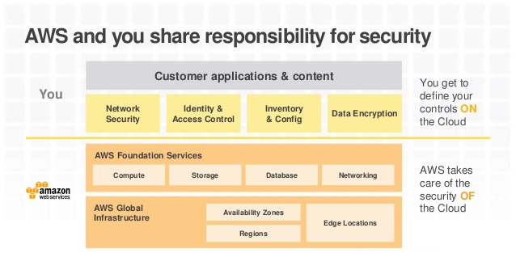
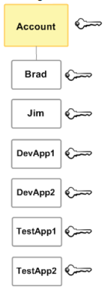
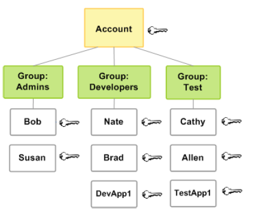

Amazon Identity & Access Management (Amazon IAM)
===

*Fuentes:*

- [Documentación oficial](https://aws.amazon.com/iam)
- [Cloud academy](https://cloudacademy.com/amazon-web-services/overview-of-aws-identity-and-access-management-iam-course/)

---

## Indice

Insertar indice

---
## Introducción

¿Qué es Amazon IAM?

Amazon Identity and Access Management (IAM) es un servicio que nos ayuda a controlar de forma segura el acceso a los servicios y recursos de AWS.

### Características

IAM otorga las siguientes características:

- **Acceso compartido**

Podemos conceder permisos a otro usuarios para administrar y utilizar recursos de AWS sin tener que compartir nuestra clave de acceso.

- **Permisos granulares**

Podemos otorgarles distintos tipos de permisos a diferentes usuarios sobre diferentes recursos. Ej; A algunos usuarios podemos darle full access sobre EC2 y S3, y a otros usuaros de AWS podemos darle read-only sobre algunos buckets de S3, o permisos para administrar algunas instancias de EC2.

- **Acceso seguro para aplicaciones sobre EC2**

Podemos utilizar las funciones de IAM para otorgar credenciales de acceso a aplicaciones que se ejecutan sobre EC2 y que necesitan acceder a otros recursos de AWS, por ejemplo; buckets de S3, una base RDS o DynamoDB.

- **Multi-factor authentication (MFA)**

Podemos agregar autenticación en 2 pasos para mayor seguridad. Los usuarios deberán no solo la clave de acceso, sino que también, un código de acceso de algún dispositivo pre-configurado.

- **Federación de identidad**

Podemos darle acceso temporal a otro usuario (que ya tenga usuario en AWS) y que no pertenezca a nuestra organización.

- **Información de auditoría**

Si estamos utilizando [AWS CloudTrail](https://aws.amazon.com/es/cloudtrail/) recibiremos logs que incluyen registros de peticiones de acceso a recursos de nuestra cuenta basadas en información de IAM.

- **Payment Card Industry(PCI) & Data Security Standard (DSS)**

IAM soporta el manejo de información y transacciones asociadas a las tarjetas de crédito. Para más información consultar.

- **Integración con otros servicios de AWS**

Es posible integrar IAM con otros servicios de AWS.

- **Sin cargos extra**

IAM es un servicio que se ofrece sin cargo.

Ref: Más información sobre el standard de seguridad de los datos [PCI DSS](https://aws.amazon.com/es/compliance/pci-dss-level-1-faqs/).

---
## Identity vs Access Management

Es importante entender la diferencia entre el concepto de Identity y el de Access Management.

- **Identity**

Cuando nos referimos a Identity, estamos hablando de como vamos a identificar unívocamente a una persona/aplicación.

- **Access Management**

 Cuando hablamos de Access Management estamos hablando de qué es lo que un usuario/aplicación va a poder hacer dentro de AWS.

**Por defecto, los usuarios (salvo root) no tienen permisos para acceder a ningún recurso** salvo que se indique lo contrario mediante políticas.

---
## Tipos de acceso

Podemos utilizar AWS Identity and Access Management en cualquera de las siguientes formas.

- **Usuario + Password**
    - AWS Management Console

- **Access Key ID + Secret Access Key**
    - AWS Command Line Tools
    - AWS SDKs
    - HTTPS API REST

---

## El usuario root

Cuando crearmos por primera vez una cuenta en AWS, por defecto estamos creando una cuenta root. Con estas credenciales, podemos acceder a la Consola de administración.

Cuando utilizamos la cuenta root, tenemos acceso completo a todos los servicios y recursos de AWS, incluyendo la facturación. AWS recomienda **NO UTILIZAR LA CUENTA ROOT** para el trabajo diario y crear otros usuarios con los permisos necesarios.

---

## Responsabilidades

---
## Usuarios

Como vimos anteriormente, el concepto de _Identity_
nos permite contestr la pregunta ¿quien es ese usuario?. En lugar de compartir la clave de root, podemos crear otras cuentas IAM que corresponderán a personas físicas en nuestra empresa, y que tendrán sus propias credenciales para acceder a la consola de administración.

**Vale aclarar que los usuarios IAM no son cuentas separadas de AWS**.

Incluso se pueden generar _access keys_ para que puedan acceder de manera programática.

En la figura siguiente, Brad, Jim, DevApp1, DevApp2, TestApp1, y TestApp2 son usuarios IAM que fueron creados dentro de una sola cuenta de AWS, y cada usuario tiene sus propias credenciales.

---

## Ejercicio # 1 haciendo clic en el siguiente [link](ejercicios/AWS_IAM_1_Users.md)

---

## Grupos
---

Es posible organizar usuarios dentro de grupos IAM. Básicamente, un grupo es una colección de usuarios.

Todos los usuarios dentro de un grupo tienen los permisos asignados al grupo. Es una forma fácil de agrupar usuarios y permisos.

Por ejemplo: En la figura siguiente tenemos un grupo llamado **Admins**, otro **Developers** y otro **Test**. Los usuarios que estan dentro del grupo Admin, tienen los permisos que se hayan definido para los Administradores. Si un nuevo usuario administrador ingresa a la empresa, bastará con agregarlo al grupo para que tenga los mismos permisos que los otros administradores.

Otro caso puede ser un usuario Test que sea ascendido a developer. En este caso, agregaremos a Cathy al grupo Developers y la borraremos del grupo Test.

---
## Roles

Un rol es muy parecido a un usuario, en el sentido de que se puede asignar permisos a un rol y luego el rol, atachearlo a un usuario. Sin embargo, **un rol no tienen ningun tipo de credencial (password o access keys**. Y también puede ser asociado a cualquiera que necesite dichos accesos temporalmente, por ejemplo: un usuario federado.

## Credenciales Temporales

Las credenciales temporales son utilizadas principalmente para los roles. Se pueden generar credenciales temporales con permisos más restrictivos que los usuarios estandard y previene que se ejecuten tareas de forma accidental. Otro beneficio de las credenciales temporales es que expiran automáticamente despues de un tiempo determinado.

## ¿Cuando usar qué?

