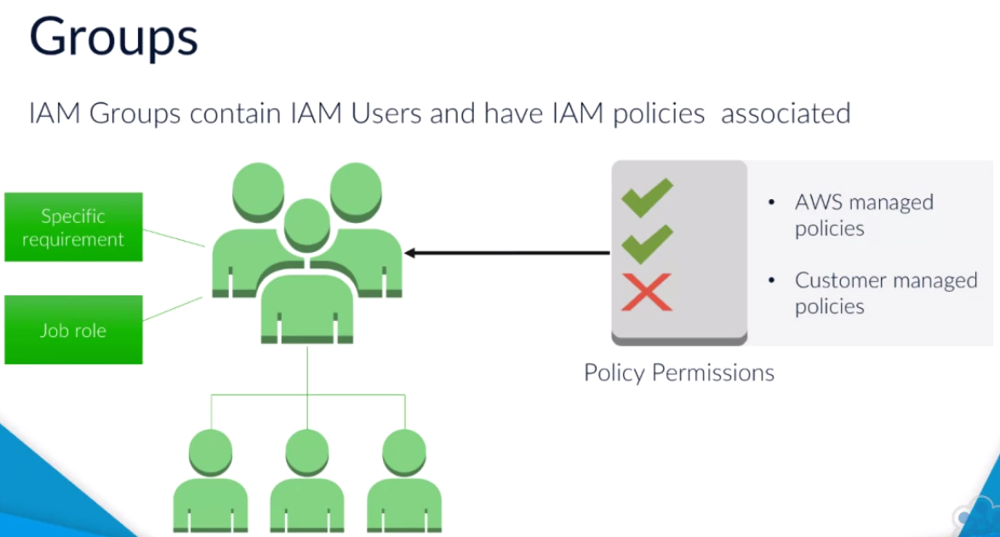
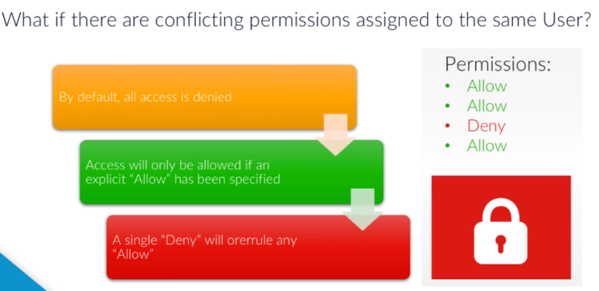

Amazon Identity & Access Management (Amazon IAM)
===

*Fuentes:*

- [Documentación oficial](https://aws.amazon.com/iam)
- [Cloud academy](https://cloudacademy.com/amazon-web-services/overview-of-aws-identity-and-access-management-iam-course/)

---

## Indice

Insertar indice

---
## Introducción

¿Qué es Amazon IAM?

Amazon Identity and Access Management (IAM) es un servicio que nos ayuda a controlar de forma segura el acceso a los servicios y recursos de AWS.

### Características

IAM otorga las siguientes características:

- **Acceso compartido**

Podemos conceder permisos a otro usuarios para administrar y utilizar recursos de AWS sin tener que compartir nuestra clave de acceso.

- **Permisos granulares**

Podemos otorgarles distintos tipos de permisos a diferentes usuarios sobre diferentes recursos. Ej; A algunos usuarios podemos darle full access sobre EC2 y S3, y a otros usuaros de AWS podemos darle read-only sobre algunos buckets de S3, o permisos para administrar algunas instancias de EC2.

- **Acceso seguro para aplicaciones sobre EC2**

Podemos utilizar las funciones de IAM para otorgar credenciales de acceso a aplicaciones que se ejecutan sobre EC2 y que necesitan acceder a otros recursos de AWS, por ejemplo; buckets de S3, una base RDS o DynamoDB.

- **Multi-factor authentication (MFA)**

Podemos agregar autenticación en 2 pasos para mayor seguridad. Los usuarios deberán otorgar la clave de acceso, sino que también, un código que será enviado a algún dispositivo pre-configurado.

- **Federación de identidad**

Podemos darle acceso temporal a otro usuario (que ya tenga usuario en AWS) y que no pertenezca a nuestra organización.

- **Información de auditoría**

Si estamos utilizando [AWS CloudTrail](https://aws.amazon.com/es/cloudtrail/) recibiremos logs que incluyen registros de peticiones de acceso a recursos de nuestra cuenta basadas en información de IAM.

- **Payment Card Industry(PCI) & Data Security Standard (DSS)**

IAM soporta el manejo de información y transacciones asociadas a las tarjetas de crédito.

- **Integración con otros servicios de AWS**

Es posible integrar las funciones de IAM con otros servicios de AWS. Generalmente utilizando la funcion de Roles.

- **Sin cargos extra**

IAM es un servicio que se ofrece sin cargo.


Refs: Más información sobre el standard de seguridad de los datos [PCI DSS](https://aws.amazon.com/es/compliance/pci-dss-level-1-faqs/).

---
## _Identity vs Access Management_

Es importante entender la diferencia entre el concepto de _Identity_ y el de _Access Management_.

- **_Identity_**

Cuando nos referimos a _Identity_, estamos hablando de identidad y de **como vamos a identificar a ese usuario**.

- **_Access Management_**

 Cuando hablamos de _Access Management_, estamos hablando de **qué es lo que un usuario va a poder hacer dentro de AWS**. Básicamente estamos hablando de qué es lo que el usuario va a poder realizar dentro de AWS.

**Por defecto, los usuarios (salvo root) no tienen permisos para acceder a ningún recurso**, salvo que se indique lo contrario mediante políticas.

---
## Tipos de acceso

Podemos identificar a un usuario de IAM de varias formas.

- **_User + Password_**

    - Nos brinda acceso a AWS mediante la _Management Console_.

- **_Access Key ID + Secret Access Key_**

    - Nos brinda acceso a AWS mediante las siguientes modalidades:
        - AWS _Command Line Tools_
        - AWS SDKs
        - HTTPS API REST

---

## _Access Key ID + Secret Access Key_

En el caso que necesitemos que un usuario tenga acceso a los servicios de AWS de forma programática, es necesesario generar un par de llaves llamadas: _access key pair_. 

Una _access key pair_ está integrada por:

- **_Access Key Id_:**
    - _Uppercase String_ alfanumerico de 20 digitos (numeros y letras mayúsculas).
    - Está activa por defecto (se puede deshabilitar).
    - Se puede generar hasta 2 AKI por usuario (útil para rotación de _keys_).
    - Se pueden borrar (no se pueden recuperar).
    - Podemos darle permisos al _owner_ de las _keys_ para que se administre sus propias _keys_.

- **_Secret Access Key_:**
    - _String_ de 40 caracteres de longitud.
    - Solo disponible cuando se crea el usuario. 
    - **Importante** no perderla porque no es posible recuperarla.

---

## El usuario _root_

Cuando crearmos por primera vez una cuenta en AWS, por defecto estamos creando una cuenta _root_. Con estas credenciales, podemos acceder a la consola de administración.

Cuando utilizamos la cuenta root, tenemos acceso completo a todos los servicios y recursos de AWS, incluyendo la facturación. **AWS recomienda no utilizar la cuenta _root_** para el trabajo diario, y recomienda crear otros usuarios con los permisos necesarios.

---
## Usuarios

Como vimos anteriormente, el concepto de _Identity_
nos permite responder la pregunta ¿quien es ese usuario?. En lugar de compartir la clave de _root_, podemos crear otras cuentas IAM que corresponderán a personas físicas en nuestra empresa, y que tendrán sus propias credenciales para acceder a la consola de administración y/o acceso de forma programática.

**Nota:** Los usuarios IAM no son cuentas separadas de AWS.

En la figura siguiente, Brad, Jim, DevApp1, DevApp2, TestApp1, y TestApp2 son usuarios IAM que fueron creados dentro de una sola cuenta de AWS, y cada usuario tiene sus propias credenciales.


Notarán que algunos usuarios son usuarios de aplicaciones. Por lo que **un usuario IAM no necesariamente tiene que representar a una persona física**. Podemos generar un usuario para una aplicación que corre en nuestra red empresarial y necesita acceso a recursos de AWS.

## Usuarios Federados

Si un usuario ya cuenta con una forma de autenticación habilitada, es posible federar dichos usuarios dentro de AWS. Otorgando acceso mediante _Management Console_ y mediante API, CLI o SDK. 

**Util cuando:**

- Usuarios corporativos: 

Si tenemos un directorio de usuarios compatible con _Security Assertion Markup Language 2.0_ (SAML 2.0), podemos configurar _Single-Sign On_ (SSO) para AWS.

- _Identity Providers_:

Si estamos creando una aplicación para celulares o una web, podemos permitirle al usuario se autentique a travez de un _Identity provider_ como Facebook, Google o cualquier otro proveedor que sea compatible con _OpenID Connect_ (OIDC). AWS recomienda utilizar [Amazon Cognito](https://aws.amazon.com/es/cognito/).

---
## Grupos

Es posible organizar usuarios dentro de grupos IAM. Básicamente, un grupo es una colección de usuarios.

Todos los usuarios dentro de un grupo tienen los mismos permisos asignados al grupo. Es una forma fácil de agrupar usuarios y permisos.

Por ejemplo: En la figura siguiente tenemos un grupo llamado **Admins**, otro **Developers** y otro **Test**. Los usuarios que estan dentro del grupo Admin, tienen los permisos que se hayan definido para los Administradores. Si un nuevo usuario administrador ingresa a la empresa, bastará con agregarlo al grupo para que tenga los mismos permisos que los otros administradores.

Otros ejemplos muy comunes es que un usuario perteneciente al grupo de Test sea promovido a developer. Por ejemplo; en este caso, agregaremos a Cathy al grupo Developers y la borraremos del grupo Test.


Los permisos son atacheados a los grupos mediante políticas, ya sean predefinidas por AWS o creadas por nosotros.

De esta froma, los usuarios dentro del grupo, heredan dichos permisos. Solo basta con modificar la política del grupo para cambiar los permisos sobre todos los usuarios.

- **Máximo de 100 grupos por cuenta de AWS**. En caso de necesitar más, es necesario generar un ticket en AWS.
- **Un usuario puede ser asociado a un máximo de 10 grupos**.



---
## [Ejercicio # 1 y 2](ejercicios/AWS_IAM_1_Users_Groups.md)
---

## Roles

Un rol es muy parecido a un usuario, en el sentido de que se le pueden asignar permisos y luego ser atacheado a un usuario federado, a una aplicación o un servicio que generalmente no tiene acceso a AWS. Sin embargo, **un rol no tiene ningun tipo de credencial (user/password o access keys)**.

### Tipos de roles

- AWS Service Role
- AWS Service-Linked Role
- Rol for Cross-Account Access
- Rol for identify Provider Access.

## ¿Cuando usar qué?

- Usuario
    - Cuando se crea una cuenta en AWS y solo existe un usuario que va a trabajar en AWS.
    - Cuando otras personas de la companía necesitan trabajar sobre AWS.
    - Cuando se desea utilizar CLI para trabajar en AWS.

- Rol
    - Cuando tenemos aplicaciones corriendo sobre algún servicio de AWS (Ej; EC2 y la aplicación necesita acceder a otros servicios de AWS (Ej S3, RDS, etc).
    - Cuando deseamos utilizar _features_ de algunos servicios los cuales si o si necesitan tener un rol asignados (Ej; Amazon S3 region replication).
    - Cuando los usuarios ya estan autenticados en la red empresarial y necesita utilizar AWS sin la necesidad de tener que loguearse nuevamente (SSO).

---

## Políticas (Policies)

Las IAM Policies son utilziadas para asignar permisos. El formato de definición de las políticas es JSON y la estructura base es la siguiente:

```bash
{
  "Version": "2012-10-17",
  "Statement": [
    {
      "Sid": "Stmt245245254535",
      "Action": "s3:*",
      "Effect": "Allow",
      "Resource": "*",
      "Condition": {
          "IpAddress": {
              "aws:SourceIp": "10.10.0.0/16"
          }
      }
    }
  ]
}
```

- **Version:**
    - Debe aparecer antes que el Statement.
    - Solo acepta 2 valores (2012-10-17 o 2008-10-17). 
    - Si no se especifica, toma 2008 por defecto. 
    - Con la versión 2008 hay _features_ que no funcionan (Ej; _policy variables_).

- **Statement:** 
    - Elemento obligatorio.
    - Elemento principal de la _policy_.
    - Incluye varios elementos dentro de un array json.
    - Formato: "Statement": [{...},{...},{...}].

- **Sid:**
    - Elemento opcional, se puede asignar un sid a cada statement.
    - Es un sub-id que puede ser utilizados por algunos servicios como SQS y SNS.

- **Acction:**
    - Elemento obligatorio.
    Describe la/s acción/es específica/s que serán permitidas o denegadas.
    - Cada servicio de AWS tiene su propio conjutno de tareas a realizar/denegar.
    - No es key sensitive -> iam:ListAccessKeys = IAM:listaccesskeys.
    - Se pueden concatenar acciones: "Action": [ "sqs:SendMessage", "sqs:ReceiveMessage", "ec2:StartInstances", "iam:ChangePassword", "s3:GetObject"].
    - Se pueden utilizar _wildcards (*)_: "Action": "s3:*" o "Action": "iam:\*AccessKey\*".

- Effect:
    - Solo acpeta 2 opciones: Allow o Deny.

- Resource:
    - Indica el recurso o recursos que cubre el statement.
    - Se utiliza el nombre ARN.
    ```bash
    "Resource": "arn:aws:s3:us-east-2:user-account-ID:my_corporate_bucket/*"
    ```

- Condition:
    - Campo opcional.
    - Permite setear condiciones para ejecutar la política.
    - Pueden incluir fechas, horas, ip origen, usuario, etc.
    ```bash
    "Condition": {
          "IpAddress": {
              "aws:SourceIp": "10.10.0.0/16"
          }
      }
    ```

Refs:

[AWS Reference Policies Elements](http://docs.aws.amazon.com/es_es/IAM/latest/UserGuide/reference_policies_elements.html)

[AWS Amazon Resources Names](http://docs.aws.amazon.com/es_es/general/latest/gr/aws-arns-and-namespaces.html)

[AWS Global Conditions Keys](http://docs.aws.amazon.com/es_es/IAM/latest/UserGuide/reference_policies_condition-keys.html#AvailableKeys)

---

## Tipos de Políticas (Type of policies)

- **AWS Managed Policies** 

Son políticas pre-creadas por AWS y pueden ser asociadas a Grupos, Roles y Usuarios (no recomendado)

- **Customer Managed Policies**

Son políticas creadas por el propio usuario y existen 3 formas de hacerlo:

    1. Copiar una Managed Policy y editarla.
    2. Utilizar el generador de policies.
    3. Escribir el json desde 0.

---
## Resolución de conflictos de permisos.

- Por defecto el acceso a todos los recursos esta prohibido.
- Solo se otorgará acceso a un recurso si existe un "Allow".
- Si existe un "Deny", sobreescribirá cualquier "Allow" que exista anteriormente.


