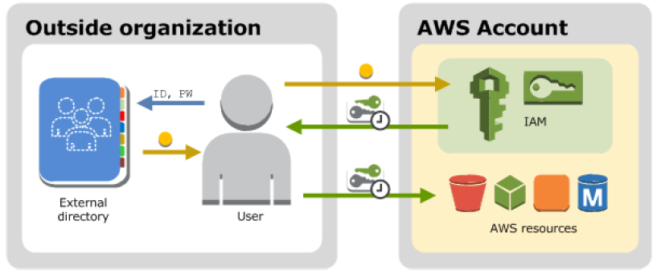

Amazon Identity & Access Management (Amazon IAM)
===

*Fuentes:*
- [Documentación oficial](https://aws.amazon.com/iam)
- [Cloud academy](https://cloudacademy.com/amazon-web-services/overview-of-aws-identity-and-access-management-iam-course/)

---
## Introducción
---
¿Qué es Amazon IAM?      
---
Amazon Identity and Access Management (IAM) es un servicio que nos ayuda a controlar de forma segura el acceso a los servicios y recursos de AWS. 

### Características

IAM nos otorga las siguientes características:

* **Acceso compartido**

Podemos conceder permisos a otro usuarios para administrar y utilizar recursos de AWS sin tener que compartir nuestra clave de acceso.

* **Permisos granulares**

Podemos otorgarles distintos tipos de permisos a diferentes usuarios sobre diferentes recursos. Ej; A algunos usuarios podemos darle full access sobre EC2 y S3, y a otros usuaros de AWS podemos darle read-only sobre algunos buckets de S3, o permisos para administrar algunas instancias de EC2.

* **Acceso seguro para aplicaciones sobre EC2**

Podemos utilizar las funciones de IAM para otorgar credenciales de acceso a aplicaciones que se ejecutan sobre EC2 y que necesitan acceder a otros recursos de AWS, por ejemplo; buckets de S3, una base RDS o DynamoDB.

* **Multi-factor authentication (MFA)**

Podemos agregar autenticación en 2 pasos para mayor seguridad. Los usuarios deberán no solo la clave de acceso, sino que también, un código de acceso de algún dispositivo pre-configurado.

* **Federación de identidad**

Podemos darle acceso temporal a otro usuario (que ya tenga usuario en AWS) y que no pertenezca a nuestra organización.

* **Información de auditoría**

Si estamos utilizando [AWS CloudTrail](https://aws.amazon.com/es/cloudtrail/) recibiremos logs que incluyen registros de peticiones de acceso a recursos de nuestra cuenta basadas en información de IAM.

* **Payment Card Industry(PCI) & Data Security Standard (DSS)**

IAM soporta el manejo de información de tarjetas de crédito. Para más información consultar [PCI DSS](https://aws.amazon.com/es/compliance/pci-dss-level-1-faqs/).

* **Integración con otros servicios de AWS**

Es posible integrar IAM con otros servicios de AWS.

* **Sin cargos extra**

IAM es un servicio que se ofrece sin cargo.

---
## Acceso a IAM
---

Podemos utilizar AWS Identity and Access Management en cualquera de las siguientes formas.

* **AWS Management Console**

* **AWS Command Line Tools**

* **AWS SDKs**

* **IAM HTTPS API**

---
## Primer acceso como Root
---

Cuando crearmos por primera vez una cuenta en AWS, por defecto estamos creando una cuenta root. Con estas credenciales, podemos acceder a la Consola de administración.

Cuando utilizamos la cuenta root, tenemos acceso completo a todos los servicios y recursos de AWS, incluyendo la facturación. AWS recomienda **NO UTILIZAR LA CUENTA ROOT** para el trabajo diario y crear otros usuarios con los permisos necesarios.

---
## Usuarios IAM
---

Como vemos en la imágen anterior, es posible tener más de un usuario creados en una cuenta de AWS, incluso pueden ser para identificar usuarios físicos, así como también usuarios de aplicaciones que accederán a recursos de AWS de forma programática mediante la API Rest o los SDK.

---
## Ejercicio #1: [Creación de usuarios y grupos](AWS_IAM_Users&Groups.md)
---

## Federación de usuarios existentes
---
Si los usuarios ya cuentan con un sistema de autenticación, Ej; login en la red empresarial. Es posible federar estos usuarios dentro de AWS.

La federación de usuarios es útil en los siguientes casos:

* **Usuarios existentes en una red empresarial**

1. Se puede configurar single-sign on (SSO) si el directorio corporativo es compatible con _Securitiy Assertion Markup Language 2.0 (SAML 2.0)_. En caso contrario, se puede crear una aplicación para proveer SSO a la consola de AWS.
2. Si se utiliza Microsoft Active Directory, se puede establecer una relación de confianza entre AD y las cuentas de AWS.

* **Usuarios con acceso OIDC** 

Si contamos con una aplicación mobil o web que le permite al usuario loguearse utilizando su cuenta de Facebook, Google o cualquier aplicación que utilice _OpenId Connect (OIDC)_ es posible federarlo para que pueda acceder a AWS. En este caso, Amazon recomienda utilizar [AmazonCognito](https://aws.amazon.com/es/cognito/).

---
## Políticas & Usuarios
---

Hasta el momento siempre estuvimos hablando de Identificación del usuario/aplicación _(Identity)_. Ahora bien, cuando hablamos de la administración de acceso _(Access Management)_ estamos hablando de que es lo que un usuario puede hacer dentro de AWS. Los permisos son otorgados mediante políticas las cuales son creadas y luego otorgadas a los usuarios, grupos o roles.

Por defecto, los usuarios no tienen permisos para acceder a ningún recurso salvo que se indique lo contrario mediante políticas.

---
## Políticas & Grupos
---

Es posible organizar usuarios dentro de grupos IAM. Todos los usuarios dentro de un grupo tienen los permisos asignados al grupo. Es una forma fácil de agrupar usuarios y permisos.

---
## Características de seguridad fuera de IAM
---

Utilizaremos el servicios IAM para controlar el acceso a las tareas que son ejecutadas mediante AWS Management Console, Command Line Tools o los servicios API usados por los SDKs.

Ahora bien, otros servicios y recursos de AWS tienen otros mecanismos de seguridad.

* **Amazon EC2**: utiliza usuario y password para iniciar sesión dentro de una instancia.

* **Amazon RDS**: utiliza usuario y clave para loguearse dentro del motor que estan atados a la base de datos (Ej; usuario y pass de SQL).

