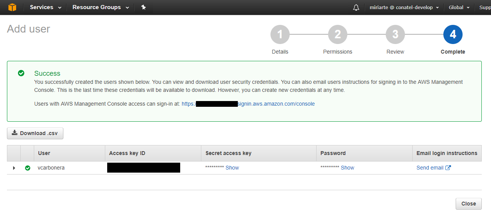

## Manejo de usuarios mediante la consola de AWS (MC).

En este ejercicio, crearemos usuarios desde la consola de administración de AWS. 

Las tareas a realizar son las siguientes:

* Acceder a la [consola IAM](https://console.aws.amazon.com/iam/)


* En el panel de IAM, haga click en *Add User*


* Indique el nombre de usuario.

Puede contener, letras, numeros, y los siguientes caracteres: mas (+), igual (=), coma (,), punto (.), arroba (@), guion bajo (_), y guion medio (-). El nombre no es _case sensitive_ y puede contener un máximo de 64 caracteres. 

* Indique el tipo de acceso a otorgar
* Indique si la clave inicial es autogenerada y si se va a forzar el cambio en el primer logon.


* Por el momento no lo vamos a asignar a ningún grupo, hacemos clic en _next review_.


*Realizamos el review de las ociones.





---
## Manejo de usuarios mediante la linea de comandos de AWS (CLI).

* Crear un par de usuarios

```bash
aws iam create-user --user-name miriarte1

aws iam create-user --user-name miriarte2
```

* Ejemplo de salida cuando creamos un usuario

```bash
{
    "User": {
        "Path": "/",
        "UserName": "miriarte1",
        "UserId": "ADFASDFADF89078907ADSF",
        "Arn": "arn:aws:iam::23432234234234:user/miriarte1",
        "CreateDate": "2017-08-16T20:01:27.623Z"
    }
}
```

* Listar usuarios

```bash
aws iam list-users
```

* Modificar usuario

```bash
aws iam update-user --user-name miriarte2 --new-user-name miriarte3
```

* Listar access keys

```bash
aws iam list-access-keys --user-name miriarte3
```

```bash
{
    "AccessKeyMetadata": [
        {
            "UserName": "miriarte3",
            "AccessKeyId": "ASDF0897ASDF087ASDF",
            "Status": "Active",
            "CreateDate": "2017-08-19T12:18:10Z"
        }
    ]
}
```

* Listar certificados

```bash
aws iam list-signing-certificates --user-name miriarte3
```

* Listamos las políticas asociadas al usuario

```bash
aws iam list-attached-user-policies --user-name miriarte3
```

* Listamos los grupos a los que pretenece el usuario

```bash
$ aws iam list-groups-for-user --user-name miriarte3
```


* Borrar usuario (6 pasos)

1. Borramos la access key (si tiene)

```bash
aws iam delete-access-key --access-key ASDF0897ASDF087ASDF --user-name miriarte3
```

2. Borramos el certificado (si tiene)

```bash
aws iam delete-signing-certificate --user-name miriarte3 --certificate-id ADSFASDF987AD8S9F79ASDF
```

3. Desactiamos el dispositivo MFA (si tiene)

```bash
aws iam deactivate-mfa-device --user-name miriarte3 --serial-number arn:aws:iam::210987654321:mfa/BobsMFADevice
```

4. Desatachamos las políticas asociadas al usuario (si tiene)

```bash
aws iam detach-user-policy --user-name miriarte3 --policy-arn arn:aws:iam::123456789012:policy/PoliticaTest
```

5. Removemos el usuario de los grupos a los cuales pertenece (si pertenece)

```bash
aws iam remove-user-from-group --user-name miriarte3 --group-name admin
```

6. Borramos el usuario

```bash
aws iam delete-user --user-name miriarte3
```

---
Refs:
[AWS CLI IAM](http://docs.aws.amazon.com/cli/latest/reference/iam/)

---
[< Volver al teorico](https://github.com/conapps/conapps-iot/blob/master/AWS%20Cloud/IAM/AWS_IAM_Parte_1.md#Grupos)