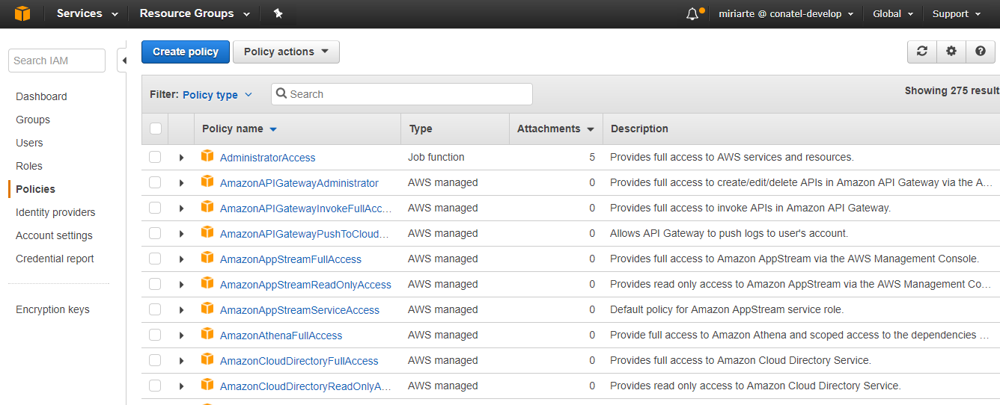
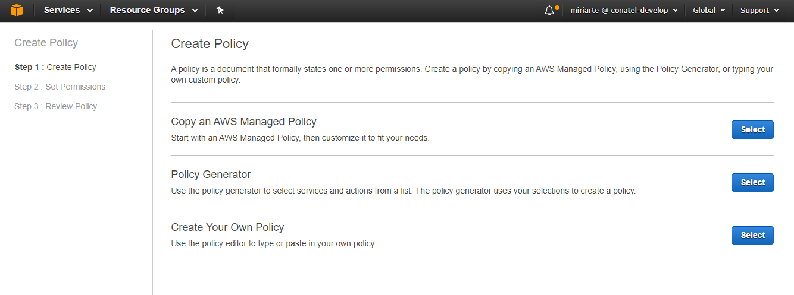
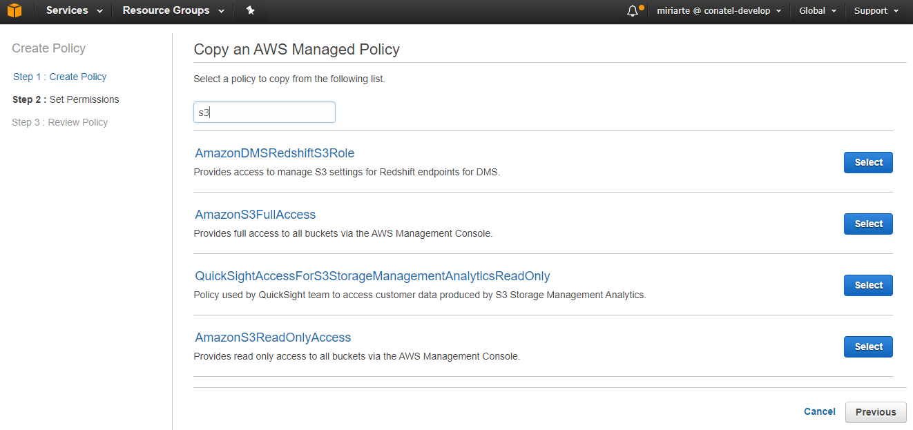
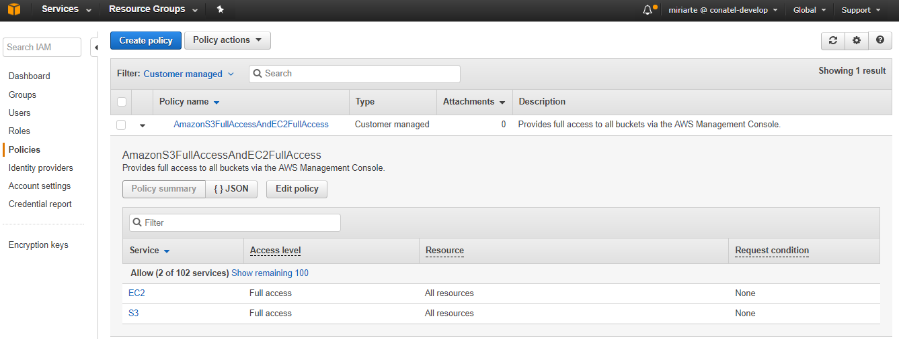
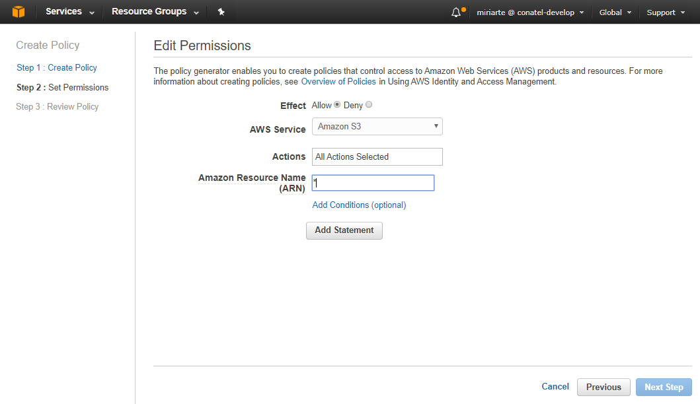
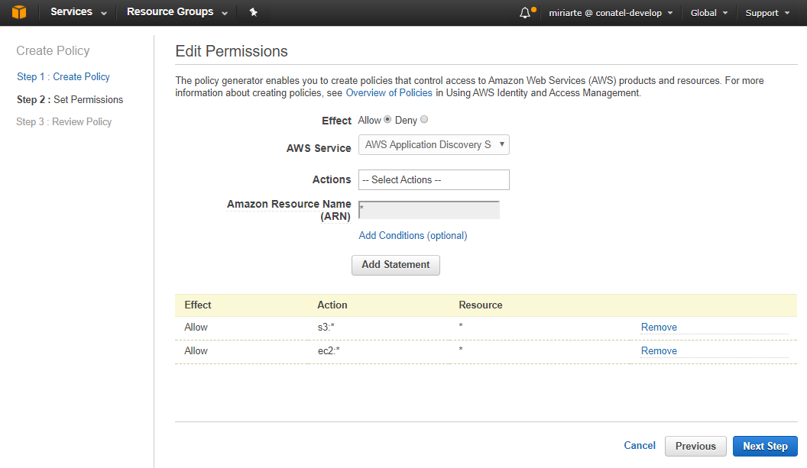
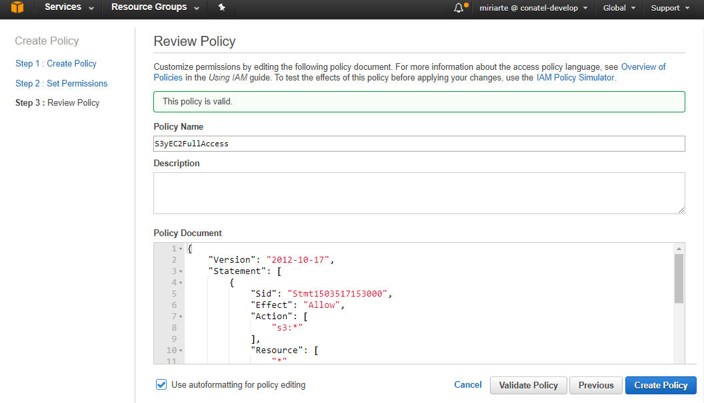
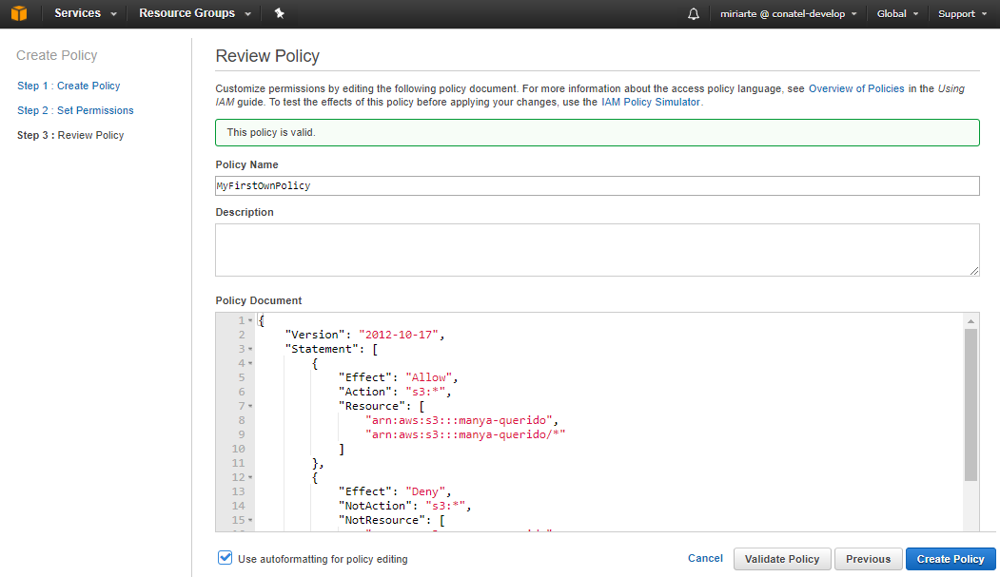

## Ejercicio 3: Manejo de políticas mediante la consola de AWS (MC).

A continuación vamos a crear políticas para definir permisos. Existen 3 formas de realizar esta tarea:

### Forma 1. Copy an AWS Managed Policy

* Acceder a la [consola IAM](https://console.aws.amazon.com/iam/)


* En el panel de IAM, haga click en *Policies*



* Hacemos clic en _Copy an AWS Managed Policy_



* Realizaremos una nueva política que tenga permisos de full access para S3 y EC2 en una sola política, partiendo de la base de S3 full access.



* Modificamos el json para que se incluya ec2 full access, cambiamos el nombre y hacemos clic en _Create Policy_


* Una vez creada la nueva policy, podemos hacer un _review_ de la misma, inluso edtiarla.



---
### Forma 2. Policy Generator

* Hacemos clic en la opción _Select_ de _Policy Generator_


- Seleccionamos
    - Effect: Allow
    - Service: Amazon S3
    - Action: All Actions Selected
    - ARN: *

- Clic en _Add Statement_



- Repetimos la acción para AWS EC2

- Una vez que tenemos todos los _Statement_ clic en _Next Step_



* Seteamos el nombre, validamos la policy y hacemos clic en _Create Policy_




---
### Forma 3. Create Your Own Policy

* Hacemos clic en la opción _Create your own policy_


* Vamos a crear una policy que permite full access sobre un solo _bucket_ de S3 y restringe el acceso a todos el resto de los servicios salvo a S3.

```bash
{
  "Version": "2012-10-17",
  "Statement": [
    {
      "Effect": "Allow",
      "Action": "s3:*",
      "Resource": [
        "arn:aws:s3:::manya-querido",
        "arn:aws:s3:::manya-querido/*"
      ]
    },
    {
      "Effect": "Deny",
      "NotAction": "s3:*",
      "NotResource": [
        "arn:aws:s3:::manya-querido",
        "arn:aws:s3:::manya-querido/*"
      ]
    }
  ]
}
```



---
## Manejo de políticas mediante la linea de comandos de AWS (CLI).

* **Descargar el archivo my-custom-policy.json desde el bucket de S3 iot-iam-lab** y guardarlo en el path C:\Program Files\Git

* Crear una política llamada custom-policy-marcelo con el sigiente comando CLI.

```bash
aws iam create-policy --policy-name custom-policy-marcelo --policy-document file://my-custom-policy.json
```

```bash
{
    "Policy": {
        "PolicyName": "custom-policy-marcelo",
        "PolicyId": "AASDFGSFDG344564K",
        "Arn": "arn:aws:iam::534634566645:policy/custom-policy-marcelo",
        "Path": "/",
        "DefaultVersionId": "v1",
        "AttachmentCount": 0,
        "IsAttachable": true,
        "CreateDate": "2017-08-23T20:55:33.232Z",
        "UpdateDate": "2017-08-23T20:55:33.232Z"
    }
}
```

---
Refs:

- [AWS CLI IAM](http://docs.aws.amazon.com/cli/latest/reference/iam/)
- [AWS IAM User Guide](http://docs.aws.amazon.com/IAM/latest/UserGuide/iam-ug.pdf)

---
[< Volver al teorico](https://github.com/conapps/conapps-iot/blob/master/AWS%20Cloud/IAM/AWS_IAM_Parte_1.md)