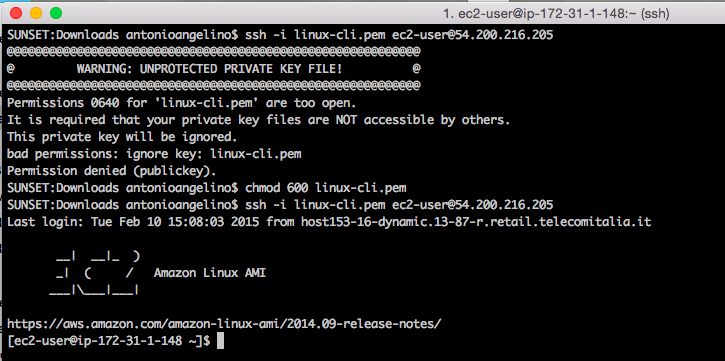
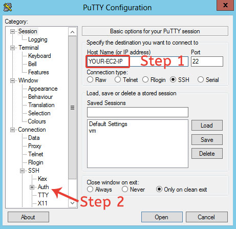
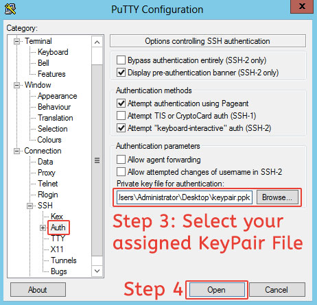
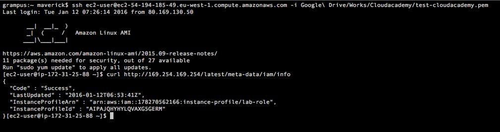
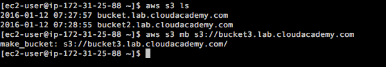
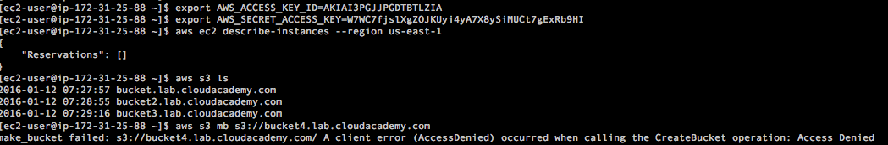

## Ejercicio extra

El siguiente ejercicio tiene como objetivo poner en práctica lo visto en en el curso de IAM, otorgando una guía básica con las tareas a realizar y una ayuda para la utilización de los nombres.

---

### 1. Loguearse en la consola de AWS.
---

### 2. Crear un Grupo dentro de IAM

- Nombre del grupo: _devops_

- Atachear la política: _AmazonEC2ReadOnlyAccess_

---

### 3. Create IAM User

- Nombre del usuario: _marce_

---

### 4. Crear una _customer managed policy_

- Name: _policy-lab_
- Effect: _Allow_
- AWS Service: _Amazon S3_
- Actions: _ListAllMyBuckets_
- Amazon Resource Name ARN: *

---

### 5. Adjuntar una política a un usuario

- Política: AmazonEC2ReadOnlyAccess
- Usuario: _marce_

---

### 6. Crear IAM Role

- Tipo de rol: _AWS Services Roles_ -> _Amazon EC2_
- Política: _AmazonS3FullAccess_
- Nombre: _lab-role_

---

### 7. Iniciar instancia EC2

- AMI: _Amazon Linux AMI_
- Atachear la política: _lab-role_

---

### 8. Conectarse a la instancia


#### Conectarse usando Linux ssh


•	Write and run the following command: ssh -i /path/to/your/keypair.pem user@server-ip.

server-ip: is the Public IP of your server, you can find it in the EC2 instance details

user_ is the remote system user that will be used for the remote authentication  

Notas: 

Amazon Linux AMIs typically use ec2-user as username.
Ubuntu AMIs login user is ubuntu, Debian AMIs use admin instead.
Assuming that you selected the Amazon Linux AMI, your assigned public IP is 123.123.123.123, and your keypair (named "keypair.pem") is stored in /home/youruser/keypair.pem, the right command to run is: ssh -i /home/youruser/keypair.pem ec2-user@123.123.123.123

Note: your SSH Client may refuse to start the connection, warning that the key file is unprotected. You should deny the file access to any other system user by changing its permissions. Issue the following command and then try again:
chmod 600  /home/youruser/keypair.pem
 



#### Conectarse usando Windows

Windows has no SSH client, so you must use PuTTY (get it here!) and convert the PEM key to PPK using PuTTYgen.
Starting a remote SSH session using PuTTY is easy:
•	Open PuTTY and insert the EC2 instance IP Address in the Host Name field.



•	Select Connection > SSH > Auth section and then select the downloaded Keypair that you previously converted to PPK format.



•	After some seconds, you will see the authentication form. Login as ec2-user and you will see the EC2 server welcome banner.

---

### 9. Probar política


Instead of creating and distributing your AWS credentials, you can delegate permission to making API requests using IAM roles. Instead of creating and distributing your AWS credentials,  you can use IAM roles to delegate permission for making API requests. 
Simply specify the role when you launch your instances. 
When are you logged into the EC2 Instances you can use this command for retrieving the current IAM Profile

```bash
curl http://169.254.169.254/latest/meta-data/iam/info
```



The key InstanceProfileArn identifies the ARN of the role associated with the EC2 instance

Now you can test the IAM Profile using AWS CLI for list bucket and create a bucket. Remember that the role lab-role has the policy AmazonS3FullAccess

```bash
aws s3 ls 
aws s3 mb s3://bucket-name 
```




Now you can call the AWS API by specifying the Access Key and Secret Key in the command line. The Access Key and Secret Key can be found in the csv file that you downloaded after creating the IAM User. 

This overwrites the IAM Profile and you will be able to interact with the EC2 service in read-only mode because the policy associated with  Group devops is the policy AmazonEC2ReadOnlyAccess. This policy is able to interact with the S3 service in read-only mode because the policy attached to the user is AmazonS3ReadOnlyAccess

```bash
export AWS_ACCESS_KEY_ID=access-key-of-user-created-before
export AWS_SECRET_ACCESS_KEY=secret-key-of-user-created-before
```

Now you can use the AWS CLI
aws ec2 describe-instances --region us-west-2 to list instances in the Oregon region

```bash
aws s3 ls
aws s3 mb s3://bucket-name 
```



You can see that you have the privileges for describing instances and list buckets, but you not have the privileges for make bucket. 

---