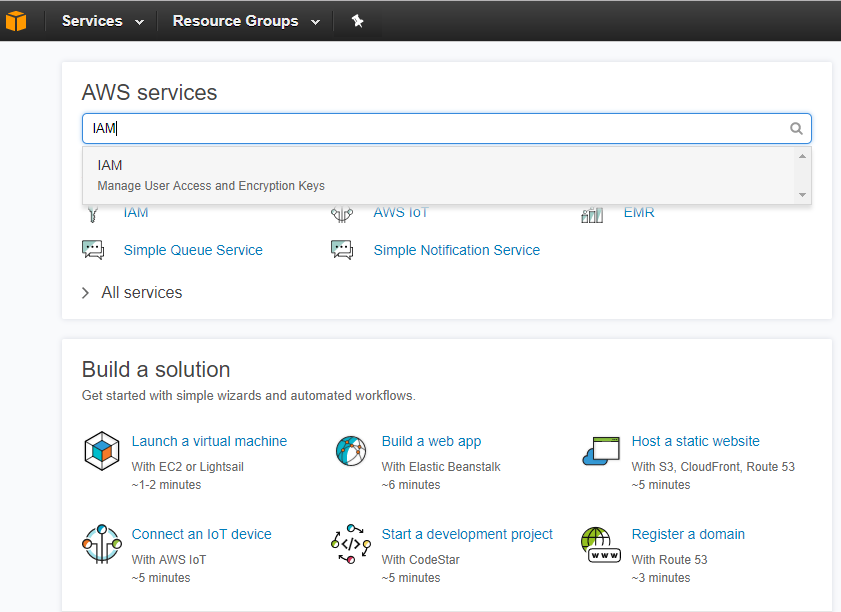
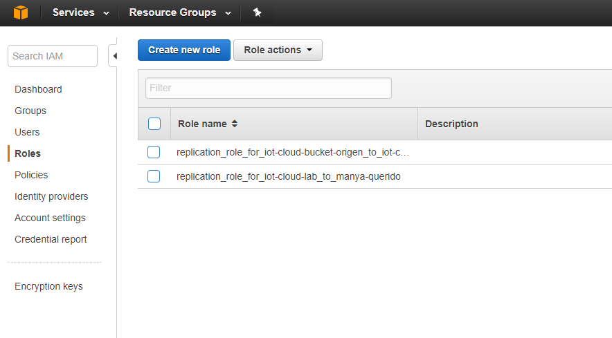
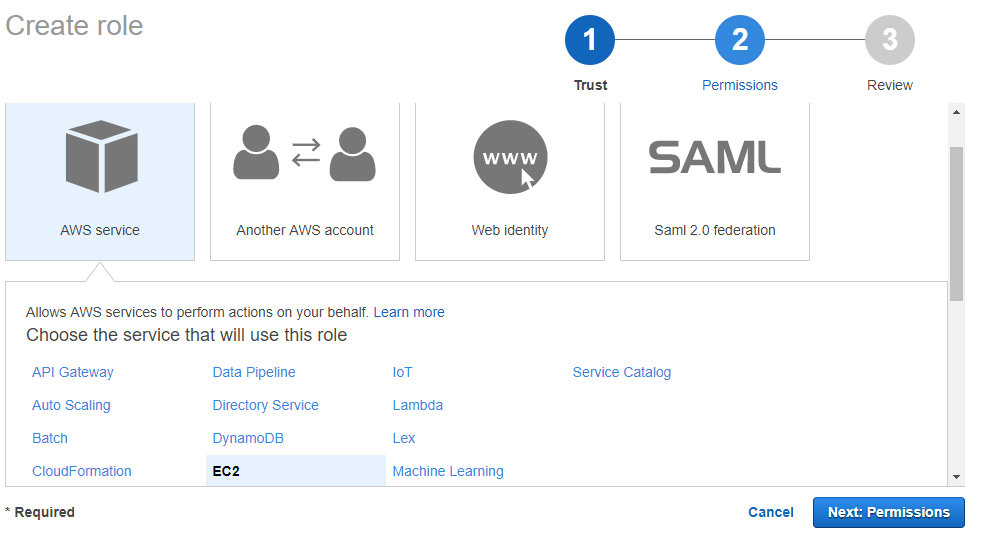
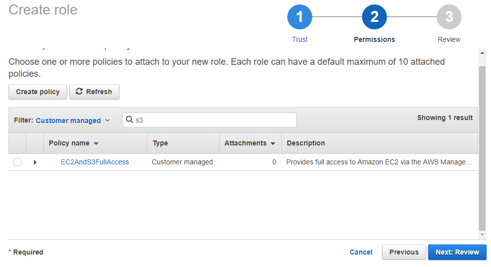
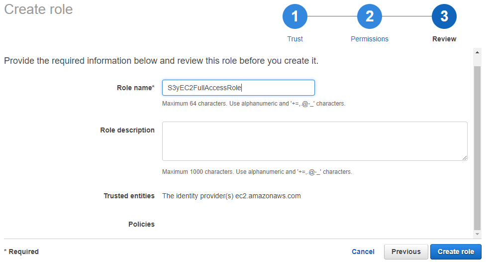

## Ejercicio 4: Manejo de roles mediante la consola de AWS (MC).

Para crear un rol en AWS: 

* Iniciar sesión en AWS _Management Console_ y seleccionar la opción [IAM](https://console.aws.amazon.com/)

* En el panel de navegación, clic en Roles y luego _Create new role_.

* Seleccionar Amazon EC2 dentro de la opción AWS _Service Role_, clic en _Next Step_.

* Seleccionar la _custom managed policy_ creada anteriormente con permisos de EC2 y S3

* Definimos un nombre (debe ser único en nuestra cuenta de AWS, no es _case sensitive_), una descripción y seleccionamos _Create role_.

Una vez creado el rol, no se le puede modificar el nombre.

* Por último, ejecutamos una nueva instancia de EC2 y asociamos el nuevo rol.

---
Refs:

- [Creating a Role to Delegate Permissions to an AWS Service](http://docs.aws.amazon.com/IAM/latest/UserGuide/id_roles_create_for-service.html#roles-creatingrole-service-console)

---
[Ejercicio Final >](https://github.com/conapps/conapps-iot/blob/master/AWS%20Cloud/IAM/ejercicios/AWS_IAM_EjercicioFinal.md)

