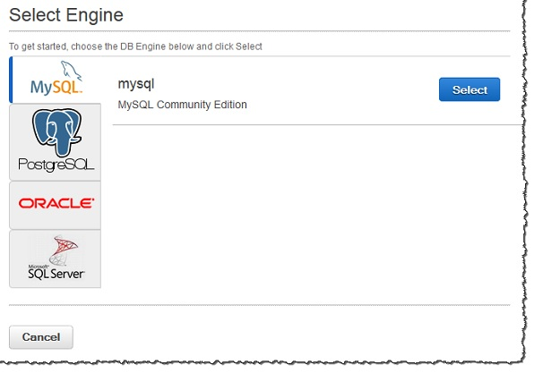
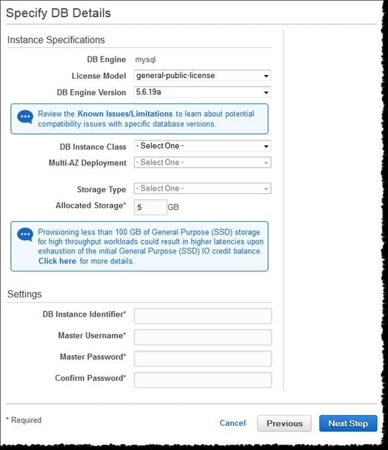
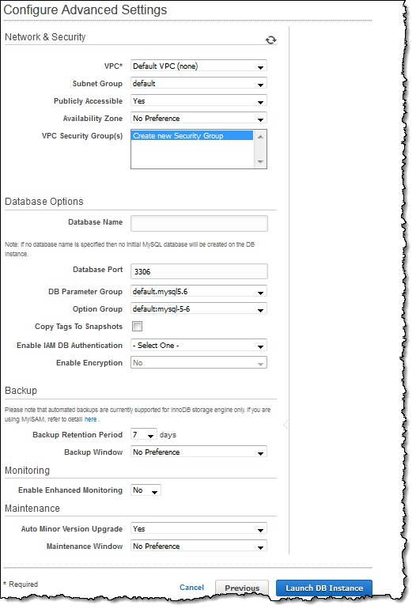
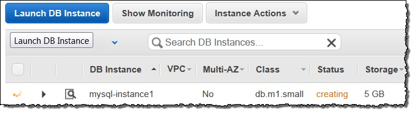
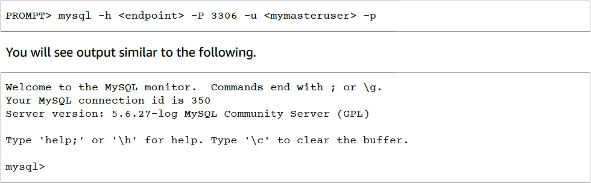

# Getting Started with Amazon RDS

En esta sección se muestra cómo crear y conectarse a una instancia de BD utilizando Amazon RDS. Usted puede crear,o lanzar, una instancia de DB que utiliza MySQL, Oracle, PostgreSQL, Microsoft SQL Server, Amazon Aurora o MariaDB.

*IMPORTANTE*   
Debe completar las tareas en la sección Configuración de Amazon RDS antes de crear o conectarse a una instancia de DB.

Crear una instancia de DB y conectarse a una base de datos en una instancia de DB es ligeramente diferente para cada uno de los motores DB; elija el motor de base de datos inferior que desea utilizar para obtener información detallada sobre la creación y conectarse a la instancia de DB. Después de haber creado y conectado a su instancia de DB, hay instrucciones para ayudarle a eliminar la instancia de la base de datos.

*TEMAS*

* Creación de un clúster de bases de datos y conexión a una base de datos en una instancia de Amazon Aurora DB 
* Creación de una instancia de MariaDB DB y conexión a una base de datos en una instancia de MariaDB DB 
* Creación de una instancia de BD de Microsoft SQL Server y conexión a una instancia de base de datos 
* Creación de una instancia de MySQL DB y conexión a una base de datos en una instancia de MySQL DB 
* Creación de una instancia de Oracle DB y conexión a una base de datos en una instancia de Oracle DB 
* Creación de una instancia de DB de PostgreSQL y conexión a una base de datos en un DB de PostgreSQL Instancia 
* Tutorial: Crear un servidor web y una base de datos Amazon RDS 

## Creating a MySQL DB Instance and Connecting to a Database on a MySQL DB Instance

La forma más sencilla de crear una instancia de base de datos es utilizar AWS Management Console. Una vez que haya creado la instancia de DB, puede utilizar las utilidades estándar de MySQL como MySQL Workbench para conectarse a una base de datos en la instancia de DB.

*TEMAS*
* Creación de una instancia de base de datos MySQL 
* Conexión a una base de datos en una instancia de DB Ejecución del motor de base de datos MySQL 
* Eliminación de una instancia de DB

## Creating a MySQL DB Instance
El elemento básico de Amazon RDS es la instancia de DB. Este es el entorno en el que se ejecutará sus bases de datos MySQL.   
En este ejemplo, se crea una instancia de base de datos que ejecuta el motor de base de datos MySQL denominado west2-mysqlinstance1, con una clase de instancia de DB db.m1.small, 5 GB de almacenamiento y respaldos automáticos habilitados con un período de retención de un día.   
**Para crear una instancia de MySQL DB**
1. Inicie sesión en AWS Management Console y abra la consola Amazon RDS en [CONSOLE](https://console.aws.amazon.com/rds/).
2. En la esquina superior derecha de la consola Amazon RDS, elija la región en la que desea crear la instancia de DB.
3. En el panel de navegación, seleccione **Instances**.
4. Seleccione **Launch DB Instance**. Se abrirá el Asistente para instancias de DB en la página de inicio **Select Engine** .
 
5. En la página Select Engine, elija el icono de MySQL y, a continuación, seleccione **Select** para el DB de MySQL .
6. En la página Especificar detalles de la base de datos, especifique la información de la instancia de la base de datos. La siguiente tabla muestra para una instancia de ejemplo de base de datos. Cuando los ajustes sean como los desea, seleccione **Siguiente**. 

| For This Parameter | Do This |
| --- | --- |
| Licence Modes | Choose the default, general-public-license, to use the general license agreement for MySQL. MySQL has only one license model. |
| DB Engine Version | Choose the default version of MySQL. Note that Amazon RDS supports multiple versions of MySQL in some regions. |
| DB Instance Class | Choose db.m1.small for a configuration that equates to 1.7 GB memory, 1 ECU (1 virtual core with 1 ECU), 64-bit platform, and moderate I/O capacity. |
| Multi-AZ Deployment | Choose Yes to have a standby replica of your DB instance created in another Availability Zone for failover support. We recommend Multi-AZ for production workloads to maintain high availability. For development and testing,you can choose No. |
| Allocated Storage | Type 5 to allocate 5 GB of storage for your database. In some cases, allocating a higher amount of storage for your DB instance than the size of your database can improve I/O performance. |
| Storage Type | Choose the storage type Magnetic. |
| DB Instance Identifier | Type a name for the DB instance that is unique for your account in the region you chose. You can add some intelligence to the name, such as including the region and DB engine you chose, for example west2-mysqlinstance1. |
| Master Username | Type a name using alphanumeric characters that you will use as the master user name to log on to your DB instance. This will be the user name you use to log on to your database on the DB instance for the first time. |
| Master Password and Confirm Password | Type a password that contains from 8 to 41 printable ASCII characters (excluding /,", and @) for your master user password. This will be the password you will use when you use the user name to log on to your database. Then type the password again in the Confirm Password box. |

 

7. En la página **Configure Advanced Settings**, proporcione información adicional que necesita RDS iniciar la instancia de MySQL DB. La tabla muestra la configuración de una instancia de ejemplo de base de datos. Especifica tu Información de la instancia de base de datos y, a continuación, seleccione Iniciar instancia de base de datos.

| For This Parameter | Do This |
| --- | --- |
| VPC | Choose the name of the Amazon Virtual Private Cloud (VPC) that will host your MySQL DB instance. If your DB instance will not be hosted in a VPC, choose Not in VPC. |
| Availability Zone | Determine if you want to specify a particular Availability Zone. If you chose Yes for the Multi-AZ Deployment parameter on the previous page, you will not have any options here |
| DB Security Groups | Choose the security group you want to use with this DB instance. |
| Database Name | Type a name for your default database that is 1 to 64 alpha-numeric characters. If you do not provide a name, Amazon RDS will not automatically create a database on the DB instance you are creating. To create additional databases, connect to the DB instance and use the SQL command CREATE DATABASE. |
| Database Port | Leave the default value of **3306** unless you have a specific port you want to access the database through. MySQL installations default to port 3306. |
| DB Parameter Group | Leave the default value unless you created your own DB parameter group. |
| Option Group | Choose the default value because this option group is used with the MySQL version you chose on the previous page. |
| Copy Tags To Snapshots | Choose this option to have any DB instance tags copied to a DB snapshot when you create a snapshot. |
| Enable Encryption | Choose **Yes** to enable encryption at rest for this DB instance. |
| Backup Retention Period | Set the number of days you want automatic backups of your database to be retained. For testing purposes, you can set this value to **1**. |
| Backup Window | Unless you have a specific time that you want to have your database backup, use the default of **No Preference**. |
| Enable Enhanced Monitoring | Unless you want to enable gathering metrics in real time for the operating system that your DB instance runs on, use the default of **No**. |
| Auto Minor Version Upgrade |Choose **Yes** to enable your DB instance to receive minor DB engine version upgrades automatically when they become available |
| Maintenance Window |Choose the 30 minute window in which pending modifications to your DB instance are applied. If the time period doesn't matter, choose **No Preference** |
|

8. En la consola RDS, la nueva instancia de DB aparece en la lista de instancias de la base de datos. La instancia de DB tienen un estado de creación hasta que la instancia de DB se crea y está lista para su uso. Cuando el estado cambia a disponible, puede conectarse a una base de datos en la instancia de DB. Dependiendo de la clase de instancia de DB y el almacén asignado, podría tomar varios minutos para que la nueva DB instancia esté disponible.

 

## Connecting to a Database on a DB Instance Running the MySQL Database Engine

Una vez que Amazon RDS provee su instancia de DB, puede usar cualquier aplicación de cliente SQL estándar para conecte a una base de datos en la instancia de la base de datos. En este ejemplo, se conecta a una base de datos en un DB de MySQL instancia usando comandos de monitor MySQL. Una aplicación basada en GUI que puede utilizar para conectarse es MySQL Banco de trabajo. Para obtener más información, vaya a la página Descargar MySQL Workbench.   
Para más información en el uso de MySQL, vaya a la documentación de MySQL.

**Para conectarse a una base de datos en una instancia de DB utilizando el monitor MySQL**   
Escriba el comando siguiente en un símbolo del sistema en un equipo cliente para conectarse a una base de datos en una instancia de MySQL DB utilizando el monitor MySQL. Sustituya el nombre DNS de su instancia de base de datos para *endpoint*, el nombre de usuario principal que utilizó para *mymasteruser* y la contraseña maestra utilizado para *password*.  

## Deleting a DB Instance

Una vez que se haya conectado a la instancia de ejemplo de DB que creó, debe eliminar la instancia de la base de datos por lo que ya no se cobran por ello.  
**Para eliminar una instancia de la base de datos sin una instantánea final de la base de datos**
1. Inicie sesión en AWS Management Console y abra la consola Amazon RDS en [console](https://console.aws.amazon.com/rds/).
2. En la lista Instancias, seleccione la instancia de DB que desea eliminar.
3. Seleccione **Instances Action** y elija **Delete** en el menú desplegable.
4. Seleccione **No** en la pantalla **Create final Snapshot?**. cuadro de lista desplegable.
5. Seleccione **Yes, Delete.**.

