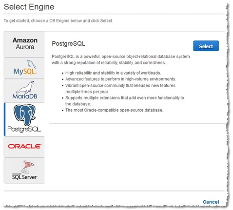
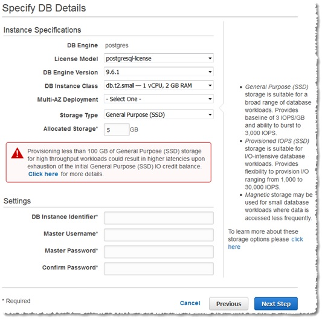
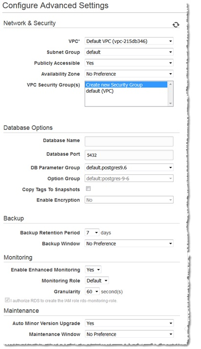
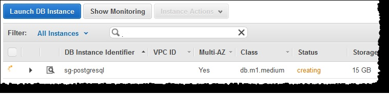
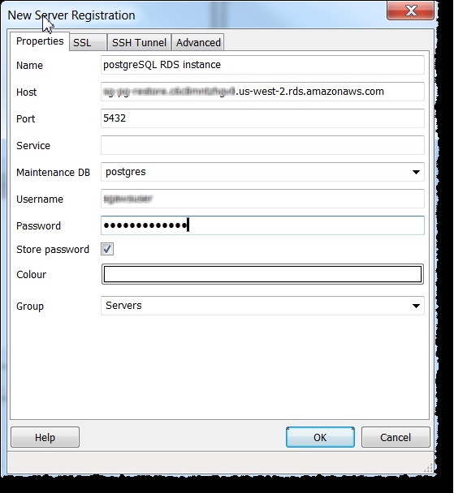
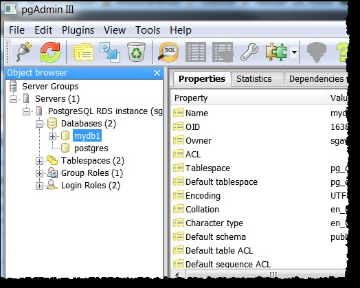
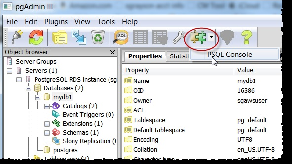

# Creating a PostgreSQL DB Instance and Connecting to a Database on a PostgreSQL DB Instance   
La forma más fácil de crear una instancia de DB es utilizar la consola RDS. Una vez creado el DB Por ejemplo, puede utilizar las utilidades de cliente SQL estándar para conectarse a la instancia de DB, como pgAdmin. En este ejemplo, se crea una instancia de base de datos que ejecuta el motor de base de datos PostgreSQL denominado west2- postgres1, con una clase de instancia de DB db.m1.small, 10 GB de almacenamiento y respaldos automatizados habilitados con un período de retención de un día.

*Importante*  
Debe completar las tareas en la sección Configuración de Amazon RDS para crear o conectarse a una instancia de DB.

*TEMAS*

* Creating a PostgreSQL DB Instance
* Connecting to a PostgreSQL DB Instance
* Deleting a DB Instance

## Creating a PostgreSQL DB Instance

*To create a DB Instance Running the PostgreSQL DB Engine*
1. Sign in to the AWS Management Console and open the Amazon RDS console at [https://console.aws.amazon.com/rds/](https://console.aws.amazon.com/rds/).
2. In the top right corner of the AWS Management Console, choose the region in which you want to
create the DB instance.
3. In the navigation pane, choose **Instances**.
4. Choose **Launch DB Instance** to start the **Launch DB Instance Wizard**.  
The wizard opens on the **Select Engine** page.   

5. On the **Select Engine page**, choose the PostgreSQL icon, and then choose **Select**.
6. Next, **the Production?** page asks if you are planning to use the DB instance you are creating for
production. If you are, choose **PostgreSQL** under **Production**. If you choose this option, the failover
option **Multi-AZ** and the **Provisioned IOPS** storage option will be preselected in the following step.
Choose **Next Step** when you are finished.
7. On the **Specify DB Details** page, specify your DB instance information. Choose **Next Step** when you
are finished.   

8. On the **Configure Advanced Settings** page, provide additional information that RDS needs to
launch the PostgreSQL DB instance. The table shows settings for an example DB instance. Specify
your DB instance information, then choose **Launch DB Instance**.   

9. On the final page of the wizard, choose **View Your DB Instances**.   
10. On the Amazon RDS console, the new DB instance appears in the list of DB instances. The DB
instance will have a status of **creating** until the DB instance is created and ready for use. When the
state changes to **available**, you can connect to the DB instance. Depending on the DB instance class
and store allocated, it could take several minutes for the new instance to be available.

## Connecting to a PostgreSQL DB Instance

Después de que Amazon RDS provee su instancia de DB, puede usar cualquier aplicación de cliente SQL estándar para
conecte a la instancia. Es importante tener en cuenta que el grupo de seguridad asignado a la instancia de la base de datos
cuando se creó debe permitir el acceso a la instancia de DB. Si tiene dificultades para conectarse al DB
Por ejemplo, el problema es más a menudo con las reglas de acceso que ha configurado en el grupo de seguridad asignado a
la instancia de DB.

Esta sección muestra dos formas de conectarse a una instancia de DB de PostgreSQL. El primer ejemplo utiliza pgAdmin, un
popular herramienta de administración y desarrollo de código abierto para PostgreSQL. Puede descargar y usar
pgAdmin sin tener una instancia local de PostgreSQL en su equipo cliente. El segundo ejemplo
utiliza psql, una utilidad de línea de comandos que forma parte de una instalación de PostgreSQL. Para usar psql, debe tener un
PostgreSQL instalado en su equipo cliente o haber instalado el cliente psql en su máquina.

En este ejemplo, se conecta a una instancia de DB de PostgreSQL utilizando pgAdmin.

### Using pgAdmin to Connect to a PostgreSQL DB Instance

**To connect to a PostgreSQL DB instance using pgAdmin**

1. Inicie la aplicación pgAdmin en su equipo cliente. Puede instalar pgAdmin desde [http: //www.pgadmin.org/](http://www.pgadmin.org/).
2. Seleccione **Add Server** en el menú **File**.
3. En el cuadro de diálogo **New Server Registration**, escriba el punto final de la instancia de la base de datos (por ejemplo,
mypostgresql.c6c8dntfzzhgv0.us-west-2.rds.amazonaws.com) en el cuadro **Host**. No incluya el dos puntos o número de puerto como se muestra en la consola RDS de Amazon (mypostgresql.c6c8dntfzzhgv0.uswest-2.rds.amazonaws.com:543).    
Introduzca el puerto que asignó a la instancia de DB en el cuadro **Port**. Introduzca el nombre de usuario y la contraseña que ingresó cuando creó la instancia de DB en los cuadros **Username** y **Password**, respectivamente.  

4. Seleccione **OK**.
5. En el explorador de objetos, expanda **Server Groups**. Elija el servidor (la instancia de base de datos) que creó, y luego elija el nombre de la base de datos.  

6. Elija el icono del complemento y elija **PSQL Console**. Se abre la ventana de comandos de psql para el valor predeterminado base de datos que creó.  

7. Utilice la ventana de comandos para introducir comandos SQL o psql. Escriba \ q para cerrar la ventana.

