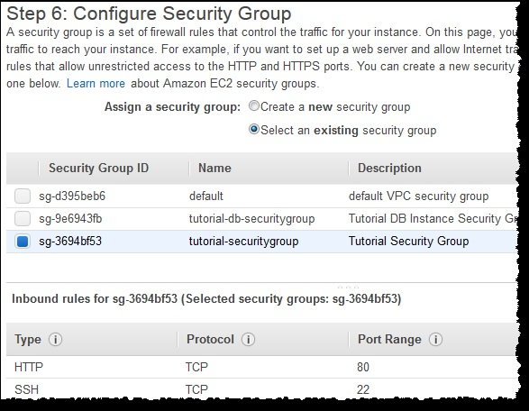

# Tutorial: Create a Web Server and an Amazon RDS Database

Este tutorial le ayuda a instalar un servidor web Apache con PHP y crear una base de datos MySQL. La web servidor se ejecuta en una instancia de Amazon EC2 utilizando Amazon Linux, y la base de datos MySQL es un Amazon RDS Instancia de MySQL DB. Tanto la instancia de Amazon EC2 como la instancia de Amazon RDS DB se ejecutan en una base VPC en Amazon Virtual Private Cloud servicio (Amazon VPC).

Nota   
Este tutorial funciona con Amazon Linux y puede que no funcione para otras versiones de Linux como Ubuntu.

Antes de comenzar este tutorial, debe tener un VPC con subredes públicas y privadas, y grupos de seguridad correspondientes. Si no los tiene, complete el siguiente tutorial:Crear un VPC de Amazon para Uso con una instancia de Amazon RDS DB (página 407).

En este tutorial, realiza los siguientes procedimientos:
* Step 1: Create an RDS DB Instance
* Step 2: Create an EC2 Instance and Install a Web Server

## Step 1: Create an RDS DB Instance
En este paso se crea una instancia de Amazon RDS MySQL DB que mantiene los datos utilizados por una web application.

Nota  
Antes de comenzar este paso, debe tener un VPC con subredes públicas y privadas y grupos de seguridad correspondientes. Si no las tiene, consulte Tutorial: Crear un VPC de Amazon para Uso con una instancia de Amazon RDS DB (página 407).

**To launch a MySQL DB instance**
1. Sign in to the AWS Management Console and open the Amazon RDS console at https://
console.aws.amazon.com/rds/.
2. In the top-right corner of the AWS Management Console, choose the region in which you want to
create the DB instance. This example uses the US West (Oregon) region.
3. Choose Instances.
4. Choose Launch DB Instance.
5. On the Select Engine page, shown following, choose the MySQL DB engine, and then choose Select.  

6. On the Production page, below Dev/Test, choose MySQL This instance is intended for use outside
of production, and then choose Next Step.
7. On the Specify DB Details page, shown following, set these values:
* DB Engine Version: Use the default value.
* DB Instance Class: db.t2.micro
* Multi-AZ Deployment: No
* Storage Type: Magnetic
* Allocated Storage: 50 GB
* DB Instance Identifier: tutorial-db-instance
* Master Username: tutorial_user
* Master Password: Choose a password.
* Confirm Password: Retype the password.

8. Choose Next Step and set the following values in the Configure Advanced Settings page, shown
following:
* VPC: Choose an existing VPC, for example tutorial-vpc (vpc-f1b76594)
* Subnet group: Create a new DB Subnet Group
* Publicly Accessible: No
* Availability Zone: No Preference
* VPC Security Group(s): Choose an existing security group, for example tutorial-dbsecuritygroup
* Database Name: sample  

9. To create your Amazon RDS MySQL DB instance, choose Launch DB Instance.
10. On the next page, choose View Your DB Instances to view your RDS MySQL DB instance.
11. Wait for the status of your new DB instance to show as available. Then choose the selection box to
the left of your DB instance to display the DB instance details, shown following.

Anote el endpoint de su instancia de base de datos. Este endpoint muestra el nombre del servidor y el puerto que que utiliza para conectar su servidor web a su instancia de RDS DB.
Para asegurarse de que su instancia de RDS MySQL DB sea lo más segura posible, verifique que las fuentes externas al VPC no puede conectarse a su instancia de RDS MySQL DB.

**Next Step**  
Step 2: Create an EC2 Instance and Install a Web Server (p. 69)

## Step 2: Create an EC2 Instance and Install a Web Server
In this step you create a web server to connect to the Amazon RDS DB instance that you created in Step
1: Create an RDS DB Instance (p. 65).
### Launch an EC2 Instance
First you create an Amazon EC2 instance in the public subnet of your VPC.
To launch an EC2 instance
1. Sign in to the AWS Management Console and open the Amazon EC2 console at [https://console.aws.amazon.com/ec2/](https://console.aws.amazon.com/ec2/).
2. Choose EC2 Dashboard, and then choose Launch Instance, as shown following.

3. Choose the Amazon Linux Amazon Machine Image (AMI), as shown following.

4. Choose the t2.micro instance type, as shown following, and then choose Next: Configure Instance
Details.

5. On the Configure Instance Details page, shown following, set these values and leave the other
values as their defaults:
* Network: Choose an existing VPC, for example: vpc-f1b76594 (10.0.0.0/16) | tutorial-vpc
* Subnet: Choose an existing public subnet, for example: subnet-fe2adba7(10.0.0.0/24)|
Tutorial-public | us-west-2a
* Auto-assign Public IP: Enable  

6. Choose Next: Add Storage.
7. On the Add Storage page, leave the default values and choose Next: Tag Instance.
8. On the Tag Instance page, shown following, set Value for the Name tag to tutorial-web-server, and
then choose Next: Configure Security Group. 

9. On the Configure Security Group page, shown following, choose Select an existing security group,
and then choose an existing security group, for example: tutorial-securitygroup. The security
group must include inbound rules for SSH and HTTP access.  

10. Choose Review and Launch
11. On the Review Instance Launch page, shown following, verify your settings and then choose
Launch.

12. On the Select an existing key pair or create a new key pair page, shown following, choose Create
a new key pair and set Key pair name to tutorial-key-pair. Choose Download Key Pair, and
then save the key pair file on your local machine. You use this key pair file to connect to your EC2
instance.

13. To launch your EC2 instance, choose Launch Instances. On the Launch Status page, shown
following, note the identifier for your new EC2 instance, for example: i-7abfcfb8.

14. To find your instance, choose View Instances.
15. Wait until Instance Status for your instance reads as running before continuing.

## Install an Apache web server with PHP
A continuación, se conecta a la instancia de EC2 e instala el servidor web.
Para conectarse a la instancia de EC2 e instalar el servidor web Apache con PHP
1. Para conectarse a la instancia de EC2 que creó anteriormente, siga los pasos de Conectar a su instancia.
2. Para obtener las últimas correcciones de errores y actualizaciones de seguridad, actualice el software en su instancia de EC2 utilizando el siguiente comando:  
Nota  
La opción -y instala las actualizaciones sin pedir confirmación. Para examinar actualizaciones antes de instalar, omita esta opción.  

    [ec2-user ~]$ sudo yum update –y

3. Una vez completadas las actualizaciones, instale el servidor web Apache con el paquete de software PHP
yum install, que instala varios paquetes de software y dependencias relacionadas en el
Mismo tiempo:  

    [ec2-user ~]$ sudo yum install -y httpd24 php56 php56-mysqlnd

4. Inicie el servidor web con el comando que se muestra a continuación:  

    [ec2-user ~]$ sudo service httpd start  

    Puede probar que su servidor web está instalado y iniciado correctamente introduciendo el nombre DNS público de la instancia de EC2 en la barra de direcciones de un navegador web, por ejemplo:**http://ec2-42-8-168-21.uswest-1.compute.amazonaws.com.**
    Si su servidor web se está ejecutando, verá la prueba de Apache página. Si no ve la página de prueba de Apache, compruebe que sus reglas de entrada para el VPC grupo de seguridad que creó en Tutorial: Cree un VPC de Amazon para su uso con un Amazon RDS La instancia DB (p. 407) incluye una regla que permite el acceso HTTP (puerto 80) para la dirección IP que utiliza conectarse al servidor web.  
        Nota   
        La página de prueba de Apache aparece sólo cuando no hay contenido en la raíz del documento directorio, / var / www / html. Después de agregar contenido al directorio raíz del documento, el contenido aparece en la dirección DNS pública de su instancia de EC2 en lugar de la prueba de Apache página.
5. Configure el servidor web para iniciar con cada inicio del sistema utilizando el comando chkconfig:

    [ec2-user ~]$ sudo chkconfig httpd on  

    Para permitir que el usuario ec2 administre archivos en el directorio raíz por defecto de su servidor web Apache, deberá modifique la propiedad y los permisos del directorio / var / www. En este tutorial, agrega un grupo llamado www a su instancia de EC2, y luego le da esa propiedad de grupo del directorio / var / www y agregue escritura para el grupo. Cualquier miembro de ese grupo puede agregar, eliminar y modificar archivos para el servidor web.

**To set file permissions for the Apache web server**  
1. Add the www group to your EC2 instance with the following command:  

    [ec2-user ~]$ sudo groupadd www

2. Add the ec2-user user to the www group:  

    [ec2-user ~]$ sudo usermod -a -G www ec2-user

3. To refresh your permissions and include the new www group, log out:  

    [ec2-user ~]$ exit

4. Log back in again and verify that the www group exists with the groups command:  

    [ec2-user ~]$ groups
ec2-user wheel www

5. Change the group ownership of the /var/www directory and its contents to the www group:  

    [ec2-user ~]$ sudo chown -R root:www /var/www

6. Change the directory permissions of /var/www and its subdirectories to add group write permissions
and set the group ID on subdirectories created in the future:  

    [ec2-user ~]$ sudo chmod 2775 /var/www  
    [ec2-user ~]$ find /var/www -type d -exec sudo chmod 2775 {} +

7. Recursively change the permissions for files in the /var/www directory and its subdirectories to add
group write permissions:  

    [ec2-user ~]$ find /var/www -type f -exec sudo chmod 0664 {} +  
## Connect your Apache web server to your RDS DB instance
Next, you add content to your Apache web server that connects to your Amazon RDS DB instance.
To add content to the Apache web server that connects to your RDS DB instance
1. While still connected to your EC2 instance, change the directory to /var/www and create a new
subdirectory named inc:    

    [ec2-user ~]$ cd /var/www  
    [ec2-user ~]$ mkdir inc  
    [ec2-user ~]$ cd inc  

2. Create a new file in the inc directory named dbinfo.inc, and then edit the file by calling nano (or
the editor of your choice).   

    [ec2-user ~]$ >dbinfo.inc   
    [ec2-user ~]$ nano dbinfo.inc   

3. Add the following contents to the dbinfo.inc file, where endpoint is the endpoint of your RDS
MySQL DB instance, without the port, and master password is the master password for your RDS
MySQL DB instance.  
Note  
Placing the user name and password information in a folder that is not part of the
document root for your web server reduces the possibility of your security information
being exposed.

*<?php  
define('DB_SERVER', 'endpoint');  
define('DB_USERNAME', 'tutorial_user');  
define('DB_PASSWORD', 'master password');  
define('DB_DATABASE', 'sample');  
?>*

4. Save and close the dbinfo.inc file.
5. Change the directory to /var/www/html:  

    [ec2-user ~]$ cd /var/www/html

6. Create a new file in the html directory named SamplePage.php, and then edit the file by calling nano
(or the editor of your choice).  

    [ec2-user ~]$ >SamplePage.php   
    [ec2-user ~]$ nano SamplePage.php  

7. Add the following contents to the SamplePage.php file:  
Note  
Placing the user name and password information in a folder that is not part of the
document root for your web server reduces the possibility of your security information
being exposed.  

8. Save and close the SamplePage.php file.
9. Verify that your web server successfully connects to your RDS MySQL DB instance by opening a web
browser and browsing to *http://**EC2 instance endpoint**/SamplePage.php*, for example: *http://
ec2-55-122-41-31.us-west-2.compute.amazonaws.com/SamplePage.php.*

You can use SamplePage.php to add data to your RDS MySQL DB instance. The data that you add is then
displayed on the page.

To make sure your RDS MySQL DB instance is as secure as possible, verify that sources outside of the VPC
cannot connect to your RDS MySQL DB instance.

