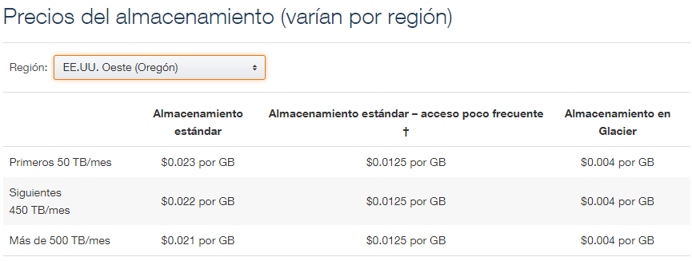

| [< Anterior](.\20170807_AWS_S3.md) | [Siguiente >](.\AWS_S3_Parte_3.md)

---
## Acerca de los datos
---
### S3 Storage Classes
Amazon S3 ofrece varios tipos de almacenamiento diseñados para distintos casos de uso:
* **Amazon S3 Standard**: almacenamiento de datos de uso general, a los que se accede en forma frecuente. Ofrece alta durabilidad, disponibilidad y desempeño, y baja latencia.
Casos de uso: aplicaciones en la nube, sitios web dinámicos, distribución de contenidos, aplicaciones móviles y de juegos, y el análisis de big data.

* **Amazon S3 Standard Acceso Poco Frecuente (Standad-IA)**: almacenamiento para datos de larga duración, a los que se accede con poca frecuencia, pero que requieren un acceso rápido cuando es necesario. Alta durabilidad, alto desempeño y baja latencia, con menor disponibilidad. Tiene costos asociados con la recuperación de datos por GB.
Casos de uso: almacenamiento a largo plazo, backups, almacén de datos para la recuperación de desastres.

* **Amazon S3 Reduced Redundancy (RSS)**: almacenamiento para datos de larga duración, a los que se accede con menos frecuencia, que no resulten de vital importancia y puedan ser reproducibles. Ofrece menor durabilidad, dado que no replica los objetos tantas veces como la clase Standard.
Casos de uso: distribución o el uso compartido de contenido que está almacenado de una forma resistente en cualquier otra ubicación o para el almacenamiento de miniaturas, contenido multimedia transcodificado o cualquier otro tipo de datos procesados que puedan reproducirse fácilmente.

* **Amazon Glacier**: para el archivado a largo plazo, a los cuales se accede en forma muy poco frecuente, dado que el acceso no es inmediato.
Tiene costos asociados con la recuperación de datos por GB. Proporciona tres opciones de acceso a los archivos, que van desde unos pocos minutos a varias horas, y diferentes costos.
Casos de uso: archivado (*archive*) de datos a largo plazo.

Refs:
* [Tipos de Almacenamiento de Amazon S3](https://aws.amazon.com/es/s3/storage-classes/)
* [Almacenamiento de redundancia reducida](https://aws.amazon.com/es/s3/reduced-redundancy/)


### Durabilidad y Disponibilidad
La durabilidad y disponibilidad de los datos son conceptos diferentes. La **durabilidad** responde a la pregunta *estarán mis datos ahí en el futuro?* Mientras que la **disponibilidad** refiere a la pregunta *puedo acceder a mis datos ahora mismo, o en cualquier momento?*

Amazon S3 ofrece diferentes niveles de disponibilidad y durabilidad, dependiendo del tipo de storage seleccionado (Storage Class).

*Amazon S3 Standard Storage* está diseñado para 99.999999999% de durabilidad y 99.99% de disponibilidad anual. Esto quiere decir, por ejemplo, que si tenemos 10.000 objetos, en promedio podríamos esperar tener una perdida de un único objeto cada 10.000.000 años.

Esto se logra dado que S3 replica automaticamente los datos entre múltiples dispositivos en diferentes ubicaciones dentro de una misma región. Está designado para perder soprota la perdida de datos hasta en dos ubicaciones sin ocacionar perdida real de datos al usuario final.   

### Consistencia de datos
Amazon S3 es un sistema *eventualmente consistente*. Dado que los datos son replicados automaticamente entre múltiples servidores y ubicaciones dentro de una región, los cambios en los datos pueden tomar cierto tiempo en propagarse a todas las ubicaciones. Por lo tanto, en ciertas ocaciones, algunas operaciones pueden devolver datos que no se encuentran actualizados.

Para PUTs a nuevos objetos, esto no es un problema, porque Amazon S3 provee consistencia *read-after-write*. Es decir, que si creamos un nuevo objeto y luego lo leemos, siempre vamos a obtener la última versión.

Sin embargo, para PUTs a objetos existentes (si sobreescribimos un objeto sobre una key existente) y para DELETEs, Amazon S3 provee *consistencia eventual*. Esto significa que si subimos (PUT) datos a una clave existente, y luego intentamos accederlos (GET), podría devolvernos la versión anterior de los datos.En forma similar, si borramos (DELETE) un objeto, y luego intentamos acceder al objeto (GET) podríamos todavía leer los datos del objeto eliminado.

En todos los casos las operaciones son atómicas, es decir, se obtiene el dato o no se obtiene, pero nunca obtendremos datos incosistentes.

Ref: [Amazon S3 Data Consistency Model](http://docs.aws.amazon.com/AmazonS3/latest/dev/Introduction.html#ConsistencyModel)


### Características de las diferentes clases de storage en S3
La siguiente tabla muestra las diferencias entre los diferentes tipos de *Storage Classes* en S3:
 
 


### Precio AWS S3
El precio de AWS S3 depende no solo de la clase de storage que utilicemos, sino también de la región que seleccionemos para nuestros *buckets*.



Algunas regiones pueden no tener ciertas capas de storage, por ej. en el caso de San Pablo (sa-east-1) podemos ver que *Glacier* no está disponible.


Ref: [Precios de AWS S3](https://aws.amazon.com/es/s3/pricing/)


### Mover objetos entre S3 Storage Classes
Los objetos se pueden subir directamente a una determinada *Storage Class*.

Esto lo podemos hacer directamente por línea de comando:

```bash
$ aws s3 ls
2017-08-08 16:33:33 iot-cloud-bucket-1
2017-08-10 21:11:11 iot-cloud-bucket-2

$ aws s3 cp documento1.txt s3://iot-cloud-bucket-2/ --storage-class REDUCED_REDUNDANCY
upload: .\documento1.txt to s3://iot-cloud-bucket-2/documento1.txt

$ aws s3 ls iot-cloud-bucket-2
2017-08-10 21:16:02         34 documento1.txt
```
En el ejemplo anterior estamos subiendo el objeto a la clase de *Reduced Redundancy Storage (RRS)*.
Podemos elegir donde subirlo utilizando las opciones *STANDARD*, *STANDARD_IA*, o *REDUCED_REDUNDANCY*.

Ref: [Sintaxis del comando *aws s3 cp*](http://docs.aws.amazon.com/cli/latest/reference/s3/cp.html)

Pero como sabemos en que clase de storage se encuentra este objeto??
La línea de comando *aws s3* no muestra esta información.
Pero podemos usar la línea de comando invocando a la API de S3 (la cual devuelve el resultado en formato JSON).

```bash
$ aws s3api list-objects --bucket iot-cloud-bucket-2
{
    "Contents": [
        {
            "Key": "documento1.txt",
            "LastModified": "2017-08-11T00:16:02.000Z",
            "ETag": "\"fb4794e7e7bfbffb4630114f236cc02d\"",
            "Size": 34,
            "StorageClass": "REDUCED_REDUNDANCY",
            "Owner": {
                "DisplayName": "fernando.agis",
                "ID": "253b01d45d66119b56bac9fdb06d91f8eb9d0aea9b7f4fbfea1ef963e189cf2d"
            }
        }
    ]
}
```
Mediante la consola web de AWS S3, también podemos especificar la clase de storage donde subimos el objeto:


Y ver a que clase de storage pertenece:


Si el objeto ya se encuentra en S3, podemos cambiarle la *storage class*:

```bash
$ aws s3 cp s3://iot-cloud-bucket-2/documento1.txt s3://iot-cloud-bucket-2/documento1.txt --storage-class STANDARD
copy: s3://iot-cloud-bucket-2/documento1.txt to s3://iot-cloud-bucket-2/documento1.txt
```
Verifique en la consola web o por línea de comando que el objeto *documento1.txt* efectivamente se cambio a la clase de storage *STANDARD* (puede requerir un reload en la consola web).

Y por supuesto que la clase de storage se puede cambiar desde la propia consola web, seleccionando el objeto y modificando sus propiedades:


### Object Metadata
Cada objeto en Amazon S3 tiene un conjunto de pares *clave/valor* que representan su metadata. Esta metadata es almcenada junto con el objeto.

Hay dos categorías de metadata, la **system metadata** contiene información que es mantenida y procesada por Amazon S3. Dentro de ésta, hay cierta metadata que solo puede ser modificada por Amazon (ej. fecha de creación, tamaño del objeto, etc.). Y hay otra porción de la *system metadata* que es controlada por el usuario, por ejemplo, la clase de storage en la cual se encuentra el objeto, o si el objeto está encriptado.

Existe otro tipo de metadata que es la **user metadata**, la cuál es creada (y mantenida) por el usuario y se almacena junto con el objeto. Por ej., podríamos tener varios tipos diferentes de imágenes y denominarlas como *logo*, *foto*, o varios tipos de archivos de texto y denominarlos como *informes*, *logs*, *config-files*, *reportes*, etc., etc.

With the new S3 UI you can set the metadata as part of the upload process, or add it later.

Cuando se crea un objeto se le puede agregar la metadata en el momento que se realiza el *upload*, o la metadata también pueden ser agregada o modificada luego, una vez que el objeto ya se encuentra en S3.


La metadata de sistema se muestra en campos predefinidos. Por ejemplo, *Content-Length* contiene el tamaño del objeto en bytes y no se puede modificar, mientras que  *ContentType* indica el tipo de objeto (image/png,
plain/text) y puede ser modificado.

La metadata de usuario debe ir siempre precedida de *"x-amz-meta-"*. Luego podríamos agregar nuestra información, por ejemplo el tipo de imagen (logo) y la versión de dicha imagen (1.0) del objeto que estoy subiendo. Esta metadata se asigna en forma de clave/valor:
  *x-amz-meta-imagen   logo
   x-amz-meta-version  1.0*

Una vez que el objeto se encuentra en S3, puede verse y modificarse la metada desde las propiedades del objeto:


Si queremos ver la *metadata* que tiene un objeto, podemos hacerlo de la forma anterior mediante la consola web, o podemos hacerlo desde la línea de comando.
Como vimos antes, el comando *s3 ls* lista los objetos, pero no muestra información detallada de los mismo. Para esto, debemos utilizar la *s3api* con la opción de *head-object* que devuelve únicamente la metadata del objeto.

```bash
$ aws s3 ls iot-cloud-bucket-1
2017-08-10 23:40:26          7 Documento-1.rtf
2017-08-10 23:40:20       6317 Planilla-1.xlsx
2017-08-10 23:38:18     794112 conatel.png
2017-08-10 14:03:04       1753 logo.png


$ aws s3api head-object --bucket iot-cloud-bucket-1 --key conatel.png
{
    "AcceptRanges": "bytes",
    "LastModified": "Fri, 11 Aug 2017 02:38:18 GMT",
    "ContentLength": 794112,
    "ETag": "\"c31616a16c736ccabc19781d2a6ba8a0\"",
    "ContentType": "image/png",
    "Metadata": {
        "version": "1.0",
        "imagen": "logo"
    }
}

```

Refs:
[Amazon S3 Object Metadata]( http://docs.aws.amazon.com/es_es/AmazonS3/latest/dev/UsingMetadata.html#object-metadata)
[AWS CLI Command Reference: s3api](http://docs.aws.amazon.com/cli/latest/reference/s3api/index.html)


### Object Tags
Además de los metadatos, los objetos en Amazon S3 también soportan *Tags* (de hecho los tags están disponibles en varios de los servicios de AWS, no solo en S3).

* Cada *tag* es un par de tipo *key/value*.
* La *key* debe ser única dentro del objeto (no pueden estar repetidas) y puede tener hasta 128 caracteres.
* El *value* puede tener hasta 256 caracteres.
* Un objeto puede tener hasta 10 *tags* como máximo

El uso de etiquetas nos permiten no solo categorizar los objetos que almacenamos en S3, sino también modificar el comportamiento de ciertos servicios dependiendo de los tags de los objetos. Esta es uno de los principales beneficios de usar *tags* y una diferencia importante con la *metadata* que no la podemos usar para esto.

Podemos configurar una *policy* en IAM, de forma que permita acceder a los objetos basado en los *tags*.
Por ejemplo, que un usuario pueda (o no) acceder a los objetos de un bucket dependiendo de lo que indique una etiqueta del objeto.

También podemos configuar políticas de ciclo de vida sobre los objetos en base a los *tags* que tengan. Por ejemplo podríamos tener una *lifecycle policy* que mueva a la clase de storage de *Standard IA* todos los objetos del bucket con mas de tres meses de antiguedad que tengan el *tag: tipo=logs* y que a los seis meses los archive en *Glacier*.

Se debe tener en cuenta que ni las etiquetas ni la metadata pueden usarse para "escanear" los objetos. Es decir, no es posible pedirle a S3 una lista de todos los objetos con determinada etiqueta o metadata.

Los *tags* podemos asignarlos al objeto al momento de hacer el upload, o asignarlos/modifcarlos/borrarlos una vez que el objeto ya se encuentra en S3:

Desde la consola web de S3, abra las propiedades de un objeto (hey, ya debería saber como hacer esto!) y agregue algunas tags al mismo:


También pueden asigarse *tags* a los *buckets*, no solo a los objetos.


O por qué no, ya deberíamos poder hacer esto desde la CLI:
```bash
$ aws s3 ls
2017-08-08 16:33:33 iot-cloud-bucket-1
2017-08-10 21:11:11 iot-cloud-bucket-2

$ aws s3api get-bucket-tagging --bucket iot-cloud-bucket-1
{
    "TagSet": [
        {
            "Key": "access",
            "Value": "webadmin"
        }
    ]
}


$ aws s3 ls iot-cloud-bucket-1
2017-08-10 23:40:26          7 Documento-1.rtf
2017-08-10 23:40:20       6317 Planilla-1.xlsx
2017-08-10 23:38:18     794112 conatel.png
2017-08-10 14:03:04       1753 logo.png

$ aws s3api get-object-tagging --bucket iot-cloud-bucket-1 --key conatel.png
{
    "TagSet": [
        {
            "Key": "tipo",
            "Value": "imagen"
        },
        {
            "Key": "aplicacion",
            "Value": "corporate-webpage"
        },
        {
            "Key": "permisos",
            "Value": "webadmin"
        }
    ]
}

```
Obviamente, también puede establecer tags a *buckets/objetos* mediante *aws s3api put-bucket-tagging* y *aws s3api put-object-tagging*.

Nota: Puede utilizar *aws s3api help* para ver la lista de comandos disponibles, y también conocer la sintaxis de cada uno *aws s3api get-bucket-tagging help*, *aws s3api get-object-tagging help* (o también ver la documentación de Amazon).

Refs:
[How do I add Tags to an S3 Object?](http://docs.aws.amazon.com/es_es/AmazonS3/latest/user-guide/add-object-tags.html)
[Amazon S3 Object Tagging](https://docs.aws.amazon.com/AmazonS3/latest/dev/object-tagging.html)
[AWS CLI Command Reference: s3api](http://docs.aws.amazon.com/cli/latest/reference/s3api/index.html)


---
## Lifecycle Rules
---
Amazon S3 ofrece la posibilidad de establecer Políticas de Gestión del Ciclo de Vida de los Datos.
Estas políticas permiten automatizar acciones sobre nuestros datos ante determinadas situacioes o eventos.
Por ejemplo, una política podría ser transferir los datos que tienen mas de tres meses de antiguedad a una capa de almacenamiento de menores características, para poder ahorrar costos.


---
## Folders
---

---
## Versionado
---

---
## Replicación entre Regiones
---


---
## Static Web Pages
---


---
## Seguridad en Amazon S3
---

### Access Controls (ACLs)

### Encryption
* None
* Amazon S3 Master Key
* AWS KMS master-key
34.50

# Aditional Security Features
* Audit Logs
* MULTI-FACTOR AUTHENTICATION DELETE
* TIME-LIMTED ACCESS TO OBJECTS


---
## Amazon Glacier
---

### Throughput omptimisation
