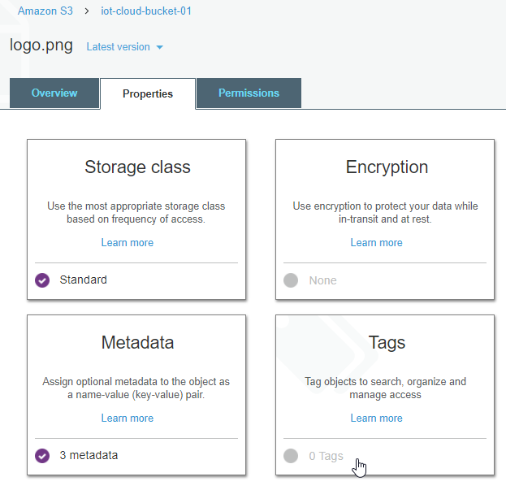
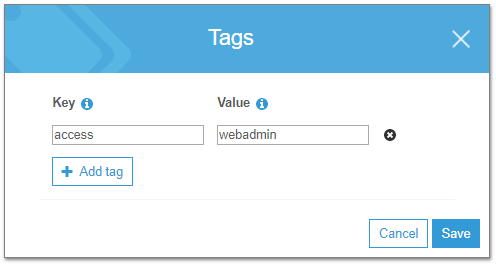
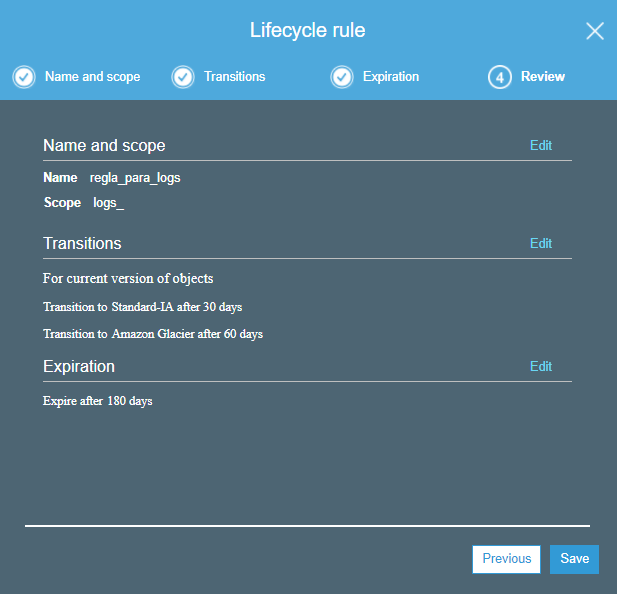
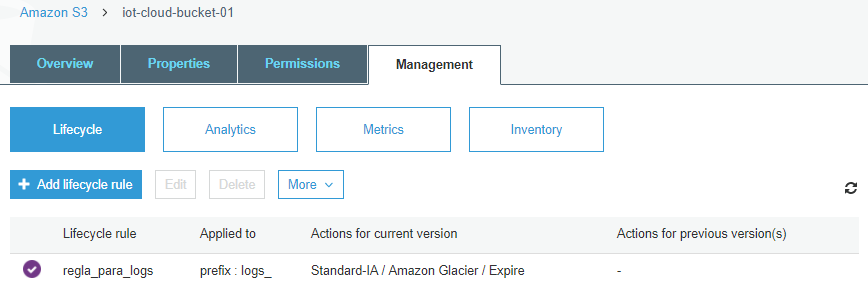
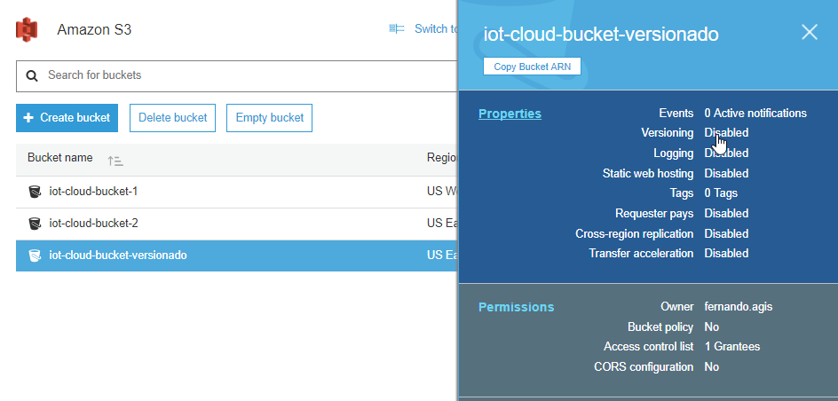
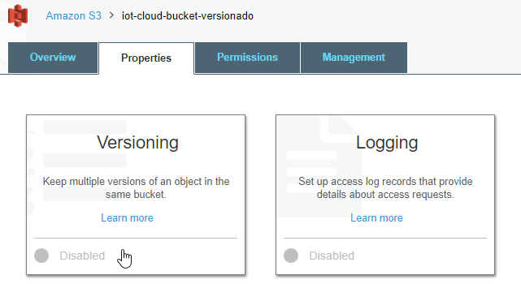
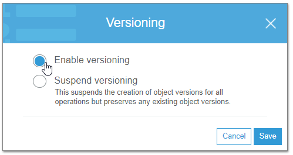

| [< Anterior](.\20170807_AWS_S3.md) | [Siguiente >](.\AWS_S3_Parte_3.md)

---
## Acerca de los datos
---
### S3 Storage Classes
Amazon S3 ofrece varios tipos de almacenamiento diseñados para distintos casos de uso:
* **Amazon S3 Standard**: almacenamiento de datos de uso general, a los que se accede en forma frecuente. Ofrece alta durabilidad, disponibilidad y desempeño, y baja latencia.
Casos de uso: aplicaciones en la nube, sitios web dinámicos, distribución de contenidos, aplicaciones móviles y de juegos, y el análisis de big data.

* **Amazon S3 Standard Acceso Poco Frecuente (Standad-IA)**: almacenamiento para datos de larga duración, a los que se accede con poca frecuencia, pero que requieren un acceso rápido cuando es necesario. Alta durabilidad, alto desempeño y baja latencia, con menor disponibilidad. Tiene costos asociados con la recuperación de datos por GB.
Casos de uso: almacenamiento a largo plazo, backups, almacén de datos para la recuperación de desastres.

* **Amazon S3 Reduced Redundancy (RSS)**: almacenamiento para datos de larga duración, a los que se accede con menos frecuencia, que no resulten de vital importancia y que puedan ser reproducibles. Ofrece menor durabilidad, dado que no replica los objetos tantas veces como la clase Standard.
Casos de uso: distribución o el uso compartido de contenido que está almacenado de una forma resistente en cualquier otra ubicación o para el almacenamiento de miniaturas, contenido multimedia, o cualquier otro tipo de datos procesados que pueda volver a generarse fácilmente.

* **Amazon Glacier**: para el archivado a largo plazo, a los cuales se accede en forma muy poco frecuente, dado que el acceso no es inmediato.
Tiene costos asociados con la recuperación de datos por GB. Proporciona tres opciones de acceso a los archivos, que van desde unos pocos minutos a varias horas, y diferentes costos.
Casos de uso: archivado (*archive*) de datos a largo plazo.

Refs:
* [Tipos de Almacenamiento de Amazon S3](https://aws.amazon.com/es/s3/storage-classes/)
* [Almacenamiento de redundancia reducida](https://aws.amazon.com/es/s3/reduced-redundancy/)


### Durabilidad y Disponibilidad
La durabilidad y disponibilidad de los datos son conceptos diferentes. La **durabilidad** responde a la pregunta *estarán mis datos ahí en el futuro?* Mientras que la **disponibilidad** refiere a la pregunta *puedo acceder a mis datos ahora mismo, o en cualquier momento?*

Amazon S3 ofrece diferentes niveles de disponibilidad y durabilidad, dependiendo del tipo de storage seleccionado (Storage Class).

*Amazon S3 Standard Storage* está diseñado para 99.999999999% de durabilidad y 99.99% de disponibilidad anual. Esto quiere decir, por ejemplo, que si tenemos 10.000 objetos, en promedio podríamos esperar tener una perdida de un único objeto cada 10.000.000 años.

Esto se logra dado que S3 replica automáticamente los datos entre múltiples dispositivos en diferentes ubicaciones dentro de una misma región. Está designado para perder soporta la perdida de datos hasta en dos ubicaciones sin ocasionar pérdida real de datos al usuario final.   

### Consistencia de datos
Amazon S3 es un sistema *eventualmente consistente*. Dado que los datos son replicados automáticamente entre múltiples servidores y ubicaciones dentro de una región, los cambios en los datos pueden tomar cierto tiempo en propagarse a todas las ubicaciones. Por lo tanto, en ciertas ocasiones, algunas operaciones pueden devolver datos que no se encuentran actualizados.

Para PUTs a nuevos objetos, esto no es un problema, porque Amazon S3 provee consistencia *read-after-write*. Es decir, que si creamos un nuevo objeto y luego lo leemos, siempre vamos a obtener la última versión.

Sin embargo, para PUTs a objetos existentes (si sobrescribimos un objeto sobre una key existente) y para DELETEs, Amazon S3 provee *consistencia eventual*. Esto significa que si subimos (PUT) datos a una clave existente, y luego intentamos accederlos (GET), podría devolvernos la versión anterior de los datos.En forma similar, si borramos (DELETE) un objeto, y luego intentamos acceder al objeto (GET) podríamos todavía leer los datos del objeto eliminado.

En todos los casos las operaciones son atómicas, es decir, se obtiene el dato o no se obtiene, pero nunca obtendremos datos inconsistentes.

Ref: [Amazon S3 Data Consistency Model](http://docs.aws.amazon.com/AmazonS3/latest/dev/Introduction.html#ConsistencyModel)


### Características de las diferentes clases de storage en S3
La siguiente tabla muestra las diferencias entre los diferentes tipos de *Storage Classes* en S3:
 
 


### Precios AWS S3
El precio de AWS S3 depende no solo de la clase de storage que utilicemos, sino también de la región que seleccionemos para nuestros *buckets*.


Algunas regiones pueden no tener ciertas capas de storage, por ej. en el caso de San Pablo (sa-east-1) podemos ver que *Glacier* no está disponible.


Ref: [Precios de AWS S3](https://aws.amazon.com/es/s3/pricing/)


### Mover objetos entre S3 Storage Classes
Los objetos se pueden subir directamente a una determinada *Storage Class*.

Esto lo podemos hacer directamente por línea de comando:

```bash
$ aws s3 ls
2017-08-08 16:33:33 iot-cloud-bucket-1
2017-08-10 21:11:11 iot-cloud-bucket-2

$ aws s3 cp documento1.txt s3://iot-cloud-bucket-2/ --storage-class REDUCED_REDUNDANCY
upload: .\documento1.txt to s3://iot-cloud-bucket-2/documento1.txt

$ aws s3 ls iot-cloud-bucket-2
2017-08-10 21:16:02         34 documento1.txt
```
En el ejemplo anterior estamos subiendo el objeto *documento1.txt* de nuesto equipo local hacia S3, y almacenandolo en el tipo de storage *Reduced Redundancy Storage (RRS)*.
Podemos elegir donde subirlo utilizando las opciones *STANDARD*, *STANDARD_IA*, o *REDUCED_REDUNDANCY*.

Ref: [Sintaxis del comando *aws s3 cp*](http://docs.aws.amazon.com/cli/latest/reference/s3/cp.html)

Pero como sabemos en que clase de storage se encuentra este objeto??
La línea de comando *aws s3* no muestra esta información.
Pero podemos usar la línea de comando invocando a la API de S3 (la cual devuelve el resultado en formato JSON).

```bash
$ aws s3api list-objects --bucket iot-cloud-bucket-2
{
    "Contents": [
        {
            "Key": "documento1.txt",
            "LastModified": "2017-08-11T00:16:02.000Z",
            "ETag": "\"fb4794e7e7bfbffb4630114f236cc02d\"",
            "Size": 34,
            "StorageClass": "REDUCED_REDUNDANCY",
            "Owner": {
                "DisplayName": "fernando.agis",
                "ID": "253b01d45d66119b56bac9fdb06d91f8eb9d0aea9b7f4fbfea1ef963e189cf2d"
            }
        }
    ]
}
```
Mediante la consola web de AWS S3, también podemos especificar la clase de storage donde subimos el objeto:


Y ver a que clase de storage pertenece:


Si el objeto ya se encuentra en S3, podemos cambiarle la *storage class*:

```bash
$ aws s3 cp s3://iot-cloud-bucket-2/documento1.txt s3://iot-cloud-bucket-2/documento1.txt --storage-class STANDARD
copy: s3://iot-cloud-bucket-2/documento1.txt to s3://iot-cloud-bucket-2/documento1.txt
```
Verifique en la consola web (o por línea de comando) que el objeto *documento1.txt* efectivamente se cambio a la clase de storage *STANDARD* (puede requerir un reload en la consola web).

Y por supuesto que la clase de storage se puede cambiar desde la propia consola web, seleccionando el objeto y modificando sus propiedades:


### Object Metadata
Cada objeto en Amazon S3 tiene un conjunto de pares *clave/valor* que representan su metadata, y es almacenada junto con el objeto.

Hay dos categorías de metadata, la **system metadata** contiene información que es mantenida y procesada por Amazon S3. Dentro de ésta, hay cierta metadata que solo puede ser modificada por Amazon (ej. fecha de creación, tamaño del objeto, etc.). Y hay otra porción de la *system metadata* que es controlada por el usuario, por ejemplo, la clase de storage en la cual se encuentra el objeto, o si el objeto está encriptado.

Existe otro tipo de metadata que es la **user metadata**, la cuál es creada (y mantenida) por el usuario y se almacena junto con el objeto. Por ej., podríamos tener varios tipos diferentes de imágenes y denominarlas como *logo*, *foto*, o varios tipos de archivos de texto y denominarlos como *informes*, *logs*, *config-files*, *reportes*, etc., etc.

Cuando se crea un objeto se le puede agregar la metadata en el momento que se realiza el *upload*, o la metadata también pueden ser agregada o modificada luego, una vez que el objeto ya se encuentra en S3.


La metadata de sistema se muestra en campos predefinidos. Por ejemplo, *Content-Length* contiene el tamaño del objeto en bytes y no se puede modificar, mientras que  *ContentType* indica el tipo de objeto (image/png,plain/text) y puede ser modificado.

La metadata de usuario debe ir siempre precedida de *"x-amz-meta-"*. Luego podríamos agregar nuestra información, por ejemplo el tipo de imagen (logo) y la versión de dicha imagen (1.0) del objeto que estoy subiendo. Esta metadata se asigna en forma de clave/valor:
  *x-amz-meta-imagen   logo
   x-amz-meta-version  1.0*

Una vez que el objeto se encuentra en S3, puede verse y modificarse la metadata desde las propiedades del objeto:


Si queremos ver la metadata que tiene un objeto, podemos hacerlo de la forma anterior mediante la consola web, o podemos hacerlo desde la línea de comando.
Como vimos antes, el comando *s3 ls* lista los objetos, pero no muestra información detallada de los mismo. Para esto, debemos utilizar la *s3api* con la opción de *head-object* que devuelve únicamente la metadata del objeto.

```bash
$ aws s3 ls iot-cloud-bucket-1
2017-08-10 23:40:26          7 Documento-1.rtf
2017-08-10 23:40:20       6317 Planilla-1.xlsx
2017-08-10 23:38:18     794112 conatel.png
2017-08-10 14:03:04       1753 logo.png


$ aws s3api head-object --bucket iot-cloud-bucket-1 --key conatel.png
{
    "AcceptRanges": "bytes",
    "LastModified": "Fri, 11 Aug 2017 02:38:18 GMT",
    "ContentLength": 794112,
    "ETag": "\"c31616a16c736ccabc19781d2a6ba8a0\"",
    "ContentType": "image/png",
    "Metadata": {
        "version": "1.0",
        "imagen": "logo"
    }
}

```

Refs:
[Amazon S3 Object Metadata]( http://docs.aws.amazon.com/es_es/AmazonS3/latest/dev/UsingMetadata.html#object-metadata)
[AWS CLI Command Reference: s3api](http://docs.aws.amazon.com/cli/latest/reference/s3api/index.html)


### Object Tags
Además de los metadatos, los objetos en Amazon S3 también soportan *Tags* (de hecho los tags están disponibles en varios de los servicios de AWS, no solo en S3).

* Cada *tag* es un par de tipo *key/value*.
* La *key* debe ser única dentro del objeto (no pueden estar repetidas) y puede tener hasta 128 caracteres.
* El *value* puede tener hasta 256 caracteres.
* Un objeto puede tener hasta 10 *tags* como máximo

El uso de etiquetas nos permiten no solo categorizar los objetos que almacenamos en S3, sino también modificar el comportamiento de ciertos servicios dependiendo de los tags de los objetos. Esta es uno de los principales beneficios de usar *tags* y una diferencia importante con la *metadata* que no la podemos usar para esto.

Podemos configurar una *policy* en IAM, de forma que permita acceder a los objetos basado en los *tags*.
Por ejemplo, que un usuario pueda (o no) acceder a los objetos de un bucket dependiendo de lo que indique una etiqueta del objeto.

También podemos configurar políticas de ciclo de vida sobre los objetos en base a los *tags* que tengan. Por ejemplo podríamos tener una *lifecycle policy* que mueva a la clase de storage de *Standard IA* todos los objetos del bucket con mas de tres meses de antiguedad que tengan el *tag: tipo=logs* y que a los seis meses los archive en *Glacier*.

Se debe tener en cuenta que ni las etiquetas ni la metadata pueden usarse para "escanear" los objetos. Es decir, no es posible pedirle a S3 una lista de todos los objetos con determinada etiqueta o metadata.

Los *tags* podemos asignarlos al objeto al momento de hacer el upload, o asignarlos/modificarlos/borrarlos una vez que el objeto ya se encuentra en S3:

Desde la consola web de S3, abra las propiedades de un objeto (hey, ya debería saber como hacer esto!) y agregue algunos tags al mismo:




También pueden asignarse *tags* a los *buckets*, no solo a los objetos:




O por qué no, ya deberíamos poder hacer esto desde la CLI:
```bash
$ aws s3 ls
2017-08-08 16:33:33 iot-cloud-bucket-1
2017-08-10 21:11:11 iot-cloud-bucket-2

$ aws s3api get-bucket-tagging --bucket iot-cloud-bucket-1
{
    "TagSet": [
        {
            "Key": "access",
            "Value": "webadmin"
        }
    ]
}


$ aws s3 ls iot-cloud-bucket-1
2017-08-10 23:40:26          7 Documento-1.rtf
2017-08-10 23:40:20       6317 Planilla-1.xlsx
2017-08-10 23:38:18     794112 conatel.png
2017-08-10 14:03:04       1753 logo.png

$ aws s3api get-object-tagging --bucket iot-cloud-bucket-1 --key conatel.png
{
    "TagSet": [
        {
            "Key": "tipo",
            "Value": "imagen"
        },
        {
            "Key": "aplicacion",
            "Value": "corporate-webpage"
        },
        {
            "Key": "permisos",
            "Value": "webadmin"
        }
    ]
}

```
Obviamente, también se pueden configurar los tags mediante la CLI *aws s3api put-bucket-tagging* y *aws s3api put-object-tagging*.

Nota: Puede utilizar *aws s3api help* para ver la lista de comandos disponibles, y también conocer la sintaxis de cada uno *aws s3api get-bucket-tagging help*, *aws s3api get-object-tagging help* (o también ver la documentación de Amazon).

Refs:
[How do I add Tags to an S3 Object?](http://docs.aws.amazon.com/es_es/AmazonS3/latest/user-guide/add-object-tags.html)
[Amazon S3 Object Tagging](https://docs.aws.amazon.com/AmazonS3/latest/dev/object-tagging.html)
[AWS CLI Command Reference: s3api](http://docs.aws.amazon.com/cli/latest/reference/s3api/index.html)


---
## Lifecycle Policies
---
Amazon S3 ofrece la posibilidad de establecer Políticas de Gestión del Ciclo de Vida de los datos (*lifecycle policies*).

Estas políticas permiten automatizar acciones sobre los objetos de un *bucket*, ante determinadas situaciones o eventos. La configuración se realiza mediante una o más reglas, donde cada regla define una acción que se aplicará a un grupo de objetos. Hay dos tipos de acciones:

***Transition***: mueve los objetos a otra *storage class*. Por ejemplo, podríamos transferir los objetos desde la clase STANDARD a la clase STANDARD_IA (acceso infrecuente) a los 30 días que se crea el objeto, y luego archivarlos en GLACIER al año.

***Expiration:*** elimina los objetos. Por ejemplo, podríamos eliminar en forma automática los objetos cuando lleguen a 5 años de antiguedad.


Las acciones se realizan sobre los *buckets*, por lo cual estas aplicarían a todos los objetos que se encuentren en el mismo. Pero si en un mismo bucket tenemos diferentes tipos de objetos para los cuales queremos especificar diferentes reglas?

Podemos especificar el ***prefix*** sobre el cual aplicar la regla. Por ejemplo, transferir todos los objetos cuyo nombre comiencen con la palabra *"log_"*, o todos los objetos que se encuentren dentro de la carpeta *"application_logs/"*.

En conjunto con el uso de ***Tags*** sobre los buckets/objetos, podemos crear reglas mas específicas, por ejemplo, transferir los objetos que tengan 30 días de antiguedad a la clase STANDARD_IA si tienen un tag *type=log_errores* pero en cambio archivarlos directamente a GLACIER a los 30 días si el tag indica *type=log_mensajes*. No se pueden usar *tags* para la eliminación (expiración) de los objetos.

En conjunto con el uso de ***Versions*** también podemos aplicar acciones sobre las versiones anteriores de los objetos, por ejemplo, archivar todas las versiones de un objeto que tengan mas de 90 días, excepto la versión actual.

Las *lifecycle policies* se crean sobre los *buckets*:


Debemos especificar un nombre de la regla, y en forma opcional podemos por un filtro indicando sobre que *refix* o *tag* aplica la regla, en este caso todos los objetos cuyo nombre comience con *"logs_"*:


Configuramos la regla de *transition*, en este caso movemos los objetos a la capa STANDARD_IA luego de 30 días, y los movemos a GLACIER luego de 60 días:


Configuramos la regla de *expiration*, en este caso vamos a eliminar los objetos luego de 180 días:


Revisamos que todo esté como queremos y creamos la regla.


Ahora podemos ver la regla creada sobre el bucket:



También podemos usar la **CLI**, por ejemplo, para ver la configuración de las *lifecycle policies* creadas para un *bucket*:
```bash
$ aws s3api get-bucket-lifecycle-configuration --bucket iot-cloud-bucket-1
{
    "Rules": [
        {
            "Expiration": {
                "Days": 180
            },
            "ID": "regla_para_logs",
            "Filter": {
                "Prefix": "logs_"
            },
            "Status": "Enabled",
            "Transitions": [
                {
                    "Days": 30,
                    "StorageClass": "STANDARD_IA"
                },
                {
                    "Days": 60,
                    "StorageClass": "GLACIER"
                }
            ]
        }
    ]
}

```

Refs:
[Object Lifecycle Management](
http://docs.aws.amazon.com/es_es/AmazonS3/latest/dev/object-lifecycle-mgmt.html)
[Setting Lifecycle Configuration On a Bucket](http://docs.aws.amazon.com/es_es/AmazonS3/latest/dev/how-to-set-lifecycle-configuration-intro.html)
[Set Lifecycle Configuration Using the AWS CLI](http://docs.aws.amazon.com/es_es/AmazonS3/latest/dev/set-lifecycle-cli.html)

---
## Folders
---

---
## Versionado
---
El versionado ayuda a proteger los datos contra el borrado de los mismos, manteniendo multiples versiones de cada objeto de un bucket, identificándolos mediante un *version ID* único. Permite preservar y recuperar cada una de las versiones del objeto en el *bucket*. Si un usuario modifica o elimina un objeto, puede recuperar la última versión del objeto, referenciando la *version ID*, *bucket* y *object key*.

El versionado se realiza a nivel de *bucket*, y preserva en forma automática todas las copias de los objetos contenidos en el mismo. Incluso mantiene el historial de versiones de los objetos eliminados.
Si borramos un objeto, en lugar de eliminarlo en forma permanente S3 le inserta una marca de borrado, de forma que podemos recuperarlo. Mientras que si sobreescribimos un objeto, se convierte en una nueva versión del objeto en el bucket. Siempre se puede restaurar una versión previa de un objeto.

El versionado está apagado por defecto está apagado, y una vez habilitado no puede ser removido de ese *bucket*, solo puede ser suspendido.

Se debe tener en cuenta que todas las versiones del objeto ocupan espacio en S3, por lo cual podemos incrementar nuestros costos de almacenamiento sensiblemente. Una buena práctica sería utilizar las *lifecycle policies* para eliminar versiones viejas, o moverlas viejas a capas de almacenamiento mas baratas o archivarlas a Glacier.

El versionado se puede habilitar en el momento de crar un *bucket*, o sobre uno ya existente:


---

---

---

---

Ahora bien, probemos de subir un objeto nuevo a este bucket, por ejemplo el *documento1.txt* que tenemos en nuestro equipo:
```bash
$ ls
documento1.txt

$ cat documento1.txt
HOLA MUNDO!!  que original, no?

$ aws s3 cp documento1.txt s3://iot-cloud-bucket-versionado
upload: .\documento1.txt to s3://iot-cloud-bucket-versionado/documento1.txt
```

Modifiquemos en nuestro equipo el contenido del *documento1.txt* (puede hacerlo con un editor/notepad si lo prefiere):
```bash
$ echo "... agrego algo de información al documento 1" >> documento1.txt

$ cat documento1.txt
HOLA MUNDO!!  que original, no?
... agrego algo de información al documento 1
```

Y volvamos a subir el *documento1.txt* al mismo bucket que antes, con lo cual vamos a sobrescribir nuestro objeto:
```bash
$ aws s3 cp documento1.txt s3://iot-cloud-bucket-versionado
upload: .\documento1.txt to s3://iot-cloud-bucket-versionado/documento1.txt
```

Bien, ahora vayamos a la consola web de S3, y veamos el contenido del *iot-cloud-bucket-versionado*.

Lo primero que podemos ver, es que en la parte superior se habilitan las opciones ***All | Deleted objects***, esto nos muestra que ese *bucket* tiene objetos con versiones.


Si seleccionamos el *documento1.txt*, podemos ver en sus propiedades las diferentes versiones del objeto, con sus fechas y la capa de almacenamiento donde se encuentra cada una. También podemos descargar y eliminar una versión del objeto.


Con la **CLI** podemos listar los objetos que se encuentran en nuestro bucket (*s3api list-objects*) y también poder ver las características de las diferentes versiones del archivo (*s3api list-object-vesions*):

```bash
$ aws s3api list-objects --bucket iot-cloud-bucket-versionado
{
    "Contents": [
        {
            "Key": "documento1.txt",
            "LastModified": "2017-08-12T18:51:00.000Z",
            "ETag": "\"17b60662b5e30ea4310aff30dbed84d4\"",
            "Size": 80,
            "StorageClass": "STANDARD",
            "Owner": {
                "DisplayName": "fernando.agis",
                "ID": "253b01d45d66119b56bac9fdb06d91f8eb9d0aea9b7f4fbfea1ef963e189cf2d"
            }
        }
    ]
}

$ aws s3api list-object-versions --bucket iot-cloud-bucket-versionado
{
    "Versions": [
        {
            "ETag": "\"17b60662b5e30ea4310aff30dbed84d4\"",
            "Size": 80,
            "StorageClass": "STANDARD",
            "Key": "documento1.txt",
            "VersionId": "tAGgGywu4OJxi9yJmSP_0gD4BoEYUC.W",
            "IsLatest": true,
            "LastModified": "2017-08-12T18:51:00.000Z",
            "Owner": {
                "DisplayName": "fernando.agis",
                "ID": "253b01d45d66119b56bac9fdb06d91f8eb9d0aea9b7f4fbfea1ef963e189cf2d"
            }
        },
        {
            "ETag": "\"fb4794e7e7bfbffb4630114f236cc02d\"",
            "Size": 34,
            "StorageClass": "STANDARD",
            "Key": "documento1.txt",
            "VersionId": "MAXk_3S16eekgokeIqrIM5IaKJlAKFkV",
            "IsLatest": false,
            "LastModified": "2017-08-12T18:32:15.000Z",
            "Owner": {
                "DisplayName": "fernando.agis",
                "ID": "253b01d45d66119b56bac9fdb06d91f8eb9d0aea9b7f4fbfea1ef963e189cf2d"
            }
        }
    ]
}
```

Probemos de bajar el archivo *documento1.txt"*. Si lo bajamos como siempre, vamos a obtener la última versión que tiene los cambios que habíamos realizado.

```bash
$ aws s3 cp s3://iot-cloud-bucket-versionado/documento1.txt documento1-actual.txt
download: s3://iot-cloud-bucket-versionado/documento1.txt to .\documento1-actual.txt

$ cat documento1-actual.txt
HOLA MUNDO!!  que original, no? :P
... agrego algo de información al documento 1
```

Si queremos obtener la versión anterior, debemos referenciar al *VersionId* correspondiente. La podemos ver mas arriba, cuando listamos las versiones del objeto: *"VersionId": "MAXk_3S16eekgokeIqrIM5IaKJlAKFkV"*.
Bajemos el archivo pero con otro nombre *documento1-old.txt*, para poder ver su contenido.

```bash
$ aws s3api get-object --bucket iot-cloud-bucket-versionado --key documento1.txt --version-id MAXk_3S16eekgokeIqrIM5IaKJlAKFkV documento1-old.txt
{
    "AcceptRanges": "bytes",
    "LastModified": "Sat, 12 Aug 2017 18:32:15 GMT",
    "ContentLength": 34,
    "ETag": "\"fb4794e7e7bfbffb4630114f236cc02d\"",
    "VersionId": "MAXk_3S16eekgokeIqrIM5IaKJlAKFkV",
    "ContentType": "text/plain",
    "Metadata": {}
}

$ cat documento1-old.txt
HOLA MUNDO!!  que original, no? :P
```

Que pasa si borramos el objeto?
Probemos de borrar el *documento1.txt* (ya debería saber como hacer esto).
Si vamos a la consola web podemos ver la lista de objetos borrados incluyendo sus versiones:


Y podemos o bien descargarlo o hacer un *Undo delete*.


Refs:
[Using Versioning](http://docs.aws.amazon.com/es_es/AmazonS3/latest/dev/Versioning.html)
[Managing Objects in a Versioning-Enabled Bucket](http://docs.aws.amazon.com/es_es/AmazonS3/latest/dev/manage-objects-versioned-bucket.html)
[AWS CLI Command Reference: s3api](http://docs.aws.amazon.com/cli/latest/reference/s3api/index.html)


---
## Replicación entre Regiones
---
La replicación entre regiones es una característica de Amazon S3 que replica datos automáticamente entre diferentes regiones de AWS. Con las réplicas entre diferentes regiones, cada objeto que se cargue en un bucket de S3 se replica automáticamente en otro bucket situado en otra región de AWS que usted elija. Usted paga los cargos de Amazon S3 por almacenamiento, solicitudes y transferencia de datos entre regiones de la copia replicada de datos además de los cargos de almacenamiento de la copia principal. El precio de la copia replicada del almacenamiento de información se basa en la región de destino, mientras que los precios de las solicitudes y la transferencia de datos entre regiones se basan en la región de origen.

---
## Static Web Pages
---


---
## Seguridad en Amazon S3
---

### Access Controls (ACLs)

### Encryption
* None
* Amazon S3 Master Key
* AWS KMS master-key
34.50

# Aditional Security Features
* Audit Logs
* MULTI-FACTOR AUTHENTICATION DELETE
* TIME-LIMTED ACCESS TO OBJECTS


---
## Amazon Glacier
---

### Throughput omptimisation
