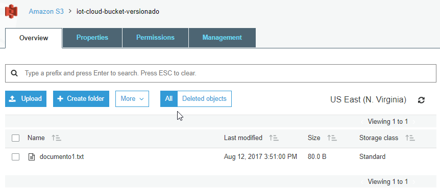
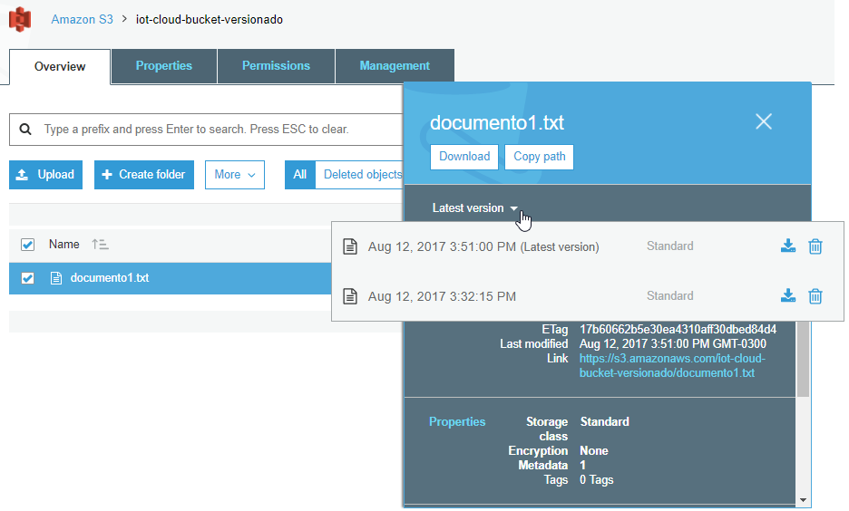
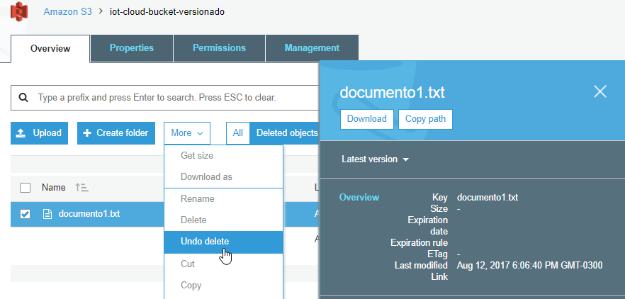

| [< Anterior](https://github.com/conapps/conapps-iot/blob/master/AWS%20Cloud/S3/20170810_AWS_S3_Parte_2.md) | [Siguiente >](https://github.com/conapps/conapps-iot/blob/master/AWS%20Cloud/S3/20170812_AWS_S3_Parte_4.md) |

---
### Versionado

El versionado ayuda a proteger los datos contra el borrado de los mismos, manteniendo multiples versiones de cada objeto de un bucket, identificándolos mediante un *version ID* único. Permite preservar y recuperar cada una de las versiones del objeto en el *bucket*. Si un usuario modifica o elimina un objeto, puede recuperar la última versión del objeto, referenciando la *version ID*, *bucket* y *object key*.

El versionado se realiza a nivel de *bucket*, y preserva en forma automática todas las copias de los objetos contenidos en el mismo. Incluso mantiene el historial de versiones de los objetos eliminados.
Si borramos un objeto, en lugar de eliminarlo en forma permanente S3 le inserta una marca de borrado, de forma que podemos recuperarlo. Mientras que si sobreescribimos un objeto, se convierte en una nueva versión del objeto en el bucket. Siempre se puede restaurar una versión previa de un objeto.

El versionado está apagado por defecto está apagado, y una vez habilitado no puede ser removido de ese *bucket*, solo puede ser suspendido.

Se debe tener en cuenta que todas las versiones del objeto ocupan espacio en S3, por lo cual podemos incrementar nuestros costos de almacenamiento sensiblemente. Una buena práctica sería utilizar las *lifecycle policies* para eliminar versiones viejas, o moverlas viejas a capas de almacenamiento mas baratas o archivarlas a Glacier.

El versionado se puede habilitar en el momento de crar un *bucket*, o sobre uno ya existente.
Probemos de crear un nuevo bucket y habilitarle el versionado (puede hacerse al crearlo o luego desde las propiedades):


---

---

---

---

Ahora bien, probemos de subir un objeto nuevo a este bucket, por ejemplo el *documento1.txt* que tenemos en nuestro equipo:
```bash
$ cat documento1.txt
HOLA MUNDO!!  que original, no?

$ aws s3 cp documento1.txt s3://iot-cloud-bucket-versionado
upload: .\documento1.txt to s3://iot-cloud-bucket-versionado/documento1.txt
```

Modifiquemos en nuestro equipo el contenido del *documento1.txt* (puede hacerlo con un editor/notepad si lo prefiere):
```bash
$ echo "... agrego algo de información al documento 1" >> documento1.txt

$ cat documento1.txt
HOLA MUNDO!!  que original, no?
... agrego algo de información al documento 1
```

Y volvamos a subir el *documento1.txt* al mismo bucket que antes, con lo cual vamos a sobrescribir nuestro objeto:
```bash
$ aws s3 cp documento1.txt s3://iot-cloud-bucket-versionado
upload: .\documento1.txt to s3://iot-cloud-bucket-versionado/documento1.txt
```

Bien, ahora vayamos a la consola web de S3, y veamos el contenido del *iot-cloud-bucket-versionado*.

Lo primero que podemos ver, es que en la parte superior se habilitan las opciones ***All | Deleted objects***, esto nos muestra que ese *bucket* tiene objetos con versiones.



Si seleccionamos el *documento1.txt*, podemos ver en sus propiedades las diferentes versiones del objeto, con sus fechas y la capa de almacenamiento donde se encuentra cada una. También podemos descargar y eliminar una versión del objeto.



Con la **CLI** podemos listar los objetos que se encuentran en nuestro bucket (*s3api list-objects*) y también poder ver las características de las diferentes versiones del archivo (*s3api list-object-vesions*):

```bash
$ aws s3api list-objects --bucket iot-cloud-bucket-versionado
{
    "Contents": [
        {
            "Key": "documento1.txt",
            "LastModified": "2017-08-12T18:51:00.000Z",
            "ETag": "\"17b60662b5e30ea4310aff30dbed84d4\"",
            "Size": 80,
            "StorageClass": "STANDARD",
            "Owner": {
                "DisplayName": "aws.develop",
                "ID": "253b019b7f4fd45d661c9fdb0619b56bad91f8eb9fea1ef96d0aeab3e189cf2d"
            }
        }
    ]
}

$ aws s3api list-object-versions --bucket iot-cloud-bucket-versionado
{
    "Versions": [
        {
            "ETag": "\"17b60662b5e30ea4310aff30dbed84d4\"",
            "Size": 80,
            "StorageClass": "STANDARD",
            "Key": "documento1.txt",
            "VersionId": "oNlqAiHtpUFJ2vK.ionRwJS1yanXVHmY",
            "IsLatest": true,
            "LastModified": "2017-08-12T18:51:00.000Z",
            "Owner": {
                "DisplayName": "aws.develop",
                "ID": "253b019b7f4fd45d661c9fdb0619b56bad91f8eb9fea1ef96d0aeab3e189cf2d"
            }
        },
        {
            "ETag": "\"fb4794e7e7bfbffb4630114f236cc02d\"",
            "Size": 34,
            "StorageClass": "STANDARD",
            "Key": "documento1.txt",
            "VersionId": "lM.eixwBplCnnot.eM.hLMGw3aTwA5iW",
            "IsLatest": false,
            "LastModified": "2017-08-12T18:32:15.000Z",
            "Owner": {
                "DisplayName": "aws.develop",
                "ID": "253b019b7f4fd45d661c9fdb0619b56bad91f8eb9fea1ef96d0aeab3e189cf2d"
            }
        }
    ]
}
```

Probemos de bajar el archivo *documento1.txt"*. Si lo bajamos como siempre, vamos a obtener la última versión que tiene los cambios que habíamos realizado.

```bash
$ aws s3 cp s3://iot-cloud-bucket-versionado/documento1.txt documento1-actual.txt
download: s3://iot-cloud-bucket-versionado/documento1.txt to .\documento1-actual.txt

$ cat documento1-actual.txt
HOLA MUNDO!!  que original, no? :P
... agrego algo de información al documento 1
```

Si queremos obtener la versión anterior, debemos referenciar al *VersionId* correspondiente. La podemos ver mas arriba, cuando listamos las versiones del objeto: *"VersionId": "lM.eixwBplCnnot.eM.hLMGw3aTwA5iW"*.
Bajemos esta versión anterior, pero con otro nombre para poder ver su contenido.

```bash
$ aws s3api get-object --bucket iot-cloud-bucket-versionado --key documento1.txt --version-id lM.eixwBplCnnot.eM.hLMGw3aTwA5iW documento1-old.txt
{
    "AcceptRanges": "bytes",
    "LastModified": "Sat, 12 Aug 2017 18:32:15 GMT",
    "ContentLength": 34,
    "ETag": "\"fb4794e7e7bfbffb4630114f236cc02d\"",
    "VersionId": "lM.eixwBplCnnot.eM.hLMGw3aTwA5iW",
    "ContentType": "text/plain",
    "Metadata": {}
}

$ cat documento1-old.txt
HOLA MUNDO!!  que original, no? :P
```

Que pasa si borramos el objeto?
Probemos de borrar el *documento1.txt* (ya debería saber como hacer esto).
```bash
$ aws s3 rm s3://iot-cloud-bucket-versionado/documento1.txt
delete: s3://iot-cloud-bucket-versionado/documento1.txt
```

Si vamos a la consola web y seleccionamos *Deleted objects* podemos ver la lista de objetos borrados incluyendo sus versiones:


Y podemos descargarlo, o bien hacer un *Undo delete*.



Refs:
[Using Versioning](http://docs.aws.amazon.com/es_es/AmazonS3/latest/dev/Versioning.html)
[Managing Objects in a Versioning-Enabled Bucket](http://docs.aws.amazon.com/es_es/AmazonS3/latest/dev/manage-objects-versioned-bucket.html)
[AWS CLI Command Reference: s3api](http://docs.aws.amazon.com/cli/latest/reference/s3api/index.html)


---
## Replicación entre Regiones
---
La replicación entre regiones es una característica de Amazon S3 que replica datos automáticamente entre diferentes regiones de AWS. Con las réplicas entre diferentes regiones, cada objeto que se cargue en un bucket de S3 se replica automáticamente en otro bucket situado en otra región de AWS que usted elija. Usted paga los cargos de Amazon S3 por almacenamiento, solicitudes y transferencia de datos entre regiones de la copia replicada de datos además de los cargos de almacenamiento de la copia principal. El precio de la copia replicada del almacenamiento de información se basa en la región de destino, mientras que los precios de las solicitudes y la transferencia de datos entre regiones se basan en la región de origen.

---
## Static Web Pages
---


---
## Seguridad en Amazon S3
---

### Access Controls (ACLs)

---
### Encryption
* None
* Amazon S3 Master Key
* AWS KMS master-key
34.50

---
### Aditional Security Features
* Audit Logs
* MULTI-FACTOR AUTHENTICATION DELETE
* TIME-LIMTED ACCESS TO OBJECTS


---
### Throughput omptimisation

---
## Amazon Glacier
---


---
| [< Anterior](https://github.com/conapps/conapps-iot/blob/master/AWS%20Cloud/S3/20170810_AWS_S3_Parte_2.md) | [Siguiente >](https://github.com/conapps/conapps-iot/blob/master/AWS%20Cloud/S3/20170812_AWS_S3_Parte_4.md) |
