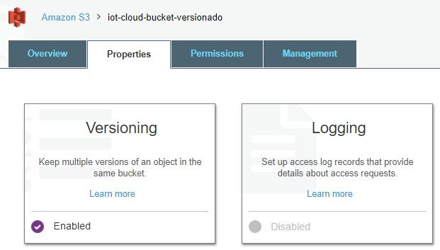
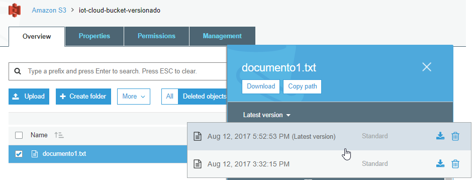
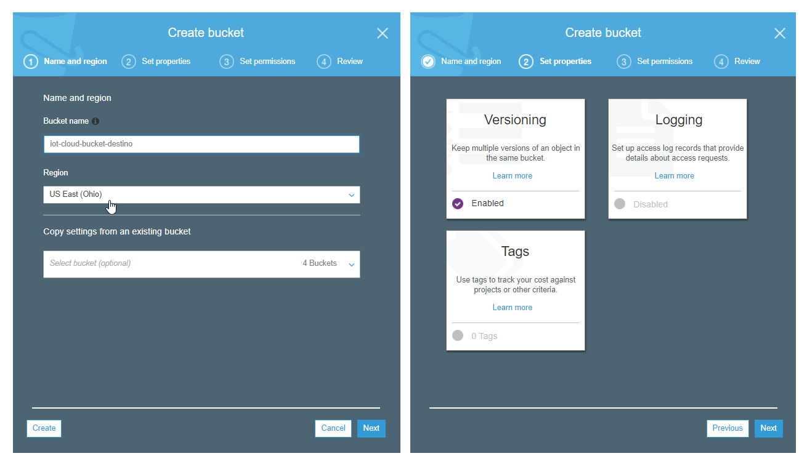
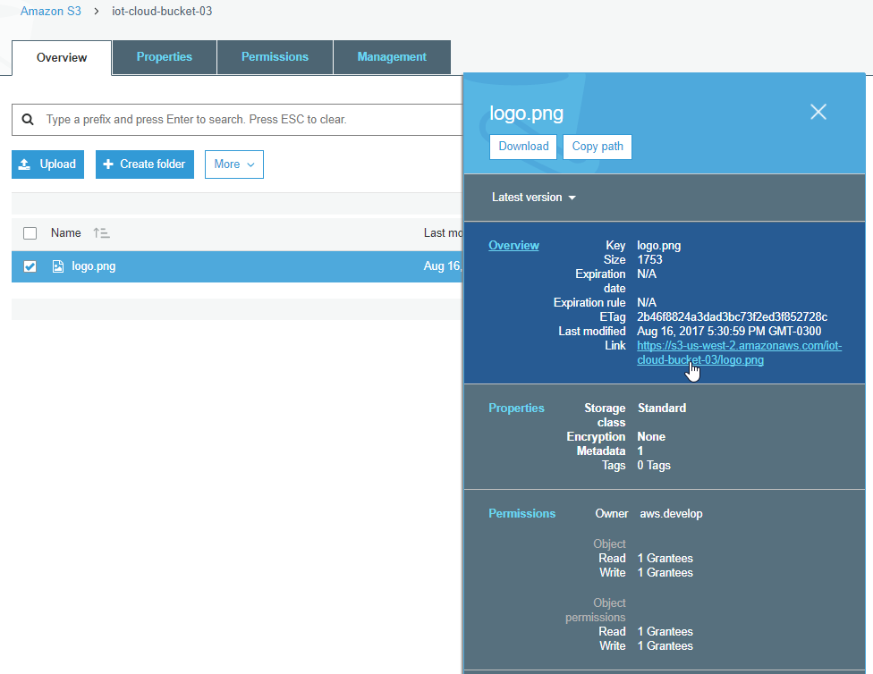
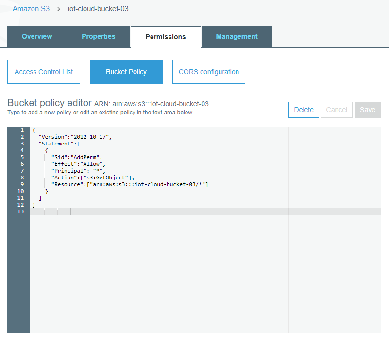
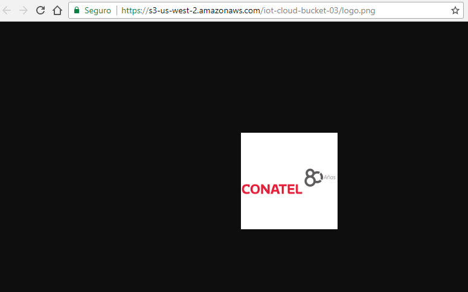
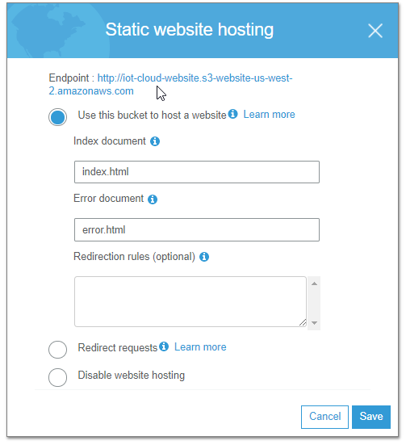
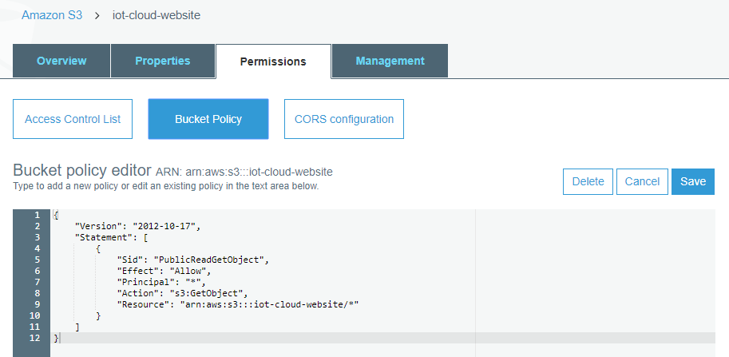
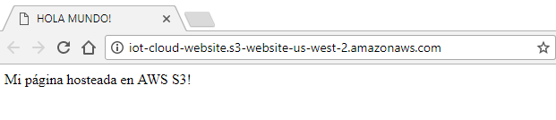

| [< Anterior](https://github.com/conapps/conapps-iot/blob/master/AWS%20Cloud/S3/20170810_AWS_S3_Parte_2.md) | [Siguiente >](https://github.com/conapps/conapps-iot/blob/master/AWS%20Cloud/S3/20170812_AWS_S3_Parte_4.md) |

---
### Versionado

El versionado ayuda a proteger los datos contra el borrado de los mismos, manteniendo multiples versiones de cada objeto de un bucket, identificándolos mediante un *version ID* único. Permite preservar y recuperar cada una de las versiones del objeto en el *bucket*. Si un usuario modifica o elimina un objeto, puede recuperar la última versión del objeto, referenciando la *version ID*, *bucket* y *object key*.

El versionado se realiza a nivel de *bucket*, y preserva en forma automática todas las copias de los objetos contenidos en el mismo. Incluso mantiene el historial de versiones de los objetos eliminados.
Si borramos un objeto, en lugar de eliminarlo en forma permanente S3 le inserta una marca de borrado, de forma que podemos recuperarlo. Mientras que si sobreescribimos un objeto, se convierte en una nueva versión del objeto en el bucket. Siempre se puede restaurar una versión previa de un objeto.

El versionado está apagado por defecto está apagado, y una vez habilitado no puede ser removido de ese *bucket*, solo puede ser suspendido.

Se debe tener en cuenta que todas las versiones del objeto ocupan espacio en S3, por lo cual podemos incrementar nuestros costos de almacenamiento sensiblemente. Una buena práctica sería utilizar las *lifecycle policies* para eliminar versiones viejas, o moverlas viejas a capas de almacenamiento mas baratas o archivarlas a Glacier.

El versionado se puede habilitar en el momento de crar un *bucket*, o sobre uno ya existente.
Probemos de crear un nuevo bucket y habilitarle el versionado (puede hacerse al crearlo o luego desde las propiedades):


---

---

---

---

Ahora bien, probemos de subir un objeto nuevo a este bucket, por ejemplo el *documento1.txt* que tenemos en nuestro equipo:
```bash
$ cat documento1.txt
HOLA MUNDO!!  que original, no?

$ aws s3 cp documento1.txt s3://iot-cloud-bucket-versionado
upload: .\documento1.txt to s3://iot-cloud-bucket-versionado/documento1.txt
```

Modifiquemos en nuestro equipo el contenido del *documento1.txt* (puede hacerlo con un editor/notepad si lo prefiere):
```bash
$ echo "... agrego algo de información al documento 1" >> documento1.txt

$ cat documento1.txt
HOLA MUNDO!!  que original, no?
... agrego algo de información al documento 1
```

Y volvamos a subir el *documento1.txt* al mismo bucket que antes, con lo cual vamos a sobrescribir nuestro objeto:
```bash
$ aws s3 cp documento1.txt s3://iot-cloud-bucket-versionado
upload: .\documento1.txt to s3://iot-cloud-bucket-versionado/documento1.txt
```

Bien, ahora vayamos a la consola web de S3, y veamos el contenido del *iot-cloud-bucket-versionado*.

Lo primero que podemos ver, es que en la parte superior se habilitan las opciones ***All | Deleted objects***, esto nos muestra que ese *bucket* tiene objetos con versiones.


Si seleccionamos el *documento1.txt*, podemos ver en sus propiedades las diferentes versiones del objeto, con sus fechas y la capa de almacenamiento donde se encuentra cada una. También podemos descargar y eliminar una versión del objeto.


Con la **CLI** podemos listar los objetos que se encuentran en nuestro bucket (*s3api list-objects*) y también poder ver las características de las diferentes versiones del archivo (*s3api list-object-vesions*):

```bash
$ aws s3api list-objects --bucket iot-cloud-bucket-versionado
{
    "Contents": [
        {
            "Key": "documento1.txt",
            "LastModified": "2017-08-12T18:51:00.000Z",
            "ETag": "\"17b60662b5e30ea4310aff30dbed84d4\"",
            "Size": 80,
            "StorageClass": "STANDARD",
            "Owner": {
                "DisplayName": "aws.develop",
                "ID": "253b019b7f4fd45d661c9fdb0619b56bad91f8eb9fea1ef96d0aeab3e189cf2d"
            }
        }
    ]
}

$ aws s3api list-object-versions --bucket iot-cloud-bucket-versionado
{
    "Versions": [
        {
            "ETag": "\"17b60662b5e30ea4310aff30dbed84d4\"",
            "Size": 80,
            "StorageClass": "STANDARD",
            "Key": "documento1.txt",
            "VersionId": "oNlqAiHtpUFJ2vK.ionRwJS1yanXVHmY",
            "IsLatest": true,
            "LastModified": "2017-08-12T18:51:00.000Z",
            "Owner": {
                "DisplayName": "aws.develop",
                "ID": "253b019b7f4fd45d661c9fdb0619b56bad91f8eb9fea1ef96d0aeab3e189cf2d"
            }
        },
        {
            "ETag": "\"fb4794e7e7bfbffb4630114f236cc02d\"",
            "Size": 34,
            "StorageClass": "STANDARD",
            "Key": "documento1.txt",
            "VersionId": "lM.eixwBplCnnot.eM.hLMGw3aTwA5iW",
            "IsLatest": false,
            "LastModified": "2017-08-12T18:32:15.000Z",
            "Owner": {
                "DisplayName": "aws.develop",
                "ID": "253b019b7f4fd45d661c9fdb0619b56bad91f8eb9fea1ef96d0aeab3e189cf2d"
            }
        }
    ]
}
```

Probemos de bajar el archivo *documento1.txt"*. Si lo bajamos como siempre, vamos a obtener la última versión que tiene los cambios que habíamos realizado.

```bash
$ aws s3 cp s3://iot-cloud-bucket-versionado/documento1.txt documento1-actual.txt
download: s3://iot-cloud-bucket-versionado/documento1.txt to .\documento1-actual.txt

$ cat documento1-actual.txt
HOLA MUNDO!!  que original, no? :P
... agrego algo de información al documento 1
```

Si queremos obtener la versión anterior, debemos referenciar al *VersionId* correspondiente. La podemos ver mas arriba, cuando listamos las versiones del objeto: *"VersionId": "lM.eixwBplCnnot.eM.hLMGw3aTwA5iW"*.
Bajemos esta versión anterior, pero con otro nombre para poder ver su contenido.

```bash
$ aws s3api get-object --bucket iot-cloud-bucket-versionado --key documento1.txt --version-id lM.eixwBplCnnot.eM.hLMGw3aTwA5iW documento1-old.txt
{
    "AcceptRanges": "bytes",
    "LastModified": "Sat, 12 Aug 2017 18:32:15 GMT",
    "ContentLength": 34,
    "ETag": "\"fb4794e7e7bfbffb4630114f236cc02d\"",
    "VersionId": "lM.eixwBplCnnot.eM.hLMGw3aTwA5iW",
    "ContentType": "text/plain",
    "Metadata": {}
}

$ cat documento1-old.txt
HOLA MUNDO!!  que original, no? :P
```

Que pasa si borramos el objeto?
Probemos de borrar el *documento1.txt* (ya debería saber como hacer esto).
```bash
$ aws s3 rm s3://iot-cloud-bucket-versionado/documento1.txt
delete: s3://iot-cloud-bucket-versionado/documento1.txt
```

Si vamos a la consola web y seleccionamos *Deleted objects* podemos ver la lista de objetos borrados incluyendo sus versiones:


Y podemos descargarlo, o bien hacer un *Undo delete*.


Refs:
[Using Versioning](http://docs.aws.amazon.com/es_es/AmazonS3/latest/dev/Versioning.html)
[Managing Objects in a Versioning-Enabled Bucket](http://docs.aws.amazon.com/es_es/AmazonS3/latest/dev/manage-objects-versioned-bucket.html)
[AWS CLI Command Reference: s3api](http://docs.aws.amazon.com/cli/latest/reference/s3api/index.html)


---
## Cross-Region Replication
---
La replicación entre regiones es una característica de Amazon S3 que permite copiar objetos en forma automática entre diferentes regiones de AWS. Cada objeto que subamos a un bucket de S3 se replicará en forma asincrónica en otro bucket situado en otra región de AWS que seleccionemos.

Para activar esta característica, es necesario agregar la configuración de replicación al *bucket* de origen, indicando cierta información, particularmente hacia que región lo vamos a copiar. Podemos replicar un *bucket* completo, o seleccionar solo algunos objetos, filtrando que copiar (y/o que no) por medio de *prefixes* o *tags*. Para usar la replicación es requerido que tanto el *bucket* origen como destino tengan el versionado activado.

Se debe tener en cuenta que cuando se habilita esta opción, se comienzan a replicar todos los objetos nuevos a partir de ese momento, pero los objetos anteriores que puedan existir en el bucket no son copiados. Los objetos de la copia destino son exactamente iguales a los originales, con la misma metadata (incluyendo la fecha de creación original), los mismos tags, permisos, etc. AWS S3 encripta el tráfico entre las regiones utilizando SSL.

El uso de esta característica implica cargos adicionales. Debemos pagar los cargos de S3 por almacenamiento, solicitudes y transferencia de datos entre regiones de la copia replicada, además de los cargos de almacenamiento de la copia principal. El precio de la copia replicada se basa en la región de destino, mientras que los precios de las solicitudes y la transferencia de datos entre regiones se basan en la región de origen.

Veamos como configurarlo.
* Creamos el *bucket* de origen, en una determinada región de AWS, y con *versioning* habilitado.
  
  .
  
  .

* Creamos el *bucket* de destino, en una región diferente de AWS, y con *versioning* habilitado.
  
  .
  
  .

* Habilitamos la replicación en el *bucket* de origen.
Podemos seleccionar a donde replicar, que objetos replicar, a que clase de storage destino vamos a replicar. Nuestro usuario debe contar con permisos para poder replicar, para lo cual podemos directamente crear un nuevo rol en IAM desde aquí mismo (necesitamos tener acceso a IAM para esto) o podemos seleccionar un rol de IAM existente (por ej. que haya sido creado por nuestro administrador de IAM).

.

.

.

.

Para verificar que la replicación funciona, podemos simplemente subir un objeto al *bucket origen* y verificar que el mismo sea replicado al *bucket destino*. O podemos cambiar las propiedades de un objeto (metadata, tags, ACLs) y verificar que las mismas son modificadas en el objeto replicado.

El tiempo que le toma a S3 replicar la información depende del tamaño de los objetos que estamos replicando.
Puede llevar varias horas dependiendo de la cantidad de información.


Refs:
[Cross-Region Replication](http://docs.aws.amazon.com/es_es/AmazonS3/latest/dev/crr.html)
[Cross-Region Replication FAQs](https://aws.amazon.com/es/s3/faqs/#crr)
[How to enable Cross-Region (AWS Console)](http://docs.aws.amazon.com/es_es/AmazonS3/latest/user-guide/enable-crr.html)
[Walkthrough 1: Configure Cross-Region Replication Replication for same AWS user account](http://docs.aws.amazon.com/es_es/AmazonS3/latest/dev/crr-walkthrough1.html)
[Amazon S3 Pricing](https://aws.amazon.com/es/s3/pricing/)


---
## Access Control
Por defecto Amazon S3 es seguro, cuando creamos un *bucket* o un objeto, solo el dueño (el usuario que lo creó) puede accederlo.
El dueño puede opcionalmente brindar (o restringir) acceso de diversas formas:

* **Access Control Lists (ACLs)**: permite aplicar permisos básicos de lectura/escritura/full-control a nivel de *bucket* y *object*. Las ACLs fueron la primer opción para brindar accesos, antes de que existiera IAM, y actualmente deberían utilizarse solo para ciertos casos puntuales, tales como habilitar el logging de un *bucket*, o permitir el acceso público a todos los usuarios. Las ACLs tienen ciertas limitantes, y permiten realizar controles a un nivel mas general, no tan detallado como las otras dos opciones.

* **Bucket Policies**: permiten aplicar políticas de acceso a nivel de los buckets, sin utilizar IAM, y logrando políticas con un buen nivel de detalle y control. Por ejemplo, permitir acceso a público de tipo read-only a todos los objetos de determinado *bucket*, restringir o brindar accesos a determinados usuarios a determinados objetos, o incluso a nivel de direcciones IP (que una determinada IP no pueda acceder a determinados objetos). Permiten un control mucho mas detallado sobre nuestros objetos que las ACLs, y sin requerir el uso de IAM. Es recomendado el uso de *bucket policies* en lugar de *ACLs*.

* **IAM Policies**: permiten especificar permisos específicos sobre S3, y aplicarlos a usuarios, grupos y/o roles. Permite lograr un control muy detallado sobre nuestros recursos de S3. Pero para poder utilizarlas, debemos tener acceso a IAM (vamos a tener una clase específica sobre IAM).


### Bucket Policy (ejemplo)

Un ejemplo de una Bucket Policy sería permitir el acceso read-only a los usuarios anónimos a los objetos de nuestro bucket.
Supongamos el ejemplo que vimos al comenzar, de subir un objeto "logo.png" y poder accederlo públicamente.




Si intentamos acceder al objeto *logo.png* desde un browser (sin darle permisos adicionales al objeto), nos va a dar error:


Veamos entonces de darle permisos al *bucket* mediante una *bucket policy* para poder acceder a todos los objetos que tiene dentro. Esto lo hacemos mediante la siguiente *policiy*

```bash
{
  "Version":"2012-10-17",   
  "Statement":[
    {
      "Sid":"AddPerm",                
      "Effect":"Allow",                                   // que le voy a aplicar: Allow o Deny
      "Principal": "*",                                   // a quien se lo voy a aplicar: *
      "Action":["s3:GetObject"],                          // cual es la acción que voy a aplicar
      "Resource":["arn:aws:s3:::iot-cloud-bucket-03/*"]   // sobre que recurso lo aplico
    }                                               
  ]
}
```

La política la configuramos dentro de las propiedades del bucket:


Y si luego volvemos a intentar acceder al objeto desde el browser, ahora podemos hacerlo:



Refs:
[Overview of Managing Access](http://docs.aws.amazon.com/es_es/AmazonS3/latest/dev/access-control-overview.html)
[Managing Access Permissions to Your Amazon S3 Resources](http://docs.aws.amazon.com/es_es/AmazonS3/latest/dev/s3-access-control.html)
[Bucket Policy Examples](http://docs.aws.amazon.com/es_es/AmazonS3/latest/dev/example-bucket-policies.html)
[Example Walkthroughs: Managing Access to Your Amazon S3 Resources](http://docs.aws.amazon.com/es_es/AmazonS3/latest/dev/example-walkthroughs-managing-access.html)
[AWS Policy Generator](http://awspolicygen.s3.amazonaws.com/policygen.html)


---
## Static Web Pages
Como vimos anteriormente, brindar acceso público a uno o varios objetos almacenados en AWS S3 es muy simple.

Con Amazon S3, podemos hostear fácilmente un sitio web estático completo, con un costo muy bajo, y sobre una solución que provee alta disponibilidad y puede escalar automáticamente para enfrentar los aumentos de demanda de nuestro sitio.

* Comencemos por crear un bucket para nuestro sitio web (puede hacerlo de la consola web):
  ```bash
  $ aws s3 mb s3://iot-cloud-website
  make_bucket: iot-cloud-website
  ```

* Luego en las propiedades del bucket, podemos acceder a la sección de *Static website hosting* para configurarlo:

  


* Debemos especificar cuál es nuestra página principal *index.html* y opcionalmente una página para desplegar en caso que se intente acceder a un elemento inexistente *error.html* (errores de tipo 4XX).

  El link que se muestra en *Endpoint: http://iot-cloud-website.s3-website-us-west-2.amazonaws.com* nos llevará a nuestra página.
  .
  

  * Opcionalmente podemos especificar reglas avanzadas para redireccionamiento, en formato XML (puede dirigirse a las referencias de documentación incluidas mas abajo para profundizar sobre esto).  

  * O podríamos redirigir todos los requerimientos que llegan a este *bucket* enviándolos a otro *bucket* o incluso a otro sitio web externo a S3. Esto lo hacemos configurando la opción *Redirect requests*.
  .

* Recordemos que por defecto todos nuestros objetos son privados, por tanto debemos brindar permisos que habiliten el acceso de lectura a nuestros objetos dentro del bucket. Esto lo hacemos mediante la siguiente *bucket policy*, como ya lo hicimos antes:

```json
{
    "Version": "2012-10-17",
    "Statement": [
        {
            "Sid": "PublicReadGetObject",
            "Effect": "Allow",
            "Principal": "*",
            "Action": [
                "s3:GetObject"
            ],
            "Resource": [
                "arn:aws:s3:::iot-cloud-website/*"
            ]
        }
    ]
}
```
* Y por último, lo que nos resta hacer es subir nuestra página al bucket, particularmente los archivos que referenciamos *index.html* y *error.html*, así como el resto de estructura y contenido que necesitemos.

```bash
$ aws s3 cp index.html s3://iot-cloud-website/
upload: .\index.html to s3://iot-cloud-website/index.html

$ aws s3 cp error.html s3://iot-cloud-website/
upload: .\error.html to s3://iot-cloud-website/error.html

```

Ahora ya podemos acceder a nuestra página: http://iot-cloud-website.s3-website-us-west-2.amazonaws.com

Y accedemos directamente a nuestro *index.html*


Y si vamos a una dirección que no existe, nos dirige a *error.html*



Podemos combinar esta funcionalidad de AWS S3 Static Website Hosting con AWS Route 53 para poder usar nuestros propios nombres de dominio para nuestro sitio, en lugar de usar la dirección de *endpoint* provisto por Amazon (puede ver la documentación de referencia mas abajo).

Refs.:
[How Do I Configure an S3 Bucket for Static Website Hosting?](http://docs.aws.amazon.com/es_es/AmazonS3/latest/user-guide/static-website-hosting.html)
[Configuring a Bucket for Website Hosting](http://docs.aws.amazon.com/es_es/AmazonS3/latest/dev/HowDoIWebsiteConfiguration.html)
[Configuring a Webpage Redirect](https://docs.aws.amazon.com/es_es/AmazonS3/latest/dev/how-to-page-redirect.html)
[Setting up a Static Website Using a Custom Domain](https://docs.aws.amazon.com/es_es/AmazonS3/latest/dev/website-hosting-custom-domain-walkthrough.html)


---
### Throughput omptimisation


---
### Encryption
* None
* Amazon S3 Master Key
* AWS KMS master-key
34.50

---
### Aditional Security Features
* Audit Logs
* MULTI-FACTOR AUTHENTICATION DELETE
* TIME-LIMTED ACCESS TO OBJECTS


---
| [< Anterior](https://github.com/conapps/conapps-iot/blob/master/AWS%20Cloud/S3/20170810_AWS_S3_Parte_2.md) | [Siguiente >](https://github.com/conapps/conapps-iot/blob/master/AWS%20Cloud/S3/20170812_AWS_S3_Parte_4.md) |
