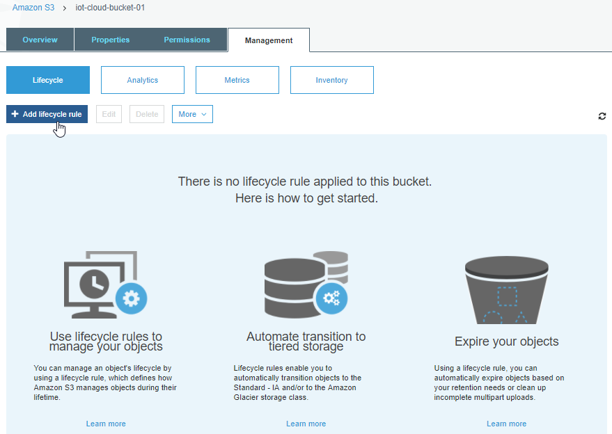
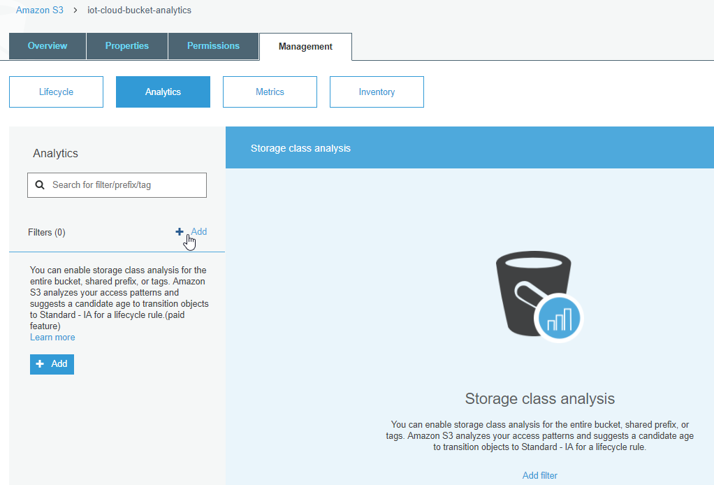
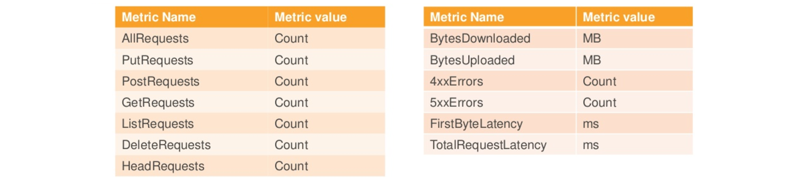
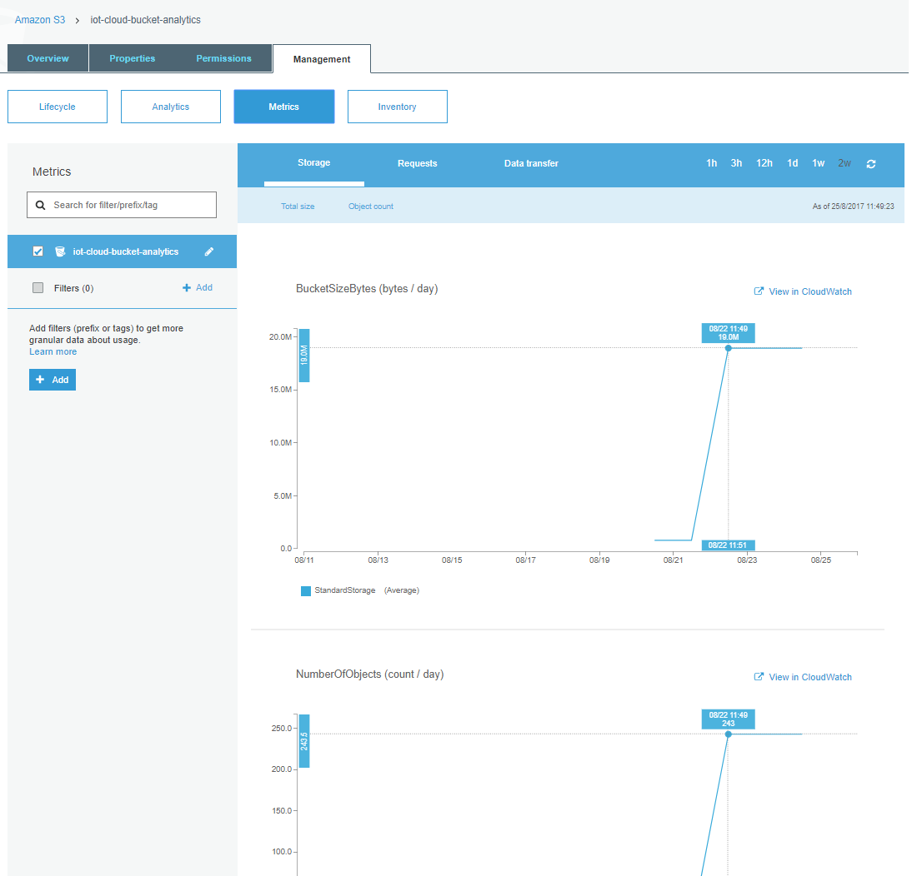
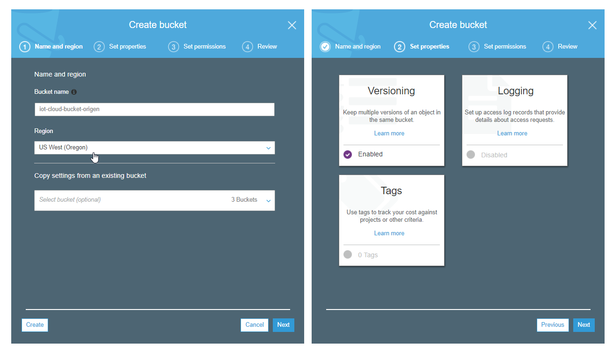
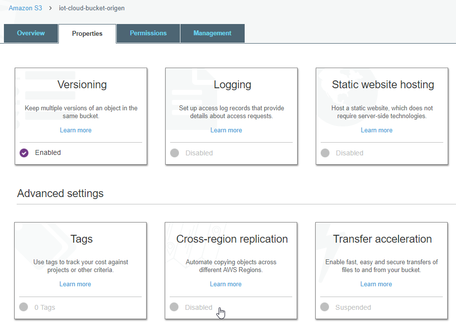
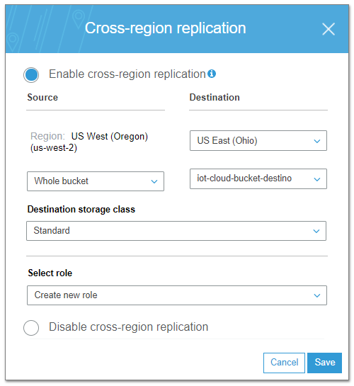

| [< Anterior](https://github.com/conapps/conapps-iot/blob/master/AWS%20Cloud/S3/AWS_S3_Parte_2.md) |

---
## Gestión de los datos
---

## Lifecycle Policies

Amazon S3 ofrece la posibilidad de establecer Políticas de Gestión del Ciclo de Vida de los datos (*lifecycle policies*).

Estas políticas permiten automatizar acciones sobre los objetos de un *bucket*, ante determinadas situaciones o eventos. La configuración se realiza mediante una o más reglas, donde cada regla define una acción que se aplicará a un grupo de objetos. Hay dos tipos de acciones:

***Transition***: mueve los objetos a otra *storage class*. Por ejemplo, podríamos transferir los objetos desde la clase STANDARD a la clase STANDARD_IA (acceso infrecuente) a los 30 días que se crea el objeto, y luego archivarlos en GLACIER al año.

***Expiration:*** elimina los objetos. Por ejemplo, podríamos eliminar en forma automática los objetos cuando lleguen a 5 años de antiguedad.


Las acciones se realizan sobre los *buckets*, por lo cual estas aplicaran, por defecto, a todos los objetos que se encuentren en el mismo.
Podemos utilizar ***prefix*** y/o ***tags*** para aplicar filtros de forma que una regla solo aplique sobre determinados objetos.
Tengamos en cuenta que no se pueden usar *tags* para la expiración de los objetos.

Con el uso de *prefixes* y/o *tags* podríamos crear reglas mas específicas, por ejemplo, transferir todos los objetos con mas de 30 días de antiguedad, cuyo nombre (prefijo) comience con *"logs_"*, moviéndolos a la clase STANDARD_IA si tienen un tag *type=errores*, y archivándolos a GLACIER si el tag indica *type=mensajes*.

En conjunto con el uso de ***Versions*** también podemos aplicar acciones sobre las versiones anteriores de los objetos, por ejemplo, archivar todas las versiones de un objeto que tengan mas de 90 días, excepto la versión actual.

Las *lifecycle policies* se crean sobre los *buckets*:




Debemos especificar un nombre de la regla, y en forma opcional podemos por un filtro indicando sobre que *refix* o *tag* aplica la regla, en este caso todos los objetos cuyo nombre comience con *"logs_"*:


Configuramos la regla de *transition*, en este caso movemos los objetos a la capa STANDARD_IA luego de 30 días, y los movemos a GLACIER luego de 60 días:


Configuramos la regla de *expiration*, en este caso vamos a eliminar los objetos luego de 180 días:


Revisamos que todo esté como queremos y creamos la regla.


Ahora podemos ver la regla creada sobre el bucket:


También podemos usar la **CLI**, por ejemplo, para ver la configuración de las *lifecycle policies* creadas para un *bucket*, mediante el comando `aws s3api get-bucket-lifecycle-configuration`:
```bash
$ aws s3api get-bucket-lifecycle-configuration --bucket iot-cloud-bucket-01
{
    "Rules": [
        {
            "Expiration": {
                "Days": 180
            },
            "ID": "regla_para_logs",
            "Filter": {
                "Prefix": "logs_"
            },
            "Status": "Enabled",
            "Transitions": [
                {
                    "Days": 30,
                    "StorageClass": "STANDARD_IA"
                },
                {
                    "Days": 60,
                    "StorageClass": "GLACIER"
                }
            ]
        }
    ]
}
```

También podríamos usar el comando `aws s3api put-lifecycle-configuration` para establecer una regla sobre un *bucket*. Puede ver un ejemplo [aquí](http://docs.aws.amazon.com/es_es/AmazonS3/latest/dev/set-lifecycle-cli.html).


Ref.:
* [Object Lifecycle Management](http://docs.aws.amazon.com/es_es/AmazonS3/latest/dev/object-lifecycle-mgmt.html)
* [Setting Lifecycle Configuration On a Bucket](http://docs.aws.amazon.com/es_es/AmazonS3/latest/dev/how-to-set-lifecycle-configuration-intro.html)
* [Set Lifecycle Configuration Using the AWS CLI](http://docs.aws.amazon.com/es_es/AmazonS3/latest/dev/set-lifecycle-cli.html)


---
### Analytics
Por medio de *Amazon S3 Analytics - Storage Class Analysis*, se pueden analizar los patrones de acceso sobre nuestros datos. Esto nos ayuda a decidir cuando y que datos podemos mover (*transition*) a otra *storage-class*.

Esta herramienta analiza en forma continua (desde que la activamos) los patrones de acceso a nuestros datos, incluyendo cuanta cantidad de storage estamos utilizando y cuanto de ese storage hemos accedido recientemente. Esto nos permite determinar cuando podemos mover los datos que son poco accedidos desde la capa Standard donde se encuentran, a la capa Standard_IA o a Glacier.

Podemos usar esta información para mejorar nuestras políticas de ciclo de vida (*lifecycle policies*) y aprovechar mejor los diferentes tipos de storage, reduciendo los costos.

Esta herramienta se habilita sobre un *bucket*, y cuanto más tiempo esté habilitada (analizando los patrones de acceso) mejor información nos proveerá. Se puede analizar el acceso a todos los objetos del *bucket*, o analizar solo determinados objetos dentro del *bucket* filtrando mediante el uso de *prefixes* y/o *tags*.
Esto permite entender aún mas el comportamiento de nuestros datos, por ej., podríamos analizar el acceso a todos los objetos que sean de tipo *"logs"* y analizar en forma separada a todos los objetos de tipo *"imagenes"* y luego tomar diferentes acciones sobre ellos (ya deberíamos tener claro que para que esto sea posible debemos tener categorizados nuestros objetos de alguna forma, ya sea utilizando tags o prefijos con ciertos patrones en los nombres de los objetos).

Adicionalmente a la información de análisis que nos muestra la consola web, podemos exportar los resultados de S3 Analytics a la herramienta que elijamos, por ej. Amazon QuickSight, Amazon Redshift, MS Excel, etc., generando la salida directamente a un bucket en formato .csv para nuestro posterior análisis.

S3 Analytics tiene costo adicional, en base a la cantidad de objetos analizados mensualmente, que dependen de la región que utilicemos.


S3 Anaytics se configura dentro de las herramientas de *Management* del *bucket*:



Luego debemos agregar un filtro indicando que objetos queremos analizar, y si queremos exportar la salida en formato .csv a otro *bucket* (creado anteriormente), en este caso exportamos los resultados a *iot-cloud-bucket-analytics-results*:


Si decidimos exporta la salida, automáticamente nos va a crear una policy que le permita accesso de escritura sobre el *bucket* destino:


Podemos ver las características de la regla que creamos, mediante la CLI con `aws s3api list-bucket-analytics-configurations`, crear una regla mediante `aws s3api put-bucket-analytics-configuration`, o eliminarla con `aws s3api delete-bucket-analytics-configuration`.

```bash
$ aws s3api list-bucket-analytics-configurations --bucket iot-cloud-bucket-analytics
{
    "IsTruncated": false,
    "AnalyticsConfigurationList": [
        {
            "Id": "analytics-01",
            "StorageClassAnalysis": {
                "DataExport": {
                    "OutputSchemaVersion": "V_1",
                    "Destination": {
                        "S3BucketDestination": {
                            "Format": "CSV",
                            "Bucket": "arn:aws:s3:::iot-cloud-bucket-analytics-results"
                        }
                    }
                }
            }
        }
    ]
}
```

Si tuviéramos varias reglas y solo quisiéramos ver una, podemos accederla mediante su *id* con el comando `aws s3 api get-bucket-analytics-configuration`:

```bash
$ aws s3api get-bucket-analytics-configuration --bucket iot-cloud-bucket-analytics --id analytics-01
{
    "AnalyticsConfiguration": {
        "Id": "analytics-01",
        "StorageClassAnalysis": {
            "DataExport": {
                "OutputSchemaVersion": "V_1",
                "Destination": {
                    "S3BucketDestination": {
                        "Format": "CSV",
                        "Bucket": "arn:aws:s3:::iot-cloud-bucket-analytics-results"
                    }
                }
            }
        }
    }
}
```

Ahora el *bucket* ya está siendo analizado. Obviamente la herramienta necesita correr durante cierto tiempo para poder recabar la información de acceso, y por tanto al principio no va a mostrar información:


Luego de cierto tiempo comenzaremos a ver la información generada aquí mismo:


Dado que todavía no tenemos muchos datos ni requerimientos sobre nuestro *bucket* de prueba, y habilitamos el análisis hace poco, las estadísticas iniciales que podemos ver son básicas. La idea es dejar corriendo la herramienta algunos meses, para que pueda analizar los patrones de uso de nuestros (cientos de) objetos almacenados.

Pero para entender un poco mejor, veamos estos datos de un ejemplo de uso obtenido de [aquí](https://aws.amazon.com/es/blogs/aws/s3-storage-management-update-analytics-object-tagging-inventory-and-metrics/).


Podemos ver desde cuando está habilitada la regla (127 días) y cuando fueron actualizados los datos por última vez (3/2/2017), cuanta información total tenemos almacenada en este bucket en la capa Standard (6.39 PB) y cuanto se ha accedido (1.74 PB), y de igual forma para la capa Standard_IA (3.24GB almacenados, y 51.5MB accedidos).

Luego podemos ver un par de gráficas con las estadísticas de cantidad de datos almacenados y recuperados durante un determinado tiempo, y cual es el porcentaje de nuestros datos que hemos accedido.

Mas abajo podemos ver las estadísticas diferenciadas por diferentes períodos de tiempo: datos con menos de 30 días de antiguedad, 30-45, 45-60, 60-90, 90-180 y mas de 180 días.

Con esta información podemos ver, por ej., que en los últimos 127 días (desde que estoy analizando los datos) la mayoría de los objetos con mas de 30 días de antiguedad son muy poco accedidos. Por ej. de los 2.25 PB que hay almacenados con mas de 180 días de antiguedad en este *bucket*, solo hemos accedido a 222.8 TB, y de forma similar para el resto de los períodos de tiempo, a excepción de los primeros 30 días.

Esta herramienta nos permite entender mejor como utilizamos/accedemos a nuestros datos, y poder mejorar nuestra políticas de ciclo de vida. Por ej, podríamos crear una *lifecycle policy* sobre este *bucket* que mueva todos los objetos con mas de 30 días a la capa de acceso infrecuente *Standard_IA* para ahorrar costos de almacenamiento.

Ref.:
* [S3 Storage Management Update – Analytics, Object Tagging, Inventory, and Metrics](https://aws.amazon.com/es/blogs/aws/s3-storage-management-update-analytics-object-tagging-inventory-and-metrics/)
* [Amazon S3 Analytics – Storage Class Analysis](http://docs.aws.amazon.com/AmazonS3/latest/dev/analytics-storage-class.html)
* [How Do I Configure Storage Class Analysis?](http://docs.aws.amazon.com/es_es/AmazonS3/latest/user-guide/configure-analytics-storage-class.html)
* [AWS CLI Command Line Reference: s3api](http://docs.aws.amazon.com/cli/latest/reference/s3api/index.html#cli-aws-s3api)
* [Precios de Amazon S3](https://aws.amazon.com/es/s3/pricing/)

---
### Metrics

Mediante *Amazon CloudWatch metrics* para S3, podemos obtener información que nos permita entender y mejorar la performance de las aplicaciones que usan S3 como almacenamiento. Nos brinda visibilidad sobre la performance del storage, que nos permite identificar y actuar sobre posibles problemas.

Todos los datos recolectados por las métricas de CloudWatch son almacenados por un período de 15 meses, de forma de poder contar con información histórica y tener una mejor perspectiva sobre como se comportan nuestras aplicaciones o servicios web que acceden a S3.

Hay dos tipos de métricas disponibles dentro de CloudWatch en S3

* **Daily Storage Metrics for Buckets:** provee información básica sobre el uso del storage de nuestro *bucket*.
Muestran la cantidad de datos (bytes) y la cantidad de objetos del *bucket* y su evolución durante cierto período de tiempo.
Estas métricas se encuentran habilitadas por defecto para todos los *buckets*, se actualizan una vez por día, y no tienen costo adicional.
Por defecto aplican para todo el contenido del *bucket*, o pueden aplicarse filtros (mediante *prefixes* y/o *tags*) para que apliquen sobre determinados objetos.

* **Request metrics:** permiten monitorear las solicitudes (*request*) que se realizan a S3, para poder identificar y actuar ante problemas de operativa (por ej. que una solicitud de un error).
Tienen costo adicional, en base a los costos asociados a Amazon CloudWatch.
Se configuran a nivel de *bucket* y se pueden aplicar sobre todos los objetos del mismo, o pueden aplicarse filtros (mediante *prefixes* y/o *tags*) para que apliquen sobre los objetos de nuestro interés.
La información generada se actualizan cada 1 minuto (hay un período inicial de unos 15min necesario para recabar la información la primera vez que se configura la métrica). Esta es la lista de métricas que obtendremos al habilitarlas:



Podemos acceder a las métricas dentro de las herramientas de *Management* del *bucket*.

Las **Storage Metrics** (sin costo) se encuentran en el tab *Storage*.
Aquí podemos ver, para nuestro *bucket* llamado *iot-cloud-bucket-analytics*, como evolucionó a lo largo del tiempo la cantidad de storage utilizado *BucketSizeBytes (bytes/day)* y la cantidad de objetos almacenados *NumberOfObjects (count/day)*.


Las **Request Metrics** (con costo adicional), se encuentran en los tabs *Requests* y *Data transfer*.


Luego de unos 15 minutos iniciales, podemos ver la información recolectada por la métrica que definimos, a modo de ejemplo :


Ref.:
* [S3 Storage Management Update – Analytics, Object Tagging, Inventory, and Metrics](https://aws.amazon.com/es/blogs/aws/s3-storage-management-update-analytics-object-tagging-inventory-and-metrics/)
* [Monitoring Metrics with Amazon CloudWatch](http://docs.aws.amazon.com/es_es/AmazonS3/latest/dev/cloudwatch-monitoring.html)
* [Metrics Configurations for Buckets](http://docs.aws.amazon.com/es_es/AmazonS3/latest/dev/metrics-configurations.html)
* [How Do I Configure Request Metrics for an S3 Bucket?](http://docs.aws.amazon.com/AmazonS3/latest/user-guide/configure-metrics.html)

---
### S3 Inventory
Supongamos que tenemos un *bucket* donde tenemos almacenados miles de objetos, con decenas de versiones cada uno.
Listar el contenido de dicho bucket con todas las versiones de los objetos, e incluir información como por ej. el tamaño que ocupan todos esos objetos incluyendo sus versiones, utilizando las herramientas normales como la CLI o SDK, sería una tareas bastante difícil que podría demorar horas, o incluso dar error (timeout).

Amazon S3 Inventory permite obtener en forma automática, ya sea diaria o semanal, un inventario de todo los objetos que tenemos almacenados en un *bucket*. Este inventario es generado en forma automática por Amazon, y el resultado se guarda en un *bucket* destino, en formato CSV.

S3 Iventory tiene costo adicional, en base a la cantidad de objetos (millón) inventariados mensualmente, y depende de la región que utilicemos.


La configuración se realiza a nivel de *bucket*, dentro de los herramientas de *Management* - *Inventory*.


Podemos aplicar el inventario a todos los objetos del bucket, o filtarlos mediante el uso de *prefixes*. También podemos seleccionar que información queremos incluir en el inventario, como ser el tamaño del objeto, su fecha de modificación, storage-class a la que pertenece, y algunos otros. En el caso que utilicemos versionado, podemos incluir en el reporte solo la versión actual de los objetos o todas sus versiones.
Podemos seleccionar el *bucket* destino donde se almacenará el resultado del inventario, e incluso podríamos indicar un prefijo para que se guarde por ej. dentro de una carpeta de dicho *backet*. Y por último, seleccionamos si queremos que se ejecute en forma diaria o semanal.

El resultado se obtiene en formato CSV, a modo de ejemplo:


Ref.:
* [S3 Storage Management Update – Analytics, Object Tagging, Inventory, and Metrics](https://aws.amazon.com/es/blogs/aws/s3-storage-management-update-analytics-object-tagging-inventory-and-metrics/)
* [Amazon S3 Inventory](http://docs.aws.amazon.com/es_es/AmazonS3/latest/dev/storage-inventory.html)
* [How Do I Configure Amazon S3 Inventory?](http://docs.aws.amazon.com/es_es/AmazonS3/latest/user-guide/configure-inventory.html)


---
## Static Web Pages
---
Como vimos anteriormente, brindar acceso público a uno o varios objetos almacenados en AWS S3 es muy simple.

Con Amazon S3, podemos hostear fácilmente un sitio web estático completo, con un costo muy bajo, y sobre una solución que provee alta disponibilidad y puede escalar automáticamente para enfrentar los aumentos de demanda de nuestro sitio.

Comencemos por crear un bucket para nuestro sitio web (puede hacerlo de la consola web):
```bash
$ aws s3 mb s3://iot-cloud-website
make_bucket: iot-cloud-website
```

Luego en las propiedades del bucket, podemos acceder a la sección de *Static website hosting* para configurarlo:


Debemos especificar cuál es nuestra página principal *index.html* y opcionalmente una página para desplegar en caso que se intente acceder a un elemento inexistente *error.html* (errores de tipo 4XX).

El link que se muestra en *Endpoint: http://iot-cloud-website.s3-website-us-west-2.amazonaws.com* será el link de acceso a nuestra página.


Opcionalmente, en *Redirect rules* podemos especificar reglas de redireccionamiento para ciertos objetos. Por ejemplo, supongamos que que renombramos un objeto del *bucket* que está referenciado en nuestra página web, podríamos poner aquí una regla que tome los requerimientos que se hagan al objeto original y los redirija hacia el objeto renombrado. Por otro lado, con *Redirect requests* podríamos redirigir todos los requerimientos que llegan a este *bucket* (a nuestra página estática) enviándolos a otro *bucket* o incluso a otro sitio web externo a S3. Puede revisar estas opciones en la documentación de referencia.

Recordemos que por defecto todos nuestros objetos son privados, por tanto debemos brindar permisos que habiliten el acceso de lectura a nuestros objetos dentro del bucket, para que se pueda acceder a nuestro sitio web.

Para esto, debemos configurar la siguiente *bucket policy* al *bucket*. Tenga en cuenta de poner el nombre de su *bucket* donde dice "arn:aws:s3:::iot-cloud-website/\*"

```json
{
    "Version": "2012-10-17",
    "Statement": [
        {
            "Sid": "PublicReadGetObject",
            "Effect": "Allow",
            "Principal": "*",
            "Action": [
                "s3:GetObject"
            ],
            "Resource": [
                "arn:aws:s3:::iot-cloud-website/*"
            ]
        }
    ]
}
```

Esto lo entendermos mejor en la sección de [Access Control](#access-control), por el momento solo configuremos esto dentro de *Permissions* - *Bucket Policy*:


Y por último, lo que nos resta hacer es subir nuestra página al bucket, particularmente los archivos que referenciamos *index.html* y *error.html*, así como el resto de estructura y contenido que necesitemos.

```bash
$ aws s3 cp index.html s3://iot-cloud-website/
upload: .\index.html to s3://iot-cloud-website/index.html

$ aws s3 cp error.html s3://iot-cloud-website/
upload: .\error.html to s3://iot-cloud-website/error.html

```

Ahora ya podemos acceder a nuestra página: http://iot-cloud-website.s3-website-us-west-2.amazonaws.com

Y accederemos a nuestro *index.html*:


Y si vamos a una dirección que no existe, nos dirige a *error.html*


Podemos combinar esta funcionalidad de AWS S3 Static Website Hosting con AWS Route 53 para poder usar nuestros propios nombres de dominio para nuestro sitio en lugar de usar la dirección de *endpoint* provisto por Amazon.

Ref.:
* [How Do I Configure an S3 Bucket for Static Website Hosting?](http://docs.aws.amazon.com/es_es/AmazonS3/latest/user-guide/static-website-hosting.html)
* [Configuring a Bucket for Website Hosting](http://docs.aws.amazon.com/es_es/AmazonS3/latest/dev/HowDoIWebsiteConfiguration.html)
* [Configuring a Webpage Redirect](https://docs.aws.amazon.com/es_es/AmazonS3/latest/dev/how-to-page-redirect.html)
* [Setting up a Static Website Using a Custom Domain](https://docs.aws.amazon.com/es_es/AmazonS3/latest/dev/website-hosting-custom-domain-walkthrough.html)


---
## Cross-Region Replication
---
La replicación entre regiones es una característica de Amazon S3 que permite copiar objetos en forma automática entre diferentes regiones de AWS. Una vez activada, cada objeto que subamos al *bucket* se replicará en forma asincrónica en otro bucket situado en otra región de AWS que seleccionemos.

La configuración se realiza en el *bucket* de origen, indicando entre otras cosas, cual es el *bucket* destino (ubicado en otro región) al cual vamos a replicar. Podemos replicar todos los objetos del *bucket*, o filtrar que queremos copiar por medio de *prefixes* o *tags*. Para usar la replicación es requerido que tanto el *bucket* origen como destino tengan el versionado activado.

---
### Precios
Se debe tener en cuenta que cuando se habilita esta funcionalidad, se comenzarán a replicar todos los objetos nuevos a partir de ese momento, pero los objetos anteriores que puedan existir en el bucket no son copiados. Los objetos del *bucket* replicado son exactamente iguales a los originales, con la misma metadata (incluyendo la fecha de creación original), los mismos tags, permisos, etc. AWS S3 encripta el tráfico entre las regiones utilizando SSL.

Tengamos en cuenta que la replicación implica cargos adicionales. Debemos pagar las tarifas correspondiente al costo del almacenamiento que utilicemos (origen+destino), las solicitudes implícitas en la tarea de replicación, y el costo de transferencia de datos entre regiones.

Como siempre, los precios varían según la región, veamos un ejemplo utilizando los costos de la región de Oregon (us-west-2).
Si replicamos 1.000 objetos de 1GB (1.000GB) pagaríamos la suma de:
- USD 0,005 -> por las solicitudes por la replicación ($0.005 por cada 1 000 solicitudes PUT, COPY, POST o LIST).
- +USD 20 -> por la transferencia de los datos ($0.020 por GB, por transferencia SALIENTE de datos de Amazon S3 a otra región de AWS).
- +el costo de almacenamiento por los 1.000GB en la región donde se encuentre nuestro *bucket* destino (de acuerdo a su storage-class).
- +(obviamente) el costo de almacenamiento de los 1.000GB en la región donde se encuentra nuestro *bucket* de origen (y su storage-class).

Los costos implicados están en varias secciones de la página de [Precios de AWS S3](https://aws.amazon.com/es/s3/pricing/)


---
### Configuración de la replicación
Veamos como configurar la replicación entre regiones.

Primero creamos nuestro *bucket* de origen, por ej. en la región us-west-2 (Oregon), y le habilitamos el versionado.

```bash
$ aws s3 mb s3://iot-cloud-bucket-origen --region us-west-2
make_bucket: iot-cloud-bucket-origen

$ aws s3api put-bucket-versioning --bucket iot-cloud-bucket-origen --versioning-configuration Status=Enabled

$ aws s3api get-bucket-versioning --bucket iot-cloud-bucket-origen
{
    "Status": "Enabled"
}
```

Y creamos el *bucket* destino de la replica, por ej. en us-east-2 (Ohio), y también le habilitamos el versionado.
```bash
$ aws s3 mb s3://iot-cloud-bucket-destino --region us-east-2
make_bucket: iot-cloud-bucket-destino

$ aws s3api put-bucket-versioning --bucket iot-cloud-bucket-destino --versioning-configuration Status=Enabled

$ aws s3api get-bucket-versioning --bucket iot-cloud-bucket-destino
{
    "Status": "Enabled"
}
```

O podemos crearlos mediante la consola web:



El próximo paso es habilitar la replicación, lo cual hacemos en el *bucket* de origen:


Seleccionamos a que región y *bucket* destino vamos a replicar, si vamos a replicar todos los objetos o queremos filtar solo cierto *prefix*, y a que storage-class vamos a replicar en el destino.

Nuestro usuario debe contar con permisos para poder replicar, para lo cual podemos directamente crear un nuevo rol en IAM desde aquí mismo (necesitamos tener acceso a IAM para esto) o podemos seleccionar un rol de IAM existente (por ej. que haya sido creado por nuestro administrador de IAM).




Luego podemos ver que la replicación está habilitada para este *bucket*:


También podemos habilitar la replicación desde la CLI, con el comando `aws s3api put-bucket-replication` el cual requiere que le pasemos la configuración en formato JSON, podemos ver la configuración mediante `aws s3api get-bucket-replication` o eliminarla mediante `aws s3api delete-bucket-replication`.

```bash
$ aws s3api get-bucket-replication --bucket iot-cloud-bucket-origen
{
    "ReplicationConfiguration": {
        "Role": "arn:aws:iam::805750336955:role/service-role/replication_role_for_iot-cloud-bucket-origen_to_iot-cloud-bucket",
        "Rules": [
            {
                "ID": "iot-cloud-bucket-origen",
                "Prefix": "",
                "Status": "Enabled",
                "Destination": {
                    "Bucket": "arn:aws:s3:::iot-cloud-bucket-destino",
                    "StorageClass": "STANDARD_IA"
                }
            }
        ]
    }
}
```

Para verificar que la replicación funciona, podemos simplemente subir objetos al *bucket origen* y verificar que sean copiados al *bucket destino*. Luego podemos eliminar un objeto del origen y ver que sea eliminado del destino.

```bash
$ touch file1.out file2.out file3.out

$ aws s3 sync . s3://iot-cloud-bucket-origen/
upload: .\file2.out to s3://iot-cloud-bucket-origen/file2.out
upload: .\file1.out to s3://iot-cloud-bucket-origen/file1.out
upload: .\file3.out to s3://iot-cloud-bucket-origen/file3.out

$  aws s3 ls s3://iot-cloud-bucket-destino
2017-08-25 18:33:27          0 file1.out
2017-08-25 18:33:26          0 file2.out
2017-08-25 18:33:27          0 file3.out


$ rm file3.out

$ aws s3 sync . s3://iot-cloud-bucket-origen/ --delete
delete: s3://iot-cloud-bucket-origen/file3.out

$  aws s3 ls s3://iot-cloud-bucket-destino
2017-08-25 18:33:27          0 file1.out
2017-08-25 18:33:26          0 file2.out

```

El tiempo que le toma a S3 replicar la información dependerá del tamaño de los objetos que estamos replicando.
Si bien en este caso la copia fue inmediata (claro, son 3 objetos de 0 bytes), recuerde que la replicación es asincrónica, y puede llevar varias horas dependiendo de la cantidad de datos a replicar.

---
### Deshabilitando la replicación

Desde la consola web tenemos la opción de deshabilitar la replicación sin borrar la configuración, o podemos deshabilitarla y borrar la configuración. También con la CLI podemos deshabilitarla y borrarla mediante `aws s3api delete-bucket-replication`, pero no deshabilitarla sin borrarla.

Debemos tener en cuenta que, si subimos nuevos objetos o si modificamos objetos existentes en el bucket de origen con la replicación deshabilitada, y luego habilitamos nuevamente la replicación, los cambios que hicimos no se replicarán en el destino. No se copiaran los nuevos objetos, ni tampoco se replicarán las modificaciones que hayamos hecho a objetos existentes, por lo cual podemos resultar con dos copias totalmente desincronizadas.

Veamos este caso, tenemos los dos *buckets* sincronizados:
```bash
$ aws s3 ls s3://iot-cloud-bucket-origen
2017-08-25 18:33:27          0 file1.out
2017-08-25 18:33:26          0 file2.out

$ aws s3 ls s3://iot-cloud-bucket-destino
2017-08-25 18:33:27          0 file1.out
2017-08-25 18:33:26          0 file2.out
```

**Deshabilitamos la replicación** en la consola web.
Luego modificamos la fecha de creación del *file2.out* y creamos el *file3.out* en nuestra máquina local.
Con la replicación todavía deshabilitada, sincronizamos estos objetos con el *bucket origen*.
```bash
$ ls -l
-rw-r--r-- 1 VM 197121 0 ago 25 18:32 file1.out
-rw-r--r-- 1 VM 197121 0 ago 25 18:32 file2.out
-rw-r--r-- 1 VM 197121 0 ago 25 18:52 file3.out

$ touch file2.out file3.out

$ ls -l
-rw-r--r-- 1 VM 197121 0 ago 25 18:32 file1.out
-rw-r--r-- 1 VM 197121 0 ago 25 18:52 file2.out
-rw-r--r-- 1 VM 197121 0 ago 25 18:52 file3.out

$ aws s3 sync . s3://iot-cloud-bucket-origen/
upload: .\file3.out to s3://iot-cloud-bucket-origen/file3.out
upload: .\file2.out to s3://iot-cloud-bucket-origen/file2.out
```

Si listamos ambos *buckets* veremos que están diferentes, esto es lógico dado que la replicación sigue estando deshabilitada.
``` bash
$ aws s3 ls s3://iot-cloud-bucket-origen
2017-08-25 18:33:27          0 file1.out
2017-08-25 18:54:29          0 file2.out
2017-08-25 18:54:29          0 file3.out

$ aws s3 ls s3://iot-cloud-bucket-destino
2017-08-25 18:33:27          0 file1.out
2017-08-25 18:33:26          0 file2.out
```

Ahora **habilitamos la replicación** nuevamente desde la consola web.
Si volvemos a listar ambos *buckets* vemos que las diferencias se mantienen, incluso la hora de modificación del objeto *file2.out* difiere entre las replicas. Por lo cual no se replicaron los objetos nuevos y tampoco se actualizaron las modificaciones que realizamos a objetos que estaban replicados anteriormente.

``` bash
$ aws s3 ls s3://iot-cloud-bucket-origen
2017-08-25 18:33:27          0 file1.out
2017-08-25 18:54:29          0 file2.out
2017-08-25 18:54:29          0 file3.out

$ aws s3 ls s3://iot-cloud-bucket-destino
2017-08-25 18:33:27          0 file1.out
2017-08-25 18:33:26          0 file2.out
```

Obviamente, si ahora que tenemos la replicación habilitada volvemos a modificar los objetos, estos serán replicados/actualizados.
```bash
$ touch file2.out file3.out

$ aws s3 sync . s3://iot-cloud-bucket-origen/
upload: .\file3.out to s3://iot-cloud-bucket-origen/file3.out
upload: .\file2.out to s3://iot-cloud-bucket-origen/file2.out

$ aws s3 ls s3://iot-cloud-bucket-origen
2017-08-25 18:33:27          0 file1.out
2017-08-25 19:14:59          0 file2.out
2017-08-25 19:14:58          0 file3.out

$ aws s3 ls s3://iot-cloud-bucket-destino
2017-08-25 18:33:27          0 file1.out
2017-08-25 19:14:59          0 file2.out
2017-08-25 19:14:58          0 file3.out
```


Ref.:
* [Cross-Region Replication](http://docs.aws.amazon.com/es_es/AmazonS3/latest/dev/crr.html)
* [S3 FAQs Cross-Region Replication FAQs](https://aws.amazon.com/es/s3/faqs/#crr)
* [Amazon S3 Pricing](https://aws.amazon.com/es/s3/pricing/)


---
## Access Control
--
Por defecto Amazon S3 es seguro, cuando creamos un *bucket* o un objeto, solo el dueño (el usuario que lo creó) puede accederlo.
El dueño puede opcionalmente brindar (o restringir) acceso de diversas formas:

* **Access Control Lists (ACLs)**: permite aplicar permisos básicos de lectura/escritura/full-control a nivel de *bucket* y *object*. Las ACLs fueron la primer opción para brindar accesos, antes de que existiera IAM, y actualmente deberían utilizarse solo para ciertos casos puntuales, tales como habilitar el logging de un *bucket*, o permitir el acceso público a todos los usuarios. Las ACLs tienen ciertas limitantes, y permiten realizar controles a un nivel mas general, no tan detallado como las otras dos opciones.

* **Bucket Policies**: permiten aplicar políticas de acceso a nivel de los buckets, sin utilizar IAM, y logrando políticas con un buen nivel de detalle y control. Por ejemplo, permitir acceso a público de tipo read-only a todos los objetos de determinado *bucket*, restringir o brindar accesos a determinados usuarios a determinados objetos, o incluso a nivel de direcciones IP (que una determinada IP no pueda acceder a determinados objetos). Permiten un control mucho mas detallado sobre nuestros objetos que las ACLs, y sin requerir el uso de IAM. Es recomendado el uso de *bucket policies* en lugar de *ACLs*.

* **IAM Policies**: permiten especificar permisos específicos sobre S3, y aplicarlos a usuarios, grupos y/o roles. Permite lograr un control muy detallado sobre nuestros recursos de S3. Pero para poder utilizarlas, debemos tener acceso a IAM (vamos a tener una clase específica sobre IAM).

---
### Bucket Policy (ejemplo)

Un ejemplo de una Bucket Policy sería permitir el acceso read-only a los usuarios anónimos a los objetos de nuestro bucket.
Supongamos el ejemplo que vimos al comenzar, de subir un objeto "logo.png" y poder accederlo públicamente.


Si intentamos acceder al objeto *logo.png* desde un browser (sin darle permisos adicionales al objeto), nos va a dar error:


Veamos entonces de darle permisos al *bucket*, pero lo haremos mediante la siguiente *bucket policy*:

```bash
{
  "Version":"2012-10-17",   
  "Statement":[
    {
      "Sid":"AddPerm",                
      "Effect":"Allow",                                   // que le voy a aplicar: Allow o Deny
      "Principal": "*",                                   // a quien se lo voy a aplicar: * (everybody, todo el mundo)
      "Action":["s3:GetObject"],                          // sobre que acción la voy a aplicar (leer un objeto)
      "Resource":["arn:aws:s3:::iot-cloud-bucket-03/*"]   // sobre que recurso lo aplico (el bucket y todos sus objetos)
    }                                               
  ]
}
```

La política la configuramos dentro de las propiedades del bucket:


Y si luego volvemos a intentar acceder al objeto desde el browser, ahora podemos hacerlo:


---
### AWS Policy Generator
Generar la *policy* desde cero puede ser un poco difícil o engorroso, y puede dar lugar a errores que permitan operaciones que no queríamos habilitar. Afortunadamente, Amazon provee una herramienta web [AWS Policy Generator](http://awspolicygen.s3.amazonaws.com/policygen.html) que nos permite generar la *policy* de una manera bastante mas sencilla, y luego podemos simplemente copiarla a nuestro *bucket* para aplicarla.


Ref.:
* [Overview of Managing Access](http://docs.aws.amazon.com/es_es/AmazonS3/latest/dev/access-control-overview.html)
* [Managing Access Permissions to Your Amazon S3 Resources](http://docs.aws.amazon.com/es_es/AmazonS3/latest/dev/s3-access-control.html)
* [Bucket Policy Examples](http://docs.aws.amazon.com/es_es/AmazonS3/latest/dev/example-bucket-policies.html)
* [Example Walkthroughs: Managing Access to Your Amazon S3 Resources](http://docs.aws.amazon.com/es_es/AmazonS3/latest/dev/example-walkthroughs-managing-access.html)
* [AWS Policy Generator](http://awspolicygen.s3.amazonaws.com/policygen.html)


---
### Audit Logs

Podemos habilitar el *logging* sobre un *bucket* y de esta forma obtener el detalle de los accesos que se realizaron a los objetos del mismo.
Esto puede ser útil, por ejemplo, para poder tener registros de auditoría sobre los accesos a los objetos.

Cada registro del log, nos mostrará información de cada requerimiento de acceso, quien lo realizó, a que *bucket*, que acción realizó, y cual fue la respuesta que obtuvo, así como el error code si lo hubiera.
Los logs son generados y procesados periódicamente por Amazon, y el resultado se exporta a un *bucket* destino que nosotros indiquemos.
Se habilita a nivel del *bucket*, dentro de las propiedades del mismo. Puede logearse el acceso a todos los objetos del *bucket*, o filtrar sobre algunos objetos mediante el uso de un *prefix*.

No hay costo adicional por habilitar la opción de logging, aunque dado que la salida del logging se guarda como objetos dentro de otro *bucket*, tendremos el costo asociado a dichos objetos generados.


Ref:
* [Server Access Logging](http://docs.aws.amazon.com/es_es/AmazonS3/latest/dev/ServerLogs.html)
* [How Do I Enable Server Access Logging for an S3 Bucket?](http://docs.aws.amazon.com/es_es/AmazonS3/latest/user-guide/server-access-logging.html)


---
### Protección de los Datos
---
Existen diversas opciones para encriptar la información guardada en Amazon S3.
Repasaremos las opciones disponibles, aunque por el momento no profundizaremos sobre las mismas. Puede referirse a la documentación adicional para tener mas detalles.

### Datos en Tránsito
Por defecto podemos realizar *uploads* y *downloads* seguros mediante endpoints encriptados con SSL si utilizamos HTTPS.
Los datos que se replican entre regiones también viajan encriptados.

### Server Side Encryption (SSE)
Podemos encriptar los datos (objetos) que se encuentran alojados en S3.
De esta forma, Amazon S3 encriptará en forma automática los datos cuando se escriben (o suben) y los desencripta cuando se acceden (o bajan), utilizando Advanced Encryption Standard (AES) con 256-bit symmetric keys.

Tenemos tres opciones para administrar las claves de encriptación:
* SSE con Amazon S3 Key Management (SSE-SE): las claves son administradas y almacenadas directamente por Amazon.
* SSE con Customer Provided Keys (SSE-C): las claves son provistas y administradas por el cliente, Amazon utiliza estas claves y son inmediatamente descartadas luego de realizar la operación, no las almacena.
* SSE con AWS KMS (SSE-KMS): encripta los datos utilizando claves que nosotros administramos utilizando el servicio de claves de Amazon: AWS Key Management Service (KMS).

### Client Side Encryption
También podemos encriptar los datos nosotros localmente en nuestro equipo, previo al envío de los mismos a AWS S3, y subirlos encriptados.

Refs:
* [Protecting Data Using Encryption](http://docs.aws.amazon.com/es_es/AmazonS3/latest/dev/UsingEncryption.html)
* [Protecting Data Using Server-Side Encryption](http://docs.aws.amazon.com/es_es/AmazonS3/latest/dev/serv-side-encryption.html)
* [Protecting Data Using Client-Side Encryption](http://docs.aws.amazon.com/es_es/AmazonS3/latest/dev/UsingClientSideEncryption.html)
* [AWS Key Management Service (KMS)](https://aws.amazon.com/es/kms/)


---
## Información adicional
---
Algunas otras funcionalidades de S3 que debemos conocer:
* [S3 Event Notifications](http://docs.aws.amazon.com/es_es/AmazonS3/latest/dev/NotificationHowTo.html).
Podemos configurar notificaciones, de modo que ante ciertas operaciones realizadas sobre un *bucket* (por ej. crear un objeto) nos envíe una notificación mediante SNS, SQS, o una función Lambda.

* [S3 Requester Pays Buckets](http://docs.aws.amazon.com/es_es/AmazonS3/latest/dev/RequesterPaysBuckets.html).
Normalmente, el dueño (owner) del *bucket* debe pagar no solo por la capacidad de almacenamiento que está utilizando, sino también, por los requerimientos de acceso y los costos de transferencia de las descargas de los objetos.
Con esta opción, podemos configurar un *bucket* de forma que el usuario que accede a los datos sea quien pague por los requerimientos de acceso y los costos de transferencia de los objetos que accede. El dueño seguirá de todas formas pagando el costo por almacenar los objetos.

* [S3 Request Rate and Performance Considerations](http://docs.aws.amazon.com/es_es/AmazonS3/latest/dev/request-rate-perf-considerations.html)
En el caso de que tengamos una gran cantidad de operaciones sobre nuestros objetos (superiores a 100 PUT/LIST/DELETE o 300 GET por segundo), debemos tener en cuenta determinadas consideraciones respecto a los nombres que utilizamos para los objetos, y como optimizar la performance.

* [S3 Transfer Acceleration](http://docs.aws.amazon.com/es_es/AmazonS3/latest/dev/transfer-acceleration.html)
Permite habilitar transferencias rápidas, seguras y fáciles de archivos, cuando existen grandes distancias entre la ubicación del cliente (quien sube/accede a los datos) y el lugar donde se encuentra almacenado el *bucket* (la región de Amazon), utilizando los endpoints de Amazon CloudFront.

* [Amazon S3 Transfer - Speed Comparasion](http://s3-accelerate-speedtest.s3-accelerate.amazonaws.com/en/accelerate-speed-comparsion.html)
Es una herramienta web que nos permite ver las velocidades de transferencia hacia las diferentes regiones de Amazon S3, compararlas entre sí, y ver además cuanto podríamos mejorar la transferencia si utilizáramos *S3 Transfer Acceleration*.


Algunos otros (de los tantos) servicios de AWS que interactúan con S3:
* [AWS Glacier](https://aws.amazon.com/es/glacier/) - también puede ver nuestra [Clase de Glacier](../Glacier/AWS_Glacier.md)
* [AWS Storage Gateway](https://aws.amazon.com/es/storagegateway/)
* [Amazon CloudWatch Metrics for Amazon S3](http://docs.aws.amazon.com/es_es/AmazonS3/latest/dev/cloudwatch-monitoring.html)


---
## Herramientas para AWS S3
---

Amazon cuenta con una variedad de herramientas para AWS, incluyendo SDK, IDE, línea de comandos, etc.
Puede acceder al conjunto de herramientas desde aquí:
* [Herramientas para Amazon Web Services](https://aws.amazon.com/es/tools/)

Las herramientas de desarrollo (SDK) están disponibles para varios lenguajes:
* [AWS SDK](https://aws.amazon.com/es/tools/#sdk)
* [AWS SDK para Python (Boto3)](https://aws.amazon.com/es/sdk-for-python/)
* [AWS SDK para Java](https://aws.amazon.com/es/sdk-for-java/)

Y también podemos acceder a las herramientas de línea de comando, algunas de las cuales ya hemos utilizado:
* [Herramientas de línea de comandos](https://aws.amazon.com/es/tools/#cli)
* [AWS S3 CLI Command Reference: s3](http://docs.aws.amazon.com/cli/latest/reference/s3/)
* [AWS S3 CLI Command Reference: s3api](http://docs.aws.amazon.com/cli/latest/reference/s3api/)

### Herramientas de Terceros

También existen incontables herramientas de terceros para trabajar con S3.
Algunos ejemplos:
* [S3cmd tool for Amazon S3](https://github.com/s3tools/s3cmd#s3cmd-tool-for-amazon-simple-storage-service-s3)
* [MinFS - Mount a S3 bucket as a local directory](https://github.com/minio/minfs#minfs-quickstart-guide---)
* [S3 Browser - Free Windows Client for Amazon S3 and Amazon CloudFront](http://s3browser.com/)
* [CloudBerry Tools for Amazon S3](https://www.cloudberrylab.com/solutions/amazon-s3)


---
| [< Anterior](https://github.com/conapps/conapps-iot/blob/master/AWS%20Cloud/S3/AWS_S3_Parte_2.md) |
