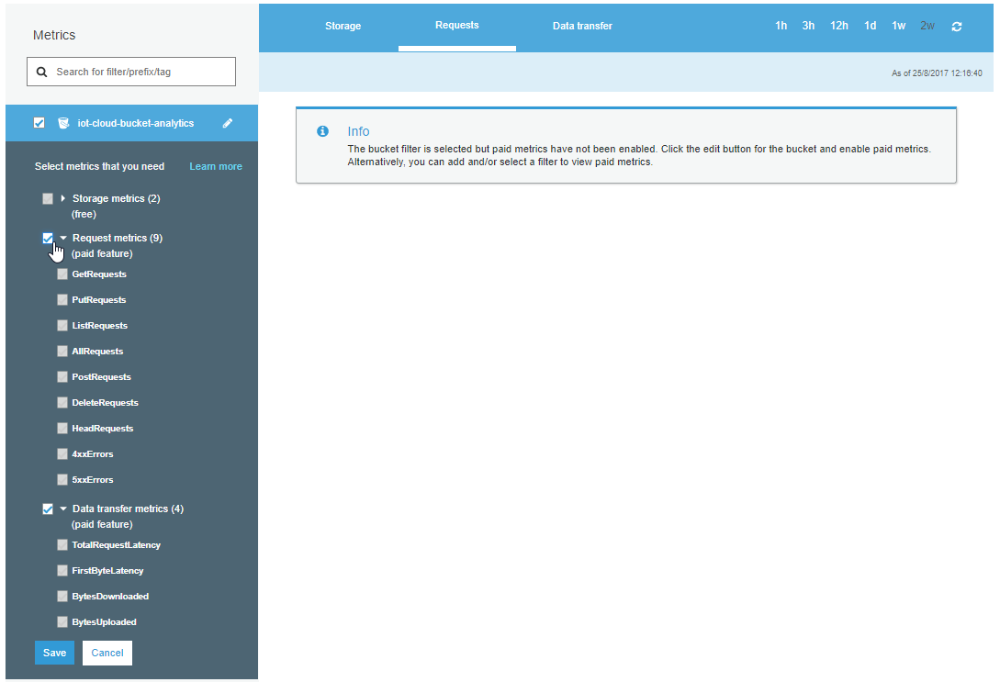
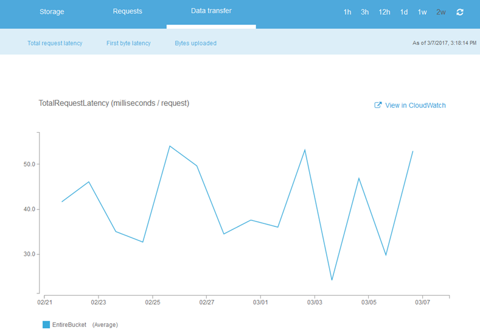
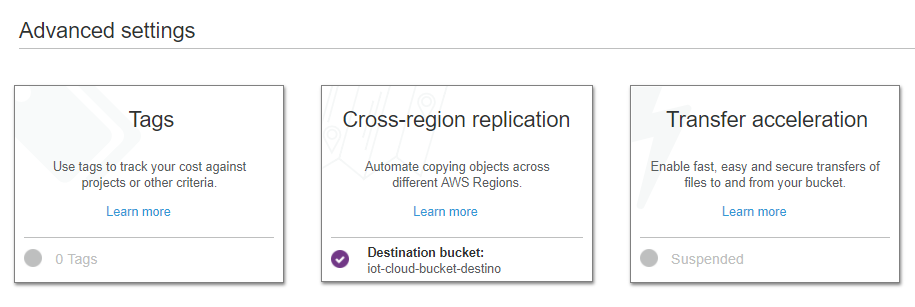

| [< Anterior](https://github.com/conapps/conapps-iot/blob/master/AWS%20Cloud/S3/AWS_S3_Parte_2.md) |

---
## Gestión de los datos
---

## Lifecycle Policies

Amazon S3 ofrece la posibilidad de establecer Políticas de Gestión del Ciclo de Vida de los datos (*lifecycle policies*).

Estas políticas permiten automatizar acciones sobre los objetos de un *bucket*, ante determinadas situaciones o eventos. La configuración se realiza mediante una o más reglas, donde cada regla define una acción que se aplicará a un grupo de objetos. Hay dos tipos de acciones:

***Transition***: mueve los objetos a otra *storage class*. Por ejemplo, podríamos transferir los objetos desde la clase STANDARD a la clase STANDARD_IA (acceso infrecuente) a los 30 días que se crea el objeto, y luego archivarlos en GLACIER al año.

***Expiration:*** elimina los objetos. Por ejemplo, podríamos eliminar en forma automática los objetos cuando lleguen a 5 años de antiguedad.


Las acciones se realizan sobre los *buckets*, por lo cual estas aplicarían a todos los objetos que se encuentren en el mismo. Pero si en un mismo bucket tenemos diferentes tipos de objetos para los cuales queremos especificar diferentes reglas?

Podemos especificar el ***prefix*** sobre el cual aplicar la regla. Por ejemplo, transferir todos los objetos cuyo nombre comiencen con la palabra *"log_"*, o todos los objetos que se encuentren dentro de la carpeta *"application_logs/"*.

En conjunto con el uso de ***Tags*** sobre los buckets/objetos, podemos crear reglas mas específicas, por ejemplo, transferir los objetos que tengan 30 días de antiguedad a la clase STANDARD_IA si tienen un tag *type=log_errores* pero en cambio archivarlos directamente a GLACIER a los 30 días si el tag indica *type=log_mensajes*. No se pueden usar *tags* para la eliminación (expiración) de los objetos.

En conjunto con el uso de ***Versions*** también podemos aplicar acciones sobre las versiones anteriores de los objetos, por ejemplo, archivar todas las versiones de un objeto que tengan mas de 90 días, excepto la versión actual.

Las *lifecycle policies* se crean sobre los *buckets*:


Debemos especificar un nombre de la regla, y en forma opcional podemos por un filtro indicando sobre que *refix* o *tag* aplica la regla, en este caso todos los objetos cuyo nombre comience con *"logs_"*:


Configuramos la regla de *transition*, en este caso movemos los objetos a la capa STANDARD_IA luego de 30 días, y los movemos a GLACIER luego de 60 días:


Configuramos la regla de *expiration*, en este caso vamos a eliminar los objetos luego de 180 días:


Revisamos que todo esté como queremos y creamos la regla.


Ahora podemos ver la regla creada sobre el bucket:


También podemos usar la **CLI**, por ejemplo, para ver la configuración de las *lifecycle policies* creadas para un *bucket*:
```bash
$ aws s3api get-bucket-lifecycle-configuration --bucket iot-cloud-bucket-01
{
    "Rules": [
        {
            "Expiration": {
                "Days": 180
            },
            "ID": "regla_para_logs",
            "Filter": {
                "Prefix": "logs_"
            },
            "Status": "Enabled",
            "Transitions": [
                {
                    "Days": 30,
                    "StorageClass": "STANDARD_IA"
                },
                {
                    "Days": 60,
                    "StorageClass": "GLACIER"
                }
            ]
        }
    ]
}

```

Ref.:
* [Object Lifecycle Management](http://docs.aws.amazon.com/es_es/AmazonS3/latest/dev/object-lifecycle-mgmt.html)
* [Setting Lifecycle Configuration On a Bucket](http://docs.aws.amazon.com/es_es/AmazonS3/latest/dev/how-to-set-lifecycle-configuration-intro.html)
* [Set Lifecycle Configuration Using the AWS CLI](http://docs.aws.amazon.com/es_es/AmazonS3/latest/dev/set-lifecycle-cli.html)


---
### Analytics
Por medio de *Amazon S3 Analytics - Storage Class Analysis*, se pueden analizar los patrones de acceso sobre nuestros datos. Esto nos ayuda a decidir cuando y que datos podemos mover (*transition*), a otra *storage-class* para aprovechar las diferentes clases de almacenamiento y reducir nuestros costos.

Esta herramienta analiza en forma continua (desde que la activamos) los patrones de acceso a nuestros datos, incluyendo cuanta cantidad de storage estamos utilizando y cuanto de ese storage hemos accedido recientemente. Esto nos permite determinar cuando podemos mover los datos que son poco accedidos desde la capa Standard donde se encuentran,  a la capa Standard_IA (acceso poco frecuente) o incluso a Glacier.

Podemos usar esta información para mejorar nuestras políticas de ciclo de vida (*lifecycle policies*) y aprovechar mejor los diferentes tipos de storage, reduciendo los costos.

Esta herramienta se habilita sobre un *bucket*, y cuanto más tiempo esté habilitada (analizando los patrones de acceso) mejor información nos proveerá. Se puede analizar el acceso a todos los objetos del *bucket*, o se pueden configurar para analizar solo determinados objetos dentro del *bucket*, filtrando mediante el uso de *prefixes*, *tags*, o ambos.
Esto permite entender ahún mas el comportamiento de nuestros datos, por ej., podríamos analizar el acceso a todos los objetos que sean de tipo *"logs"* y analizar en forma separada a todos los objetos de tipo *"imagenes"* y luego tomar diferentes acciones sobre ellos (ya deberíamos tener claro que para que esto sea posible debemos tener categorizados nuestros objetos de alguna forma, ya sea utilizando tags o prefijos con ciertos patrones en los nombres de los objetos, ej., log_*).

Adicionalmente a la información de análisis que nos muestra la consola web, podemos exportar los resultados de S3 Analytics a la herramienta que elijamos, por ej. Amazon QuickSight, Amazon Redshift, MS Excel, etc., generando incluso la salida directamente a un bucket en formato .csv para nuestro posterior análisis.

S3 Analytics tiene costo adicional, en base a la cantidad de objetos analizados mensualmente.

  
  


S3 Anaytics se configura dentro de las herramientas de *Management* del *bucket*:


Luego debemos agregar un filtro indicando que objetos queremos analizar, y si queremos exportar la salida a otro *bucket* (creado anteriormente), en este caso exportamos los resultados a *iot-cloud-bucket-analytics-results*:


Si decidimos exporta la salida, automáticamente nos va a crear una policy que le permita accesso de escritura sobre el *bucket* destino:


Podemos ver las características de la regla que creamos, mediante la CLI s3api [*s3api list-bucket-analytics-configurations*](http://docs.aws.amazon.com/cli/latest/reference/s3api/list-bucket-analytics-configurations.html), o podríamos incluso crear la regla mediante [*put-bucket-analytics-configuration*](http://docs.aws.amazon.com/cli/latest/reference/s3api/put-bucket-analytics-configuration.html), o elminarla mediante [*delete-bucket-analytics-configuration*](http://docs.aws.amazon.com/cli/latest/reference/s3api/delete-bucket-analytics-configuration.html).
```bash
$ aws s3api list-bucket-analytics-configurations --bucket iot-cloud-bucket-analytics
{
    "IsTruncated": false,
    "AnalyticsConfigurationList": [
        {
            "Id": "analytics-01",
            "StorageClassAnalysis": {
                "DataExport": {
                    "OutputSchemaVersion": "V_1",
                    "Destination": {
                        "S3BucketDestination": {
                            "Format": "CSV",
                            "Bucket": "arn:aws:s3:::iot-cloud-bucket-analytics-results"
                        }
                    }
                }
            }
        }
    ]
}
```
Ahora el *bucket* ya está siendo analizado. Obviamente la herramienta necesita correr durante cierto tiempo para poder recabar la información de acceso, y por tanto al principio no va a mostrar información:


Luego de cierto tiempo comenzaremos a ver la información generada aquí mismo, donde nos mostraría información similar al siguiente ejemplo:


Podemos ver desde cuando está habilitada la regla (127 días) y cuando fueron actualizados los datos por última vez (3/2/2017), cuanta información total tenemos almacenada en este bucket en la capa Standard (6.39 PB) y cuanto se ha accedido (1.74 PB), y de igual forma para la capa Standard_IA (3.24GB almacenados, y 51.5MB accedidos).

También podemos ver un par de gráficas con las estadísticas de datos de un determinado tiempo, y que porcentaje de nuestros datos hemos accedido.


Mas abajo podemos ver las estadísticas diferenciadas por diferentes períodos de tiempo.

Con esta información podemos ver, por ej., que en los últimos 127 días (desde que estoy analizando los datos) la mayoría de los objetos con mas de 30 días de antiguedad son muy poco accedidos. Por ej. de los 2.25 PB que hay almacenados con mas de 180 días de antiguedad en este *bucket*, solo hemos accedido a 222.8 TB, y de forma similar para el resto de los períodos de tiempo, a excepción de los primeros 30 días.

Esta herramienta nos permite entender mejor como utilizamos/accedemos a nuestros datos, y poder mejorar nuestra políticas de ciclo de vida. Por ej, podríamos crear una *lifecycle policy* sobre este *bucket* que mueva todos los objetos con mas de 30 días a la capa de acceso infrecuente *Standard_IA* para ahorrar costos de almacenamiento.

Ref.:
* [S3 Storage Management Update – Analytics, Object Tagging, Inventory, and Metrics](https://aws.amazon.com/es/blogs/aws/s3-storage-management-update-analytics-object-tagging-inventory-and-metrics/)
* [Amazon S3 Analytics – Storage Class Analysis](http://docs.aws.amazon.com/AmazonS3/latest/dev/analytics-storage-class.html)
* [How Do I Configure Storage Class Analysis?](http://docs.aws.amazon.com/es_es/AmazonS3/latest/user-guide/configure-analytics-storage-class.html)
* [Precios de Amazon S3](https://aws.amazon.com/es/s3/pricing/)

---
### Metrics

Mediante *Amazon CloudWatch metrics* para S3, podemos obtener información que nos permita entender y mejorar la performance de las aplicaciones que usan S3 como almacenamiento. Nos brinda visibilidad sobre la performance del storage, que nos permite identificar y actuar sobre posibles problemas.

Todos los datos recolectados por las métricas de CloudWatch son almacenados por un período de 15 meses, de forma de poder contar con información histórica y tener una mejor perspectiva sobre como se comportan nuestras aplicaciones o servicios web que acceden a S3.

Hay dos tipos de métricas disponibles dentro de CloudWatch en S3

* **Daily Storage Metrics for Buckets:** provee información básica sobre el uso del storage de nuestro *bucket*.
Muestran la cantidad de datos (bytes) y la cantidad de objetos del *bucket* y su evolución durante cierto período de tiempo.
Estas métricas se encuentran habilitadas por defecto para todos los *buckets*, se actualizan una vez por día, y no tienen costo.
Por defecto aplican para todo el contenido del *bucket*, o pueden aplicarse filtros (mediante *prefixes* y/o *tags*) para que apliquen sobre determinados objetos.

Podemos acceder a las métricas dentro de las herramientas de *Management* del *bucket*.




* **Request metrics:** permiten monitorear las solicitudes (*request*) que se realizan a S3, para poder identificar y actuar ante problemas de operativa (por ej. que una solicitud de un error). Estas métricas se actualizan en intervalos de 1 minuto (hay un período incial de unos 15min necesario para recabar la información la primera vez que se configura la métrica). Se configuran a nivel de *bucket* y se pueden aplicar sobre todos los objetos del mismo, o pueden aplicarse filtros (mediante *prefixes* y/o *tags*) para que apliquen sobre los objetos de nuestro interés.
Tienen costo adicional, en base a los costos asociados a Amazon CloudWatch.

Nuevamente, la configuración la realizamos dentro de las herramientas de *Management* del *bucket*, donde podemos configurar las métricas con costo correspondientes a *Request* y *Data transfer*:
.


Luego de unos 15 minutos iniciales, podemos ver la información recolectada por la métrica que definimos, por ej:


Ref.:
* [S3 Storage Management Update – Analytics, Object Tagging, Inventory, and Metrics](https://aws.amazon.com/es/blogs/aws/s3-storage-management-update-analytics-object-tagging-inventory-and-metrics/)
* [Monitoring Metrics with Amazon CloudWatch](http://docs.aws.amazon.com/es_es/AmazonS3/latest/dev/cloudwatch-monitoring.html)
* [Metrics Configurations for Buckets](http://docs.aws.amazon.com/es_es/AmazonS3/latest/dev/metrics-configurations.html)
* [How Do I Configure Request Metrics for an S3 Bucket?](http://docs.aws.amazon.com/AmazonS3/latest/user-guide/configure-metrics.html)

---
### S3 Inventory
Amazon S3 inventory is one of the tools Amazon S3 provides to help manage your storage.

You can simplify and speed up business workflows and big data jobs using the Amazon S3 inventory, which provides a scheduled alternative to the Amazon S3 synchronous List API operation. Amazon S3 inventory provides a comma-separated values (CSV) flat-file output of your objects and their corresponding metadata on a daily or weekly basis for an S3 bucket or a shared prefix (that is, objects that have names that begin with a common string).

You can configure what object metadata to include in the inventory, whether to list all object versions or only current versions, where to store the inventory list flat-file output, and whether to generate the inventory on a daily or weekly basis. You can have multiple inventory lists configured for a bucket. For information about pricing, see Amazon S3 Pricing.


Ref.:
* [Amazon S3 Inventory](http://docs.aws.amazon.com/es_es/AmazonS3/latest/dev/storage-inventory.html)
* [How Do I Configure Amazon S3 Inventory?](http://docs.aws.amazon.com/es_es/AmazonS3/latest/user-guide/configure-inventory.html)


---
## Static Web Pages
---
Como vimos anteriormente, brindar acceso público a uno o varios objetos almacenados en AWS S3 es muy simple.

Con Amazon S3, podemos hostear fácilmente un sitio web estático completo, con un costo muy bajo, y sobre una solución que provee alta disponibilidad y puede escalar automáticamente para enfrentar los aumentos de demanda de nuestro sitio.

* Comencemos por crear un bucket para nuestro sitio web (puede hacerlo de la consola web):
  ```bash
  $ aws s3 mb s3://iot-cloud-website
  make_bucket: iot-cloud-website
  ```

* Luego en las propiedades del bucket, podemos acceder a la sección de *Static website hosting* para configurarlo:

  


* Debemos especificar cuál es nuestra página principal *index.html* y opcionalmente una página para desplegar en caso que se intente acceder a un elemento inexistente *error.html* (errores de tipo 4XX).

  El link que se muestra en *Endpoint: http://iot-cloud-website.s3-website-us-west-2.amazonaws.com* nos llevará a nuestra página.
  .
  

  * Opcionalmente podemos especificar reglas avanzadas para redireccionamiento, en formato XML (puede dirigirse a las referencias de documentación incluidas mas abajo para profundizar sobre esto).  

  * O podríamos redirigir todos los requerimientos que llegan a este *bucket* enviándolos a otro *bucket* o incluso a otro sitio web externo a S3. Esto lo hacemos configurando la opción *Redirect requests*.
  .

* Recordemos que por defecto todos nuestros objetos son privados, por tanto debemos brindar permisos que habiliten el acceso de lectura a nuestros objetos dentro del bucket. Esto lo hacemos mediante la siguiente *bucket policy* (que explicaremos mas en detalle en la sección de Access Control) antes:

```json
{
    "Version": "2012-10-17",
    "Statement": [
        {
            "Sid": "PublicReadGetObject",
            "Effect": "Allow",
            "Principal": "*",
            "Action": [
                "s3:GetObject"
            ],
            "Resource": [
                "arn:aws:s3:::iot-cloud-website/*"
            ]
        }
    ]
}
```
* Y por último, lo que nos resta hacer es subir nuestra página al bucket, particularmente los archivos que referenciamos *index.html* y *error.html*, así como el resto de estructura y contenido que necesitemos.

```bash
$ aws s3 cp index.html s3://iot-cloud-website/
upload: .\index.html to s3://iot-cloud-website/index.html

$ aws s3 cp error.html s3://iot-cloud-website/
upload: .\error.html to s3://iot-cloud-website/error.html

```

Ahora ya podemos acceder a nuestra página: http://iot-cloud-website.s3-website-us-west-2.amazonaws.com

Y accedemos directamente a nuestro *index.html*


Y si vamos a una dirección que no existe, nos dirige a *error.html*


Podemos combinar esta funcionalidad de AWS S3 Static Website Hosting con AWS Route 53 para poder usar nuestros propios nombres de dominio para nuestro sitio, en lugar de usar la dirección de *endpoint* provisto por Amazon (puede ver la documentación de referencia mas abajo).

Ref.:
* [How Do I Configure an S3 Bucket for Static Website Hosting?](http://docs.aws.amazon.com/es_es/AmazonS3/latest/user-guide/static-website-hosting.html)
* [Configuring a Bucket for Website Hosting](http://docs.aws.amazon.com/es_es/AmazonS3/latest/dev/HowDoIWebsiteConfiguration.html)
* [Configuring a Webpage Redirect](https://docs.aws.amazon.com/es_es/AmazonS3/latest/dev/how-to-page-redirect.html)
* [Setting up a Static Website Using a Custom Domain](https://docs.aws.amazon.com/es_es/AmazonS3/latest/dev/website-hosting-custom-domain-walkthrough.html)


---
## Cross-Region Replication
---
La replicación entre regiones es una característica de Amazon S3 que permite copiar objetos en forma automática entre diferentes regiones de AWS. Cada objeto que subamos a un bucket de S3 se replicará en forma asincrónica en otro bucket situado en otra región de AWS que seleccionemos.

Para activar esta característica, es necesario agregar la configuración de replicación al *bucket* de origen, indicando cierta información, particularmente hacia que región lo vamos a copiar. Podemos replicar un *bucket* completo, o seleccionar solo algunos objetos, filtrando que copiar (y/o que no) por medio de *prefixes* o *tags*. Para usar la replicación es requerido que tanto el *bucket* origen como destino tengan el versionado activado.

Se debe tener en cuenta que cuando se habilita esta opción, se comienzan a replicar todos los objetos nuevos a partir de ese momento, pero los objetos anteriores que puedan existir en el bucket no son copiados. Los objetos de la copia destino son exactamente iguales a los originales, con la misma metadata (incluyendo la fecha de creación original), los mismos tags, permisos, etc. AWS S3 encripta el tráfico entre las regiones utilizando SSL.

El uso de esta característica implica cargos adicionales. Debemos pagar los cargos de S3 por almacenamiento, solicitudes y transferencia de datos entre regiones de la copia replicada, además de los cargos de almacenamiento de la copia principal. El precio de la copia replicada se basa en la región de destino, mientras que los precios de las solicitudes y la transferencia de datos entre regiones se basan en la región de origen.

Veamos como configurarlo.
* Creamos el *bucket* de origen, en una determinada región de AWS, y con *versioning* habilitado.
  
  .
  
  .

* Creamos el *bucket* de destino, en una región diferente de AWS, y con *versioning* habilitado.
  
  .
  
  .

* Habilitamos la replicación en el *bucket* de origen.
Podemos seleccionar a donde replicar, que objetos replicar, a que clase de storage destino vamos a replicar. Nuestro usuario debe contar con permisos para poder replicar, para lo cual podemos directamente crear un nuevo rol en IAM desde aquí mismo (necesitamos tener acceso a IAM para esto) o podemos seleccionar un rol de IAM existente (por ej. que haya sido creado por nuestro administrador de IAM).

.

.

.

.

Para verificar que la replicación funciona, podemos simplemente subir un objeto al *bucket origen* y verificar que el mismo sea replicado al *bucket destino*. O podemos cambiar las propiedades de un objeto (metadata, tags, ACLs) y verificar que las mismas son modificadas en el objeto replicado.

El tiempo que le toma a S3 replicar la información depende del tamaño de los objetos que estamos replicando.
Puede llevar varias horas dependiendo de la cantidad de información.


Ref.:
* [Cross-Region Replication](http://docs.aws.amazon.com/es_es/AmazonS3/latest/dev/crr.html)
* [Cross-Region Replication FAQs](https://aws.amazon.com/es/s3/faqs/#crr)
* [How to enable Cross-Region (AWS Console)](http://docs.aws.amazon.com/es_es/AmazonS3/latest/user-guide/enable-crr.html)
* [Walkthrough 1: Configure Cross-Region Replication Replication for same AWS user account](http://docs.aws.amazon.com/es_es/AmazonS3/latest/dev/crr-walkthrough1.html)
* [Amazon S3 Pricing](https://aws.amazon.com/es/s3/pricing/)


---
## Access Control
---
Por defecto Amazon S3 es seguro, cuando creamos un *bucket* o un objeto, solo el dueño (el usuario que lo creó) puede accederlo.
El dueño puede opcionalmente brindar (o restringir) acceso de diversas formas:

* **Access Control Lists (ACLs)**: permite aplicar permisos básicos de lectura/escritura/full-control a nivel de *bucket* y *object*. Las ACLs fueron la primer opción para brindar accesos, antes de que existiera IAM, y actualmente deberían utilizarse solo para ciertos casos puntuales, tales como habilitar el logging de un *bucket*, o permitir el acceso público a todos los usuarios. Las ACLs tienen ciertas limitantes, y permiten realizar controles a un nivel mas general, no tan detallado como las otras dos opciones.

* **Bucket Policies**: permiten aplicar políticas de acceso a nivel de los buckets, sin utilizar IAM, y logrando políticas con un buen nivel de detalle y control. Por ejemplo, permitir acceso a público de tipo read-only a todos los objetos de determinado *bucket*, restringir o brindar accesos a determinados usuarios a determinados objetos, o incluso a nivel de direcciones IP (que una determinada IP no pueda acceder a determinados objetos). Permiten un control mucho mas detallado sobre nuestros objetos que las ACLs, y sin requerir el uso de IAM. Es recomendado el uso de *bucket policies* en lugar de *ACLs*.

* **IAM Policies**: permiten especificar permisos específicos sobre S3, y aplicarlos a usuarios, grupos y/o roles. Permite lograr un control muy detallado sobre nuestros recursos de S3. Pero para poder utilizarlas, debemos tener acceso a IAM (vamos a tener una clase específica sobre IAM).


### Bucket Policy (ejemplo)

Un ejemplo de una Bucket Policy sería permitir el acceso read-only a los usuarios anónimos a los objetos de nuestro bucket.
Supongamos el ejemplo que vimos al comenzar, de subir un objeto "logo.png" y poder accederlo públicamente.


Si intentamos acceder al objeto *logo.png* desde un browser (sin darle permisos adicionales al objeto), nos va a dar error:


Veamos entonces de darle permisos al *bucket* mediante una *bucket policy* para poder acceder a todos los objetos que tiene dentro. Esto lo hacemos mediante la siguiente *policiy*

```bash
{
  "Version":"2012-10-17",   
  "Statement":[
    {
      "Sid":"AddPerm",                
      "Effect":"Allow",                                   // que le voy a aplicar: Allow o Deny
      "Principal": "*",                                   // a quien se lo voy a aplicar: *
      "Action":["s3:GetObject"],                          // cual es la acción que voy a aplicar
      "Resource":["arn:aws:s3:::iot-cloud-bucket-03/*"]   // sobre que recurso lo aplico
    }                                               
  ]
}
```

La política la configuramos dentro de las propiedades del bucket:


Y si luego volvemos a intentar acceder al objeto desde el browser, ahora podemos hacerlo:


Ref.:
* [Overview of Managing Access](http://docs.aws.amazon.com/es_es/AmazonS3/latest/dev/access-control-overview.html)
* [Managing Access Permissions to Your Amazon S3 Resources](http://docs.aws.amazon.com/es_es/AmazonS3/latest/dev/s3-access-control.html)
* [Bucket Policy Examples](http://docs.aws.amazon.com/es_es/AmazonS3/latest/dev/example-bucket-policies.html)
* [Example Walkthroughs: Managing Access to Your Amazon S3 Resources](http://docs.aws.amazon.com/es_es/AmazonS3/latest/dev/example-walkthroughs-managing-access.html)
* [AWS Policy Generator](http://awspolicygen.s3.amazonaws.com/policygen.html)


---
### Audit Logs
In order to track requests for access to your bucket, you can enable access logging.

Each access log record provides details about a single access request, such as the requester, bucket name, request time, request action, response status, and error code, if any. Access log information can be useful in security and access audits. It can also help you learn about your customer base and understand your Amazon S3 bill.

There is no extra charge for enabling server access logging on an Amazon S3 bucket; however, any log files the system delivers to you will accrue the usual charges for storage. (You can delete the log files at any time.) No data transfer charges will be assessed for log file delivery, but access to the delivered log files is charged the same as any other data transfer.

Ref:
* [Server Access Logging](http://docs.aws.amazon.com/es_es/AmazonS3/latest/dev/ServerLogs.html)
* [How Do I Enable Server Access Logging for an S3 Bucket?](http://docs.aws.amazon.com/es_es/AmazonS3/latest/user-guide/server-access-logging.html)

---
## Encriptación de los Datos
---

### Datos en transito
Por defecto podemos realizar *uploads* y *downloads* seguros mediante endpoints encriptados con SSL si utilizamos HTTPS.
Los datos que se replican entre regiones también viajan encriptados.


### Server Side Encryption (SSE)
Podemos encriptar los datos que se encuentran alojados en S3.

De esta forma, Amazon S3 encriptará en forma automática los datos cuando se escriben (o suben) y los desencripta cuando se acceden (o bajan), utilizando Advanced Encryption Standard (AES) con 256-bit symmetric keys.

Tenemos tres opciones para administrar las claves de encriptación:
* SSE con Amazon S3 Key Management (SSE-SE): las claves son administradas y almacenadas directamente por Amazon.
* SSE con Customer Provided Keys (SSE-C): las claves son provistas y administradas por el cliente, Amazon utiliza estas claves y son inmediatamente descartadas luego de realizar la operación, no las almacena.
* SSE con AWS KMS (SSE-KMS): encripta los datos utilizando claves que nosotros administramos utilizando el servicio de claves de Amazon: AWS Key Management Service (KMS).

### Client Side Encryption
También podemos encriptar los datos nosotros localmente, previo al envío de los mismos a AWS S3.

Refs:
* [Protecting Data Using Encryption](http://docs.aws.amazon.com/es_es/AmazonS3/latest/dev/UsingEncryption.html)
* [Protecting Data Using Server-Side Encryption](http://docs.aws.amazon.com/es_es/AmazonS3/latest/dev/serv-side-encryption.html)
* [Protecting Data Using Client-Side Encryption](http://docs.aws.amazon.com/es_es/AmazonS3/latest/dev/UsingClientSideEncryption.html)
* [AWS Key Management Service (KMS)](https://aws.amazon.com/es/kms/)


---
## Información adicional
---
Algunas otras funcionalidades de S3 que debemos conocer:
* [S3 Event Notifications](http://docs.aws.amazon.com/es_es/AmazonS3/latest/dev/NotificationHowTo.html)
* [S3 Requester Pays Buckets](http://docs.aws.amazon.com/es_es/AmazonS3/latest/dev/RequesterPaysBuckets.html)
* [S3 Performance Optimization](http://docs.aws.amazon.com/es_es/AmazonS3/latest/dev/PerformanceOptimization.html)
* [S3 Transfer Acceleration](http://docs.aws.amazon.com/es_es/AmazonS3/latest/dev/transfer-acceleration.html)

Algunos (de los tantos) otros servicios de AWS que interactúan con S3:
* [AWS Storage Gateway](https://aws.amazon.com/es/storagegateway/)
* [AWS Glacier](https://aws.amazon.com/es/glacier/) - también puede ver nuestra [Clase de Glacier](https://github.com/conapps/conapps-iot/blob/master/AWS%20Cloud/Glacier/20170816_AWS_Glacier.md)
* [Amazon CloudWatch Metrics for Amazon S3](http://docs.aws.amazon.com/es_es/AmazonS3/latest/dev/cloudwatch-monitoring.html)
* [AWS Snowbal](https://aws.amazon.com/es/snowball/) | [AWS Snowball Edge](https://aws.amazon.com/es/snowball-edge/) | [AWS Snowmobile](https://aws.amazon.com/es/snowmobile/)

---
## Herramientas para AWS
---

Amazon cuenta con una variedad de herramientas para AWS, incluyendo SDK, IDE, línea de comandos, etc. Puede acceder al conjunto de herramientas desde aquí:
* [Herramientas para Amazon Web Services](https://aws.amazon.com/es/tools/)


Las herramientas de desarrollo (SDK) están disponibles para varios lenguajes:
* [AWS SDK](https://aws.amazon.com/es/tools/#sdk)
* [AWS SDK para Python (Boto3)](https://aws.amazon.com/es/sdk-for-python/)
* [AWS SDK para Java](https://aws.amazon.com/es/sdk-for-java/)

Y también podemos acceder a las herramientas de línea de comando, algunas de las cuales ya hemos utilizado:
* [Herramientas de línea de comandos](https://aws.amazon.com/es/tools/#cli)


---
| [< Anterior](https://github.com/conapps/conapps-iot/blob/master/AWS%20Cloud/S3/AWS_S3_Parte_2.md) |
