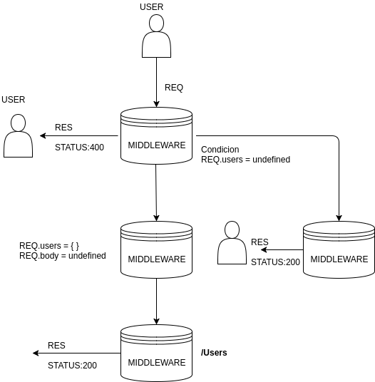

#  Node.js

## Temas

* Modularizacion
* Callbacks

## Repaso

Node.js es un entorno de ejecución para JavaScript construido con el motor de JavaScript V8 de Chrome. Node.js usa un modelo de operaciones E/S sin bloqueo y orientado a eventos, que lo hace liviano y eficiente. 

Combinado con otras herramientas, Node.js le permite escribir aplicaciones de escritorio como Word o iTunes, aplicaciones de servidor como Apache, aplicaciones de red como Curl o incluso aplicaciones móviles para iPhone o Android.

Node no es ninguno de los siguientes:

  - Un framework web (como Rails o Django, sin embargo puede ser usado para hacer tales cosas)
  - Un lenguaje de programación (Node usa JavaScript pero no es en sí mismo un lenguaje)

En su lugar, Node es algo en la mitad:

  - Diseñado para ser simple y por lo tanto relativamente fácil de entender y usar
  - Útil para programas basados en E/S que necesitan ser rápidos y/o manejar muchas conecciones

_______

# Modularización

Un módulo encapsula el código relacionado en una sola unidad de código. Al crear un módulo, esto puede interpretarse como mover todas las funciones relacionadas en un archivo. Ilustremos este punto con un ejemplo de una aplicación construida con `Node.js`. Imagine que creamos un archivo llamado `greetings.js` y que contiene las dos funciones siguientes:


```js
// greetings.js
sayHelloInEnglish = function() {
  return "Hello";
};

sayHelloInSpanish = function() {
  return "Hola";
};

```

La utilidad de `greetings.js` aumenta cuando su código encapsulado puede ser utilizado en otros archivos. Así que vamos a refactorizar `greetings.js` para lograr este objetivo. Para comprender lo que realmente está sucediendo, podemos seguir un proceso de tres pasos:


1) Imagine que esta línea de código existe como la primera línea de código en `greetings.js`:


```js
// greetings.js
var exports = module.exports = {};

```
2) Asigna cualquier expresión en `greetings.js` que queramos que esté disponible en otros archivos al objeto exportado:

```js
// greetings.js
// var exports = module.exports = {};

exports.sayHelloInEnglish = function() {
  return "HELLO";
};

exports.sayHelloInSpanish = function() {
  return "Hola";
};

```

En el código anterior, podríamos haber reemplazado las exportaciones por las exportaciones de módulos. Si esto parece confuso, recuerde que las `exports` y `module.exports` hacen referencia al mismo objeto.

3) Este es el valor actual de `module.exports`:

```js
module.exports = {
  sayHelloInEnglish: function() {
    return "HELLO";
  },

sayHelloInSpanish: function() {
    return "Hola";
  }
};
```
Importemos los métodos de `greetings.js` disponibles públicamente a un nuevo archivo llamado `main.js`. Este proceso se puede describir en tres pasos:

a) La palabra clave `require` se usa en `Node.js` para importar módulos. Imagine que así se define la necesidad del modulo:
```js
var require = function(path) {

// ...

return module.exports;
};
```
b) Requerimos `greetings.js` en `main.js`:

```js
// main.js
var greetings = require("./greetings.js");

```

c) Ahora podemos acceder a los métodos de `greetings.js` disponibles públicamente como propiedad de nuestra variable greetings en `main.js`.

```js
// main.js
var greetings = require("./greetings.js");

// "Hello"
greetings.sayHelloInEnglish();

// "Hola" 
greetings.sayHelloInSpanish();

```

#### Puntos importantes
La palabra clave `require` devuelve un objeto, que hace referencia al valor del `module.exports`para un archivo dado. Si un desarrollador vuelve a asignar de forma involuntaria o intencionada el `module.exports` a un objeto diferente o a una estructura de datos diferente, las propiedades añadidas al módulo original no serán accesibles.

Un ejemplo ayudará a elaborar este punto:

```js
// greetings.js
// var exports = module.exports = {};

exports.sayHelloInEnglish = function() {
  return "HELLO";
};

exports.sayHelloInSpanish = function() {
  return "Hola";
};

/* 

this line of code re-assigns  

module.exports
*/
module.exports = "Bonjour";

```

Ahora requerimos `greetings.js` en `main.js`:

```js
// main.js
var greetings = require("./greetings.js");
```

En este momento, nada es diferente que antes. Asignamos las variables a cualquier código que esté disponible públicamente en `greetings.js`.

La consecuencia de re-asignar el módulo. exporta a una estructura de datos que no sea su valor por defecto se revela cuando intentamos invocar `sayHelloInglish` y `sayHelloInSpanish`:

```js
// main.js
// var greetings = require("./greetings.js");

/*

TypeError: object Bonjour has no 

method 'sayHelloInEnglish'
*/
greetings.sayHelloInEnglish();
/* 

TypeError: object Bonjour has no 

method 'sayHelloInSpanish'
*/
greetings.sayHelloInSpanish();

```


## Cargando desde la carpeta
Si el identificador del módulo pasa a `require()` lo que no es un módulo nativo, y no comienza con `'/', '../', o './'`, entonces node inicia en el directorio principal del módulo actual, y añade /node_modules, e intenta cargar el módulo desde esa ubicación.

Si no se encuentra, entonces se dirige al directorio principal, y así sucesivamente, hasta que el módulo es encontrado, hasta en la raíz del árbol es encontrado.

Por ejemplo, si el fichero en `'/home/ry/projects/foo.js'` es llamado como `require('bar.js')`, entonces node buscaría en las siguientes ubicaciones, en este orden:

+ /home/ry/projects/node_modules/bar.js
+ /home/ry/node_modules/bar.js
+ /home/node_modules/bar.js
+ /node_modules/bar.js
Esto permite que los programas encuentren sus dependencias, de modo que no entren en conflicto.


____________]


## Callback

Node procesa E/S en una forma llamada [asíncrona](http://en.wikipedia.org/wiki/Asynchronous_I/O) el cual le permite manejar muchas cosas diferentes simultáneamente.

Por ejemplo, si vas a un restaurante de comida rápida y ordenas una hamburguesa ellos tomarán tu orden inmediatamente y te harán esperar hasta que tu hamburguesa esté lista. Mientras tanto ellos pueden tomar otras órdenes y empezar a preparar hamburguesas para otras personas. Imagina si tuvieras que esperar en la caja registradora por tu hamburguesa, bloqueando a todas las otras personas en la fila para ordenar, mientras preparan tu hamburguesa! Esto es llamado **bloqueo de E/S** porque toda E/S (preparación de hamburguesas) suceden una vez al tiempo. Node, por otro lado, es de **no-bloqueo**, que significa que puede preparar muchas hamburguesas al mismo tiempo.


Este es el tema más importante para entender si quieres entender cómo utilizar Node. Casi todo en Node utiliza callbacks. No fueron inventadas por Node, y son una forma particularmente útil para utilizar las funciones en JavaScript.

`Callback()` son funciones que se ejecutan de forma asíncrona. En lugar de leer el código de arriba a abajo, programas asincrónicos pueden ejecutar diferentes funciones en diferentes momentos basado en el orden y la velocidad que ocurren las  funciones que leen el sistema de archivo o los pedidos de http.

Determinando si una función es asíncrona o no puede crear confusión ya que depende mucho en el contexto donde se presenta. Aquí sigue un ejemplo simple de una  función sincrónica:


```js
var miNumero = 1
function agregaUno() { miNumeror++ } // define la  función
agregaUno() // ejecuta la  función
console.log(miNumero) // registra 2
```

El código aquí define una función y luego en la siguiente línea llama a esa función, sin esperar nada. Cuando se llama a la función, inmediatamente suma 1 al número, por lo que podemos esperar que después de llamar a la función el número debe ser 2.

Supongamos que en su lugar queremos guardar nuestro número en un archivo llamado `number.txt`:

```js
var fs = require('fs') // require es una funcion especial traida por Node.js
var myNumber = undefined // No sabemos el numero, esta en el archivo de texto.

function addOne() {
  fs.readFile('./number.txt', function doneReading(err, fileContents) {
    myNumber = parseInt(fileContents)
    myNumber++
  })
}

addOne()

console.log(myNumber) // La salida es indefinida
```

¿Por qué tenemos "indefinido" cuando hacemos logout del número esta vez? En este código utilizamos el método `fs. readFile`, que resulta ser un método asíncrono. Por lo general, las cosas que tienen que hablar con los discos duros o las redes serán asincrónicas. Si sólo tienen que acceder a cosas en la memoria o hacer algo de trabajo en la CPU, serán síncronos. La razón de esto es que la entrada/salida es realmente realmente muy lenta. 

Cuando ejecutamos este programa todas las funciones se definen inmediatamente, pero no todas se ejecutan inmediatamente. Esto es algo fundamental para entender sobre la programación asincrona. 

Cuando `addOne` se llama inicia un `readFile` y luego pasa a la siguiente cosa que está lista para ejecutar. Si no hay nada que ejecutar el nodo esperará a que finalicen las operaciones pendientes de fs/network o dejará de ejecutarse y saldrá a la línea de comandos.

Cuando `readFile` termine de leer el archivo (esto puede tardar desde milisegundos a segundos a minutos dependiendo de lo rápido que sea el disco duro) ejecutará la función `doneReading` y le dará un error (si hubo un error) y el contenido del archivo.


Entonces sabiendo esto, podemos decir que `Callback` son simplemente funciones que se ejecutan más tarde. La clave para entenderlas es darse cuenta de que se utilizan cuando no sabes cuándo se completará alguna operación asincrona, pero sí sabes dónde se completará la operación: ¡la última línea de la función asincorna!.

El orden de arriba a abajo que usted declara las llamadas de retorno no necesariamente importa, sólo el anidamiento lógico/jerárquico de las mismas. Primero divides tu código en funciones, y luego usas las llamadas de retorno para declarar si una función depende de otra función para terminar.

El método `fs. readFile` es proporcionado por el nodo, es asincrónico y toma mucho tiempo para finalizar. Usted le da a `readFile` una función (conocida como callback) a la que llamará una vez que haya recuperado los datos del sistema de archivos. Pone los datos que ha recuperado en una variable javascript y llama a su función con esa variable, en este caso la variable se llama `fileContents` porque contiene el contenido del fichero leído.

Pongamos nuestra declaración `console. log` en una función y pasémosla como una llamada de retorno.

```js
var fs = require('fs')
var myNumber = undefined

function addOne(callback) {
  fs.readFile('./number.txt', function doneReading(err, fileContents) {
    myNumber = parseInt(fileContents)
    myNumber++
    callback()
  }
}

function logMyNumber() {
  console.log(myNumber)
}

addOne(logMyNumber)
```

Ahora la función 'logMyNumber' puede pasar en un argumento que se convertirá en la variable 'callback' dentro de la función 'addOne'. Después de 'readFile' se hace la variable 'callback' se invocará ('callback()'). Sólo se pueden invocar funciones, por lo que si se pasa a otra cosa que no sea una función, se producirá un error.

Cuando una función es invocada en javascript el código dentro de esa función será ejecutado inmediatamente. En este caso, nuestra sentencia log se ejecutará ya que `callback` es en realidad `logMyNumber`. Recuerda, sólo porque definas una función no significa que se ejecute. Tienes que *invocar* una función para que eso suceda.

Para desglosar este ejemplo aún más, aquí hay una cronología de eventos que ocurren cuando ejecutamos este programa:

1. El código es analizado, lo que significa que si hay algún error de sintaxis, el programa se romperá.
2. `addOne` se invoca, consiguiendo pasar en la función `logMyNumber` como `callback`, que es lo que queremos que se llame cuando se complete `addOne`. Esto provoca inmediatamente el arranque de la función `fs. readFile` asíncrona. Esta parte del programa toma un tiempo para terminar.
3. Sin nada que hacer, el nodo se detiene un poco mientras espera a que termine `readFile`.
4. `readFile` termina y llama a su llamada de retorno, `doneReading`, que a su vez incrementa el número y luego invoca inmediatamente la función que `addOne` pasó (su llamada de retorno), `logMyNumber`.

Es posible que haya escuchado los términos "programación orientada a eventos". Se refieren a la forma en que se implementa `readFile`. Node primero envía la operación `readFile` y luego espera a que `readFile` le envíe un evento que ha completado. Mientras *Node* puede ir a comprobar otras cosas. Dentro de *Node* hay una lista de cosas que se envían pero que aún no se han reportado, por lo que *Node* repite sobre la lista una y otra vez comprobando si están terminados. Una vez terminados, se les "procesa", por ejemplo, se invocará cualquier llamada que dependa de su acabado.

Aquí hay una versión pseudo-código del ejemplo anterior:

```js
function addOne(thenRunThisFunction) {
  waitAMinuteAsync(function waitedAMinute() {
    thenRunThisFunction()
  })
}

addOne(function thisGetsRunAfterAddOneFinishes() {})
```

El diseño dde node.js requiere que pienses de forma no lineal. Considere esta lista de operaciones:

```
leer un archivo
procesar ese fichero

```

Si tuvieras que convertir ingenuamente esto en pseudocódigo terminarías con esto:

```
var file = readFile ()
processFile (archivo)
```

Este tipo de código lineal (paso a paso, por orden) no es la forma en que funciona node. Si este código fuera a ser ejecutado entonces `readFile` y `processFile` serían ejecutados al mismo tiempo. Esto no tiene sentido ya que `readFile` tomará un tiempo para completarse. En su lugar, necesita expresar que `processFile` depende del acabado de `readFile`. Esto es exactamente para lo que sirven las llamadas! 


#### Ejemplo 

```js
var fs = require('fs')
fs.readFile('movie.mp4', finishedReading)

function finishedReading(error, movieData) {
  if (error) return console.error(error)
  // do something with the movieData
}
```

_______
## Express.js

A medida que la mayoría de los proyectos de `node` comienzan, abra su terminal e inicie con la inicialización de `npm` para crear un archivo `package.json`. A continuación, instale Express como una dependencia.

```
  npm init
  npm install --save express
```
### Hola Mundo

Empezaremos con el ejemplo clásico de "hola mundo", explicaremos eso y luego construiremos a partir de ahí.


```js
const express = require('express');
const app = express();

app.get('/', (request, response) => {
  response.send('hello world');
});

app.listen(3000, () => {
  console.log('Express intro running on localhost:3000');
});

```

La primera línea requiere el módulo `Express` que fue instalado vía `npm`, y la segunda línea configura nuestra aplicación `Express`. Con esta aplicación(app), puede configurar y añadir funcionalidad a su servidor.

La función `app.listen()` le indica al servidor que empiece a escuchar las conexiones en un puerto concreto, en este caso el puerto 3000. Cuando el servidor está listo para escuchar las conexiones, se llama la llamada de retorno y los registros `Express` se ejecutan en `localhost:3000` en el terminal.

La última parte es el gestor de rutas:

Esta parte es bastante densa porque `Express` es capaz de dar mucha funcionalidad con muy poco código. `app.get()` crea un gestor de rutas para escuchar las peticiones GET de un cliente. El primer argumento en esta función es el recorrido de la ruta. En este caso, estamos a la escucha de peticiones `GET` en `localhost: 3000/`. Si quisiéramos escuchar una petición POST, entonces usaríamos `app.post()` - paa ua `petición PUT, `app.put()`, y así sucesivamente para cualquier otro método HTTP.

El segundo argumento es una función de devolución de llamada que toma un objeto de solicitud y un objeto de respuesta. El objeto de solicitud contiene información sobre la solicitud procedente del cliente (cabeceras de solicitud, parámetros de consulta, cuerpo de la solicitud, etc.). El objeto de respuesta contiene información que queremos enviar como respuesta al cliente. El objeto de respuesta también tiene funciones que nos permiten enviar una respuesta.

Dentro de `app.get()`, la `response.send(' hello world')envía una respuesta con contenido en el cuerpo de la respuesta. En este caso, el cuerpo contiene el  texto plano. Ahora sabemos cómo configurar una ruta!


### Middleware

Cada pieza de middleware es sólo otro manejador de solicitudes. Comienzas mirando al primer gestor de solicitudes, luego miras al siguiente, al siguiente, al siguiente, y así sucesivamente.



Así es como se ve el middleware básicamente:

```js
function myFunMiddleware(request, response, next) {
   // hacer cosas con request y response.
   // Cuando terminamos, llamamos next() para pasarle la posta al siguiente middleware.
   next();
}

```

Cuando iniciamos un servidor, empezamos en el middleware más alto y nos abrimos camino hasta el fondo. Así que si quisiéramos añadir un simple registro a nuestra aplicación, ¡podríamos hacerlo!

```js

var express = require("express");
var app = express();

// Logging middleware
app.use(function(request, response, next) {
  console.log("In comes a " + request.method + " to " + request.url);
  next();
});

// Mandar "hello world"
app.use(function(request, response) {
  response.writeHead(200, { "Content-Type": "text/plain" });
  response.end("Hello world!\n");
});

http.createServer(app).listen(1337);

```

Es importante notar que cualquier cosa que funcione en Node.js también funciona en middleware. Por ejemplo, si desea inspeccionar con `req.method`, está justo ahí.

### Routing

Estamos en la cima de nuestra montaña de abstracción. 

El enrutamiento es una forma de mapear diferentes peticiones a manejadores específicos. Básicamente haríamos esto con un montón de declaraciones de if normalmente.

Pero Express es más inteligente que eso. Express nos da algo llamado "enrutamiento" que creo que se explica mejor con código que con español:

```js
var express = require("express");
var http = require("http");
var app = express();

app.all("*", function(request, response, next) {
  response.writeHead(200, { "Content-Type": "text/plain" });
  next();
});

app.get("/", function(request, response) {
  response.end("Welcome to the homepage!");
});

app.get("/about", function(request, response) {
  response.end("Welcome to the about page!");
});

app.get("*", function(request, response) {
  response.end("404!");
});

```

Después de los requisitos básicos, decimos "cada petición pasa por esta función" con `app.all`. Y esa función se parece mucho al middleware, ¿no?

Las tres llamadas a `app.get` son el sistema de enrutamiento de Express. También pueden ser `app.post`, que responden a peticiones POST, o PUT, o cualquiera de los verbos HTTP. El primer argumento es un path, como /about o /. El segundo argumento es un manejador de solicitudes similar a lo que hemos visto antes. 

Para citar la documentación de Express:

>[Estos manejadores de solicitudes] se comportan igual que el middleware, con la única excepción de que estas llamadas de retorno pueden invocar la siguiente (' ruta') para pasar por alto la(s) llamada(s) de retorno de ruta restantes. Este mecanismo se puede utilizar para realizar precondiciones en una ruta y luego pasar el control a rutas posteriores cuando no hay razón para proceder con la ruta emparejada.

En resumen: básicamente son middleware como hemos visto antes.

Estas rutas pueden volverse más inteligentes, con cosas como ésta:


```js

app.get("/hello/:who", function(req, res) {
  res.end("Hello, " + req.params.who + ".");
});

```

## CONTINUARA
