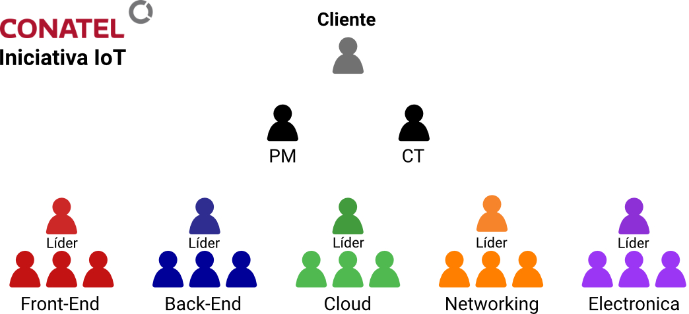

# Conapps IOT - Detalles de la Iniciativa

## Introducción

En Conatel desde hace tiempo se están buscando oportunidades para trabajar en proyectos de IoT, los cuales son distintos a los que se está acostumbrado trabajar habitualmente. Para la realización de estos proyectos, es necesario contar con conocimiento en ciertas áreas en las que Conatel no trabaja al día de hoy. El objetivo de esta iniciativa es cambiar esta situación.

Para lograrlo se propone crear un grupo de trabajo dentro de la empresa creado por voluntarios, para estudiar y trabajar en las áreas de interés para el desarrollo de proyectos IoT. Este grupo de voluntarios podrá elegir formar parte de alguno de los varios equipos que se pre-determinaran según su preferencia. Conatel brindará a los participantes el espacio, la infraestructura y tiempo dentro del horario laboral para dedicarle a esta nueva iniciativa.

Como parte del proceso de capacitación, se trabajará en el desarrollo de un proyecto concreto de IoT: el diseño y la construcción de una solución de estaciones de carga para autos eléctricos con ciertas funcionalidades que permitan poner en práctica todos los conceptos aprendidos.

Esta claro que para llegar al punto de poder desarrollar este proyecto, va a ser necesario obtener cierto conocimiento previamente. Es por esto que el proyecto se dividirá en dos etapas macro:

1. La primera etapa se enfocara en el aprendizaje de los participantes mediante una metodología de estudio en grupo (los instructores serán los propios participantes). Al finalizar la etapa de aprendizaje se realizara un breve proyecto por equipo. 
2. En la segunda etapa, se pondrán en practica los conocimientos adquiridos. Se realizará una presentación de los requerimientos del proyecto, tras la cual se pasara a la fase de implementación donde se diseñara y construirá el primer prototipo de la solución.

Durante estas fases se coordinarán espacios dentro del horario laboral donde se realizarán las reuniones que forman parte del proceso. Se proporcionara dentro de la empresa el espacio, la infraestructura y todo el apoyo necesario para que todos los participantes puedan concentrarse en el proyecto. Como se requiere que cada participante cuente con una laptop, se le brindará una a todo aquel que lo requiera.

El modelo de capacitación es distinto al modelo tradicional, donde un instructor previamente capacitado expone un tema a los estudiantes, los cuales son luego evaluados de alguna manera. En cambio, se propone un modelo de auto-aprendizaje en donde todos los participantes tendrán en algún momento que preparar y exponer un tema al resto de los participantes. Los temas de interés así como los temarios de cada uno de los temas ya están diseñados para definir el alcance de cada uno, pero el desarrollo y el diseño de la presentación recaerá exclusivamente en la persona encargada de dictarla.

La iniciativa esta abierta a todos los colaboradores de la empresa, existiendo como único requisito, el tomar la responsabilidad de estudiar y exponer al menos un tema de interés al resto de los participantes de su equipo. 

Para medir y premiar los logros alcanzados por los participantes se utilizará la metodología diseñada por [Mozilla](https://www.mozilla.org), conocidas como [OpenBadges](https://openbadges.org/). Este sistema de premios funciona en base a la entrega de "badges" (medallas) digitales en reconocimiento de algún hito alcanzado por el participante. Los "badges" deben cumplir con determinadas características que permiten ser expuestos online de forma pública, y validan el trabajo realizado.

## Proyectos IoT

No existe una definición única sobre que representa un proyecto de IoT, sin embargo la mayoría coincide en un par de puntos:

- Los proyectos de IoT cuentan con un "stack" de tres capas. De más baja a la más alta, estas capas son:
  1. **Capa de Sensores y Actuadores**. Es la capa más baja del stack. En ella están incluidos todos los dispositivos electrónicos, como: sensores (de movimiento, temperatura, humedad, etc), cámaras, motores, servos, controles, etc.
  2. **Capa de Internet**. Aquí se encuentran todos los dispositivos que se encargan de conectar las otras dos capas con Internet. La mayoría de productos y protocolos involucrados en esta capa no son nuevos para los departamentos de Networking de Conatel, aunque existen ciertos servicios y protocolos con los cuales nunca ha trabajado la empresa.
  3. **Capa de Servicios**. Engloba todos los servicios y desarrollos de software necesarios para el funcionamiento del producto. Procesa toda la información generada por los sensores; envía los comandos a los controladores y actuadores; presenta la información a los usuarios; y consume sus comandos para aplicarlos a los dispositivos.
- Cualquier proyecto que necesite integrar elementos de las tres capas puede ser catalogado como un proyecto de IoT.

En Conatel contamos con ciertos conocimientos en la "Capa de Internet" pero no tanto en las otras dos. Al menos en los temas y tecnologías utilizadas en este tipo de proyecto.

La complejidad de estos proyectos hace que un solo equipo no pueda conocer a fondo de todas las tecnologías necesarios. En cambio, se necesita una estructura menos centralizada, que cuente con equipos especialistas que puedan trabajar en un mismo proyecto en paralelo. Por lo tanto, la comunicación entre equipos es vital para luego poder integrar los resultados de todos los equipos individuales. 

## Estructura del Proyecto

En base a la cantidad de voluntarios, se crearán 3 o 5 equipos de no más de 3 personas más un líder. Estos equipos fueron creados en base a la estructura de los proyectos de IoT, y a las verticales donde queremos hacer foco.

Los equipos serán:

*5 equipos (14+ personas)*

- Desarrollo Front-End.
- Desarrollo Back-End.
- Infraestructura Cloud.
- Networking.
- Electrónica y control.

3 equipos (9~13 pesonas)

- Desarrollo de Software.
- Infraestructura Cloud.
- Electrónica y Control.

Además de los equipos existirán dos personas adicionales que ayudarán a la comunicación entre equipos, y seguirán el progreso de los equipos. 

Estos roles son:

- Project Manager (PM).
- Coordinador Tecnico CT.

El PM estará encargado de la coordinación de las tareas una vez comenzado a trabajar en el proyecto. Además tomará un rol protagonista durante la fase de aprendizaje para familiarizar la interacción de los equipos con el PM.Por otro lado, el CT estará encargado de realizar los syllabus de los temas a dictar, realizará el seguimiento del avance de los equipos, y estará encargado de determinar junto con los equipos las tecnologías y servicios a utilizar en el proyecto. Por último, el CT será el encargado de evaluar el proyecto final, a entregar durante los últimos días de la fase de aprendizaje. 

Otro rol de interés es el cliente. La comunicación de el cliente con el resto de los equipos se realizará a través del PM, que puede contar con el apoyo del CT en caso de que sea necesario.

Los líderes de cada equipo están encargados de asignar tareas, prioridades, y definir como se van a dividir los temas a dar entre los integrantes del equipo. También trabajara como vinculo entre su equipo y los demás. Para simplificar la comunicación entre equipos, todas las comunicaciones se realizarán a través de los líderes. Se plantea la realización de breves reuniones periódicas entre líderes para discutir sobre el avance de las capacitaciones; avance de el proyecto; problemas que hayan tenidos, y soluciones aplicadas. El PM y el CT También se comunicarán con los líderes para medir su avance y transmitir los requerimientos.

Esta cadena de comunicación permite que todos los equipos trabajen de forma independiente y en paralelo, sin perder de vista el estado de los demás equipos. Están bien definidas las responsabilidades de cada rol así como la asignación de prioridades.

## Reuniones de Trabajo

La metodología de trabajo para ambas fases, requiere de la realización de varias reuniones, cada una con una finalidad distintas. En total se definen cuatro tipos de reuniones diferentes:

1. **Reuniones de Grupo**:
   - *Frecuencia*: 1 vez por semana.
   - Participantes: todos los integrantes del equipo. También esta abierta la invitación a integrantes de otros equipos. Se agendarán las reuniones de forma que no coincidan entre sí.
   - *Duración*: 4 horas.
   - *Dinámica*: tipo workshop. Uno de los integrantes de el equipo previamente seleccionado, preparara durante las semanas anteriores la clase. La presentación debe contar de varias secciones, en donde el expositor presentará parte del contenido teorico, e inmediatamente despues se pasara a una fase práctica donde se implementará lo explicado. Este mismo procedimiento es realizado en cada sección. Dependiendo de la complejidad de el tema, se puede asignar más de una reunión para su completa exposición.
2. **Reunión de Avance**:
   - *Frecuencia*: 1 vez cada 3 semanas.
   - *Participantes*: todos los equipos.
   - *Duración*: 2 horas.
   - *Dinámica*: Cada equipo deberá exponer a los otros equipos su estado de avance en **15 minutos**. Cualquiera de los integrantes puede realizar la exposición. La idea es que se presente los temas en los que se trabajaron, los resultados obtenidos, los problemas que encontraron, y las soluciones que implementaron. El último expositor contará con **40 minutos** dado que deberá además realizar una exposición de algunos de los temas tratados. Esta presentación debe ser más simple que la realizada durante las *Reuniones de Grupo*.
3. **Reunión de Líderes**:
   - *Frecuencia*: 1 vez por semana.
   - *Participantes*: todos los líderes más el PM y el CT.
   - *Duración*: 20 minutos.
   - *Dínamica*: Reunión "informal" donde se discutirá el estado de cada equipo.
4. **Reuniones de Presentación**:
   - *Frecuencia*: 1 vez cada 4 semanas.
   - *Participantes*: PM, CT, y Cliente. Lideres o integrantes de el equipo pueden tener que participar en caso de que el PM o el CT lo necesiten.
   - *Duración*: 2 horas.
   - *Dinámica*: Presentación al cliente del avance del proyecto.

El PM o los líderes a través de el CT puede coordinar instancias adicionales en caso de que lo requieran necesario.

Cada participante contará con tiempo adicional durante su jornada laboral para estudiar y preparar las presentaciones (siempre y cuando se cuente con el tiempo para realizarlo). 

## Metodología de Trabajo

Se pueden encontrar los detalles en este [link](https://github.com/conapps/conapps-iot/blob/master/Definicion_del_proyecto.md).

