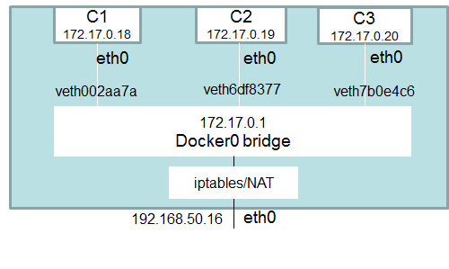

| [<-- Volver](https://github.com/conapps/conapps-iot/blob/master/claseDeDocker/20170815-Storage.md) |
[Siguiente -->](#) |

## Networking

### Introducción

Cuando instalamos Docker, se crean por defecto 3 redes:

```bash
$ docker network ls
NETWORK ID          NAME                DRIVER
7fca4eb8c647        bridge              bridge
9f904ee27bf5        none                null
cf03ee007fb4        host                host
```

Los contenedores pueden conectarse a estas redes al momento de su creación con la opción ```--network```.
Si no especificamos ninguna opción, Docker conecta los contenedores a la red ```bridge``` por defecto.
Estas tres redes utilizan drivers dinsintos y por tanto tienen comportamientos también distintos, a continuación veremos una breve explicación de cada una de ellas:

#### bridge
La red ```bridge``` representa a la interface ```docker0``` en el host. Básicamente, al instalar Docker, se crea en el host una interface ```docker0``` que "mira" hacia el motor de Docker, se le asigna una dirección IP, y se la deja lista para que los containers que no definan ninguna red específica al momento de su creación se conecten a ella.

```bash
$ ifconfig
--> SALIDA OMITIDA PARA MAYOR CLARIDAD <--
docker0: flags=4163<UP,BROADCAST,RUNNING,MULTICAST>  mtu 1500
        inet 172.17.0.1  netmask 255.255.0.0  broadcast 0.0.0.0
        inet6 fe80::42:acff:fecb:1c79  prefixlen 64  scopeid 0x20<link>
        ether 02:42:ac:cb:1c:79  txqueuelen 0  (Ethernet)
        RX packets 8574  bytes 472977 (472.9 KB)
        RX errors 0  dropped 0  overruns 0  frame 0
        TX packets 17876  bytes 25736022 (25.7 MB)
        TX errors 0  dropped 0 overruns 0  carrier 0  collisions 0
--> SALIDA OMITIDA PARA MAYOR CLARIDAD <--
```

La red se llama ```bridge``` debido a que técnicamente es eso, un bridge, que interconecta en capa 2 a todos los contenedores que la utilizan, (y a la interface ```docker0``` del host). La interface ```docker0``` existe para que los contenedores conectados a la red ```bridge``` tengan conectividad con el exterior; esto se hace con un PAT utilizando la IP de dicha interface.

#### none
La red tipo ```none``` básicamente deja al contenedor aislado del mundo.
Veamos esto con un ejemplo, pero antes un breve ejercicio para preparar el ambiente de pruebas:

> **Ejercicio:**
>
> Crear una imagen llamada ```netubuntu``` basada en la imagen ubuntu, que tenga instalado el paquete ```net-tools```.

Ahora que contamos con la imagen ```netubuntu``` podemos verificar el funcionamiento de la red ```none``` con driver ```null```.


```bash
$ docker run -it --name my-none-container --rm --network=none netubuntu bash
root@68965d657e5d:/# ifconfig
lo        Link encap:Local Loopback  
          inet addr:127.0.0.1  Mask:255.0.0.0
          UP LOOPBACK RUNNING  MTU:65536  Metric:1
          RX packets:0 errors:0 dropped:0 overruns:0 frame:0
          TX packets:0 errors:0 dropped:0 overruns:0 carrier:0
          collisions:0 txqueuelen:1
          RX bytes:0 (0.0 B)  TX bytes:0 (0.0 B)
```


#### host
La red tipo ```host``` lo que hace es que el contenedor utiliza directamente el stack TCP/IP de la máquina host. Por lo que en lo que a red se refiere, el contenedor y el host son la misma cosa. Verfiquemos el funcionamiento de esta red:

```bash
$ docker run -it --name my-host-container --rm --network=host netubuntu bash
root@68965d657e5d:/# ifconfig
---> AQUÍ DEBERÍA VERSE EXACTAMENTE LO MISMO QUE EN EL HOST <---
```

Las redes ```none``` y ```host``` son bastante simples de comprender, no tanto así la red tipo ```bridge``` por lo que a continuación profundizaremos sobre esta última.

### Red tipo ```bridge```

La figura a continuación muestra gráficamente como sería la conexión de varios containers a la red ```bridge```.



Veamos como se vería la figura anterior en la consola, pero antes un breve ejercicio para preparar el ambiente de pruebas:

> **Ejercicio:**
>
> Actualizar la imagen ```netubuntu``` creada en el ejercicio anterior para que además incluya el paquete ```iputils-ping```.

Ahora que tenemos la imagen necesaria, armemos una topología y aprendamos como obtener la información de la misma en formato JSON.

```bash
$ docker run -d -it --name c1 --rm netubuntu bash
0c31832e576a9e082768eb0fbdb6271ffdbda8538a4894775b28f3c54540e00a
$ docker run -d -it --name c2 --rm netubuntu bash
4d723cf46218c94895bb87eb3097055869357fd56b1c8a0df4c863b4b4903129
$ docker run -d -it --name c3 --rm netubuntu bash
4d61c3f6b98b163680ac19c701778b4b7d2749898deef432bf13c30b404ef15e

$ docker network inspect bridge
[
    {
        "Name": "bridge",
        "Id": "64468e306e67651ad837ef871138ead91b79f33dd0cb7d4a6388ef8691002f1a",
        "Created": "2017-08-21T10:09:26.640394965-03:00",
        "Scope": "local",
        "Driver": "bridge",
        "EnableIPv6": false,
        "IPAM": {
            "Driver": "default",
            "Options": null,
            "Config": [
                {
                    "Subnet": "172.17.0.0/16",
                    "Gateway": "172.17.0.1"
                }
            ]
        },
        "Internal": false,
        "Attachable": false,
        "Ingress": false,
        "ConfigFrom": {
            "Network": ""
        },
        "ConfigOnly": false,
        "Containers": {
            "0c31832e576a9e082768eb0fbdb6271ffdbda8538a4894775b28f3c54540e00a": {
                "Name": "c1",
                "EndpointID": "f7b75d3e4988944deb3ed200348630b6f00da747096e25c89a1e6d1e80dc4090",
                "MacAddress": "02:42:ac:11:00:02",
                "IPv4Address": "172.17.0.2/16",
                "IPv6Address": ""
            },
            "4d61c3f6b98b163680ac19c701778b4b7d2749898deef432bf13c30b404ef15e": {
                "Name": "c3",
                "EndpointID": "537515aa3ae82b82e2c63b8b353c7b6dce3aa42ea84c62c96f3618f02720f1f4",
                "MacAddress": "02:42:ac:11:00:04",
                "IPv4Address": "172.17.0.4/16",
                "IPv6Address": ""
            },
            "4d723cf46218c94895bb87eb3097055869357fd56b1c8a0df4c863b4b4903129": {
                "Name": "c2",
                "EndpointID": "509d4210e10a4a57bd32690b5a3f00c48b83daca14a658f3481611641a20aa27",
                "MacAddress": "02:42:ac:11:00:03",
                "IPv4Address": "172.17.0.3/16",
                "IPv6Address": ""
            }
        },
        "Options": {
            "com.docker.network.bridge.default_bridge": "true",
            "com.docker.network.bridge.enable_icc": "true",
            "com.docker.network.bridge.enable_ip_masquerade": "true",
            "com.docker.network.bridge.host_binding_ipv4": "0.0.0.0",
            "com.docker.network.bridge.name": "docker0",
            "com.docker.network.driver.mtu": "1500"
        },
        "Labels": {}
    }
]
```

Notemos dentro de los campos del JSON retornado por el comando ```docker network inspect bridge``` la dirección de red ```172.17.0.0/16```, la dirección IP (```172.17.0.1```) correspondiente a la interface ```docker0``` y las direcciones MAC y direcciones IP de cada uno de los contenedores.

Comprobaremos ahora que los contenedores tienen conectividad IP entre si y con la interface ```docker0``` del host.

> Nota: se puede salir de la consola de un contenedor sin apagarlo con la secuencia de comandos ```ctl+p,ctl+q```


```bash
$ docker attach c1
root@0d1697247d1d:/#
root@0d1697247d1d:/# ping 172.17.0.3
PING 172.17.0.3 (172.17.0.3) 56(84) bytes of data.
64 bytes from 172.17.0.3: icmp_seq=1 ttl=64 time=0.145 ms
64 bytes from 172.17.0.3: icmp_seq=2 ttl=64 time=0.134 ms
64 bytes from 172.17.0.3: icmp_seq=3 ttl=64 time=0.138 ms
^C
--- 172.17.0.3 ping statistics ---
3 packets transmitted, 3 received, 0% packet loss, time 2048ms
rtt min/avg/max/mdev = 0.134/0.139/0.145/0.004 ms
root@0d1697247d1d:/# ping 172.17.0.4
PING 172.17.0.4 (172.17.0.4) 56(84) bytes of data.
64 bytes from 172.17.0.4: icmp_seq=1 ttl=64 time=0.285 ms
64 bytes from 172.17.0.4: icmp_seq=2 ttl=64 time=0.144 ms
64 bytes from 172.17.0.4: icmp_seq=3 ttl=64 time=0.207 ms
^C
--- 172.17.0.4 ping statistics ---
3 packets transmitted, 3 received, 0% packet loss, time 2055ms
rtt min/avg/max/mdev = 0.144/0.212/0.285/0.057 ms
root@0d1697247d1d:/# ping 172.17.0.1
PING 172.17.0.1 (172.17.0.1) 56(84) bytes of data.
64 bytes from 172.17.0.1: icmp_seq=1 ttl=64 time=0.257 ms
64 bytes from 172.17.0.1: icmp_seq=2 ttl=64 time=0.134 ms
64 bytes from 172.17.0.1: icmp_seq=3 ttl=64 time=0.116 ms
^C
--- 172.17.0.1 ping statistics ---
3 packets transmitted, 3 received, 0% packet loss, time 2052ms
rtt min/avg/max/mdev = 0.116/0.169/0.257/0.062 ms
```

```bash
$ docker attach c2
root@3fd032d1d648:/#
root@3fd032d1d648:/# ping 172.17.0.2
PING 172.17.0.2 (172.17.0.2) 56(84) bytes of data.
64 bytes from 172.17.0.2: icmp_seq=1 ttl=64 time=0.195 ms
64 bytes from 172.17.0.2: icmp_seq=2 ttl=64 time=0.144 ms
64 bytes from 172.17.0.2: icmp_seq=3 ttl=64 time=0.138 ms
^C
--- 172.17.0.2 ping statistics ---
3 packets transmitted, 3 received, 0% packet loss, time 2045ms
rtt min/avg/max/mdev = 0.138/0.159/0.195/0.025 ms
root@3fd032d1d648:/# ping 172.17.0.4
PING 172.17.0.4 (172.17.0.4) 56(84) bytes of data.
64 bytes from 172.17.0.4: icmp_seq=1 ttl=64 time=0.254 ms
64 bytes from 172.17.0.4: icmp_seq=2 ttl=64 time=0.048 ms
64 bytes from 172.17.0.4: icmp_seq=3 ttl=64 time=0.134 ms
^C
--- 172.17.0.4 ping statistics ---
3 packets transmitted, 3 received, 0% packet loss, time 2039ms
rtt min/avg/max/mdev = 0.048/0.145/0.254/0.085 ms
root@3fd032d1d648:/# ping 172.17.0.1
PING 172.17.0.1 (172.17.0.1) 56(84) bytes of data.
64 bytes from 172.17.0.1: icmp_seq=1 ttl=64 time=0.220 ms
64 bytes from 172.17.0.1: icmp_seq=2 ttl=64 time=0.132 ms
^C
--- 172.17.0.1 ping statistics ---
2 packets transmitted, 2 received, 0% packet loss, time 1031ms
rtt min/avg/max/mdev = 0.132/0.176/0.220/0.044 ms
```

```bash
$ docker attach c3
root@75cfce7d09c6:/#
root@75cfce7d09c6:/# ping 172.17.0.2
PING 172.17.0.2 (172.17.0.2) 56(84) bytes of data.
64 bytes from 172.17.0.2: icmp_seq=1 ttl=64 time=0.188 ms
64 bytes from 172.17.0.2: icmp_seq=2 ttl=64 time=0.134 ms
64 bytes from 172.17.0.2: icmp_seq=3 ttl=64 time=0.130 ms
^C
--- 172.17.0.2 ping statistics ---
3 packets transmitted, 3 received, 0% packet loss, time 2025ms
rtt min/avg/max/mdev = 0.130/0.150/0.188/0.030 ms
root@75cfce7d09c6:/# ping 172.17.0.3
PING 172.17.0.3 (172.17.0.3) 56(84) bytes of data.
64 bytes from 172.17.0.3: icmp_seq=1 ttl=64 time=0.186 ms
64 bytes from 172.17.0.3: icmp_seq=2 ttl=64 time=0.137 ms
^C
--- 172.17.0.3 ping statistics ---
2 packets transmitted, 2 received, 0% packet loss, time 1006ms
rtt min/avg/max/mdev = 0.137/0.161/0.186/0.027 ms
root@75cfce7d09c6:/# ping 172.17.0.1
PING 172.17.0.1 (172.17.0.1) 56(84) bytes of data.
64 bytes from 172.17.0.1: icmp_seq=1 ttl=64 time=0.251 ms
64 bytes from 172.17.0.1: icmp_seq=2 ttl=64 time=0.120 ms
64 bytes from 172.17.0.1: icmp_seq=3 ttl=64 time=0.118 ms
^C
--- 172.17.0.1 ping statistics ---
3 packets transmitted, 3 received, 0% packet loss, time 2030ms
rtt min/avg/max/mdev = 0.118/0.163/0.251/0.062 ms
```


| [<-- Volver](https://github.com/conapps/conapps-iot/blob/master/claseDeDocker/20170815-Storage.md) |
[Siguiente -->](#) |
